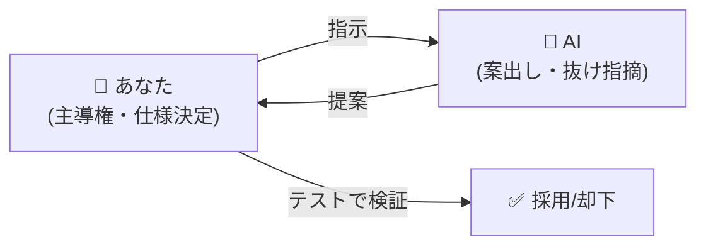
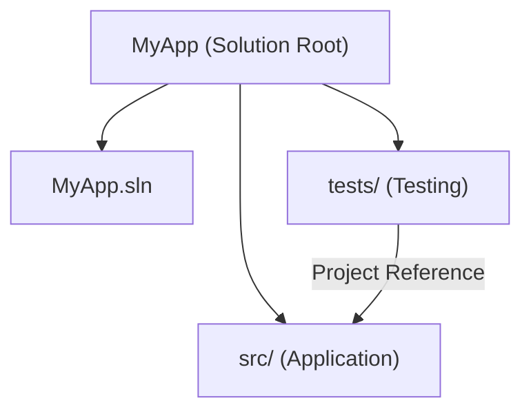
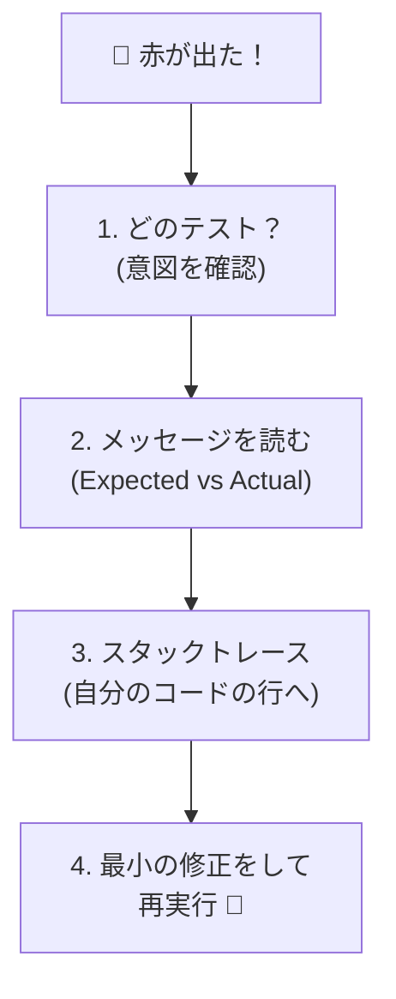

# 第06章：AI時代のTDD作法（使いどころを固定）🤖✅

この章はね、**「AIを使って速くなる」**のに、**「品質はむしろ上げる」**ための“作法”を固める回だよ〜！✨
TDDの初心者さんほど、ここでルールを先に決めると後がめちゃ楽😊💖

---

## この章のゴール🎯✨（できるようになりたいこと）

1. **AIの使いどころを3つに固定**できる（迷わない）🧭
2. AIが出した案を、**テストで安全に採用/却下**できる✅
3. 自分用の **固定プロンプト集（コピペ集）** を作れる📎🤖

---

## まず知っておこ：AIでTDDが壊れる“ありがち事故”😵‍💫💥

### 事故①：GreenでAIに「全部実装して」って頼んじゃう🥺


* すると…AIが“気を利かせて”**仕様を勝手に補完**しがち
* 結果：**テストが仕様じゃなくなる**（主導権がAIへ）😇

### 事故②：テストまでAIに丸投げする🤖🧪


* それっぽいテストを書くけど、**大事な境界値が抜ける**
* しかも **テストが実装の写し**になりがち（最悪パターン）😵

### 事故③：Refactorで“一気に綺麗にして”をやる🧼💣

* 変更がでかすぎて、レビュー不能＆戻せない
* TDDの強み（小さく安全）が消える😭

---

## 逆に、AIが“めちゃ強い仕事”はここ💪🤖✨（＝使いどころ固定）


AIってね、ざっくり言うと
**「案をたくさん出す」「抜けを見つける」「言葉を整える」**が得意！🧠✨

具体的には👇

* ✅ **テストケース洗い出し**（正常/異常/境界値）
* ✅ **命名の候補だし**（読みやすいテスト名）
* ✅ **失敗ログの読み解き補助**（原因候補→確認手順）
* ✅ **小さなリファクタ手順の提案**（手順を刻む）
* ✅ **重複の指摘**（でも採用は人が決める！）



※Copilot系がIDEに統合されて、補完＋チャットが連携して使える流れは強まってるよ〜（2025/11頃の案内）🧩✨ ([Visual Studio][1])
あと、Copilotはエディタ周辺の文脈（近い行、開いてるファイル等）を見て提案を作る仕組みだよ📝 ([GitHub][2])

---

## この章のキモ：AIの“3固定ルール”🚦🧪🤖


ここから先は、この3つだけ覚えたらOK🙆‍♀️✨

### ルール①：AIは「案を出す係」🧠📌


* **仕様の決定者はあなた**（テストが仕様！）
* AIの案は「候補」扱いで、**採用条件はテスト**✅

### ルール②：AIに頼むのは “小さく” 🪡✨


* 1回のお願いは **テスト1本ぶん**、または **差分20行くらい**の気持ち
* 大きいお願いは禁止🙅‍♀️（事故る）

### ルール③：「通ったからOK」じゃなく「意図に一致したらOK」✅💖


* テストが通っても、**意図と違う実装**は普通に起こる
* 最終チェックは **“意図”* 🧷 “本体を参照するテスト”にする（tests → src）



---

## TDD 3フェーズ × AIの使い方（これで迷子ゼロ）🗺️😊

### 🔴 Red（失敗するテストを書く）

AIに頼んでいいこと🙆‍♀️

* テストケース列挙（正常/異常/境界）
* 仕様の抜け探し（「この仕様だと他に何が必要？」）
* テスト名の候補

AIに頼みすぎ注意⚠️

* テスト本文を丸ごと生成（→意図が薄くなりやすい）

---

### 🟢 Green（最小で通す）

AIに頼んでいいこと🙆‍♀️

* 「このテストを通す**最小の実装案**を2〜3案」
* 「差分が最小になる書き方」提案

禁止🙅‍♀️

* 「ついでに設計も綺麗にして」
* 「将来を見越して拡張して」
  → それはRefactorでやるやつ！

---

### 🔵 Refactor（意味を変えずに整える）


AIに頼んでいいこと🙆‍♀️

* **安全な手順を刻んで**提案してもらう

  * 例：「まずリネーム→次に抽出→最後に整理」みたいに🛠️
* 重複の指摘、命名改善案

注意⚠️

* “大掃除”提案は却下（差分でかい＝危険）🧨

---

## コピペで使える！固定プロンプト集📎🤖✨

この章の主役〜！これを自分用に育てるよ🌱💕

```text
(1) テストケース洗い出し
この仕様のテストケースを「正常系 / 異常系 / 境界値」に分けて列挙して。
出力は「Given / When / Then」で。

(2) 抜け探し
この仕様で、曖昧 or 決めてない点を質問形式で5つ出して。

(3) テスト名（読み物化）
次のテストの意図が一発で伝わる名前案を3つ。
日本語案→英語案の順で。

(4) Green最小実装
このテストを通す最小実装案を2案。
「余計な一般化」はしないで。

(5) 失敗ログ解析
この失敗ログの原因候補を3つ。
それぞれ「確認手順」を短く書いて。

(6) リファクタ手順（刻む）
このコードを読みやすくしたい。
安全な手順を「1手ずつ」提案して。各手でテストを回す前提で。
```

---

## ミニ演習☕️🧾：AIを使っても“TDDの主導権”を渡さない練習

題材はカンタンにいくよ😊
**「税込み計算：小数は四捨五入」**だけ。

### 仕様（この3行だけ）📝

* 税率10%
* 税込み金額は四捨五入（0.5は切り上げ）
* 入力は税抜き金額（decimal）

---

### Step 1：AIに“テストケースだけ”出させる🤖🧪

上のプロンプト(1)を投げる
→ 返ってきた候補から、**最小の1本**を選ぶ！

今回はこれにする👇

* 税抜き 100 → 税込み 110

---

### Step 2：テストを書く（あなたが主役）✍️✨

```csharp
using Xunit;

public class PriceCalculatorTests
{
    [Fact]
    public void TaxIncluded_100yen_ShouldBe_110yen()
    {
        // Arrange
        var calc = new PriceCalculator(taxRate: 0.10m);

        // Act
        var result = calc.TaxIncluded(100m);

        // Assert
        Assert.Equal(110m, result);
    }
}
```

---

### Step 3：Green（最小実装）🟢

ここでAIに頼むなら、(4)で「最小実装案を2案」くらいがちょうどいい😊
でも今回は自分で最小にいくよ！

```csharp
public sealed class PriceCalculator
{
    private readonly decimal _taxRate;

    public PriceCalculator(decimal taxRate)
    {
        _taxRate = taxRate;
    }

    public decimal TaxIncluded(decimal basePrice)
    {
        var raw = basePrice * (1m + _taxRate);
        return decimal.Round(raw, 0, MidpointRounding.AwayFromZero);
    }
}
```

---

### Step 4：AIの正しい使い方（Refactor編）🧹✨

テストが通ったら、AIにこう頼むのが強い👇

* 「命名、責務、重複の観点で改善点ある？」
* 「安全な手順を刻んで提案して」(6)

この例だと、AIは例えばこんな提案をするかも👇

* `TaxIncluded` → `CalculateTaxIncluded` の方が意図が明確？
* `1m + _taxRate` を変数化して読みやすく？
* 税率の妥当性チェックを追加？（←これは仕様次第）

ここで大事なのは、**“仕様にない改善”は採用しない**こと😊✅

---

## AIの出力を採用するときのチェックリスト✅🧠💖

* [ ] テストが通る
* [ ] テストの意図（仕様）に一致してる
* [ ] 差分が小さい（レビューできる）
* [ ] 余計な機能追加がない（未来対応してない）
* [ ] 読みやすさが上がってる（下がったら却下）
* [ ] 「なぜこの形？」を自分が説明できる

---

## ちょい最新メモ🗓️✨（2026/01/18時点の空気感）

* .NET 10 は LTSで、2025/11/11にリリース、2026/01/13に 10.0.2 が出てるよ🧩 ([Microsoft][3])
* Visual Studio 2022 は 2026/01/13 に Current 17.14.24 が案内されてる（リリース履歴）🪟✨ ([Microsoft Learn][4])
* 4. **何を直して、どのテストを再実行する？**（最小の修正で！）



Visual Studio の Test Explorer は、失敗したテストを選ぶと **メッセージとスタックトレース**を表示してくれるよ👀✨ ([Microsoft Learn][5])
* xUnit v3 は 3.0.0 が 2025/07/13 にリリースされていて、v2→v3移行ガイドや “v3の新機能まとめ”も整ってるよ🧪📘 ([xUnit.net][5])

---

## 宿題（軽め）🎒😊

1. 自分の **AI固定プロンプト集** を 5個に絞ってメモ化📎
2. さっきの題材にテストを1本追加

   * 例：税抜き 101 → 税込み 111（四捨五入の確認）🔁
3. AIに「抜けてる仕様の質問」を5つ出させて、**仕様を言葉で固める**🗣️✨

---

次の章（第7章）では、ここで決めた作法のまま、テストが“サクッと回る土台”を作っていくよ🏗️🧪💖
もし「第6章を講義台本みたいに（先生のセリフ付きで）作って！」とかも欲しければ、同じテンションで作るね😊🎀

[1]: https://visualstudio.microsoft.com/github-copilot/?utm_source=chatgpt.com "Visual Studio With GitHub Copilot - AI Pair Programming"
[2]: https://github.com/features/copilot?utm_source=chatgpt.com "GitHub Copilot · Your AI pair programmer"
[3]: https://dotnet.microsoft.com/en-us/platform/support/policy?utm_source=chatgpt.com "The official .NET support policy"
[4]: https://learn.microsoft.com/en-us/visualstudio/releases/2022/release-history?utm_source=chatgpt.com "Visual Studio 2022 Release History"
[5]: https://xunit.net/releases/v3/3.0.0?utm_source=chatgpt.com "Core Framework v3 3.0.0 [2025 July 13]"
