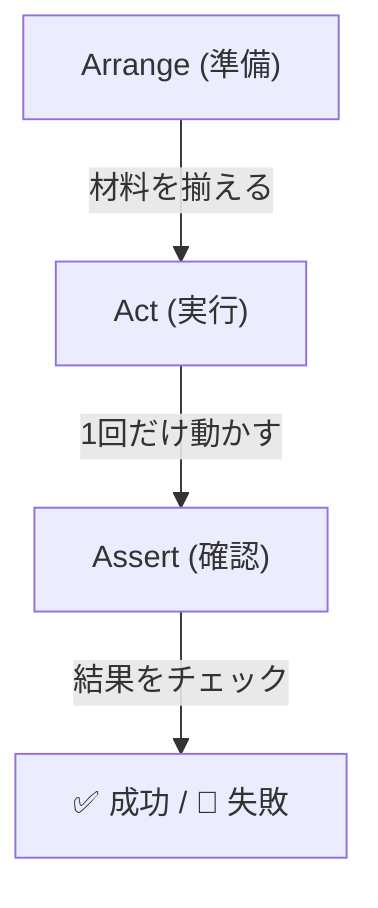
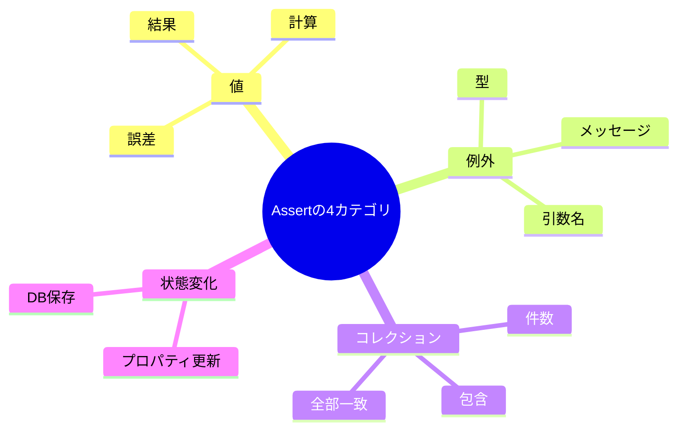
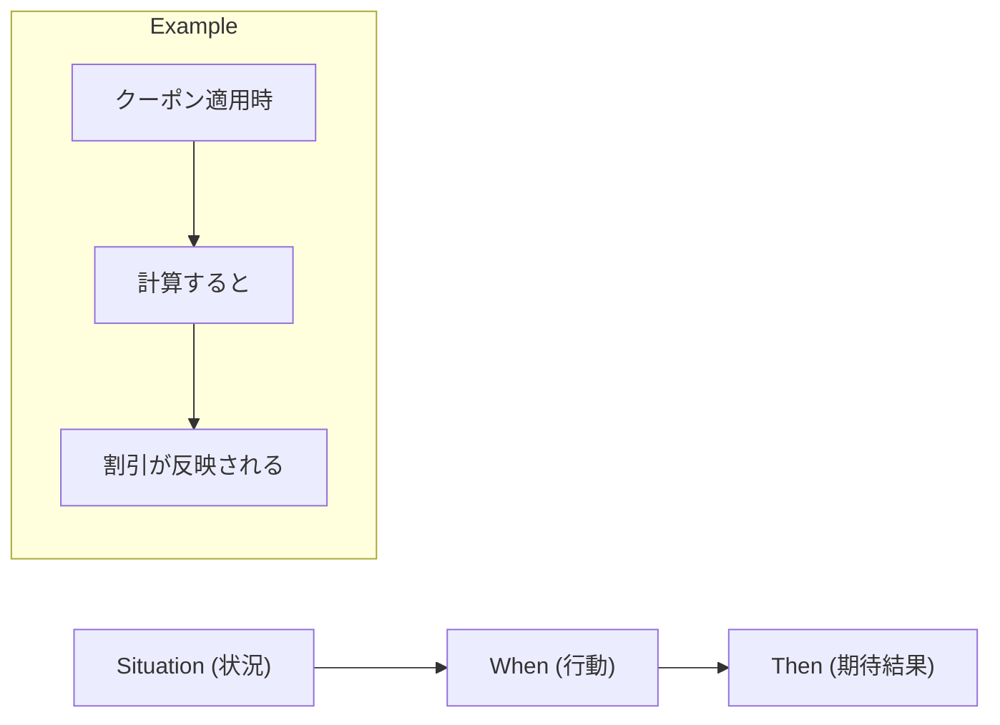

# 第11章：AAA（Arrange/Act/Assert）で形を固定🧱

今日は「テスト本文の書き方」を、**いつも同じ型（AAA）**にそろえる練習だよ〜😊💡
型が決まると、テストが **読みやすい・直しやすい・AIにも渡しやすい** になるよ🤖✨

（最新状況メモ：.NET 10 の最新SDKは **10.0.2（2026-01-13リリース）**だよ📌 ([Microsoft][1]) / C# 14 は .NET 10 対応だよ🧩 ([Microsoft Learn][2]) / xUnit v3 は NuGet 上で **3.2.2** が最新安定として表示されてるよ🧪 ([NuGet][3])）

---

### 1) ねらい（この章のゴール）🎯✨


この章が終わったら、あなたはこうなれる！😊

* **テストが毎回AAAの並び**で書ける🧱
* 1つのテストを見た瞬間に「準備・実行・確認」が分かる👀✅
* テストが壊れたとき、**どこがおかしいか**追いやすい🔍
* AIに投げても、**返ってきたテストが読みやすい**状態にできる🤖✨

---

### 2) AAAってなに？（超かんたん説明）🧸💬


AAAは、テストをこの順番で書く型だよ👇

* **Arrange（準備）**：材料をそろえる🍳

  * 入力データ、対象オブジェクト（テストしたいクラス）、必要ならスタブ/モックなど
* **Act（実行）**：1回だけ動かす▶️

  * “いま検証したい操作”を実行する
* **Assert（確認）**：結果をチェック✅

  * 期待した値？例外？状態変化？呼び出し？を確認する



> コツ：**混ぜない**！これだけで読みやすさが爆上がりするよ⤴️✨

---

### 3) “型が固定”されると何がうれしいの？🥰📘

AAAにそろうと…

* テストが **仕様書みたいに読める**📘✨
* 失敗した時に「準備が悪い？実行が悪い？確認が悪い？」が切り分けやすい🔍
* 大きくなっても、テストが散らかりにくい🧹
* AIに「AAAで整形して」と頼みやすい🤖✅
* どうでもいい詳細までAssertすると、リファクタでテストが邪魔になります😵‍💫



---

### 4) この章の“お作法”セット（ここが大事）🧱✨

#### ✅ お作法1：3ブロックを “見た目” で分ける👀

おすすめはこのどれか👇

* **コメントで区切る**（初心者にいちばん優しい💖）
* **空行だけで区切る**（慣れてきたらこっちもアリ✨）
* 両方やってもOK🙆‍♀️

#### ✅ お作法2：Actは基本「1行」🎯

Actが2回以上あると、**どっちが原因で失敗したか**分かりにくくなるよ😵‍💫
（必要ならテストを分けよう🍰✂️）

#### ✅ お作法3：Assertは最後に集める✅

途中にAssertが混ざると読みづらい〜😖
**最後にまとめる**と「結論」が気持ちよく読める✨

---

### 5) まずはテンプレを手に入れよ〜！📌🧪

xUnit のテストは、まずこの形をコピペしてOK😊

```csharp
using Xunit;

public class TaxCalculatorTests
{
    [Fact]
    public void AddTax_10Percent_ReturnsTaxIncludedPrice()
    {
        // Arrange
        var sut = new TaxCalculator(taxRate: 0.10m);
        var priceYen = 100;

        // Act
        var totalYen = sut.AddTax(priceYen);

        // Assert
        Assert.Equal(110, totalYen);
    }
}
```

ポイント💡

* **sut** は “System Under Test” の略で「今回テストする主役」って意味だよ👑
* Arrangeの変数は、**何のための値か分かる名前**にするのがおすすめ😊

---

### 6) ありがち失敗あるある（先に潰す！）🚧😂

#### ❌ あるある1：Arrange と Assert が混ざる

「準備しながら確認」みたいになると読みづらい〜😵

#### ❌ あるある2：Actが2回ある

1つのテストで2回Addしたり、2回呼び出したり…
原因が分かりにくくなるよ💦

#### ❌ あるある3：Assertが弱い（確認が足りない）

「通ったけど、ほんとに仕様守れてる？」ってなる😇
→ 次章（Assertの基本）で強化していくよ💪

#### ❌ あるある4：Arrangeがでかすぎる

準備が長すぎるテストは「設計がつらいサイン」かも👃🚨
（でもこの章ではまず“区切って見える化”できればOK！）

---

### 7) 実演：散らかったテストをAAAに整形してみよ〜🧹✨

#### 🌀 散らかり例（読みづらい…！）

```csharp
using Xunit;

public class ShoppingCartTests
{
    [Fact]
    public void Total_is_updated()
    {
        var cart = new ShoppingCart();
        cart.Add(new Item("Apple", 120));
        Assert.Equal(120, cart.Total);

        cart.Add(new Item("Banana", 80));
        Assert.Equal(200, cart.Total);
    }
}
```

これ、何がつらい？😵‍💫

* Actが2回ある（Addが2回）
* Assertも2回で「意図が2つ」混ざってる🍰

#### ✅ AAAに直す（テストを分ける！）

```csharp
using Xunit;

public class ShoppingCartTests
{
    [Fact]
    public void Add_single_item_updates_total()
    {
        // Arrange
        var sut = new ShoppingCart();
        var item = new Item("Apple", 120);

        // Act
        sut.Add(item);

        // Assert
        Assert.Equal(120, sut.Total);
    }

    [Fact]
    public void Add_two_items_updates_total_to_sum()
    {
        // Arrange
        var sut = new ShoppingCart();
        var apple = new Item("Apple", 120);
        var banana = new Item("Banana", 80);

        // Act
        sut.Add(apple);
        sut.Add(banana);

        // Assert
        Assert.Equal(200, sut.Total);
    }
}
```

ここでの判断ポイント😊

* 2つ目のテストは「2回Act」になってるけど、**意図が1つ（合計になる）**だから今回はOK🙆‍♀️
* もし「1つ目が追加できる」も「2つ目が追加できる」も別意図で確認したくなったら、さらに分ける🍰✂️

---

### 8) ミニTDD：AAAで “Red→Green” を超短く体験🚦🧪

**お題：税込価格を返す（10%）**☕️🧾

#### (1) Red：先にテスト（AAAで！）

```csharp
using Xunit;

public class TaxCalculatorTests
{
    [Fact]
    public void AddTax_10Percent_ReturnsTaxIncludedPrice()
    {
        // Arrange
        var sut = new TaxCalculator(taxRate: 0.10m);
        var priceYen = 100;

        // Act
        var totalYen = sut.AddTax(priceYen);

        // Assert
        Assert.Equal(110, totalYen);
    }
}
```

#### (2) Green：最短で通す（まずはベタでもOK）

```csharp
public sealed class TaxCalculator
{
    private readonly decimal _taxRate;

    public TaxCalculator(decimal taxRate)
    {
        _taxRate = taxRate;
    }

    public int AddTax(int priceYen)
    {
        return (int)(priceYen * (1m + _taxRate));
    }
}
```

#### (3) Refactor：この章では「形」を守れたら勝ち🏆✨

（丸めや例外、境界値は後の章で育てていくよ😊）

---

### 9) AIの使いどころ（この章の“固定技”）🤖🪄

AAAはAIに頼むと速い！でも **採用基準**はこれ👇

* AAAの順番が守られてる？🧱
* Actがモリモリ増えてない？🍖
* Assertが “実装の写し” になってない？（意味のある確認になってる？）✅

使えるプロンプト例だよ（コピペOK）✨

* 「このテストをAAA（Arrange/Act/Assert）で読みやすく整形して。意図が2つ以上なら分割案も出して」🤖
* 「Actが複数あるかチェックして、1テスト1意図になるように直して」🧪
* 「Assertが弱い/強いの観点を3つ教えて（ただし章11なので最低限の範囲で）」✅

---

### 10) 練習問題（手を動かすやつ！）✍️💪✨

テスト名の構成要素

テスト名は「何を」「どうしたら」「どうなるか」を明確に書くと、テストの意図が伝わりやすいよ😊

例：`AddTax_10Percent_ReturnsTaxIncludedPrice`

1. **状況（Given）**：どんな前提？
2. **行動（When）**：何をした？
3. **結果（Then）**：どうなってほしい？



例（英語パターン）👇
`AddTax_10Percent_ReturnsTaxIncludedPrice`

#### 問題A：AAAに整形してね🧹

次のテスト、**AAAに直して**、必要なら**テスト分割**してみて😊

```csharp
using Xunit;

public class StringNormalizerTests
{
    [Fact]
    public void normalize()
    {
        var normalizer = new StringNormalizer();
        var result = normalizer.Normalize("  A  ");
        Assert.Equal("a", result);
        result = normalizer.Normalize("B");
        Assert.Equal("b", result);
    }
}
```

目標🎯

* Arrange/Act/Assert が見た目で分かれる
* 意図が混ざってたら分ける

#### 問題B：自分の過去コードでやってみよ📦✨

過去に書いたテストを1本選んで、AAAに整形してみてね😊
「整形前/整形後」を見比べると成長が見えて楽しいよ〜🌱✨

---

### 11) この章のチェックリスト（合格判定✅）🎓

* [ ] テスト本文が AAA の順番になってる🧱
* [ ] Arrange / Act / Assert が混ざってない🥣🚫
* [ ] Act は “いま検証したい操作” が分かる▶️
* [ ] Assert が最後にまとまってる✅
* [ ] テスト名と本文がケンカしてない📝💕

---

### 12) 次章につながる一言（予告）📣✨

AAAで形が整ったら、次は **「何をAssertするべき？」** を強化すると一気に“強いテスト”になるよ💪🧪
（第12章でやるよ〜！😊）

---


[1]: https://dotnet.microsoft.com/en-US/download/dotnet/10.0?utm_source=chatgpt.com "Download .NET 10.0 (Linux, macOS, and Windows) | .NET"
[2]: https://learn.microsoft.com/en-us/dotnet/csharp/whats-new/csharp-14?utm_source=chatgpt.com "What's new in C# 14"
[3]: https://www.nuget.org/packages/xunit.v3 "
        NuGet Gallery
        \| xunit.v3 3.2.2
    "
