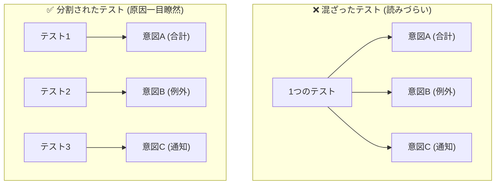
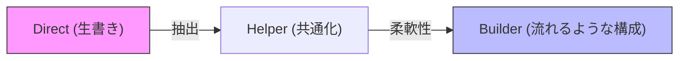

# 第14章：1テスト1意図（欲張り禁止）🍰🙅‍♀️

この章はね、**「テストが落ちたとき、原因が一瞬でわかる✨」**ようにするための超重要テクだよ〜！😆
TDDって回転が命だから、**“読むのがしんどいテスト”**が増えると、だんだん回らなくなるの🥲

---

## 今日のゴール🎯✨


読み終わったら、こんなことができるようになるよ💪😊

* ✅ テストの「意図（ねらい）」を1つに絞れる
* ✅ “混ざってるテスト”を見つけて、キレイに分割できる
* ✅ 「複数Assert＝悪」じゃない理由を説明できる（ここ超大事！）
* ✅ xUnit v3 の `Assert.Multiple` / `Assert.MultipleAsync` を“正しい場面だけ”で使える🤝
  （xUnit v3 のAPIとして用意されてるよ）([api.xunit.net][1])

---

## 「意図」ってなに？🧠💡

**意図 = このテストが守りたい“1つの約束（仕様）”**だよ📘✨

たとえば…

* ✅「合計金額が正しい」
* ✅「無効な入力なら例外になる」
* ✅「割引が適用される」

これらは全部、**別の意図**だよね🙂

---

## よくある勘違い①：「1テスト1Assert」じゃないよ🙅‍♀️🧁

よく「Assertは1個だけにしろ！」って言う人いるけど、**それは雑なルール**になりがち😅

### ✅複数AssertがOKなとき

**同じ意図を、いろんな角度から確認してるだけ**ならOKだよ👌✨
（例：戻り値オブジェクトの複数プロパティが全部正しい＝“1つの意図”）

### ❌分けた方がいいとき

**意図が別**なら分ける！



（例：「合計が正しい」＋「例外になる」＋「通知が飛ぶ」…全部混ぜると地獄😇）

---

## まずはダメな例から🥲（意図が混ざってるテスト）

たとえばカフェ会計で☕️🧾

* 税込み合計を計算する
* 不正な数量は例外
* 割引もある

これを1本のテストに詰め込むと…こうなる👇

```csharp
using Xunit;

public class CafeBillingTests
{
    [Fact]
    public void Calculate_should_work_everything()
    {
        // Arrange
        var sut = new CafeBilling();

        // Act
        var total = sut.CalculateTotal(price: 1000, quantity: 2, taxRate: 0.10m, discountRate: 0.20m);

        // Assert (意図が混ざってる…🥲)
        Assert.Equal(1760m, total);                 // 合計（割引＋税）
        Assert.Throws<ArgumentOutOfRangeException>( // 例外（無効入力）
            () => sut.CalculateTotal(1000, 0, 0.10m, 0.20m));
        Assert.True(total > 0);                     // なんか別の確認…
    }
}
```

### 何がツラいの？😵‍💫

* 落ちたときに「合計？割引？税？例外？どれが壊れた？」ってなる
* “直す順番”も迷う
* 仕様変更が来たら、全部巻き添えで直す羽目になる😭

---

## キレイに分割しよう✨（1テスト1意図へ🪄）

ポイントはこれ👇
**「シナリオ（条件）× 意図（守りたい約束）」で分ける**🧠✨

```csharp
using Xunit;

public class CafeBillingTests
{
    [Fact]
    public void CalculateTotal_returns_total_with_tax_and_discount()
    {
        // Arrange
        var sut = new CafeBilling();

        // Act
        var total = sut.CalculateTotal(price: 1000, quantity: 2, taxRate: 0.10m, discountRate: 0.20m);

        // Assert（意図：合計が正しい）
        Assert.Equal(1760m, total);
    }

    [Fact]
    public void CalculateTotal_throws_when_quantity_is_zero()
    {
        // Arrange
        var sut = new CafeBilling();

        // Act & Assert（意図：無効入力は例外）
        Assert.Throws<ArgumentOutOfRangeException>(
            () => sut.CalculateTotal(price: 1000, quantity: 0, taxRate: 0.10m, discountRate: 0.20m));
    }

    [Fact]
    public void CalculateTotal_returns_positive_total_for_valid_input()
    {
        // Arrange
        var sut = new CafeBilling();

        // Act
        var total = sut.CalculateTotal(price: 1, quantity: 1, taxRate: 0.00m, discountRate: 0.00m);

        // Assert（意図：最低限の健全性…でもこれは要検討⚠️）
        Assert.True(total > 0);
    }
}
```

### ここで大事な一言💬

最後の「total > 0」みたいなテストは、**“意図が弱い”**ことが多いよ🙂
「正しい合計」を確認するテストがあるなら、だいたい不要になりがち。
（“健全性チェック”をしたいなら、何のためか意図を言語化してね📝）

---

## xUnit v3 の `Assert.Multiple` はこう使う👌✨

xUnit v3 には、複数のチェックをまとめて「まとめて失敗報告」できる `Assert.Multiple` があるよ🧪
（APIとして提供されてる）([api.xunit.net][1])

### ✅使っていい場面（同じ意図の中で）

**“1つの意図”の中で、複数プロパティをまとめて確認したい**とき🎀

```csharp
using Xunit;

public class ReceiptTests
{
    [Fact]
    public void CreateReceipt_returns_expected_summary()
    {
        var sut = new ReceiptService();

        var receipt = sut.CreateReceipt(price: 1000, quantity: 2, taxRate: 0.10m);

        Assert.Multiple(
            () => Assert.Equal(2, receipt.Quantity),
            () => Assert.Equal(1000m, receipt.UnitPrice),
            () => Assert.Equal(2000m, receipt.Subtotal),
            () => Assert.Equal(200m, receipt.Tax),
            () => Assert.Equal(2200m, receipt.Total)
        );
    }
}
```

これだと、もし複数箇所がズレてても一気に分かって気持ちいい〜！😆✨

### async版もあるよ（`Assert.MultipleAsync`）🧵✨

`Task` を返すチェックをまとめる用で、これもxUnit v3のAPIにあるよ。([api.xunit.net][2])

---

## 「意図が混ざってる」ニオイ集👃🚨（見つけたら分割チャンス）

次のどれかが出たら、だいたい混ざってる😂

* 🚨 **Actが2回以上ある**（同じテストで別行動してる）
* 🚨 **Assertが途中にも最後にも散らばってる**
* 🚨 テスト名に **And / そして / かつ** が入ってる
* 🚨 失敗したときに「直す場所が複数候補」になる
* 🚨 例外テストと正常系テストが同居してる

---

## 分割の“型”🍪✨（迷ったらこれ）

### 1) 意図を日本語で1行にする📝

例：

* 「割引が適用された合計が返る」
* 「数量0なら例外になる」

### 2) “意図ごと”にテスト名を付ける🏷️

テスト名がそのまま仕様になるやつね💖

### 3) “同じ意図の複数ケース”はパラメータ化も検討🔁

（xUnitなら `Theory` とデータで増やせる）

---

## AIの使いどころ🤖✨（この章向け・超効くやつ）

AIはここが得意だよ💪

### ✅混ざってる意図の検出

* 「このテストに含まれる意図を箇条書きで3つまで挙げて。混ざってたら分割案も出して」

### ✅分割後のテスト名案

* 「Given/When/Then っぽい命名案を3つ出して。誤解が少ない順で」

### ✅“分けすぎ”チェック

* 「この分割は細かすぎ？統合した方が良いテストがあるなら理由つきで教えて」

※ただし採用条件はいつも同じね：**テストが通る＋意図に一致**🤝✅

---

## ミニ演習🎓☕️🧾✨（手を動かすと一気に身につく！）

次の条件のテストを自分で書いてみてね😊

### お題：`CalculateTotal` のテストを3本に分割する

1. ✅ 正常系：割引＋税の合計が正しい
2. ✅ 異常系：数量0なら例外
3. ✅ 境界値：数量1、割引0、税0 でも正しい

**提出物（おすすめ）📦**

* コミット1：混ざってるテスト（わざと）
* コミット2：分割してスッキリ✨
* コミット3：必要なら `Theory` でケース追加🔁

---

## できたかチェック✅✨（この章の合格ライン）

* ✅ テスト名を見ただけで「何を守ってるか」分かる
* ✅ 失敗したとき、原因がだいたい1つに絞れる
* ✅ 異常系と正常系が別れてる
* ✅ `Assert.Multiple` を使ってても“意図は1つ”になってる([api.xunit.net][1])

---
* “共通化しすぎて意図が消える事故”を避けられる🚫🌀



ちなみに今どきは xUnit v3 系が普通に使われていて、リリースも継続してます🧪✨（例：`xunit.v3` の 3.x） ([xUnit.net][7])

---

### 参考：この章の周辺、いまの最新スタックの根拠メモ🗒️✨

* Visual Studio 2026 は 2026/01/13 の更新（18.2.0）が公開されてるよ。([Microsoft Learn][3])
* .NET 10 は 2026/01/13 の更新で 10.0.2 が例として挙がってる（10.0.1は置き換え）。([Microsoft サポート][4])
* C# 14 の新機能は Microsoft Learn にまとまってるよ。([Microsoft Learn][5])
* xUnit v3 はリリースノートで v3系の更新が追えるよ。([xUnit.net][6])

---

次、もしよければ第14章の内容をそのまま「教材文章」として、**講義台本（導入トーク→例→演習→小テスト）**に整形して出せるよ📘✨
それか、あなたの「カフェ会計」題材を使って、**混ざりテスト→分割→リファクタ**の流れをもっと長めに一緒に作ろっか？😆🧪

[1]: https://api.xunit.net/v3/3.0.0/v3.3.0.0-Xunit.Assert.Multiple.html?utm_source=chatgpt.com "Method Multiple"
[2]: https://api.xunit.net/v3/3.0.1/v3.3.0.1-Xunit.Assert.MultipleAsync.html?utm_source=chatgpt.com "Method MultipleAsync"
[3]: https://learn.microsoft.com/en-us/visualstudio/releases/2026/release-notes?utm_source=chatgpt.com "Visual Studio 2026 Release Notes"
[4]: https://support.microsoft.com/en-us/topic/-net-10-0-update-january-13-2026-64f1e2a4-3eb6-499e-b067-e55852885ad5?utm_source=chatgpt.com ".NET 10.0 Update - January 13, 2026"
[5]: https://learn.microsoft.com/en-us/dotnet/csharp/whats-new/csharp-14?utm_source=chatgpt.com "What's new in C# 14"
[6]: https://xunit.net/releases/?utm_source=chatgpt.com "Release Notes"
