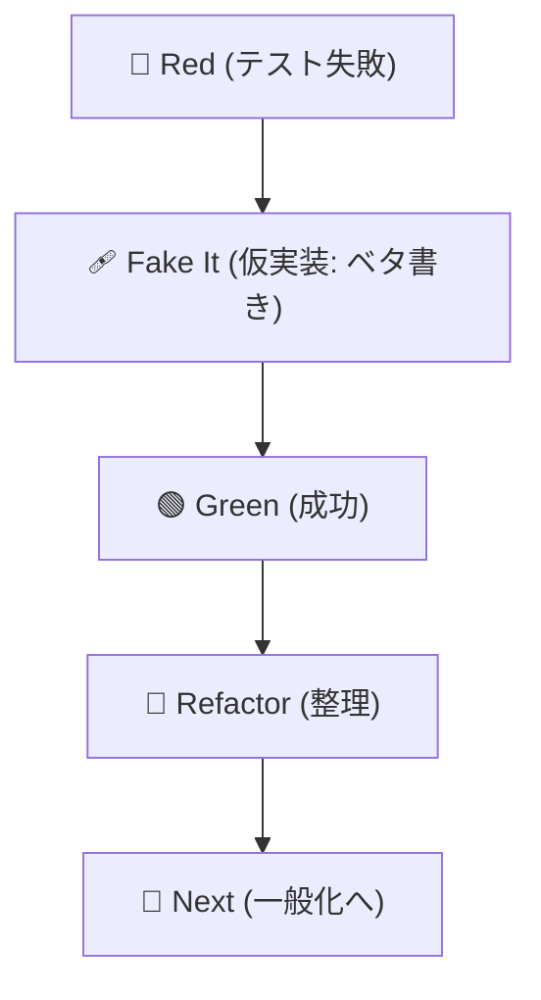
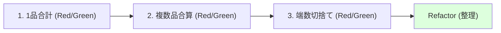

# 第17章：“決定性”の確保（テストが毎回同じ結果）🎲🚫

TDDでいちばん心が折れるのって、**「さっき通ったのに、たまに落ちる」**やつです…😵‍💫
こういう“たまに落ちるテスト”は **フレーク（flaky test）**って呼ばれてて、放置すると「テスト信じない文化」が爆誕します🔥🙅‍♀️

この章は、**テストを“毎回同じ結果”に固定する技術**を、超具体的にやっていくよ〜😊✨
（2026-01-18時点：.NET 10の最新は **10.0.2（他に「三角測量」「明白な実装」もあるやつ！） ([stanislaw.github.io][1])



---

### この章のゴール🎯✨


できるようになること👇

* ✅ フレークの原因を「カテゴリ分け」して見つけられる🔍
* ✅ **時間・乱数・並列・順序/環境**を“依存”として扱える🧩
* ✅ 直し方が「テスト ↔ 設計」につながるのが分かる（TDD的に最高）🧠✨
* ✅ **Red → Green → Refactor** を小さく3回まわせる



---

## 1) 決定性を壊す“四天王”👿⚡️（だいたいコレ）

### A. 時間（DateTime.Now / UtcNow / タイムゾーン）⏰🌏

* テスト実行する“今”に依存しちゃう
* 深夜0時またぎ、サマータイム、ローカル時間…地味に地獄😇

👉 対策：**時間は `TimeProvider` で注入する**
`TimeProvider` は .NET に入ってる「時間を差し替えるための仕組み」だよ🪄（.NET 10 でも当然使える） ([Microsoft Learn][2])

---

### B. 乱数（Random / Guid.NewGuid）🎲🧷

* 乱数は“仕様”じゃなくて“実装都合”になりがち
* `Random` のシード固定も万能じゃない：**.NETのメジャーバージョンが違うと同じシードでも同じ列にならない可能性がある**って公式が言ってるよ⚠️ ([Microsoft Learn][3])

👉 対策：**乱数も注入する**（スタブで固定値を返す、など）

---

### C. 並列（テストが同時に走る）🧵💥

* xUnit は **テストを並列実行**できる（＝共有状態があると事故る）
* 並列の制御（無効化/コレクション化）が用意されてるよ🧯 ([xUnit.net][4])

👉 対策：**共有状態（static/Singleton/同じファイル名など）を消す**
それでも必要なら **並列を止める/隔離する**

---

### D. 順序/環境（実行順、Culture、ファイル列挙順など）📦🌀

* `Directory.GetFiles()` の順序に期待しちゃう
* `Dictionary` の列挙順に頼っちゃう
* `CultureInfo` がPCによって違って数字・日付が死ぬ💀

👉 対策：**順序は常にソート**、Cultureは **Invariant** に固定 or 注入

---

## 2) ハンズオン①：時間依存で“たまに落ちる”を作って直す⏰🧪✨

### ❌ ダメな例（今の時間で割引する）

「17:00〜19:00は10%オフ」みたいな仕様があるとするね☕️🎟️

```csharp
public sealed class HappyHourDiscount
{
    public decimal Apply(decimal subtotal)
    {
        var now = DateTimeOffset.Now; // ← 今の時間に依存（フレークの匂い）
        var isHappyHour = now.Hour is >= 17 and < 19;
        return isHappyHour ? subtotal * 0.9m : subtotal;
    }
}
```

これ、**テストを書く側が時間を支配できない**から、実行時間によって結果が変わっちゃう😵‍💫

---

### ✅ 良い例：`TimeProvider` を注入して時間を支配する🪄

`TimeProvider` をコンストラクタで受け取るだけでOK😊
（`TimeProvider` は `GetUtcNow()` / `GetLocalNow()` を持ってるよ） ([Microsoft Learn][2])

```csharp
public sealed class HappyHourDiscount
{
    private readonly TimeProvider _time;

    public HappyHourDiscount(TimeProvider time)
    {
        _time = time;
    }

    public decimal Apply(decimal subtotal)
    {
        var now = _time.GetLocalNow(); // ← 差し替え可能になった✨
        var isHappyHour = now.Hour is >= 17 and < 19;
        return isHappyHour ? decimal.Round(subtotal * 0.9m, 2) : subtotal;
    }
}
```

#### テスト：FakeTimeProviderで“17:30”を作る🧊⏰

`FakeTimeProvider` を使うと、テストで時間を固定できるよ😊
NuGet には **「決定的に動くように時間を手で進められる」**って説明がある（超まさにコレ） ([NuGet][5])

```csharp
using Microsoft.Extensions.Time.Testing;
using Xunit;

public class HappyHourDiscountTests
{
    [Fact]
    public void Apply_17_30_is_10_percent_off()
    {
        var time = new FakeTimeProvider(new DateTimeOffset(2026, 1, 18, 17, 30, 0, TimeSpan.Zero));
        var sut = new HappyHourDiscount(time);

        var actual = sut.Apply(1000m);

        Assert.Equal(900m, actual);
    }

    [Fact]
    public void Apply_20_00_is_no_discount()
    {
        var time = new FakeTimeProvider(new DateTimeOffset(2026, 1, 18, 20, 0, 0, TimeSpan.Zero));
        var sut = new HappyHourDiscount(time);

        var actual = sut.Apply(1000m);

        Assert.Equal(1000m, actual);
    }
}
```

💡ポイント

* **「時間＝依存」**として扱うと、テストが一気に安定する😌✨
* これ、TDD的にも最高で「設計が勝手に整う」やつです🧠🌱

---

## 3) ハンズオン②：乱数依存を“注入”で潰す🎲🧪🧯

### ❌ ダメな例（Randomに期待してしまう）

```csharp
public sealed class CouponCodeGenerator
{
    public string Generate()
    {
        var n = Random.Shared.Next(0, 1_000_000); // ← 乱数依存
        return $"CP-{n:000000}";
    }
}
```

これを「`CP-123456`になるはず！」みたいにテストすると、当然死ぬ😂

さらに注意⚠️
公式が「Randomの実装は .NET のメジャーバージョン間で同じとは限らない」って言ってるので、**“シード固定だから大丈夫”も過信しない**のが安全だよ🧷 ([Microsoft Learn][3])

---

### ✅ 良い例：乱数も注入（スタブで固定値）

```csharp
public interface IRandomSource
{
    int Next(int minInclusive, int maxExclusive);
}

public sealed class CouponCodeGenerator
{
    private readonly IRandomSource _rng;

    public CouponCodeGenerator(IRandomSource rng)
    {
        _rng = rng;
    }

    public string Generate()
    {
        var n = _rng.Next(0, 1_000_000);
        return $"CP-{n:000000}";
    }
}
```

テストは“固定の乱数”を返すだけでOK🎯

```csharp
using Xunit;

public class CouponCodeGeneratorTests
{
    private sealed class StubRng : IRandomSource
    {
        public int Next(int minInclusive, int maxExclusive) => 123;
    }

    [Fact]
    public void Generate_formats_code_deterministically()
    {
        var sut = new CouponCodeGenerator(new StubRng());

        Assert.Equal("CP-000123", sut.Generate());
    }
}
```

🎉これで

* テストは毎回同じ結果✅
* 実装は本番で好きに乱数を使える✅
* テストは「仕様（フォーマット）」だけを守れる✅

---

## 4) 並列で落ちる系💥：まず“共有”を疑おう🧵😵‍💫

### よくある事故パターン（staticが原因）

```csharp
public static class GlobalSequence
{
    private static int _value = 0;

    public static int Next() => ++_value;
}
```

テストが並列で走ると、どのテストが先に `Next()` するか分からない→たまに失敗💀

✅対策の基本はこれ👇

* **staticやSingletonをやめる**（インスタンスにする、注入する）
* テストごとに新しく作る（状態を持たせない）

どうしても並列が邪魔なカテゴリ（ファイル/DB/外部）だけ、隔離するのもアリ👌

#### xUnitで並列を止める（最終手段）🧯

xUnitには並列実行を無効化する設定があるよ（公式ドキュメント） ([xUnit.net][4])

```csharp
using Xunit;

// テストアセンブリ全体で並列を止める（やりすぎ注意！）
[assembly: CollectionBehavior(DisableTestParallelization = true)]
```

または「このテスト群だけ並列禁止」にする👇

```csharp
using Xunit;

[CollectionDefinition("NonParallel", DisableParallelization = true)]
public class NonParallelCollection { }

[Collection("NonParallel")]
public class FileSystemLikeTests
{
    [Fact]
    public void Something() { /* ... */ }
}
```

---

## 5) 決定性チェックリスト✅🧠（困ったらここを見る）

テストが怪しいとき、まずここを疑ってね👇（めっちゃ効くよ✨）

* ⏰ `DateTime.Now` / `UtcNow` / `TimeZoneInfo.Local`
* 🎲 `Random` / `Random.Shared` / `Guid.NewGuid()`
* 🧵 `static` / Singleton / キャッシュ / 共有フォルダ
* 📁 `Directory.GetFiles()` の順序（→必ず `OrderBy`）
* 🌏 `CultureInfo.CurrentCulture`（日付・小数点・通貨）
* 🌐 ネットワーク / DB / 外部API（→ユニットでは原則スタブ）
* 💤 `Task.Delay`（→テストで待たない、時間を進める設計に）

---

## 6) AI活用（この章にピッタリの使い方）🤖✨

コピペで使えるやつ置いとくね😊

* 「このテストが**フレークになる可能性**を、時間/乱数/並列/順序/環境の観点で指摘して」
* 「このコードの `DateTime.Now` / `Random` / `Guid.NewGuid` を、**注入できる形にリファクタ案3つ**出して」
* 「“仕様としてテストすべきこと”と“実装都合でテストしないこと”を分けて」

ポイントは、**AIに“コードを書かせる”より、“危ない依存をあぶり出させる”**のが強いよ🔥🧠

---

## 7) 今日の課題（コミット単位のおすすめ）🧑‍💻🎀

1. ✅ `HappyHourDiscount` を `TimeProvider` 注入にして、`FakeTimeProvider` で2本テスト
2. ✅ `CouponCodeGenerator` を `IRandomSource` 注入にして、スタブでフォーマットテスト
3. ✅（できたら）わざと `static` 共有で“たまに落ちる”テストを作って、共有を消して直す💪

---

## まとめ🎉

* フレークは「**設計が“外界”にくっついてるサイン**」👃🚨
* 時間・乱数・並列・順序/環境を **依存として注入**できると、テストは安定してTDDが加速する🚀✨
* xUnitや.NET側にも“決定性を作る道具”がちゃんと用意されてるよ🧰

  * `TimeProvider` ([Microsoft Learn][2])
  * `FakeTimeProvider` ([NuGet][5])
  * 並列制御 ([xUnit.net][4])

次の章（第18章）の総合ミニ演習に行く前に、ここで**「テストは信用できる」状態**を作っとくのが超大事だよ〜😊🧪✨

[1]: https://dotnet.microsoft.com/en-US/download/dotnet/10.0?utm_source=chatgpt.com "Download .NET 10.0 (Linux, macOS, and Windows) | .NET"
[2]: https://learn.microsoft.com/en-us/dotnet/api/system.timeprovider?view=net-10.0 "TimeProvider Class (System) | Microsoft Learn"
[3]: https://learn.microsoft.com/ja-jp/dotnet/api/system.random?view=net-10.0 "Random Class (System) | Microsoft Learn"
[4]: https://xunit.net/docs/running-tests-in-parallel?utm_source=chatgpt.com "Running Tests in Parallel"
[5]: https://www.nuget.org/packages/Microsoft.Extensions.TimeProvider.Testing/10.0.0?utm_source=chatgpt.com "Microsoft.Extensions.TimeProvider.Testing 10.0.0"
