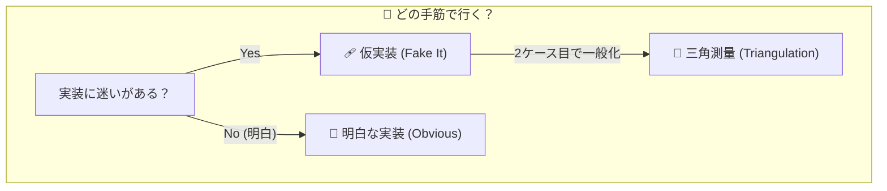
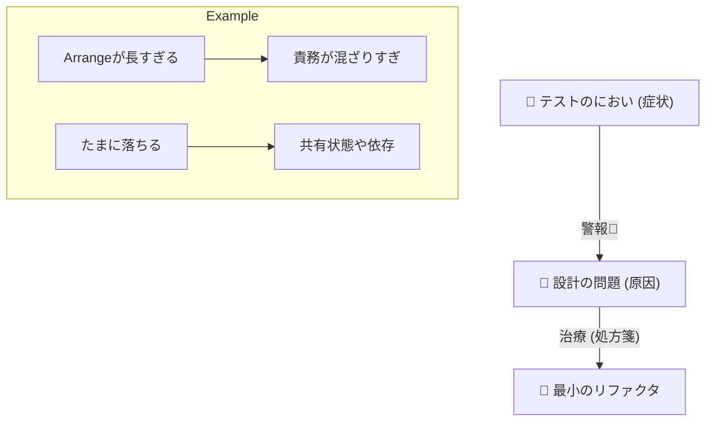
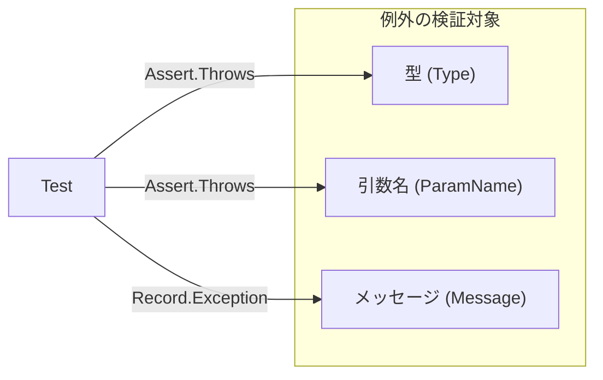

# 第21章：明白な実装（迷いがない時は素直に）🌼

この章は「**TDDって、毎回“回り道”しなくていいんだよ😊**」って感覚をつかむ回だよ〜！
**“明白（obvious）”なときは、サクッと素直に実装してOK**👌✨
ただし、**先回りして作り込みすぎない**のがコツだよ〜🧠💡

---

### この章のゴール🎯✨


* 「いまは **明白な実装でいってOK**」を判断できる😊🔍
* **仮実装 / 三角測量 / 明白な実装**を、状況で使い分けられる🚦📐🌼
* 明白に実装しても、**TDDのリズム（Red→Green→Refactor）**は崩さない🧪🔁✨



---

## 1) 3つの手筋、ざっくり復習だよ🚦✨

### 🩹 仮実装（Fake it）

* **とにかく最短でGreen**にするために、ベタな値を返す😇
* 良い：詰まった時の脱出ボタン🚪💨
* 注意：**永住させるとヤバい**😂（第19章でやったやつ）

### 📐 三角測量（Triangulation）

* **2ケース目（3ケース目）で一般化**していく感じ✨
* 良い：一般化のタイミングが自然🌱
* 注意：ケースを増やす前提だから、最初はちょい遅い⏳

### 🌼 明白な実装（Obvious implementation）

* **仕様がはっきりしてて、迷いがないなら素直に書く**✍️✨
* 良い：ムダがない！速い！気持ちいい！💃🫶
* 注意：**“賢くしすぎない”**（ここ超大事⚠️）

---

## 2) 「明白」かどうかの判断基準🧠🔍✨

### ✅ 明白でいってOKなサイン🌼

* 仕様が **式やルールでスパッと言える**（例：税込=切り捨て）🧾✨
* 実装が **3〜10行くらいで書けそう**✍️
* 新しい抽象（interfaceとか）を作らなくても、今は困らない😊
* 失敗したら、次のRefactorで整えればいい状態🧹✨

### ❌ 明白に見えて、実は危ないサイン⚠️

* 「将来こうなるかも…」で **先回り設計**したくなってる🔮😵
* 依存（時刻・乱数・DB・API）が混ざってて、迷いがある🎲🌐
* 条件分岐が増えそうなのに、今の時点でクラス増やしたくなってる🧩😇
  → こういうときは **仮実装 or 三角測量**が安全だよ〜🛡️✨

---

## 3) ハンズオン：税込計算を“明白に”実装してみよ☕️🧾🌼

### 仕様（この章のミニ題材）📌✨

* 税率は **10%**
* 税込み価格 = `税抜 * 1.1` を **小数点以下切り捨て**（円は整数）
* 入力は 0以上の int（今回は異常系は次章でやるよ🚫🧪）

---

### ✅ Step 1：Red（失敗するテストを書く）🧪🔴

```csharp
using Xunit;

public class PriceCalculatorTests
{
    [Fact]
    public void 税抜100円なら税込110円()
    {
        var result = PriceCalculator.ToTaxIncludedYen(100);
        Assert.Equal(110, result);
    }

    [Theory]
    [InlineData(101, 111)] // 101 * 1.1 = 111.1 → 切り捨てで 111
    [InlineData(999, 1098)] // 999 * 1.1 = 1098.9 → 1098
    public void 税込は小数点以下切り捨て(int netYen, int expectedTaxIncluded)
    {
        var result = PriceCalculator.ToTaxIncludedYen(netYen);
        Assert.Equal(expectedTaxIncluded, result);
    }
}
```

👉 ここでまだ `PriceCalculator` は無いので、まずはコンパイルエラー/失敗でOKだよ〜😊🧪

---

### ✅ Step 2：Green（明白な実装で素直に通す）🧪🟢🌼

ポイントはこれ👇

* **decimalを使う**（float/doubleの誤差で泣かないため🥲）
* 切り捨ては **Math.Floor** で明確に✨

```csharp
public static class PriceCalculator
{
    public static int ToTaxIncludedYen(int netYen)
    {
        decimal taxIncluded = netYen * 1.1m;
        return (int)decimal.Floor(taxIncluded);
    }
}
```

これでテストが通るはず〜🎉✨
「仕様が式で言える」「実装が短い」「迷いがない」→ **明白案件**だね🌼😊

---

### ✅ Step 3：Refactor（“小さく整える”）🧹✨

この実装、もう十分だけど…
読みやすくしたいならこういうのもアリ👇（※テストが守ってくれるから安心😌🛡️）

```csharp
public static class PriceCalculator
{
    private const decimal TaxRate = 0.10m;

    public static int ToTaxIncludedYen(int netYen)
    {
        var taxIncluded = netYen * (1 + TaxRate);
        return (int)decimal.Floor(taxIncluded);
    }
}
```

---

## 4) 「仮実装で行くとどうなる？」を比べてみよ😂🩹

同じ最初のテストだけなら、こういう“ズル”でも通っちゃう👇

```csharp
public static class PriceCalculator
{
    public static int ToTaxIncludedYen(int netYen) => 110;
}
```

でもこれだと…

* 2ケース目で即崩壊💥
* **一般化のタイミングを後ろにズラしてるだけ**😇
* しかも「110って何？」って読んだ人が困る🌀

今回みたいに式が明白なら、**最初から素直に書いた方が速い**よね🌼✨

---

## 5) “明白”のときにやりがちな事故あるある😵‍💫⚠️

### 🚫 先回り抽象化しすぎる

* `ITaxCalculator` 作る
* `Money` 型を作る
* DIコンテナを導入する
  → ぜんぶ「将来」への備えだけど、今は必要ないかも🥲
  **必要になったら、その時にテストに押されて自然に出る**ことが多いよ🌱✨

### 🚫 仕様が曖昧なのに明白で突っ走る

* 「端数処理って切り捨て？四捨五入？品目ごと？合計？」みたいなやつ😵
  → こういうときは **三角測量**で仕様をテストで固めるのが安全📐🧪✨
* **最小のリファクタ**で、テストも実装もラクにできる（大改造しない🧸）



---

## 6) AIの使いどころ🤖✨（この章向け）

「明白かどうか」をAIに判定させるんじゃなくて、**自分の判断を言語化する補助**に使うのがいいよ😊🫶

おすすめプロンプト👇

* 「この仕様は *仮実装/三角測量/明白* のどれで始めるのが良い？理由もセットで」🤖💬
* 「明白に実装したい。作り込みすぎを防ぐために、最小の実装方針を箇条書きで」🧠✅
* 「この実装、先回り抽象化になってない？危ない点があれば指摘して」⚠️🔍

---

## 7) チェックリスト✅✨（自分で判定！）

次の質問に **3つ以上YES**なら、明白でGOしやすいよ🌼🚀

* 仕様を1行の式/ルールで言える？🧾
* 実装が10行以内に収まりそう？✍️
* “今この瞬間” 依存や設計の迷いがない？😊
* 仮実装にすると逆に遠回りになりそう？🩹➡️😵
* テストが読みやすくて、仕様として成立してる？🧪📘
* 特に「引数が変」「状態が変」は、APIを使う側にとって超大事！



---

## 8) ミニ小テスト（超かんたん）📝✨

次のうち「明白」で行きやすいのはどれ？（理由も一言で😊）

1. 文字列を逆順にする（例："abc"→"cba"）🔁
2. 「会員は送料0円、それ以外は500円未満は送料200円」🚚
3. DBから取得して在庫を引き当てる（同時更新あり）🗄️💥
4. 税込み計算（10%切り捨て）🧾

（答えの目安：1,2,4は明白寄り🌼 / 3は明白に見えて地雷多め⚠️）

---

## 9) この章の課題（コミット単位つき）🎒✨

### 課題A：税込計算を“明白”で完成させる☕️🧾

* `ToTaxIncludedYen` をTDDで作る🧪
* ケースは最低3つ（100, 101, 999 みたいに）🔁

**コミット案📦**

1. `test: 税込計算のテスト追加（1ケース）` 🔴
2. `test: 切り捨てケースを追加（2ケース目以降）` 🔴
3. `feat: 明白な実装でGreen` 🟢
4. `refactor: 税率定数化＆命名改善` 🧹✨

---

## 参考：この章の“いまの最新”に関係する情報メモ📌✨

* .NET 10 の最新SDKは **10.0.2（2026-01-13）** が案内されてるよ🧪✨ ([Microsoft][1])
* C# 14 は .NET 10 SDK / Visual Studio 2026 で試せる形で整理されてるよ🌼 ([Microsoft Learn][2])
* xUnit v3 は NuGet 上で **xunit.v3 3.2.2** が出ていて、v3系のリリースノートも追えるよ🧪✨ ([NuGet][3])

---

次は、第21章の内容をベースにして「**演習用の別題材**（送料/ポイント/割引）」でも同じ“明白判断”を練習できるように、追加問題も作れるよ〜😊🎀🧪

[1]: https://dotnet.microsoft.com/en-US/download/dotnet/10.0?utm_source=chatgpt.com "Download .NET 10.0 (Linux, macOS, and Windows) | .NET"
[2]: https://learn.microsoft.com/en-us/dotnet/csharp/whats-new/csharp-14?utm_source=chatgpt.com "What's new in C# 14"
[3]: https://www.nuget.org/packages/xunit.v3?utm_source=chatgpt.com "xunit.v3 3.2.2"
