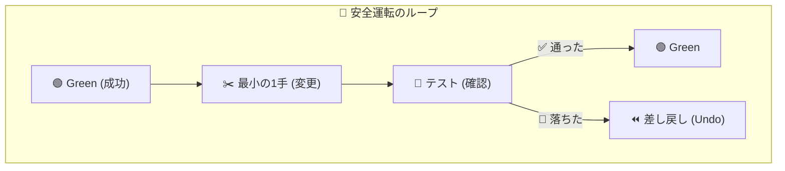
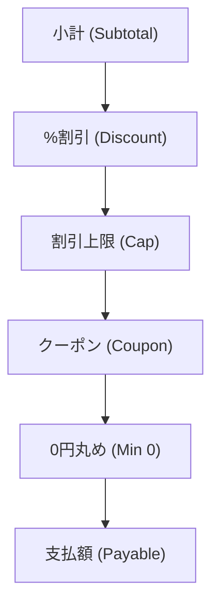
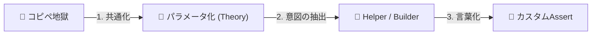

# 第24章：リファクタの安全運転（テストがある時の整理）🛡️

この章は「テストがあるからこそ、怖がらずにコードを整える」回だよ〜！😊
TDDの **Red→Green→Refactor** のうち、今日は **Refactor（整理整頓）** を“安全運転”でやるコツを身につけます🚗💨

---

## 1) この章のゴール🎯✨


読み終わる頃に、こうなってたら勝ちです💪💕

* ✅ **Green（テスト全部成功）を保ったまま**、コードを少しずつ綺麗にできる
* ✅ 「リファクタ」と「仕様変更（挙動変更）」の違いを説明できる
* ✅ **小さく変更→すぐテスト**のループが手癖になる
* ✅ AI（Copilot/Codex）を使っても、**“最小の一歩”だけ採用**できる 🤖✅

---

## 2) まず超大事：リファクタって何？🧹✨


リファクタはひとことで言うと、

> **外から見える動き（ふるまい）を変えずに**、中身のコードを読みやすく・直しやすくすること🧼✨

✅ ふるまいは同じ
✅ でも中の作りを良くする（名前、重複、構造、見通し）

そして、TDDだと最強なのがこれ👇

* **テストが「安全ベルト」**になってくれる🛡️
* だから **安心して直せる**😊✨



---

## 3) 安全運転の「5つのルール」🚦🛡️


ここから先、ずっとこのルールでいこう〜！🌸

1. **Greenから始める**✅（赤いまま整理しない）
2. **1回の変更は“1種類だけ”**✂️（リネームだけ／抽出だけ…）
3. **変更は小さく**🐣（差分が小さいほど安全）
4. **こまめにテスト**🧪（できれば数十秒おき）
5. **こまめにコミット**📌（戻れる場所＝安心）

---

## 4) 「リファクタしていいタイミング」いつ？⏱️✨


### ✅ やっていいタイミング

* テストが全部Green✅
* 実装が“とりあえず通った”けど、見た目がぐちゃぐちゃ😵‍💫
* 重複や命名が気持ち悪い👃🚨（におい！）

### 🚫 やっちゃダメ（事故りやすい）

* テストがRedのまま
* 仕様がまだ固まってないのに、設計を作り込み始める
* まとめて大改造（いきなりフォルダ構成変更とか）😇

---

## 5) 実戦：カフェ会計の「割引計算」を安全に整える☕️🧾🛠️

ここからハンズオン！
「動くけど読みにくい」典型コードを **“小さく直す”** 練習するよ😊✨

### 5-1. まずはテスト（安全ベルト）を用意🧪🛡️

#### ✅ 仕様（例）

* 合計金額 `subtotal` がある
* 会員なら 10% 引き（ただし最大 500 円まで）
* クーポン `"200OFF"` は 200 円引き（ただし 0円未満にならない）
* 最終金額は 0円以上

#### xUnit テスト例

```csharp
using Xunit;

public class PricingTests
{
    [Fact]
    public void MemberDiscount_is_10_percent_capped_at_500()
    {
        var p = new Pricing();

        var result = p.CalcFinalPrice(subtotal: 10_000, isMember: true, couponCode: null);

        // 10% = 1000 だけど上限500
        Assert.Equal(9_500, result);
    }

    [Fact]
    public void Coupon_200OFF_is_applied_after_member_discount()
    {
        var p = new Pricing();

        var result = p.CalcFinalPrice(subtotal: 3_000, isMember: true, couponCode: "200OFF");

        // 会員10%で 2700、そこから200引きで 2500
        Assert.Equal(2_500, result);
    }

    [Fact]
    public void Final_price_never_goes_below_zero()
    {
        var p = new Pricing();

        var result = p.CalcFinalPrice(subtotal: 100, isMember: false, couponCode: "200OFF");

        Assert.Equal(0, result);
    }
}
```

---

### 5-2. “ぐちゃぐちゃ実装”（リファクタ前）😵‍💫

```csharp
public class Pricing
{
    public int CalcFinalPrice(int subtotal, bool isMember, string? couponCode)
    {
        var price = subtotal;

        if (isMember)
        {
            var discount = (int)(price * 0.1);
            if (discount > 500)
            {
                discount = 500;
            }
            price = price - discount;
        }

        if (couponCode == "200OFF")
        {
            price = price - 200;
            if (price < 0)
            {
                price = 0;
            }
        }

        if (price < 0)
        {
            price = 0;
        }

        return price;
    }
}
```

動く。けど…

* `price < 0` チェックが重複してる🙈
* マジックナンバーが裸で出てくる（0.1 / 500 / 200）🧙‍♀️
* “何の意図でこうしてる？” が読み取りづらい😵

ここの順番を **テストで固定** していくよ〜！🧪✨



---

## 6) リファクタ手順（小さく → テスト）🪜✅🧪

### STEP 1：マジックナンバーに名前をつける🏷️✨（挙動は変えない）


「数字に意味があるなら、名前をつける」だけで一気に読みやすくなるよ😊

```csharp
public class Pricing
{
    private const decimal MemberDiscountRate = 0.10m;
    private const int MemberDiscountCap = 500;
    private const int Coupon200OffAmount = 200;

    public int CalcFinalPrice(int subtotal, bool isMember, string? couponCode)
    {
        var price = subtotal;

        if (isMember)
        {
            var discount = (int)(price * MemberDiscountRate);
            if (discount > MemberDiscountCap)
            {
                discount = MemberDiscountCap;
            }
            price = price - discount;
        }

        if (couponCode == "200OFF")
        {
            price = price - Coupon200OffAmount;
            if (price < 0)
            {
                price = 0;
            }
        }

        if (price < 0)
        {
            price = 0;
        }

        return price;
    }
}
```

✅ ここでテスト実行！🧪
（Visual Studioなら Test Explorer で “Run All”、CLIなら `dotnet test`）

---

### STEP 2：重複を“1か所”に寄せる（Clampを抽出）✂️🧼


`price < 0` が2回出てるよね？
「0未満禁止」は **ルール** だから **1か所**に寄せたい✨

```csharp
public class Pricing
{
    private const decimal MemberDiscountRate = 0.10m;
    private const int MemberDiscountCap = 500;
    private const int Coupon200OffAmount = 200;

    public int CalcFinalPrice(int subtotal, bool isMember, string? couponCode)
    {
        var price = subtotal;

        if (isMember)
        {
            var discount = (int)(price * MemberDiscountRate);
            if (discount > MemberDiscountCap)
            {
                discount = MemberDiscountCap;
            }
            price -= discount;
        }

        if (couponCode == "200OFF")
        {
            price -= Coupon200OffAmount;
        }

        return ClampToZero(price);
    }

    private static int ClampToZero(int price) => price < 0 ? 0 : price;
}
```

✅ 変更は「抽出して寄せた」だけ！
✅ ここでまたテスト実行！🧪✨

---

### STEP 3：意図が読めるように“処理の塊”を抽出する🧩✨


「会員割引」「クーポン適用」って、意味のある処理の塊だよね？
メソッドにすると読む側が幸せ🥰

```csharp
public class Pricing
{
    private const decimal MemberDiscountRate = 0.10m;
    private const int MemberDiscountCap = 500;
    private const int Coupon200OffAmount = 200;

    public int CalcFinalPrice(int subtotal, bool isMember, string? couponCode)
    {
        var price = subtotal;

        price = ApplyMemberDiscount(price, isMember);
        price = ApplyCoupon(price, couponCode);

        return ClampToZero(price);
    }

    private static int ApplyMemberDiscount(int price, bool isMember)
    {
        if (!isMember) return price;

        var discount = (int)(price * MemberDiscountRate);
        discount = Math.Min(discount, MemberDiscountCap);

        return price - discount;
    }

    private static int ApplyCoupon(int price, string? couponCode)
    {
        if (couponCode != "200OFF") return price;
        return price - Coupon200OffAmount;
    }

    private static int ClampToZero(int price) => price < 0 ? 0 : price;
}
```

✅ ここでまたテスト！🧪✨
（この章の目的は **“毎回テストするクセ”** を作ることだよ〜！）

---

## 7) Visual Studio / VS Code の「安全な武器」🧰✨

### Visual Studio（超よく使うやつ）

* リネーム（Rename）📝：変数・メソッド名の変更が安全
* Extract Method（メソッド抽出）✂️
* “Find All References”🔍：影響範囲の確認
* Test Explorerで **変更のたびに実行**🧪

### VS Code（補足）

* Rename Symbol（だいたい `F2`）📝
* “Go to References”🔍
* ターミナルで `dotnet test`🧪

---

## 8) AI（Copilot/Codex）を使う時の「事故らない頼み方」🤖🛡️


AIは便利だけど、**一気に大改造提案**してきがち😇
だから、こう頼むのが安全！

### ✅ 安全プロンプト例

* 「**挙動を変えない**前提で、**最小のリファクタ1手だけ**提案して」
* 「このコードの重複を減らしたい。**差分が小さい順に**3案出して」
* 「“命名だけ”改善したい。変数名・メソッド名の候補を5つ出して」
* 「この変更で壊れそうな場所を指摘して。確認方法もセットで」

### ✅* AIの提案を採用する判断も速い🏎️💨



---
### ✅ AI提案を採用する条件（超重要）✅

* ✅ 差分が小さい
* ✅ テストが全部Green
* ✅ 自分が説明できる（“なんとなく”採用しない）🙅‍♀️

---

## 9) ありがち事故🚑💥（と対策）

* ❌ まとめて直してテスト落ちる → **どこで壊れたか分からない**
  ✅ 対策：**1手ごとにテスト**🧪

* ❌ リファクタのつもりで仕様変えてた
  ✅ 対策：**仕様変えるなら先にテスト追加**📌

* ❌ テストが弱くて、壊しても気づけない
  ✅ 対策：境界値（0/上限/下限）を増やす🔁✨

---

## 10) ミニ問題（理解チェック）📝💕

Q1. リファクタとは「何を変えない」作業？
Q2. Refactorに入っていいタイミングは？
Q3. 「変更が大きくなった」と感じたら最初にすることは？
Q4. AIの提案をそのまま採用していい条件は？
Q5. `price < 0` の重複がある時、まずやると安全な改善は？

（答えは自分の言葉でOKだよ〜😊✨）

---

## 11) 提出課題（コミット単位つき）📌🧪

### 課題：さっきの `Pricing` を、次の順番でリファクタしてコミットしよう💪✨

1. 🏷️ マジックナンバーに名前をつける（コミット①）
2. 🧼 `ClampToZero` を作って重複を消す（コミット②）
3. ✂️ `ApplyMemberDiscount` / `ApplyCoupon` を抽出（コミット③）
4. 🧪 各コミットでテストがGreenのスクショ or ログを残す（提出物）

---

## 12) ちょい最新メモ（今日の“事実確認”）🗓️✨

この章の内容は特定バージョンに依存しないけど、教材全体の前提が最新かは確認済みだよ😊✅

* .NET 10 の最新パッチは **10.0.2（2026-01-13）**。([Microsoft][1])
* xUnit v3 のリリースは **3.2.2** まで出てるよ。([xunit.net][2])
* C# 14 は .NET 10 でサポートされる “最新” として案内されてるよ。([Microsoft Learn][3])

---

必要なら、この章の続きとして👇も一気に作れるよ😊✨

* 「安全なリファクタ手順」チェックリスト（印刷用）🧾🛡️
* カフェ会計②（割引・クーポン）に向けて、**“におい→改善手”対応表**👃➡️🛠️
* Visual Studioでの操作手順を、スクショ前提みたいに“手取り足取り”文章化🪟📘

[1]: https://dotnet.microsoft.com/en-US/download/dotnet/10.0?utm_source=chatgpt.com "Download .NET 10.0 (Linux, macOS, and Windows) | .NET"
[2]: https://xunit.net/releases/?utm_source=chatgpt.com "Release Notes"
[3]: https://learn.microsoft.com/en-us/dotnet/csharp/whats-new/csharp-14?utm_source=chatgpt.com "What's new in C# 14"
