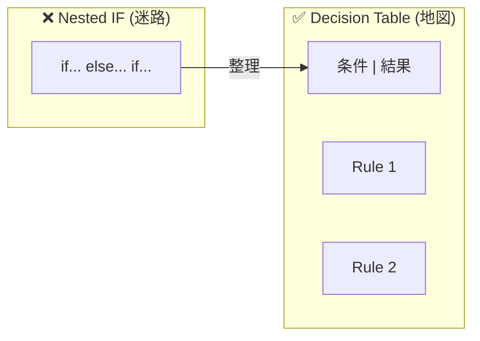
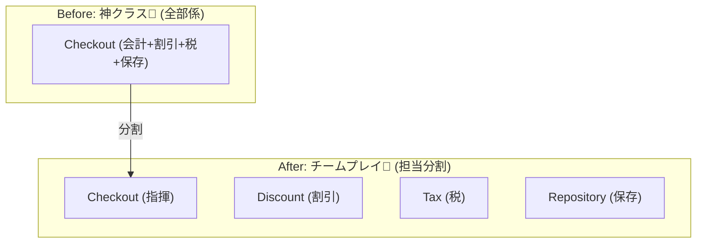
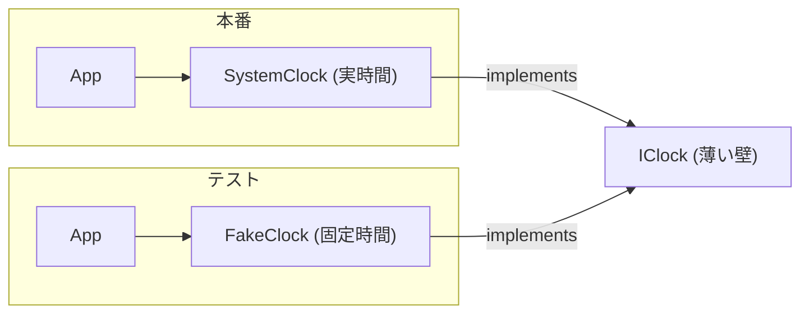

# 第27章：条件分岐地獄の回避（表にして考える）🗂️

「if が増えすぎて読むのもしんどい…」「仕様追加のたびにどこ直すか怖い…」ってなるやつ、だいたい **“ルール”が頭の中でぐちゃぐちゃ**になってるのが原因です🥺💦
そこで今日は、**決定表（Decision Table）**でルールを“見える化”して、**テストケースも一緒にスッと作れる**ようにします🧪✨
（決定表は「条件の組み合わせ → 実行すること」を表で整理する考え方だよ📘） ([ウィキペディア][1])

---

## 今日のゴール🎯✨


* ✅ 仕様の「条件」と「結果（アクション）」を分解できる
* ✅ 決定表を作って、**抜け・重なり**を見つけられる👀
* ✅ 決定表から **テストケース（Theory）** を作れる🧪
* ✅ 実装は **“表駆動”** に寄せて、if を育てない🌱



---

## 1) なぜ if は地獄になるの？😵‍💫🌋

たとえばこんな感じの仕様、増えがち👇

* クーポンの種類が増えた🎟️
* 会員ランクが増えた💎
* 小計の条件が増えた🧾
* 上限や例外が増えた🚧

ここで if/else を足していくと…

* 条件の組み合わせが爆発💥（把握しきれない）
* 「このケース誰が担当？」が不明🫥
* 追加のたびに “既存を壊す” 🥶

なので発想を変えて、**まず表にしてからコードを書く**が安全です🛡️✨

---

## 2) 決定表（Decision Table）ってなに？📘🗂️

決定表はざっくり言うと：

* **条件（Conditions）**：入力や状態（例：クーポン有効？、会員？）
* **結果/アクション（Actions）**：どうする？（例：割引いくら？）
* **ルール（Rules）**：条件の組み合わせ 1パターン＝1ルール

さらに「関係ない条件」は **“don’t care（どっちでもいい）”** として `-` みたいに表せます👍（表がスッキリする✨） ([ウィキペディア][1])

---

## 3) 例題：カフェ会計（割引ルール）☕️🎟️🧾

今日の題材はこうします（ほどよく複雑にするよ🥰）

### 仕様（文章）📄

1. クーポンが **有効** で、会計の小計が **500円以上** ならクーポンを使える🎟️✅
2. クーポンは2種類：

   * `Fixed300`：300円引き
   * `Percent10`：小計の10%引き（ただし最大500円まで）
3. クーポンが使えないとき（無効 / 小計不足 / そもそも無し）は、
   **Premium会員** で **小計1000円以上** なら 50円引き💎✨
4. 割引額は小計を超えない（マイナス会計禁止）🧯

---

## 4) まず “条件軸” を切り出す🔪🧠✨

文章から、条件っぽいものを抜きます👇

* クーポン種別：`None / Fixed300 / Percent10`
* クーポン有効？：`Yes / No`（※クーポン無しなら気にしない）
* 小計帯：`<500 / 500–999 / >=1000`
* 会員：`Normal / Premium`

結果（アクション）は👇

* 割引額：`0 / 50 / 300 / (10%上限500)` など

---

## 5) 決定表にする（ルールを見える化）🗂️✨

ここでは **“1行＝1ルール”** の形で書いちゃいます（読みやすいから😊）
`-` は **どっちでもOK** の意味だよ🙆‍♀️

| ルール | クーポン                 | 有効？ | 小計帯              | 会員      | 割引                       |
| --- | -------------------- | --- | ---------------- | ------- | ------------------------ |
| R1  | Fixed300             | Yes | 500–999 / >=1000 | -       | min(300, 小計)             |
| R2  | Percent10            | Yes | 500–999 / >=1000 | -       | min(round(小計×0.10), 500) |
| R3  | Fixed300 / Percent10 | Yes | <500             | -       | 0（小計不足で使えない）             |
| R4  | -                    | -   | >=1000           | Premium | 50（クーポン使えない時だけ）          |
| R5  | -                    | -   | それ以外             | -       | 0                        |

**ポイント**💡

* R1/R2 が「クーポン優先」
* R4 は「クーポンが使えない時の救済」
* R5 は最後のデフォルト（迷子防止）🧭

> ルールが **重なる** と「どっちの結果？」問題が起きます💥
> こういう “重なり/抜け” を扱う考え方は、DMN（決定モデル）でも大事にされてます。 ([Trisotech][2])

---

## 6) 決定表からテストケースを作る🧪✨（ここが気持ちいい）

### コツ🎀

* **各ルールにつき最低1ケース** を作る
* 境界（499/500/999/1000）を入れる
* **分けすぎ事故**（細切れ地獄）を回避できる🍰🙅‍♀️



---

## 7) xUnit（Theory）でケースを “表” っぽく回す🔁🧪

### 7.1 入力モデル（超シンプル）✨

```csharp
public enum CouponKind { None, Fixed300, Percent10 }
public enum MemberRank { Normal, Premium }
public enum SubtotalBand { Small, Mid, Large } // <500, 500-999, >=1000

public sealed record DiscountInput(
    int Subtotal,
    CouponKind Coupon,
    bool CouponValid,
    MemberRank Member
);
```

`SubtotalBand` はテスト側で使ってもいいけど、実装では `Subtotal` から判定する方が自然だよ🙆‍♀️

---

### 7.2 テストケース（決定表→TheoryData）🗂️🧪

```csharp
using Xunit;

public class DiscountPolicyTests
{
    public static TheoryData<DiscountInput, int> Cases => new()
    {
        // R1: Fixed300 (valid) and subtotal >= 500
        { new DiscountInput(500,  CouponKind.Fixed300, true,  MemberRank.Normal), 300 },
        { new DiscountInput(999,  CouponKind.Fixed300, true,  MemberRank.Premium), 300 },
        { new DiscountInput(550,  CouponKind.Fixed300, true,  MemberRank.Normal), 300 },
        { new DiscountInput(200,  CouponKind.Fixed300, true,  MemberRank.Normal), 0 },   // R3: subtotal < 500

        // R2: Percent10 (valid) and subtotal >= 500 (cap 500)
        { new DiscountInput(500,  CouponKind.Percent10, true, MemberRank.Normal), 50 },
        { new DiscountInput(999,  CouponKind.Percent10, true, MemberRank.Normal), 100 }, // round(99.9) -> 100 (例として四捨五入)
        { new DiscountInput(6000, CouponKind.Percent10, true, MemberRank.Normal), 500 }, // cap

        // R4: Premium 50 when coupon cannot be used
        { new DiscountInput(1000, CouponKind.None,      false, MemberRank.Premium), 50 },
        { new DiscountInput(1000, CouponKind.Fixed300,  false, MemberRank.Premium), 50 }, // invalid coupon -> treat as no coupon
        { new DiscountInput(999,  CouponKind.None,      false, MemberRank.Premium), 0 },  // not Large

        // R5: default
        { new DiscountInput(400,  CouponKind.None,      false, MemberRank.Normal), 0 },
    };

    [Theory]
    [MemberData(nameof(Cases))]
    public void Discount_is_decided_by_rules(DiscountInput input, int expected)
    {
        var policy = new DiscountPolicy();
        var discount = policy.CalculateDiscount(input);

        Assert.Equal(expected, discount);
    }
}
```

※ xUnit v3 は既にリリースされていて、v3系の変更点やリリースノートも公開されてるよ📌 ([xunit.net][3])

---

## 8) 実装は “表駆動” に寄せる（if を育てない）🌱😎

### 8.1 まずは最小の実装（ルールを順に当てる）🎯

```csharp
public sealed class DiscountPolicy
{
    private const int CouponMinSubtotal = 500;
    private const int PercentCap = 500;

    public int CalculateDiscount(DiscountInput input)
    {
        // 1) valid coupon & subtotal >= 500 => coupon wins
        if (input.Coupon != CouponKind.None && input.CouponValid && input.Subtotal >= CouponMinSubtotal)
        {
            return input.Coupon switch
            {
                CouponKind.Fixed300 => Math.Min(300, input.Subtotal),
                CouponKind.Percent10 => Math.Min((int)Math.Round(input.Subtotal * 0.10m, MidpointRounding.AwayFromZero), PercentCap),
                _ => 0
            };
        }

        // 2) otherwise premium rule
        if (input.Member == MemberRank.Premium && input.Subtotal >= 1000)
            return 50;

        // 3) default
        return 0;
    }
}
```

これでも十分読みやすいけど、仕様が増えるとまた if が太り始めます🐷💦
そこで次へ👇

---

### 8.2 “ルールの表” をコードにする（ガチの表駆動）🗂️➡️💻✨

```csharp
public sealed class DiscountPolicy
{
    private readonly List<Rule> _rules = new()
    {
        // R1: Fixed300
        new Rule(
            when: x => x.Coupon == CouponKind.Fixed300 && x.CouponValid && x.Subtotal >= 500,
            calc: x => Math.Min(300, x.Subtotal)
        ),

        // R2: Percent10 (cap 500)
        new Rule(
            when: x => x.Coupon == CouponKind.Percent10 && x.CouponValid && x.Subtotal >= 500,
            calc: x => Math.Min((int)Math.Round(x.Subtotal * 0.10m, MidpointRounding.AwayFromZero), 500)
        ),

        // R4: Premium 50 (only when coupon not used)
        new Rule(
            when: x => x.Member == MemberRank.Premium && x.Subtotal >= 1000,
            calc: _ => 50
        ),

        // R5: default
        new Rule(
            when: _ => true,
            calc: _ => 0
        ),
    };

    public int CalculateDiscount(DiscountInput input)
        => _rules.First(r => r.When(input)).Calc(input);

    private sealed record Rule(Func<DiscountInput, bool> When, Func<DiscountInput, int> Calc);
}
```

**いいところ**🥳✨

* ルール追加＝ `Rule` を1個足すだけ🎯
* “どれが優先？” も **順番**で分かる📌
* テストは **表の行を増やす**感覚で増やせる🧪
* テストだから「時間」は **依存（外部要因）** として扱って、差し替え可能にするよ〜🔁✨



---

## 9) 抜け・重なりチェックのやり方（超大事）👀🚨

### 抜け（未定義）を防ぐ🕳️

* **最後に default ルール（いつでも true）** を置く
* 表で「この組み合わせ、結果どうなる？」を必ず埋める

### 重なり（競合）を防ぐ💥

* “同じ入力が2ルールに当たる” と結果が揺れる
* まずは **ルールの優先順位を文章で宣言**（例：クーポン優先）
* 余裕が出たら、重なり検出の仕組み（DMNの hit policy みたいな考え）も知っておくと強いよ📘 ([Trisotech][2])

---

## 10) AI（Copilot/Codex）をこの章で使うなら🤖✨（使いどころ固定！）

### ① 決定表のたたき台を作らせる🗂️

🪄プロンプト例：

* 「この仕様を“条件/結果/ルール”に分解して、決定表を作って」

👉 出てきた表をそのまま信じないで、**境界値（499/500/999/1000）** と **優先順位** を人間が確認✅

### ② 抜けを探させる🔍

* 「この決定表で未カバーの組み合わせを指摘して」

### ③ テストケース化だけ手伝わせる🧪

* 「各ルールにつき代表ケース1つ＋境界値を提案して」

（実装はテストが通る最小で自分が握るのがコツだよ✊✨）

---

## 11) まとめ🎉🧠

* 条件分岐が増えるときは、先に **決定表で見える化**🗂️
* `-（don’t care）` を使うと表がスリムになる✨ ([ウィキペディア][1])
* 表 → テスト（Theory）に落とすと **追加が怖くなくなる**🧪
* 実装は “表駆動” に寄せると、if が育ちにくい🌱😎

---

## おまけ：今の最新メモ📝✨（確認済み）

* .NET 10 は **2026/01/13 に 10.0.2 が出てる**よ📌 ([GitHub][4])
* C# 14 は .NET 10 でサポートされてるよ✅ ([Microsoft Learn][5])
* Visual Studio 2026 のリリース履歴も公開されてるよ🪟 ([Microsoft Learn][6])

---

次の第28章は、この“表で整理したルール”を **責務分割（小さなクラスに分ける）** に繋げて、もっと壊れにくくしていくよ🧩✨
必要なら、この章の例題をあなたの教材用に「講義台本」「課題」「小テスト問題」つきに整形して出せるよ〜🥰📘✨

[1]: https://en.wikipedia.org/wiki/Decision_table?utm_source=chatgpt.com "Decision table"
[2]: https://www.trisotech.com/dmn-hit-policy-explained/?utm_source=chatgpt.com "DMN Hit Policy Explained"
[3]: https://xunit.net/releases/?utm_source=chatgpt.com "Release Notes - xUnit.net"
[4]: https://github.com/dotnet/core/blob/main/release-notes/10.0/10.0.2/10.0.2.md?utm_source=chatgpt.com "core/release-notes/10.0/10.0.2/10.0.2.md at main · dotnet/ ..."
[5]: https://learn.microsoft.com/en-us/dotnet/csharp/whats-new/csharp-14?utm_source=chatgpt.com "What's new in C# 14"
[6]: https://learn.microsoft.com/en-us/visualstudio/releases/2026/release-history?utm_source=chatgpt.com "Visual Studio Release History"
