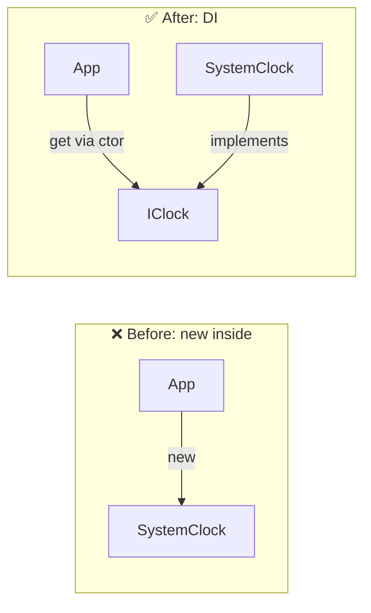

# 第31章：依存の差し替え②：コンストラクタ注入（DI入門）📦

（ねらい：**new を減らしてテスト可能にする**💪）

---

## 0) まずこの章のゴール🎯💕


この章が終わったら、こんな状態になれます👇✨

* ✅ 「テストで差し替えたい依存」を **コンストラクタから受け取る**ようにできる
* ✅ クラスの中にある **new（依存の直生成）を減らせる**
* ✅ テストでは **スタブ（Fake）を渡して安定・高速**に回せる
* ✅ まだ **DIコンテナ無し**でOK！手で渡せるようになる



---

## 1) “DI”って言葉にビビらないでOK😌✨

DI（Dependency Injection）は、超ざっくり言うと👇

> 「クラスが必要とするもの（依存）を、外から渡してあげる」こと📦

難しい理屈じゃなくて、感覚はこれだけです😊💕

* ❌ 自分の中で new する（固定されて差し替え不可）
* ✅ 外から受け取る（差し替え可能）

---

## 2) ありがちな “惜しい” 状態😵‍💫（interface 化したのに…）

前章（第30章）で IClock を作ったのに、こんな感じになりがち👇

```csharp
public interface IClock
{
    DateTimeOffset UtcNow { get; }
}

public sealed class SystemClock : IClock
{
    public DateTimeOffset UtcNow => DateTimeOffset.UtcNow;
}

public sealed class CouponApplier
{
    private readonly IClock _clock = new SystemClock(); // ← ここ！！😵

    public decimal Apply(decimal subtotal, Coupon coupon)
    {
        if (_clock.UtcNow > coupon.ExpiresAtUtc)
            throw new CouponExpiredException();

        return subtotal - coupon.DiscountAmount;
    }
}
```

これ、IClock を使ってるのに **差し替えられない**んです😭
（だって中で new SystemClock() して固定しちゃってるから…）

---

## 3) 解決：コンストラクタ注入（Constructor Injection）📦✨

やることは1つだけ👇

> 「依存は new しないで、コンストラクタでもらう」🎁

```csharp
public sealed class CouponApplier
{
    private readonly IClock _clock;

    public CouponApplier(IClock clock)
    {
        _clock = clock;
    }

    public decimal Apply(decimal subtotal, Coupon coupon)
    {
        if (_clock.UtcNow > coupon.ExpiresAtUtc)
            throw new CouponExpiredException();

        return subtotal - coupon.DiscountAmount;
    }
}
```

これでテストがめちゃ楽になります🧪💕

---

## 4) ハンズオン🧪☕：期限切れクーポンをテストで守る🎟️✨

### 仕様（今回のミニ仕様）📌

* クーポンには ExpiresAtUtc（期限）がある
* 期限を過ぎてたら CouponExpiredException を投げる
* 期限内なら割引して返す

---

### 4-1) テスト用の FakeClock（スタブ）を用意🕰️🧸

「今の時刻」を自由にいじれる時計を作ります✨

```csharp
public sealed class FakeClock : IClock
{
    public DateTimeOffset UtcNow { get; set; }
}
```

---

### 4-2) xUnit テスト（期限切れは例外）🚫🧪

```csharp
using Xunit;

public sealed class CouponApplierTests
{
    [Fact]
    public void Apply_期限切れクーポンなら例外()
    {
        // Arrange
        var clock = new FakeClock
        {
            UtcNow = new DateTimeOffset(2026, 1, 18, 0, 0, 0, TimeSpan.Zero)
        };
        var sut = new CouponApplier(clock);

        var coupon = new Coupon(
            expiresAtUtc: new DateTimeOffset(2026, 1, 17, 23, 59, 59, TimeSpan.Zero),
            discountAmount: 100m
        );

        // Act & Assert
        Assert.Throws<CouponExpiredException>(() => sut.Apply(1000m, coupon));
    }
}
```

> ここが気持ちいいポイント😍
> ✅ DateTimeOffset.UtcNow に依存しないから、テストが毎回安定する🎯

---

### 4-3) 期限内なら割引できる✅🧪

```csharp
using Xunit;

public sealed class CouponApplierDiscountTests
{
    [Fact]
    public void Apply_期限内なら割引して返す()
    {
        // Arrange
        var clock = new FakeClock
        {
            UtcNow = new DateTimeOffset(2026, 1, 18, 0, 0, 0, TimeSpan.Zero)
        };
        var sut = new CouponApplier(clock);

        var coupon = new Coupon(
            expiresAtUtc: new DateTimeOffset(2026, 1, 18, 0, 0, 1, TimeSpan.Zero),
            discountAmount: 100m
        );

        // Act
        var result = sut.Apply(1000m, coupon);

        // Assert
        Assert.Equal(900m, result);
    }
}
```

---

## 5) 「じゃあ本番では誰が渡すの？」問題🤔➡️🙂

テストでは FakeClock を渡したけど、本番では SystemClock を渡します⏰✨
この「組み立て場所」を **コンポジションルート**って呼んだりします（覚えなくてOK😂）

例：Console アプリならこんな感じ👇

```csharp
public static class Program
{
    public static void Main()
    {
        IClock clock = new SystemClock();
        var applier = new CouponApplier(clock);

        // applier を使う
    }
}
```

ポイントはこれ👇💕

* ✅ “使う側” が「どれを渡すか」を決める
* ✅ “作られる側” は「受け取って使うだけ」

---

## 6) よくある落とし穴（ここ超あるある！）😇🪤

### 6-1) コンストラクタで null を受け取って爆発💥

初心者あるあるなので、軽く守るなら👇

```csharp
public CouponApplier(IClock clock)
{
    _clock = clock ?? throw new ArgumentNullException(nameof(clock));
}
```

---

### 6-2) 何でもかんでも注入しすぎる🌀

「差し替えたいもの」だけ注入でOK🙆‍♀️✨

* ✅ 注入向き：時計、乱数、ID生成、外部API、DB、ファイル、メール送信、設定、ログ…
* ❌ 注入いらない寄り：小さい値、単純な計算クラス、値オブジェクト（Moneyとか）

---

### 6-3) “new を消す”の目的が迷子になる😵

目的は **テストで差し替えられるようにすること**🧪✨
「new が悪」じゃなくて、**差し替えたい new がつらい**って覚えるとちょうどいいです😊

---

## 7) AIの使いどころ（この章めちゃ相性いい🤖💖）

### 使えるプロンプト例🪄

* 「このクラスの中にある new を探して、DI（コンストラクタ注入）に変える最小差分を提案して」
* 「このテストが安定しない原因になりそうな依存（時刻・乱数・静的状態）を列挙して」
* 「FakeClock みたいな最小スタブを作って」

⚠️ただし、採用条件はいつもこれ👇
**テストが通る✅＋意図に一致✅**（AIの言う通りに丸呑みしないでね🙈）

---

## 8) ミニ演習🎓✨（手を動かす用）

次のどれか1つやればOK（全部やったら神💪👑）

1. 🕰️ 「IClock を new してる場所」を全部探して、コンストラクタ注入に直す
2. 🎲 乱数（Random）を使ってるロジックがあれば、IRandom 的に差し替え可能にする
3. 🆔 ID採番（Guid.NewGuid）を IIdGenerator で差し替え可能にして、テストで固定IDにする

---

## 9) コミットの切り方（おすすめ）🧾✨

* ✅ commit1: FakeClock を追加（テスト用）
* ✅ commit2: CouponApplier をコンストラクタ注入に変更（new削除）
* ✅ commit3: テストを追加（期限切れ／期限内）
* ✅ commit4: リファクタ（命名・重複整理）

---

## 10) 最新メモ（本日時点）🆕✨

* .NET 10 の最新リリースは **10.0.2（2026-01-13）**になっています。([Microsoft][1])
* Visual Studio 2026 は **2026-01-13 に 18.2.0 の更新**が出ています。([Microsoft Learn][2])
* xUnit v3 は公式リリースノート上、**3.2.2** が掲載されています。([xunit.net][3])

---

## まとめ🎀✨

* DI（コンストラクタ注入）は「外から渡すだけ」📦
* “interface 化したのに new が残ってる” を直すのがこの章の主役😵➡️😊
* テストでは Fake（スタブ）を渡して、安定＆高速🧪⚡️
* まだ DIコンテナは不要！まずは手で渡せれば勝ち🏆✨

---

次は第32章の「スタブとモックの気持ち（混乱しない説明）🎭」に行けます😊✨
この章の題材（CouponApplier）をそのまま使って、「スタブ＝返すだけ」「モック＝呼ばれ方も確認」を超わかりやすく繋げられるよ〜💖

[1]: https://dotnet.microsoft.com/en-US/download/dotnet/10.0?utm_source=chatgpt.com "Download .NET 10.0 (Linux, macOS, and Windows) | .NET"
[2]: https://learn.microsoft.com/en-us/visualstudio/releases/2026/release-notes?utm_source=chatgpt.com "Visual Studio 2026 Release Notes"
[3]: https://xunit.net/releases/?utm_source=chatgpt.com "Release Notes"
