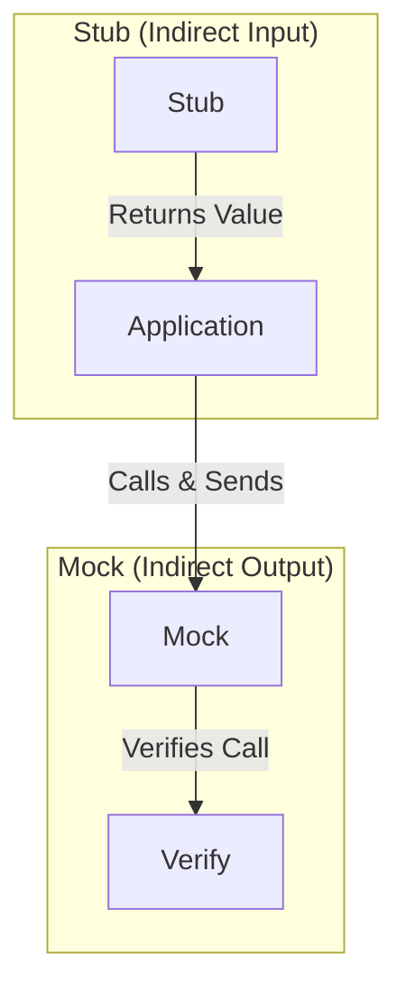

# 第32章：スタブとモックの気持ち（混乱しない説明）🎭

「スタブ？モック？なんか“偽物”っぽいけど、結局なにが違うの〜😵‍💫」ってなりがちなので、この章は **“気持ち”で覚える回**だよ〜！🥳💕

---

## この章のゴール🎯✨


読み終わったら、これができるようになります👇

* **スタブ**と**モック**を、言葉でサクッと説明できる🗣️✨
* テストで迷った時に **「今回はスタブで十分」「ここはモックが必要」** を選べる🎭✅
* **“モックしすぎ地獄”**（テストが壊れやすい・読めない😇）を避けられる🛡️

---

## まずは一言で！スタブとモックの違い🌼

### ✅ スタブ（Stub）＝「返すだけの人」📦


* 依存先から **決まった値を返して** テストを進めるためのもの
* 例：時間を固定したい → 「常に 2026/01/01 を返す時計」⏰✨
* テストはだいたい **“結果（状態）”** を見る👀

### ✅ モック（Mock）＝「呼ばれ方を見張る人」👮‍♀️📞


* 依存先が **どう呼ばれたか**（回数・引数・順番など）を確認するもの
* 例：メール送信が **1回だけ呼ばれた？**、宛先は合ってる？📧✅
* テストは **“やりとり（振る舞い）”** を見る🎬



---

## いったん全体像：「テストダブル」って何？🎎✨


スタブもモックも、まとめてこう呼ばれることが多いよ👇

* **テストダブル（Test Double）**＝テストで使う“代役”ぜんぶ🎭

よく出る仲間たち👯‍♀️

* **Dummy**：使うけど中身はどうでもいい（null回避用とか）🪆
* **Stub**：値を返すだけ📦
* **Spy**：呼ばれた記録を残す（後で確認）🕵️‍♀️
* **Mock**：呼ばれ方を検証する（期待に合うか）👮‍♀️
* **Fake**：それっぽく動く簡易実装（メモリDBみたいな）🧸

※現場だと “Spyもまとめてモックって呼ぶ” こともあって混乱しがち😵‍💫
この教材では、**「返すだけ＝スタブ」「呼ばれ方も検証＝モック」**で統一するね🎀

---

## 使い分け早見表📌✨（迷ったらここ！）

* **外部から値をもらうだけ**（時刻・乱数・ID・設定など）
  　👉 **スタブ**でOK🙆‍♀️✨

* **外部へ何かする**（メール送信・通知・ログ・保存・課金など）
  　👉 「呼んだ／呼んでない」を仕様にしたいなら **モック**が効く📣✅

* **まずはスタブ中心**が超おすすめ🍰
  　👉 モックは便利だけど、やりすぎるとテストが壊れやすい🥲

---

## 実践：同じ依存を「スタブ→モック」でテストしてみる🎭🧪

題材は **会員登録（SignUp）** にするよ〜！🎀
登録すると👇

1. ユーザーが保存される（状態）💾
2. ウェルカムメールが送られる（呼び出し）📧

ここで **(1)はスタブ/フェイク中心**、**(2)はモック** が気持ちよくハマる✨

---

## ハンズオン：会員登録サービスをTDDで育てる🌱✨

### 登場人物（依存）👭

* `IIdGenerator`：ID作る（テストでは固定したい → スタブ向き🎲🚫）
* `IClock`：現在時刻（固定したい → スタブ向き⏰🚫）
* `IUserRepository`：保存（テストではメモリ保存でOK → フェイク向き🧸）
* `IEmailSender`：メール送信（呼ばれ方を確認したい → モック向き📞✅）

---

### ① まず「保存される」をテスト（スタブ＋フェイク）🧪💾

#### テストコード（App.Tests）

```csharp
using Xunit;

public sealed class SignupServiceTests
{
    [Fact]
    public async Task Signup_すると_ユーザーが保存される() // ← テスト名は日本語でも全然OK🥳
    {
        // Arrange 🧱
        var fixedId = Guid.Parse("aaaaaaaa-aaaa-aaaa-aaaa-aaaaaaaaaaaa");
        var fixedNow = new DateTimeOffset(2026, 1, 1, 9, 0, 0, TimeSpan.FromHours(9));

        var idGen = new FixedIdGenerator(fixedId);      // スタブ🎲➡️固定
        var clock = new FixedClock(fixedNow);           // スタブ⏰➡️固定
        var repo = new InMemoryUserRepository();        // フェイク🧸
        var email = new NullEmailSender();              // Dummy🪆（今回は見ない）

        var sut = new SignupService(idGen, clock, repo, email);

        // Act 🏃‍♀️
        await sut.SignupAsync("alice@example.com");

        // Assert ✅（状態を見る👀）
        Assert.Single(repo.SavedUsers);

        var saved = repo.SavedUsers[0];
        Assert.Equal(fixedId, saved.Id);
        Assert.Equal("alice@example.com", saved.Email);
        Assert.Equal(fixedNow, saved.CreatedAt);
    }
}
```

#### テストダブル（Tests側に置いてOK）🧰✨

```csharp
public sealed class FixedIdGenerator : IIdGenerator
{
    private readonly Guid _id;
    public FixedIdGenerator(Guid id) => _id = id;
    public Guid NewId() => _id;
}

public sealed class FixedClock : IClock
{
    private readonly DateTimeOffset _now;
    public FixedClock(DateTimeOffset now) => _now = now;
    public DateTimeOffset Now => _now;
}

public sealed class InMemoryUserRepository : IUserRepository
{
    public List<User> SavedUsers { get; } = new();
    public Task AddAsync(User user, CancellationToken ct = default)
    {
        SavedUsers.Add(user);
        return Task.CompletedTask;
    }
}

public sealed class NullEmailSender : IEmailSender
{
    public Task SendAsync(EmailMessage message, CancellationToken ct = default)
        => Task.CompletedTask;
}
```

#### 本体（App側）：最小実装でGreenへ🟢✨

```csharp
public sealed record User(Guid Id, string Email, DateTimeOffset CreatedAt);

public sealed record EmailMessage(string To, string Subject, string Body);

public interface IIdGenerator { Guid NewId(); }
public interface IClock { DateTimeOffset Now { get; } }

public interface IUserRepository
{
    Task AddAsync(User user, CancellationToken ct = default);
}

public interface IEmailSender
{
    Task SendAsync(EmailMessage message, CancellationToken ct = default);
}

public sealed class SignupService
{
    private readonly IIdGenerator _idGen;
    private readonly IClock _clock;
    private readonly IUserRepository _repo;
    private readonly IEmailSender _email;

    public SignupService(IIdGenerator idGen, IClock clock, IUserRepository repo, IEmailSender email)
    {
        _idGen = idGen;
        _clock = clock;
        _repo = repo;
        _email = email;
    }

    public async Task SignupAsync(string email, CancellationToken ct = default)
    {
        var user = new User(_idGen.NewId(), email, _clock.Now);
        await _repo.AddAsync(user, ct);

        // まだメール仕様は固めてないから、ここでは送らなくてもOK🙆‍♀️
    }
}
```

ここまでで「スタブって何？」が体感できるはず！✨
**時間・IDみたいな“外から来る値”を固定**できるのがスタブの気持ち📦💕

---

### ② 次に「メールが送られる」をテスト（モック）📧👮‍♀️

今度は **“呼ばれた？”** を検証するよ〜！🎭

#### モック（今回は手書きでOK）🕵️‍♀️✨

```csharp
public sealed class RecordingEmailSender : IEmailSender
{
    public List<EmailMessage> Sent { get; } = new();

    public Task SendAsync(EmailMessage message, CancellationToken ct = default)
    {
        Sent.Add(message);
        return Task.CompletedTask;
    }
}
```

#### テスト：呼び出し（振る舞い）を確認📞✅

```csharp
using Xunit;

public sealed partial class SignupServiceTests
{
    [Fact]
    public async Task Signup_すると_ウェルカムメールが1回送られる()
    {
        // Arrange 🧱
        var idGen = new FixedIdGenerator(Guid.NewGuid());
        var clock = new FixedClock(DateTimeOffset.Parse("2026-01-01T09:00:00+09:00"));
        var repo = new InMemoryUserRepository();

        var emailSender = new RecordingEmailSender(); // ← ここがモック役🎭
        var sut = new SignupService(idGen, clock, repo, emailSender);

        // Act 🏃‍♀️
        await sut.SignupAsync("alice@example.com");

        // Assert ✅（呼ばれ方を見る👀）
        Assert.Single(emailSender.Sent);

        var mail = emailSender.Sent[0];
        Assert.Equal("alice@example.com", mail.To);
        Assert.Contains("Welcome", mail.Subject);
    }
}
```

#### 本体：メール送信を追加してGreenへ🟢📧

```csharp
public sealed partial class SignupService
{
    public async Task SignupAsync(string email, CancellationToken ct = default)
    {
        var user = new User(_idGen.NewId(), email, _clock.Now);
        await _repo.AddAsync(user, ct);

        var message = new EmailMessage(
            To: email,
            Subject: "Welcome!",
            Body: "Thanks for signing up! 😊"
        );

        await _email.SendAsync(message, ct);
    }
}
```

---

### ここが超大事！モックの“やりすぎ”注意報⚠️😇


モックを使うと「呼び出し順まで検証」「内部の細かいメソッド呼び出しまで検証」みたいに、やろうと思えば無限にできるんだけど…

* ✅ 便利
* ❌ でも **テストが実装にベッタリ**になって、リファクタで壊れがち💥

だからおすすめルールはこれ👇

#### 🍰おすすめルール（初心者向けの安全運転）

* **基本：状態をAssert（スタブ/フェイク中心）**👀✅
* **境界だけ：モックで呼び出し確認**🚪📞✅
  （メール送信・外部通知・外部API・ログ・メッセージ発行など）

---

## AIの使いどころ🤖✨（この章向け）

AIはここで爆速になるよ〜🏎️💨

* 「会員登録の仕様から、テストケースを **正常/異常/境界値** で列挙して」🧪
* 「この依存、スタブとモックどっちが向く？理由も」🎭
* 「テスト名を “Given/When/Then” で3案出して」📝
* 「このテスト、モックしすぎ？壊れやすい点を指摘して」👀⚠️

ポイントは **AIの提案をそのまま採用しない**で、
「何を仕様として固定したいか？」を自分で決めることだよ🧠✨

---

## 練習問題（ミニ課題）🎀🧩

### 問1：無効メールは例外にして、メール送信されない🚫📧

仕様👇

* `email` が空/空白なら `ArgumentException`
* その場合は

  * `repo.AddAsync` も呼ばれない
  * `email.SendAsync` も呼ばれない

ヒント💡

* 例外のAssert：`await Assert.ThrowsAsync<ArgumentException>(...)`
* 「呼ばれない」は、`RecordingEmailSender.Sent` が空で確認できるよ🙆‍♀️

### 問2：メールの中身、どこまで検証する？🎯

* 件名まで固定する？本文まで固定する？
* 固定しすぎるとリファクタで辛い😇
* “仕様として大事なところだけ” に絞ってみてね✨

---

## まとめ🎉

* **スタブ＝値を返してテストを進める**📦✨
* **モック＝呼ばれ方を検証する**📞✅
* まずは **スタブ中心**でOK🍰
* **境界（外部へ出るところ）だけモック**が気持ちよくて壊れにくい🚪🛡️

---

## 今日の最新版メモ🧾✨（リサーチ結果）

* xUnit v3 系：`xunit.v3` **3.2.2**（2026-01-14 更新） ([nuget.org][1])
* VSのテスト探索用：`xunit.runner.visualstudio`（v3系） ([nuget.org][2])
* テスト実行基盤：`Microsoft.NET.Test.Sdk` **18.0.1**（2025-11-11 更新） ([nuget.org][3])
* 次章で触れる代表的モックFW：`Moq` **4.20.72** ([nuget.org][4])
* .NET 10 の最新パッチは **10.0.2（2026-01-13）** ([Microsoft][5])

---

次の **第33章** では、いよいよ **モックフレームワーク（Moqなど）** を “最小だけ” 使って、同じことをもっと短く書けるようにしていくよ〜🎭🧪✨

[1]: https://www.nuget.org/packages/xunit.v3 "
        NuGet Gallery
        \| xunit.v3 3.2.2
    "
[2]: https://www.nuget.org/packages/moq/ "
        NuGet Gallery
        \| Moq 4.20.72
    "
[3]: https://www.nuget.org/packages/microsoft.net.test.sdk "
        NuGet Gallery
        \| Microsoft.NET.Test.Sdk 18.0.1
    "
[4]: https://www.nuget.org/packages/xunit.runner.visualstudio "
        NuGet Gallery
        \| xunit.runner.visualstudio 3.1.5
    "
[5]: https://dotnet.microsoft.com/ja-jp/platform/support/policy/dotnet-core ".NET および .NET Core の公式サポート ポリシー | .NET"
