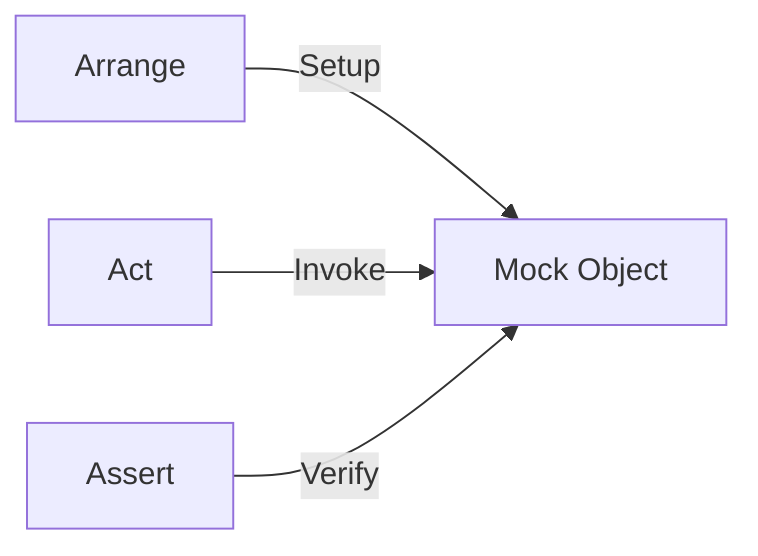

# 第33章：モックフレームワーク入門（最小だけ）🧪

（テーマ：**「外部通知（メール送信）をモック化して、呼ばれたことをテストする」**📣✅）

---

### 今日のゴール🎯💖


この章が終わったら、あなたはこんなことができるようになります😊✨

* 「**外部に何かする（通知する／保存する）**」みたいな**副作用**を、テストで安全に確認できる📣✅
* モックフレームワークで最低限の

  * **戻り値（/Task）を用意する**
  * **呼び出し回数を確認する**
    をサクッと使えるようになる🧪✨
* そして一番大事：**モックの使いすぎを避ける基準**が持てる🎭🚫🍰



---

## 0) どれを使う？（2026年1月の“今”ベース）🔍✨

この章では **Moq** をメインで扱います（いちばん情報も例も多いから💡）。

* **Moq**：NuGetの最新が **4.20.72**（本日時点） ([nuget.org][1])
* 代替：

  * **NSubstitute**：**5.3.0** ([nuget.org][2])
  * **FakeItEasy**：**9.0.0** ([nuget.org][3])
* ちなみに xUnit v3 のNuGetは **xunit.v3 3.2.2**（本日時点） ([nuget.org][4])

> この章の狙いは「Moqを極める」じゃなくて、**“必要な時だけ最小で使える”**ようになることだよ〜😊🪄

---

## 1) モックフレームワークって何？🍩🎭

### ざっくり言うと…

「本物の代わりのオブジェクト（テストダブル）」を、**簡単に作る道具**です🧰✨

特に便利なのはここ👇

* **外部通知（メール/Slack/Push）**
* **外部I/O（HTTP/DB/ファイル）**
* **時間・乱数** など、テストで扱いづらいもの⏰🎲

そして、この章で覚える“最小セット”はこれだけ👇

* **Setup**：呼ばれたらこう返してね（TaskでもOK）🧪
* **Verify**：ちゃんと呼ばれた？何回？✅

---

## 2) 使いどころのルール（ここ超大事）📌💖

モックは便利だけど、使いすぎるとテストがつらくなる😵‍💫💦
なので判断基準を決めよ〜！

### ✅ モックを使っていい典型

* 「**通知した/しない**」が仕様📣✅
* 「保存した/しない」「送信した/しない」みたいに **副作用が目的**のとき

### 🚫 モックを避けたい典型

* 計算ロジックや純粋な判定（**戻り値で確認できる**やつ）
  → それは **値のAssert** で十分😇✨

> 迷ったら：「それ、結果（値）で確認できない？」って自分に聞くのがコツだよ😊🧠✨

---

## 3) ハンズオン：メール送信をモック化する📧🧪✨

### 題材（超ミニ）🧸

「購入が成功したら、確認メールを送る」📧

* 成功 → **SendAsyncが1回呼ばれる**
* 失敗 → **呼ばれない**

---

### 3-1) パッケージ追加（VSでもCLIでもOK）📦✨

CLI派なら（テストプロジェクトで）👇

```bash
dotnet add package Moq
```

（MoqはNuGetで配布されてるよ ([nuget.org][1])）

---

## 4) まず“テストから”書く（Red）🚦🔴

### 4-1) 依存（メール送信）をインターフェースにする📮

```csharp
public interface IEmailSender
{
    Task SendAsync(string to, string subject, string body);
}
```

### 4-2) テスト：成功したらメール送信される📧✅

```csharp
using Moq;
using Xunit;

public class PurchaseServiceTests
{
    [Fact]
    public async Task Purchase_success_sends_confirmation_email()
    {
        // Arrange
        var emailMock = new Mock<IEmailSender>();

        // Taskを返すメソッドは、最低限ここを用意すると安心😊
        emailMock
            .Setup(x => x.SendAsync(It.IsAny<string>(), It.IsAny<string>(), It.IsAny<string>()))
            .Returns(Task.CompletedTask);

        var sut = new PurchaseService(emailMock.Object);

        // Act
        await sut.PurchaseAsync(userEmail: "alice@example.com", amount: 1200);

        // Assert（呼ばれたことを確認する！）
        emailMock.Verify(
            x => x.SendAsync(
                "alice@example.com",
                It.Is<string>(s => s.Contains("購入", StringComparison.Ordinal)),
                It.IsAny<string>()),
            Times.Once);
    }
}
```

ポイント解説🧁✨

* `Setup(...).Returns(Task.CompletedTask)`：**「呼ばれても落ちない」安全装置**
* `Verify(..., Times.Once)`：**「1回だけ送れ」**を仕様として固定📌
* `It.Is<string>(...)`：件名がそれっぽいかだけ見る（細かすぎない）😊👌

---

## 5) 実装を書く（Green）🚦🟢

```csharp
public class PurchaseService
{
    private readonly IEmailSender _email;

    public PurchaseService(IEmailSender email)
    {
        _email = email;
    }

    public async Task PurchaseAsync(string userEmail, int amount)
    {
        // ここでは「成功したことにする」ミニ実装でOK😊
        // （第19章の仮実装の感覚！🩹）
        await _email.SendAsync(
            userEmail,
            subject: "購入の確認",
            body: $"ご購入ありがとうございます！金額: {amount}");
    }
}
```

これでテストが通るはず🎉✨

---

## 6) もう1本テスト：失敗時は送らない（次のRed）🚦🔴➡️🟢

「失敗」を仕様にしたいので、テストで固定しよ〜💪😊

```csharp
[Fact]
public async Task Purchase_failure_does_not_send_email()
{
    // Arrange
    var emailMock = new Mock<IEmailSender>();
    emailMock
        .Setup(x => x.SendAsync(It.IsAny<string>(), It.IsAny<string>(), It.IsAny<string>()))
        .Returns(Task.CompletedTask);

    var sut = new PurchaseService(emailMock.Object);

    // Act
    await sut.PurchaseAsync(userEmail: "alice@example.com", amount: 0);

    // Assert
    emailMock.Verify(
        x => x.SendAsync(It.IsAny<string>(), It.IsAny<string>(), It.IsAny<string>()),
        Times.Never);
}
```

### ここで実装を少しだけ育てる🌱✨

```csharp
public async Task PurchaseAsync(string userEmail, int amount)
{
    if (amount <= 0)
        return; // 失敗扱い（ミニ）

    await _email.SendAsync(
        userEmail,
        subject: "購入の確認",
        body: $"ご購入ありがとうございます！金額: {amount}");
}
```

---

## 7) よくあるハマりどころ集😵‍💫🧯

* ✅ **Verifyが細かすぎる**（本文が完全一致！とか）
  → 変更に弱くなるので、**重要な部分だけ**見るのがコツ😊
* ✅ **モックだらけ**になって、テストが「手順の写し」になる
  → 「結果でAssertできるなら、結果で！」に戻る🧠✨
* ✅ asyncメソッドで `Setup` しなくて挙動が分かりづらい
  → まずは `Returns(Task.CompletedTask)` を癖にしよ👍✨

---

## 8) AIの使い方（この章の勝ちパターン）🤖🪄

AIは“叩き台”に便利だよ〜😊✨（採用はテストが通ったものだけ✅）

おすすめプロンプト例👇

* 「このインターフェースをMoqでモックして、**1回呼ばれたことをVerifyするテスト**を書いて」🤖
* 「Verifyが細かすぎないように、**壊れにくいAssert/Verifyの粒度**を提案して」🧠
* 「この副作用、**モックで見るべき観点**（回数/引数/呼ばない条件）を列挙して」📣✅

---

## 9) ミニ課題（コミット単位で）🎒✨

### 課題A：通知条件を増やす🎟️

* `amount >= 5000` のときだけ「VIPありがとうメール」にする💌✨

  * テスト：件名に “VIP” が入ること（完全一致じゃなくてOK）

### 課題B：送信先が空なら送らない🚫📧

* `userEmail` が空/空白なら送らない

  * テスト：`Times.Never` で固定

---

## まとめ🎀✨

* モックフレームワークは **副作用（通知/保存/送信）を仕様として固定**するのに強い📣✅
* この章は **Setup（返す）＋Verify（呼ばれた？）** の最小だけでOK🧪✨
* モックは便利だけど、**結果でAssertできるならそっち優先**が平和😊🌸

次の章（第34章）は、この流れをそのまま使って
「**呼ぶ/呼ばない**が条件で変わる副作用」を、もっと仕様っぽくテストしていくよ〜📣✅✨

[1]: https://www.nuget.org/packages/moq/?utm_source=chatgpt.com "Moq 4.20.72"
[2]: https://www.nuget.org/packages/nsubstitute/?utm_source=chatgpt.com "NSubstitute 5.3.0"
[3]: https://www.nuget.org/packages/fakeiteasy/?utm_source=chatgpt.com "FakeItEasy 9.0.0"
[4]: https://www.nuget.org/packages/xunit.v3?utm_source=chatgpt.com "xunit.v3 3.2.2"
