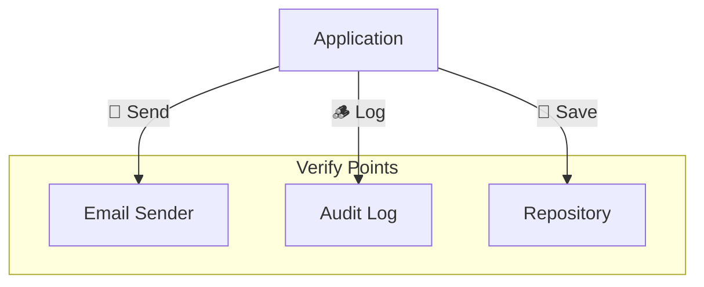

# 第34章：呼び出し確認（副作用を仕様にする）📣✅

この章はね、「**返り値や状態だけじゃ見えない“外部への影響”**」をテストで守れるようになる回だよ〜！🥰
例：メール送信📧、通知🔔、ログ🪵、DB保存💾、イベント発行🛰️…みたいなやつ✨

---

## 今日のゴール🎯✨


* 「通知した / しなかった」を**テストで言い切れる**ようになる✅
* **呼び出し回数 / 引数 / 呼ばれないこと**をチェックできるようになる✅
* “やりすぎモック地獄😇”を避けるコツもつかむ✅

---

## まず：副作用ってなに？🌊


副作用＝「そのメソッドを呼ぶと、外の世界に影響が出ること」だよ〜🙂

* メール送る📧
* ログに書く🪵
* DBに保存する💾
* 外部API叩く🌐
* 画面に通知する🔔



---
こういうのって、**戻り値だけ**見ても「本当に実行された？」が分からないことが多いのね🙈
だから「呼び出した？」を**仕様として**テストするのがこの章！

---

## いつ“呼び出し確認”を使うの？🧭

### 使ってOKな場面✅（おすすめ）


* “境界”で起きる副作用（外部I/O）
  例：`IEmailSender.Send(...)`、`ILogger.Log(...)`、`IRepository.Save(...)`

### できれば避けたい場面⚠️（壊れやすい）

* 内部の実装手順（「内部メソッドを何回呼んだ」みたいなやつ）

  * それは仕様じゃなくて“実装の都合”になりがち😵‍💫

> 合言葉：**「外へ出る影響はテストしてOK、内部手順はなるべくテストしない」**💡✨

---

## 最新メモ（今の安定版の目安）🧷✨

* .NET 10 の最新パッチは **10.0.2（2026-01-13）**だよ📅 ([Microsoft][1])
* xUnit v3 は NuGet だと **xunit.v3 3.2.2** が出てるよ🧪 ([nuget.org][2])
* モックは例として **Moq 4.20.72** を使うね🎭 ([nuget.org][3])

---

## 実践：通知の“した/しない”を仕様にする🧪📣

題材はこれにするよ👇（ちっちゃくて分かりやすい✨）

* 注文確定したら、条件次第で「購入完了メール」を送る📧
* 送ったら監査ログも残す🪵（※ここも副作用）

---

### 1) まずはインターフェース（境界）を用意🧩

```
csharp
public interface IEmailSender
{
    Task SendPurchaseCompletedAsync(string toEmail, string subject, string body);
}

public interface IAuditLogger
{
    void Log(string message);
}
```

---

### 2) 仕様（ルール）を決めよう📜✨

今回は分かりやすく👇

* 合計が **0円以下**なら例外（入力ミス）🚫
* 合計が **1円以上**ならメール送信📧＆ログ🪵
* ただし、`email` が空なら例外🚫

---

### 3) テストを書く（呼び出し確認）🚦🧪

### Moq版（呼ばれたことを検証）🎭✅

```
csharp
using Moq;
using Xunit;

public class PurchaseServiceTests
{
    [Fact]
    public async Task 合計が1円以上なら_購入完了メールを1回送る()
    {
        // Arrange
        var email = new Mock<IEmailSender>();
        var audit = new Mock<IAuditLogger>();

        var sut = new PurchaseService(email.Object, audit.Object);

        // Act
        await sut.CompletePurchaseAsync(
            toEmail: "alice@example.com",
            totalYen: 1200);

        // Assert
        email.Verify(x =>
            x.SendPurchaseCompletedAsync(
                "alice@example.com",
                It.IsAny<string>(),
                It.IsAny<string>()),
            Times.Once);

        audit.Verify(x => x.Log(It.IsAny<string>()), Times.Once);
    }
}
```

ここで大事なのは👇

* **Times.Once**：1回だけね！✅
* `It.IsAny<string>()`：本文とか件名までガチガチ固定しない（壊れやすいから）🙈

---

### “呼ばれないこと”も仕様だよ🙅‍♀️✅

```
csharp
[Fact]
public async Task 合計が1円以上でないなら_メールは送らない()
{
    var email = new Mock<IEmailSender>();
    var audit = new Mock<IAuditLogger>();
    var sut = new PurchaseService(email.Object, audit.Object);

    await Assert.ThrowsAsync<ArgumentOutOfRangeException>(async () =>
        await sut.CompletePurchaseAsync("alice@example.com", totalYen: 0));

    email.Verify(x => x.SendPurchaseCompletedAsync(
        It.IsAny<string>(), It.IsAny<string>(), It.IsAny<string>()),
        Times.Never);

    audit.Verify(x => x.Log(It.IsAny<string>()), Times.Never);
}
```

**「送らない」も仕様**なの、超大事〜！✨
ここをテストしないと、いつの間にか“送っちゃうバグ”が混ざる😱

---

### 4) 最小実装（Greenへ）🌱✅

```
csharp
public class PurchaseService
{
    private readonly IEmailSender _email;
    private readonly IAuditLogger _audit;

    public PurchaseService(IEmailSender email, IAuditLogger audit)
    {
        _email = email;
        _audit = audit;
    }

    public async Task CompletePurchaseAsync(string toEmail, int totalYen)
    {
        if (string.IsNullOrWhiteSpace(toEmail))
            throw new ArgumentException("email is required", nameof(toEmail));

        if (totalYen <= 0)
            throw new ArgumentOutOfRangeException(nameof(totalYen));

        await _email.SendPurchaseCompletedAsync(
            toEmail,
            subject: "購入ありがとうございます",
            body: $"合計 {totalYen} 円です");

        _audit.Log($"Purchase completed: {toEmail}, {totalYen}");


    }
}
```


---

## もう一歩：引数も“仕様”にできる🎯✨


「誰に送った？」「合計が入ってる？」みたいな確認ね🙂

```
csharp
[Fact]
public async Task メール本文に_合計金額が入る()
{
    var email = new Mock<IEmailSender>();
    var audit = new Mock<IAuditLogger>();
    var sut = new PurchaseService(email.Object, audit.Object);

    await sut.CompletePurchaseAsync("alice@example.com", 1200);

    email.Verify(x => x.SendPurchaseCompletedAsync(
        "alice@example.com",
        It.IsAny<string>(),
        It.Is<string>(body => body.Contains("1200"))),
        Times.Once);
}
```

`It.Is<string>(...)` が「引数の条件チェック」だよ〜🔍✨

---

## やりすぎ防止！モック地獄を避けるコツ🧯😇

* ✅ **本当に仕様にしたい副作用だけ** Verifyする
* ✅ ログ本文みたいな“微妙に変わりやすい文字列”は固定しない（必要ならキーワードだけ）🪵
* ✅ 「メール送ったか？」みたいな**境界の呼び出し**はテストしてOK
* ⚠️ 「内部でA→B→Cの順で呼んだ」みたいな**手順テスト**はなるべくしない

お守りフレーズ：**Verifyは“仕様の線”だけに引く**🖊️✨

---

## AIの使いどころ🤖✨（この章向き！）

AIはここが強いよ〜👇

* 「副作用になりうる観点」を列挙させる（通知/ログ/保存/イベント…）📣🪵💾🛰️
* 「呼ぶ/呼ばない」条件の抜けを探させる🔍
* Verifyの条件（回数・引数）を案出しさせる🎭

コピペ用プロンプト例👇

* 「この仕様で“呼ぶ/呼ばない副作用”を列挙して、テスト観点にして」
* 「呼び出し確認のテスト（回数・引数）を最小セットで提案して」

※ただし採用条件はいつも同じ：**テストが通る＋意図に一致**✅😌

---

## ミニ課題🎀📌

## 課題A：VIP通知を追加してみよ〜✨

* 合計が **10000円以上**なら `SendVipThanksAsync(...)` を呼ぶ（新しいIF追加）💌
* それ未満なら **呼ばない**🙅‍♀️

やること👇

1. Red：VIPのテストを書く🧪
2. Green：最小実装
3. Refactor：条件分岐が見やすい形に整理🧹✨

---

## 章末チェックリスト✅✅✅

* [ ] 「呼ぶ」だけじゃなく「呼ばない」もテストした
* [ ] Verifyしてるのは“外部への影響”だけ
* [ ] 引数は必要なところだけチェック（ガチガチ固定しない）
* [ ] テストが読めば仕様になる感じになってる📘✨

---

次の章（第35章）は「依存先が落ちたとき（例外・失敗）」を仕様にする回だよ💥🙂
この章の“呼ばない”テストが、そこでめっちゃ効いてくるよ〜！🚀

[1]: https://dotnet.microsoft.com/en-US/download/dotnet/10.0?utm_source=chatgpt.com "Download .NET 10.0 (Linux, macOS, and Windows) | .NET"
[2]: https://www.nuget.org/packages/xunit.v3?utm_source=chatgpt.com "xunit.v3 3.2.2"
[3]: https://www.nuget.org/packages/moq/?utm_source=chatgpt.com "Moq 4.20.72 - NuGet"
