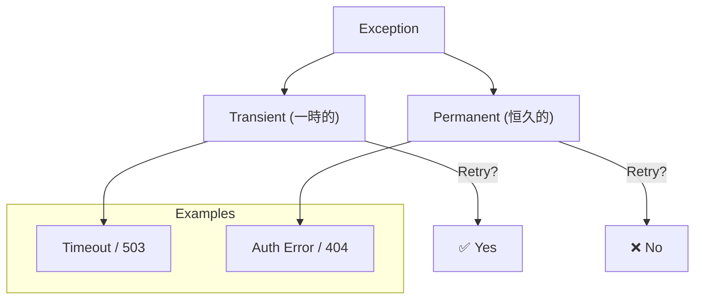

# 第35章：例外の扱い（依存先が落ちた時）💥

この章は「DB・API・ファイル・通知」みたいな **外部依存がコケたとき**に、アプリがグチャグチャにならないようにする回だよ〜😊✨
TDDで「失敗時の仕様」を先に固定して、安心して実装できるようにしていこう💪🧡

---

## 0) この章でできるようになること🎯✨


* 依存先が落ちた時に **どう振る舞うべきか（仕様）** を言葉で決められる🗣️
* その仕様を **テストで固定**できる🧪✅
* 「握りつぶし😇」や「全部 catch(Exception)😵」みたいな事故を避けられる🚫
* リトライする／しない、するなら **どこで・どんな条件で**やるか決められる🔁⚡

---

## 1) まず最初に決める「失敗時の仕様」3問セット❓❓❓

依存先が失敗したとき、実装より先にこれを決めるのが超大事💡

1. **この失敗、ユーザーにはどう見せる？**

   * 「しばらくして再試行してね」なのか
   * 「入力がダメ」なのか
   * 「システム障害」なのか 🧯

2. **処理は成功扱いにする？失敗扱いにする？**
   例：登録は成功したけど通知だけ失敗📣💥 → これを成功扱いにするかは仕様！

3. **リトライする？しない？**

   * するなら「回数」「間隔」「対象（タイムアウトだけ？）」を決める🔁
   * しないなら「すぐ失敗を返す」も立派な仕様😊

> ここが曖昧なまま実装すると、後で「え、通知失敗してたのに成功表示してたの！？」みたいな事故が起きがち😇💣

---

## 2) 依存先の失敗は“種類”があるよ🧩（ざっくり分類）


同じ「例外」でも、意味が違うよ〜🙂

* **一時的（Transient）**：しばらく待てば直る系
  例：Timeout、ネットワーク瞬断、503、接続リセット…🌧️
  → リトライ候補になりやすい🔁

* **恒久的（Permanent）**：待っても直らない系
  例：認証ミス、入力不正、404、契約違反…🧱
  → リトライしてもムダになりがち🙅‍♀️

* **バグ（Bug）**：こっちのコードが悪い系
  例：NullReferenceException…😵
  → リトライでは直らない、まず直すべき🛠️



---

## 3) どこで try/catch するのが正解？📍✨


おすすめの基本ルールはこれ👇😊

* **中心ロジック（ドメイン）では基本 catch しない**（仕様の失敗は Result 等で表現）🧠
* **外部依存に触れる“境界”で例外を捕まえて、意味のある形に変換する**🚪

  * 例外をそのまま上に投げるのではなく

    * 「外部依存が落ちたので一時失敗」
    * 「外部依存が恒久失敗」
      みたいに **アプリにとって意味のあるエラー**にする✨

そして大前提👇
**例外を握りつぶすのはNG**🙅‍♀️（少なくともログ or 何らかの通知・計測が必要）

---

## 4) 今回のミニ題材：推し活グッズ管理（登録）🎀📦

「登録処理」がこうなってるとするね😊

* 登録データを **保存（Repository）** する💾
* 登録できたら **通知（Notifier）** する📣

外部依存（例外が飛ぶかも）はこの2つ：

* 保存：DBや外部ストレージ（落ちると致命的になりがち）💥
* 通知：Slack/メール等（落ちても“登録自体は成功”にしたい場合も多い）💥

---

## 5) 仕様を先に決めよう（この章のサンプル仕様）🧾✨

ここでは分かりやすく、こうするよ👇😊

* **保存が失敗したら**：処理は失敗（Result.Fail）で返す💔

  * 一時的なら「一時的障害」
  * 恒久的なら「恒久的障害」

* **通知が失敗したら**：登録は成功のまま（Result.Ok）✅
  ただし **ログは必ず残す**📝（握りつぶし禁止🙅‍♀️）

---

## 6) TDDでいくよ！最初にテストを書く🧪🚦

### 6-1) 使うライブラリ（2026/01時点の“現役”メモ）📌

* .NET 10 の2026年1月のサービス更新は **10.0.2** が案内されてるよ🪟✨。([Microsoft for Developers][1])
* xUnit v3 はリリースノート上、v3系の更新が継続してる（例：3.2.2）よ🧪✨。([xunit.net][2])
* Moq は NuGet 上で 4.20.72 が見えてるよ🎭。([nuget.org][3])

（※章の目的は“例外設計”なので、ここは軽くでOK😊）

---

## 7) 実装（最小の形）🧩✨

### 7-1) Result と Error（超ミニ版）🧁


```csharp
public readonly record struct Error(string Code, string Message);

public readonly record struct Result(bool IsSuccess, Error? Error)
{
    public static Result Ok() => new(true, null);
    public static Result Fail(string code, string message) => new(false, new Error(code, message));
}

public static class Errors
{
    public static readonly Error ExternalTemporary =
        new("EXTERNAL_TEMP", "外部サービスが一時的に利用できません。少し待ってからもう一度お試しください。");

    public static readonly Error ExternalPermanent =
        new("EXTERNAL_PERM", "外部サービスのエラーが発生しました。サポートに連絡してください。");
}
```

### 7-2) 依存のインターフェース（前章までの流れを活かす）🔌

```csharp
public interface IGoodsRepository
{
    Task SaveAsync(Goods goods, CancellationToken ct);
}

public interface INotifier
{
    Task NotifyRegisteredAsync(Goods goods, CancellationToken ct);
}

public sealed record Goods(string Id, string Name);
```

### 7-3) “一時的か？”の判定（まずは雑でもOK）🔍

```csharp
public static class ExternalFailureClassifier
{
    public static bool IsTransient(Exception ex)
        => ex is TimeoutException
        || ex is OperationCanceledException
        || ex is HttpRequestException;
}
```

> ここは現場だともっと丁寧にやるけど、最初はこのくらいでOK😊
> 大事なのは「雑でも“方針が固定されてる”」こと✨

---

## 8) まずテストを書く（本題！）🧪💥

### 8-1) 保存が Timeout したら「一時失敗」で返して通知しない📛

```csharp
using Moq;
using Xunit;

public class RegisterGoodsUseCaseTests
{
    [Fact]
    public async Task Save_timeout_returns_external_temporary_and_not_notify()
    {
        // Arrange
        var repo = new Mock<IGoodsRepository>();
        repo.Setup(r => r.SaveAsync(It.IsAny<Goods>(), It.IsAny<CancellationToken>()))
            .ThrowsAsync(new TimeoutException("db timeout"));

        var notifier = new Mock<INotifier>();

        var sut = new RegisterGoodsUseCase(repo.Object, notifier.Object);

        // Act
        var result = await sut.ExecuteAsync(new Goods("A001", "アクスタ"), CancellationToken.None);

        // Assert
        Assert.False(result.IsSuccess);
        Assert.Equal(Errors.ExternalTemporary.Code, result.Error!.Value.Code);

        notifier.Verify(n => n.NotifyRegisteredAsync(It.IsAny<Goods>(), It.IsAny<CancellationToken>()), Times.Never);
    }
}
```

### 8-2) 通知が失敗しても「登録は成功」のまま✅（でも握りつぶさない）

ここでは「例外を外に漏らさない」ことをテストで固定するよ😊

```csharp
[Fact]
public async Task Notify_failure_still_success()
{
    var repo = new Mock<IGoodsRepository>();
    repo.Setup(r => r.SaveAsync(It.IsAny<Goods>(), It.IsAny<CancellationToken>()))
        .Returns(Task.CompletedTask);

    var notifier = new Mock<INotifier>();
    notifier.Setup(n => n.NotifyRegisteredAsync(It.IsAny<Goods>(), It.IsAny<CancellationToken>()))
            .ThrowsAsync(new Exception("slack down"));

    var sut = new RegisterGoodsUseCase(repo.Object, notifier.Object);

    var result = await sut.ExecuteAsync(new Goods("A001", "アクスタ"), CancellationToken.None);

    Assert.True(result.IsSuccess);
}
```

> ログ検証までやると一気に難しくなるので、まずは
> 「通知が落ちても登録は成功」＋「例外は握りつぶさずどこかで扱う」
> の設計方針を守る、でOK😊🧡

---

## 9) それを通す最小実装（Green）🟢✨

```csharp
public sealed class RegisterGoodsUseCase
{
    private readonly IGoodsRepository _repo;
    private readonly INotifier _notifier;

    public RegisterGoodsUseCase(IGoodsRepository repo, INotifier notifier)
    {
        _repo = repo;
        _notifier = notifier;
    }

    public async Task<Result> ExecuteAsync(Goods goods, CancellationToken ct)
    {
        try
        {
            await _repo.SaveAsync(goods, ct);
        }
        catch (Exception ex) when (ExternalFailureClassifier.IsTransient(ex))
        {
            return Result.Fail(Errors.ExternalTemporary.Code, Errors.ExternalTemporary.Message);
        }
        catch (Exception)
        {
            return Result.Fail(Errors.ExternalPermanent.Code, Errors.ExternalPermanent.Message);
        }

        try
        {
            await _notifier.NotifyRegisteredAsync(goods, ct);
        }
        catch (Exception)
        {
            // ここは本当はログを残したい（握りつぶし禁止のため）
            // ただし、この章では「例外を外に漏らさない」仕様を先に固定してる
        }

        return Result.Ok();
    }
}
```

---

## 10) Refactor：握りつぶし禁止を“構造”で守る🛡️🧩


「catch したけど何もしない」は、未来の自分が泣くやつ😭
だから、次のどれかに寄せると良いよ😊

* **ログ**を残す📝（最優先）
* 監視（メトリクス）にカウントする📈
* “通知失敗”を戻り値に含める（警告として）⚠️

初心者向けにはまずこれが安全👇

```csharp
public interface IWarningSink
{
    void Report(string code, string message, Exception ex);
}

public sealed class RegisterGoodsUseCase
{
    private readonly IGoodsRepository _repo;
    private readonly INotifier _notifier;
    private readonly IWarningSink _warnings;

    public RegisterGoodsUseCase(IGoodsRepository repo, INotifier notifier, IWarningSink warnings)
    {
        _repo = repo;
        _notifier = notifier;
        _warnings = warnings;
    }

    public async Task<Result> ExecuteAsync(Goods goods, CancellationToken ct)
    {
        try
        {
            await _repo.SaveAsync(goods, ct);
        }
        catch (Exception ex) when (ExternalFailureClassifier.IsTransient(ex))
        {
            _warnings.Report("SAVE_TEMP", "保存が一時的に失敗しました", ex);
            return Result.Fail(Errors.ExternalTemporary.Code, Errors.ExternalTemporary.Message);
        }
        catch (Exception ex)
        {
            _warnings.Report("SAVE_PERM", "保存が恒久的に失敗しました", ex);
            return Result.Fail(Errors.ExternalPermanent.Code, Errors.ExternalPermanent.Message);
        }

        try
        {
            await _notifier.NotifyRegisteredAsync(goods, ct);
        }
        catch (Exception ex)
        {
            _warnings.Report("NOTIFY_FAIL", "通知に失敗しました（登録は成功）", ex);
        }

        return Result.Ok();
    }
}
```

> こうしておくと「握りつぶし禁止」が**テスト可能な形**になるよ😊✨

---

## 11) リトライはどこでやる？🔁⚡（超重要）

リトライは便利だけど、やり方を間違えると地獄👹

### ✅おすすめ（基本）

* **外部通信の層（HttpClient/DB接続の近く）でやる**
* UseCase 側は「最終的にダメだったらどうする？」を決める

.NETだと、HttpClient向けのレジリエンス拡張が用意されてて、Polly を土台にした仕組みになってるよ🧰✨。([nuget.org][4])

> 「自前でリトライを書く」より、こういう標準寄りの仕組みを使う方が安全になりやすいよ😊（ただし“方針”はアプリ側で決める！）

### 🧪テスト観点（大事な割り切り）

* 「リトライライブラリが正しく動くか」は基本ライブラリ側の責務
* あなたのテストは

  * **リトライしきってダメなら、仕様通りのResultになる**
  * **リトライ中に成功したら、成功になる**
    を固定するのが主役✨

---

## 12) よくある事故パターン集（避けよう😵‍💫）🚫

* catch(Exception) して **return Ok**（静かに壊れる）😇💣
* 例外を **new Exception(ex.Message)** で投げ直す（スタックトレース消える）🫠
* 「一時的」と「恒久的」を区別せず **何でもリトライ**（悪化する）🐢➡️💥
* 失敗時の仕様が曖昧（チームで揉める）🥲

---

## 13) AIの使いどころ（この章向け）🤖✨

コピペで使えるやつ置いとくね😊🧡

* 「この外部依存の失敗を **一時的/恒久的/バグ** に分類して、理由も添えて」
* 「“保存失敗”と“通知失敗”が起きたときの **仕様案を3つ**（ユーザー表示も含めて）」
* 「このテストに足りない **境界ケース** を5つ出して」
* 「例外を握りつぶさないための **設計（ログ/警告/戻り値）案** を3つ」

---

## 14) 提出物（コミット単位の例）📦✅

* Commit 1：保存Timeoutで失敗になるテスト🧪
* Commit 2：通知失敗でも成功のテスト🧪
* Commit 3：最小実装でGreen🟢
* Commit 4：握りつぶし禁止のRefactor（WarningSink導入）🛡️
* Commit 5：テスト名・AAA整形で読み物化📘✨

---

## 15) ミニ理解チェック（5問）📝💡

1. 依存先例外を「一時的」と判断できる典型例は？
2. 例外はどこでcatchするのが基本おすすめ？（中心 or 境界）
3. 「通知失敗でも登録成功」にしたいとき、握りつぶし禁止はどう守る？
4. 何でもリトライが危ない理由は？
5. テストで固定すべき主役は「リトライの内部動作」？それとも「最終的な振る舞い」？

---

必要なら、この第35章をベースにして👇も一気に作れるよ😊🎀

* “通知失敗”を **警告として戻り値に含める** 版（UI表示まで）⚠️
* 「一時失敗だけリトライ、恒久失敗は即失敗」決定表つき🗂️
* 章40の題材に直結する形で、推し活グッズ管理のUseCase設計に接続🔗✨

[1]: https://devblogs.microsoft.com/dotnet/dotnet-and-dotnet-framework-january-2026-servicing-updates/ ".NET and .NET Framework January 2026 servicing releases updates - .NET Blog"
[2]: https://xunit.net/releases/?utm_source=chatgpt.com "Release Notes"
[3]: https://www.nuget.org/packages/moq/?utm_source=chatgpt.com "Moq 4.20.72"
[4]: https://www.nuget.org/packages/Microsoft.Extensions.Http.Resilience/?utm_source=chatgpt.com "Microsoft.Extensions.Http.Resilience 10.2.0"
