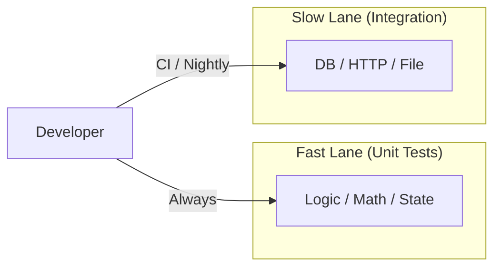

# 第36章：テストを速く保つ（遅いテストは続かない）🐢➡️⚡️

この章は「**テストが遅くて回さなくなる→壊れる**」の悪循環を、根っこから断ち切る回です💪✨
（しかも2026のテスト環境は、`dotnet test`まわりが **Microsoft.Testing.Platform（MTP）** 寄りに進んでいて、オプションや出力の作法も整理しておくと超ラクになります🧪📦）([Microsoft Learn][1])

---

## 1) この章のゴール🎯✨


読み終わったら、こんなことができるようになります😊

* 遅いテストを「感覚」じゃなく **計測で特定**できる📏⏱️
* 遅さの原因（I/O・待ち・巨大準備・共有状態）を **分類**できる🧠🧩
* **速いユニット**と **重いテスト**をレーン分けして、普段の開発が詰まらない🚦✨
* ハングしたときに `dotnet test --blame-hang-timeout` で **犯人捜査**できる🕵️‍♀️💥([Microsoft Learn][2])

---

## 2) まず決めたい「速さの目標」⏱️🎯

チームや規模で変わるけど、学習用におすすめの目安はこれ👇

* **ふだん回す“速いレーン”**：合計 **数秒〜十数秒** で終わる（1分超えたら黄色信号🚥）
* **1テスト**：基本は **数ms〜数十ms**（100ms超えるのが常連なら原因があること多い😵‍💫）



---

ポイントは「完璧な数字」より **“遅くなったら気づける運用”** を作ることだよ😊✨

---

## 3) 遅くなる原因ランキング（だいたいコレ）🧨😂

遅いテストって、ほぼこの中にいるよ〜👇（あるある順）

1. **待ち**：`Thread.Sleep` / `Task.Delay` / タイムアウト待ち 😴
2. **外部I/O**：DB、ネットワーク、ファイル、HTTP 🌐💾
3. **重い初期化**：でかいDIコンテナ構築、巨大Fixture、反射スキャン 🏗️
4. **データがデカい**：Arrangeがモリモリ（数千件作るなど）🍔🍟
5. **共有状態**：static、シングルトン、グローバルなキャッシュ 🔥
6. **並列の競合**：ロック待ち・順序依存（次章でガッツリ）🧵😇
7. **ログ出しすぎ**：大量Console/ログが地味に遅い📣

この章は、特に **1〜4** を退治します⚔️✨

---

## 4) いまどきの計測＆切り分け（2026の現場力）🔍🧪


### 4-1. まずは「遅いテストを見つける」👀⏱️

Visual Studioのテスト画面は、失敗だけじゃなく **Duration（所要時間）** を見て、遅い順に眺めるのが基本だよ😊
（個別実行や選択実行もすぐできる）([Microsoft Learn][3])

### 4-2. CLIで「いつでもどこでも」回す⌨️✨

CIでもローカルでも、基本は `dotnet test`。
最近は **Microsoft.Testing.Platform（MTP）** の話が増えてて、TRX出力（テスト結果ファイル）などの呼び方が変わることがあるよ📄🧪([Microsoft Learn][1])

* VSTest流儀だと `--logger trx`
* **MTP流儀**だと **TRXは reporter** 扱いになって、`--report-trx` を使う（しかもMTPに渡す引数の前に `--` が必要になることがある）([Microsoft Learn][1])

> 「え、ややこしっ😵」ってなるけど、逆に言うと
> **“普段回すのは速いレーンだけ”** にしておけば、細かい出力オプションは必要なときだけ触ればOKだよ😊✨

---

## 5) レーン分けが最強🚦✨（速いのだけ毎回回す）

### 5-1. “タグ（Trait）”で分類しよ🎟️

発想はシンプル👇

* いつも回す：`Fast`
* 重いけど大事：`Slow`（夜だけ・CIだけ・手動だけ、みたいに）🌙

xUnitにはTraitがあるから、こんな感じで分けられるよ🧪✨

```csharp
using Xunit;

public class PriceCalculatorTests
{
    [Fact]
    [Trait("Category", "Fast")]
    public void Fast_税計算が正しい()
    {
        // ...
    }

    [Fact]
    [Trait("Category", "Slow")]
    public void Slow_DBを使った統合テスト()
    {
        // ...
    }
}
```

### 5-2. “速いレーンだけ”走らせる（xUnit v3 + MTPのフィルタ）🏎️💨

xUnit v3 は `dotnet test` 実行時のフィルタが **VSTestの`--filter`と同じにならない**ことがあるので、v3側のオプションを使うのが安全だよ👌✨
`--filter-trait` / `--filter-method` / `--filter-query` などが用意されています([Microsoft Learn][1])

例（イメージ）👇

* Fastだけ回す：Trait指定
* もっと複雑に絞る：Query Filter Language（式で書ける）([xunit.net][4])

---

## 6) ハンズオン： “遅いテスト” を “速いテスト” にする🔥➡️⚡️

ここ、超大事なので小さな例で体に入れよ〜😊🧠✨

### 6-1. ダメ例：時間待ちで遅いテスト😴💔

「期限切れになる」をテストしたいからって、待つのは最悪パターン…！

```csharp
[Fact]
public async Task 24時間後に期限切れになる_待って確認する_遅い()
{
    var service = new CouponService(); // 内部で DateTime.UtcNow を見る想定

    service.Issue();

    await Task.Delay(TimeSpan.FromSeconds(2)); // ←本当は24時間待ちたい…という発想がもう地獄😵‍💫

    Assert.True(service.IsExpired());
}
```

これ、**テストが増えた瞬間に詰みます**😇
「遅い」「不安定」「CIで地獄」ぜんぶ盛りです🍱💥

---

### 6-2. 改善：時間を“依存”として差し替える⏰🔁✨

ここで第30〜31章の流れ（依存の差し替え＆注入）が効くよ！

#### ✅ ① `IClock` を作る（時間の窓口）

```csharp
public interface IClock
{
    DateTime UtcNow { get; }
}

public sealed class SystemClock : IClock
{
    public DateTime UtcNow => DateTime.UtcNow;
}
```

#### ✅ ② 本体は `IClock` を受け取る

```csharp
public class CouponService
{
    private readonly IClock _clock;
    private DateTime? _issuedAt;

    public CouponService(IClock clock)
    {
        _clock = clock;
    }

    public void Issue()
    {
        _issuedAt = _clock.UtcNow;
    }

    public bool IsExpired()
    {
        if (_issuedAt is null) return false;
        return _clock.UtcNow - _issuedAt.Value >= TimeSpan.FromHours(24);
    }
}
```

#### ✅ ③ テストは “偽物の時計” で一瞬で進める⚡️

```csharp
public sealed class FakeClock : IClock
{
    public DateTime UtcNow { get; private set; }

    public FakeClock(DateTime initialUtcNow)
    {
        UtcNow = initialUtcNow;
    }

    public void Advance(TimeSpan delta) => UtcNow = UtcNow.Add(delta);
}
```

```csharp
public class CouponServiceTests
{
    [Fact]
    [Trait("Category", "Fast")]
    public void 24時間未満なら期限切れではない()
    {
        var clock = new FakeClock(new DateTime(2026, 1, 1, 0, 0, 0, DateTimeKind.Utc));
        var service = new CouponService(clock);

        service.Issue();
        clock.Advance(TimeSpan.FromHours(23).Add(TimeSpan.FromMinutes(59)));

        Assert.False(service.IsExpired());
    }

    [Fact]
    [Trait("Category", "Fast")]
    public void 24時間以上なら期限切れになる()
    {
        var clock = new FakeClock(new DateTime(2026, 1, 1, 0, 0, 0, DateTimeKind.Utc));
        var service = new CouponService(clock);

        service.Issue();
        clock.Advance(TimeSpan.FromHours(24));

        Assert.True(service.IsExpired());
    }
}
```

🎉 これで「待ち」がゼロ！
テストは一瞬、しかも毎回安定✅✨

---

## 7) “ハングしたテスト” を即つかまえる🕵️‍♀️💥

遅いを通り越して「終わらない😇」が出たら、これが超便利👇

* `dotnet test --blame-hang-timeout <TIMESPAN>`

一定時間を超えたら、ハングとして止めて情報を残してくれるよ💣
オプションとして公式ドキュメントにも載ってます([Microsoft Learn][2])

> 学習段階だと、無限ループや待ち合わせミス（`Task.Result`のデッドロック等）が出やすいから、
> “自分を助ける安全装置”として覚えとくと最強😊🛟✨

---

## 8) AIの使い方（速さ改善にめっちゃ効く🤖⚡️）

AIは「最適化コード」を吐かせるより、**原因の分類＆方針出し**に使うのが強いよ💡

おすすめプロンプト👇✨

* 「このテストが遅い原因を **(1)待ち (2)I/O (3)初期化 (4)データ量 (5)共有状態** に分類して、直し方を3案出して」
* 「このテストを **Fastレーン**に寄せるなら、どの依存を抽象化（interface化）する？」
* 「xUnitのTraitで `Fast/Slow` を切る前提で、分類基準と運用案を作って」

---

## 9) まとめ：速さを守る“黄金ルール”🌟

* ✅ **待つな**（時間はFakeClockで進める）⏰🚫
* ✅ **外に出るな**（DB/HTTP/ファイルはFastレーンから追放）🌐🚫
* ✅ **でかい準備をやめる**（最小データでOK）🍙✨
* ✅ **Fast/Slowに分ける**（全部を毎回回そうとしない）🚦
* ✅ ハングは `--blame-hang-timeout` で捕まえる🕵️‍♀️([Microsoft Learn][2])

---

## 10) 今日のミニ課題（15〜30分）📝✨

1. テストを **Durationの遅い順**で眺めて、遅いのを1つ選ぶ👀⏱️
2. 遅さの原因を「待ち / I/O / 初期化 / データ量 / 共有状態」に分類する🧠
3. そのテストを `Trait("Category","Fast")` にできるよう、設計を1回だけ直す（例：FakeClock化）🔧⚡️
4. Fastだけ回す運用を作る（コマンドでも、VSの選択実行でもOK）🏃‍♀️💨
   ※xUnit v3 は `--filter-trait` や `--filter-query` を覚えると一気に楽になるよ([Microsoft Learn][1])

---

必要なら次は、あなたの題材（カフェ会計 or 推し活グッズ管理）に合わせて
**「Fast/Slowの具体的な分割ライン」**を一緒に決めて、章36の運用をそのまま教材テンプレに落とします😊🎀✨

[1]: https://learn.microsoft.com/ja-jp/dotnet/core/testing/migrating-vstest-microsoft-testing-platform?utm_source=chatgpt.com "VSTest から Microsoft.Testing.Platform への移行ガイド - .NET"
[2]: https://learn.microsoft.com/ja-jp/dotnet/core/tools/dotnet-test-vstest?utm_source=chatgpt.com "VSTest を使用した dotnet test コマンド - .NET CLI"
[3]: https://learn.microsoft.com/en-us/visualstudio/test/run-unit-tests-with-test-explorer?view=visualstudio&utm_source=chatgpt.com "Run Unit Tests with Test Explorer - Visual Studio (Windows)"
[4]: https://xunit.net/docs/query-filter-language?utm_source=chatgpt.com "Query Filter Language"
