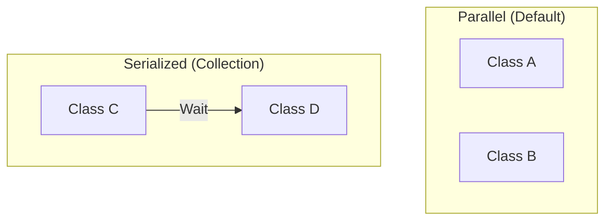

# 第37章：並列実行の落とし穴（順序依存を消す）🧵

### 今日のゴール🎯✨


この章が終わると、こんな状態になれます😊💪

* 「単体だと通るのに、全部実行すると落ちる😇」を**原因から潰せる**
* テストを**順不同＆並列**で走らせても安定する（＝フレーク退治🧹✨）
* どうしても共有が必要な時に、**xUnitの安全ブレーキ**を正しく踏める🚦

---

## 1) まず知っておく：xUnitの“並列”の基本ルール🧠🧪

xUnitは「テストコレクション」という単位で、**同時に走っていいか**を決めます✨
そして **デフォルトでは“テストクラスごとに別コレクション”** です。つまり…

* **同じクラス内のテストは並列にならない**（順番に実行）🧘‍♀️
* **別クラス同士は並列になり得る**（同時実行）🏃‍♀️🏃‍♂️

この挙動が、順序依存バグを炙り出します🔥
（「別クラス同士が同時に動く」＝共有状態があると壊れる） ([xUnit.net][1])

さらに、並列のオンオフやスレッド数は、**アセンブリ属性**で制御できます👇 ([xUnit.net][1])

* 全体の並列を切る：`DisableTestParallelization = true`
* 並列スレッド数を指定：`MaxParallelThreads = n`
* 特定コレクションだけ並列禁止：`[CollectionDefinition(DisableParallelization = true)]`



---

## 2) 典型的な症状あるある😵‍💫🧪

次のどれかが出たら、この章の出番です🚨

* ✅ **単体実行だと通る**
  ❌ **全実行だと落ちる**
* ✅ 昨日まで通ってたのに、今日は落ちる（気まぐれ）🎲
* ✅ ローカルは通るのにCIで落ちる😇
* ✅ エラー内容が毎回ちょっと違う（タイミング系）⏰

---

## 3) 原因はだいたいコレ☠️（順序依存を作る6大ボス）

### ボス①：`static` / シングルトンの共有状態👻

* `static List<>`、`static Dictionary<>`
* `static` キャッシュ
* グローバルなDIコンテナ（ServiceLocator的なやつ）
  → **テストが同じ箱を触ってケンカ**します💥

### ボス②：共有ファイル（固定パス）📄💣

* `./data.json` を全テストで使う
* tempを使ってるけどファイル名が固定
  → 片方が消す／上書きで壊れる🫠

### ボス③：共有DB（同じDB・同じテーブル・同じキー）🗄️⚔️

* “テスト用DB”が1個しかない
* `Id=1` を全テストが使う
  → 並列でデータが混ざる😇

### ボス④：同じポート・同じ外部リソース🌐🔌

* ローカルサーバ起動が衝突
* 同じキュー／同じコンテナ名
  → “先に取ったもん勝ち”が起きる

### ボス⑤：時間・乱数・環境差🎲⏰

* `DateTime.Now` / `Guid.NewGuid()` / `Random.Shared`
* タイムゾーン依存
  → 再現しにくいフレークの温床😵‍💫

### ボス⑥：テストの後始末が甘い🧹❌

* 作ったデータを消してない
* グローバル設定を戻してない
  → 次のテストにゴミが渡る🗑️

---

## 4) ミニ演習：わざと“順序依存”を作ってみる😈🧪➡️😇


「何が悪いか」を体で覚えよう！✨
題材は“在庫管理”っぽい超ミニでいきます📦

### ❌ 悪い例：`static` で共有してしまう

#### プロダクトコード（悪い）

```csharp
public static class Inventory
{
    private static readonly List<string> _items = new();

    public static void Add(string item) => _items.Add(item);

    public static int Count => _items.Count;

    public static void Clear() => _items.Clear();
}
```

#### テスト（それぞれ単体だと通るのに…）

※ **別クラス**にすると、デフォルト挙動で並列になり得ます🏃‍♀️🏃‍♂️ ([xUnit.net][1])

```csharp
using Xunit;

public class InventoryStartsEmptyTests
{
    [Fact]
    public void 初期状態は空()
    {
        // 単体で走らせるとだいたい通る
        Assert.Equal(0, Inventory.Count);
    }
}

public class InventoryAddTests
{
    [Fact]
    public void 追加すると1件になる()
    {
        Inventory.Add("apple");
        Assert.Equal(1, Inventory.Count);
    }
}
```

### 💥 何が起きる？

* `InventoryAddTests` が先に走る（or 同時に走る）
* `InventoryStartsEmptyTests` が `Count=1` を見て落ちる😇

これが「順序依存」＆「並列で壊れる」正体です👻

---

## 5) 正しい直し方：共有状態をやめる（最強）🛡️✨

ポイントはシンプル👇
**“テストごとに新品の状態を持つ”** 🧼✨

### ✅ 良い例：インスタンスにして、毎回 new する

#### プロダクトコード（良い）

```csharp
public sealed class Inventory
{
    private readonly List<string> _items = new();

    public void Add(string item) => _items.Add(item);

    public int Count => _items.Count;
}
```

#### テスト（良い）

```csharp
using Xunit;

public class InventoryTests
{
    [Fact]
    public void 初期状態は空()
    {
        var inventory = new Inventory();
        Assert.Equal(0, inventory.Count);
    }

    [Fact]
    public void 追加すると1件になる()
    {
        var inventory = new Inventory();
        inventory.Add("apple");
        Assert.Equal(1, inventory.Count);
    }
}
```

これで、テストは並列でも順不同でも安定します🎉🧪

---

## 6) どうしても共有したい時の“安全ブレーキ”🚦😌

「DBやコンテナ起動が重い…毎回作るのは無理😭」って時はあります。
その場合は、**“共有する範囲”を意図的に小さくして、並列を止める**のが現実的です。

### ブレーキ①：特定グループだけ直列にする（おすすめ）🧵

同じグループ（コレクション）に入れたクラス同士は並列になりません。 ([xUnit.net][1])

```csharp
using Xunit;

[CollectionDefinition("DB", DisableParallelization = true)]
public class DbCollectionDefinition { }

[Collection("DB")]
public class DbTestsA { /* ... */ }

[Collection("DB")]
public class DbTestsB { /* ... */ }
```

* ✅ ユニットテストは並列で速い⚡
* ✅ DB系だけ直列で安全🧘‍♀️

### ブレーキ②：アセンブリ全体の並列を切る（最終手段）🧯

```csharp
using Xunit;

[assembly: CollectionBehavior(DisableTestParallelization = true)]
```

これで全テストが直列になります。 ([xUnit.net][1])
ただし当然遅くなるので、**“原因が分かるまでの応急処置”**として使うのがコツです🐢

### ブレーキ③：設定ファイルで並列を切る（xunit.runner.json）🗂️

xUnitは `xunit.runner.json` で `parallelizeTestCollections` を制御できます。 ([xUnit.net][2])

* `parallelizeTestCollections: false` → アセンブリ内の並列を無効化

（※設定の有効範囲やランナー差があるので、効き方が怪しい時は①や②で確実に止めるのが安全😌）

---

## 7) Visual Studioで「並列で壊れるか」を早めに炙り出す🔥🧪

大事なのはこれ👇
**“最初から並列で回して、弱点を先に見つける”** です✨

### 7-1) テストホスト（DLL単位）の並列もあるよ⚙️

Visual Studio / dotnet test 側は、**テストDLL（テストコンテナ）を並列に走らせる**設定があります。
`.runsettings` の `MaxCpuCount` がそれで、`0` にすると最大並列になります。 ([Microsoft Learn][3])

```xml
<?xml version="1.0" encoding="utf-8"?>
<RunSettings>
  <RunConfiguration>
    <!-- 0: 最大のプロセス並列 / 1: 並列なし -->
    <MaxCpuCount>0</MaxCpuCount>
  </RunConfiguration>
</RunSettings>
```

ここ、勘違いポイント👇

* `MaxCpuCount` は **“DLL（テストコンテナ）同士”の並列**
* **同じDLL内の並列**は xUnit 側（コレクション等）で決まる ([Microsoft Learn][3])

---

## 8) AIの使いどころ（並列バグの特定が早くなる）🤖🔍✨

AIはこういう時にめちゃ役立ちます😊

### プロンプト例（コピペOK）📋✨

* 「この失敗ログから、**共有状態っぽい原因候補**を3つ挙げて。`static`/ファイル/DB/時間の観点で」
* 「このテストコードで、**並列実行で危ない箇所**を指摘して。直し方もセットで」
* 「“毎回新品状態”にするための**DI/分離案**を最小で提案して（変更差分を小さく）」

⚠️ ただし最後は必ず自分で決める：
**採用条件＝「テストが安定して通る」＋「意図に合う」** ✅🤝

---

## 9) まとめ：順序依存を消すチェックリスト✅🧵

困ったらここから点検してね😊✨

* [ ] `static` を使ってない？（キャッシュ含む）👻
* [ ] ファイル名・パスが固定になってない？📄
* [ ] DBのデータがテスト間で混ざってない？🗄️
* [ ] `DateTime.Now` / `Random` に依存してない？🎲
* [ ] 後始末（削除・初期化）が漏れてない？🧹
* [ ] 共有が必要なら、**コレクションで直列化**してる？🧵 ([xUnit.net][1])

---

## ミニ小テスト📝✨（3問）

1. 「単体では通るのに全実行で落ちる」最大の原因になりがちなものは？👻
2. xUnitで**同じクラス内のテストが並列にならない**のは、何という単位のルールだった？🧪 ([xUnit.net][1])
3. DB系だけ直列にしたい。使うのは「アセンブリ全体ブレーキ」より何が良い？🧵

---

必要なら、この第37章の続きとして👇もそのまま作れます😊🎀

* あなたの「推し活グッズ管理①」のテストに、**順序依存が入り込みやすい箇所チェック**を当てて改善案を出す🧪🔍
* “DBやファイルを使う統合テスト”を、**コレクション分け＋一意リソース化**で安定させる実践編📦🗄️

[1]: https://xunit.net/docs/running-tests-in-parallel "Running Tests in Parallel | xUnit.net "
[2]: https://xunit.net/docs/config-xunit-runner-json "Config with xunit.runner.json [2025 July 30] | xUnit.net "
[3]: https://learn.microsoft.com/en-us/visualstudio/test/configure-unit-tests-by-using-a-dot-runsettings-file?view=visualstudio "Configure unit tests with a .runsettings file - Visual Studio (Windows) | Microsoft Learn"
