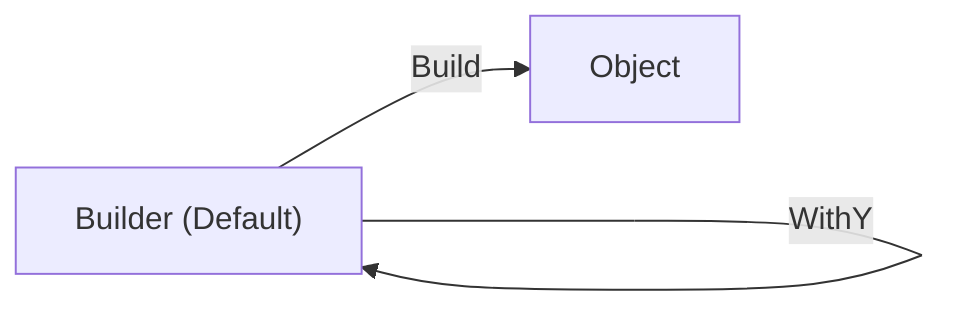

# 第38章：データ生成の整理（毎回手で作らない）🧸✨

この章はひとことで言うと、**「Arrange（準備）が長すぎてツラい😵‍💫」を直す章**だよ〜！
テストデータを“いい感じに作る仕組み”を作って、**テストがスッと読める状態**にしていくよ🧪💕

---

## 0. この章のゴール🎯✨


テストを書くときに…

* 毎回 `new` がズラ〜っと並んで **テストの意図が見えない**😇
* データ作りが面倒で **テスト追加がイヤになる**😵
* ちょっと仕様が変わると **テストが大量に壊れる**💥

…みたいな状態から卒業して、

✅ **テストの重要な値だけが目に入る**
✅ **データ生成は1か所に集まっていて、修正がラク**
✅ **“賢すぎない”データ生成で読みやすさキープ**

この状態を作れるようになるよ🫶✨

---

## 1. まず「Arrange地獄」ってどんな状態？😵‍💫🧱


例えば、推し活グッズ管理の検索テストを書くとして…

* グッズA（カテゴリ、価格、購入日、限定…）
* グッズB（カテゴリ、価格、購入日、限定…）
* グッズC（…）

って **毎回ぜんぶ手で作る**と、テストの本題（検索条件）が埋もれるの😭

**理想はこれ👇**

* テスト内には「このテストで大事な値」だけ書く
* それ以外（どうでもいい値）は、裏で自動的に埋める

---

## 2. 解決の基本セット🧰✨（3つだけ覚えよ！）


### A) テストデータビルダー（Builder）🧸🧱 ←この章の主役


「デフォ値を持ってて、必要なところだけ上書きできるやつ」だよ！

* 例：`GoodsBuilder.Default().WithPrice(1500).Build()`

✅ **読みやすい**
✅ **自分のドメイン（推し活）に合わせやすい**
✅ **初心者でも管理しやすい**



---

### B) ファクトリ（Factory）🏭✨


「よく使うパターンを、短いメソッドにしたやつ」

* 例：`TestGoods.Limited()` とか `TestGoods.Cheap()` みたいに“型”を用意

✅ テストが短くなる
⚠️ 増やしすぎると、逆に覚えるのがつらい

---

### C) 自動生成ライブラリ（AutoFixture / Bogus）🎁🤖


* **AutoFixture**：Arrangeを減らす目的のライブラリ（匿名データを作るのが得意）([GitHub][1])
* **Bogus**：リアルっぽいダミーデータ生成が得意で、**再現性（決定性）**の考え方も強い([GitHub][2])

この章では「まずは自前Builderで勝つ」→余裕が出たら導入、の順がおすすめだよ😊

（参考：AutoFixtureはNuGetで安定版が 4.18.1、プレビューも提供されてるよ([nuget.org][3])）

---

## 3. ハンズオン：Builderを作って「Arrange地獄」を救う🧸✨

ここでは、超ミニな「グッズ」モデルを使うよ🎀📦
（本物のアプリ側のクラスに合わせて置き換えてOK！）

### 3.1 まずは“しんどいテスト”を用意😵‍💫（ビフォー）

```csharp
using Xunit;

public sealed class Goods
{
    public string Name { get; init; } = "";
    public string Category { get; init; } = "";
    public int PriceYen { get; init; }
    public DateOnly BoughtOn { get; init; }
    public bool IsLimited { get; init; }
}

public sealed class GoodsSearcher
{
    public IEnumerable<Goods> SearchByKeyword(IEnumerable<Goods> goods, string keyword)
        => goods.Where(g => g.Name.Contains(keyword, StringComparison.OrdinalIgnoreCase));
}

public class GoodsSearcherTests
{
    [Fact]
    public void SearchByKeyword_returns_only_goods_that_contain_keyword()
    {
        // Arrange 😵‍💫（長い…）
        var goods = new List<Goods>
        {
            new Goods { Name = "アクスタ ねこ", Category = "アクリル", PriceYen = 1500, BoughtOn = new DateOnly(2026, 1, 2), IsLimited = false },
            new Goods { Name = "缶バッジ いぬ", Category = "バッジ", PriceYen = 500, BoughtOn = new DateOnly(2026, 1, 3), IsLimited = true },
            new Goods { Name = "アクスタ きつね", Category = "アクリル", PriceYen = 1800, BoughtOn = new DateOnly(2026, 1, 4), IsLimited = true },
        };

        var sut = new GoodsSearcher();

        // Act
        var result = sut.SearchByKeyword(goods, "アクスタ").ToList();

        // Assert
        Assert.Equal(2, result.Count);
        Assert.All(result, g => Assert.Contains("アクスタ", g.Name));
    }
}
```

このテスト、意図は「アクスタで検索したら2件」なのに、データ作りで疲れるやつ〜！😇

---

### 3.2 Builderを作る（最小でOK！）🧸🧱

ポイントはこれ👇

* **デフォ値（どうでもいい値）を持つ**
* **テストで触りたいところだけ WithX で上書き**
* **賢くしすぎない**（ロジック入れない！）

```csharp
public sealed class GoodsBuilder
{
    private string _name = "ダミーグッズ";
    private string _category = "その他";
    private int _priceYen = 1000;
    private DateOnly _boughtOn = new DateOnly(2026, 1, 1);
    private bool _isLimited = false;

    public static GoodsBuilder Default() => new GoodsBuilder();

    public GoodsBuilder WithName(string name) { _name = name; return this; }
    public GoodsBuilder WithCategory(string category) { _category = category; return this; }
    public GoodsBuilder WithPrice(int priceYen) { _priceYen = priceYen; return this; }
    public GoodsBuilder WithBoughtOn(DateOnly boughtOn) { _boughtOn = boughtOn; return this; }
    public GoodsBuilder Limited(bool isLimited = true) { _isLimited = isLimited; return this; }

    public Goods Build() => new Goods
    {
        Name = _name,
        Category = _category,
        PriceYen = _priceYen,
        BoughtOn = _boughtOn,
        IsLimited = _isLimited
    };
}
```

✅ これだけで、Arrangeが一気に軽くなるよ〜！🥳

---

### 3.3 テストを書き換える（アフター）✨


```csharp
using Xunit;

public class GoodsSearcherTests
{
    [Fact]
    public void SearchByKeyword_returns_only_goods_that_contain_keyword()
    {
        // Arrange 😊（読みやすい！）
        var goods = new List<Goods>
        {
            GoodsBuilder.Default().WithName("アクスタ ねこ").Build(),
            GoodsBuilder.Default().WithName("缶バッジ いぬ").Build(),
            GoodsBuilder.Default().WithName("アクスタ きつね").Build(),
        };

        var sut = new GoodsSearcher();

        // Act
        var result = sut.SearchByKeyword(goods, "アクスタ").ToList();

        // Assert
        Assert.Equal(2, result.Count);
        Assert.All(result, g => Assert.Contains("アクスタ", g.Name));
    }
}
```

見て見て〜！👀💕
テストの読み手は、**「アクスタが2個入ってる」だけに集中できる**✨

---

## 4. Builderを“置き場所”まで整える📁✨（地味だけど超効く）

おすすめ構成👇（テストプロジェクト側）

* `Tests/TestData/GoodsBuilder.cs`
* `Tests/TestData/TestData.cs`（必要なら入口まとめ）

「データ生成はこのフォルダを見る」って決めると、未来の自分が助かるよ🥹✨

---

## 5. “賢すぎるデータ生成”を避けるコツ🙈⚠️


Builderが便利すぎると、逆にこうなることがあるよ👇

* 生成の中でランダムや条件分岐が増える
* いつの間にか「テストの仕様」がBuilder側に隠れる
* 失敗したときに、原因が追えない😇

### ✅ 合言葉：「テストの意図はテストに書く」📝✨

* テストで重要な値（境界値、例外条件、検索キーワード etc）は **テスト内に出す**
* どうでもいい値は Builder に押し込む

---

## 6. たくさんデータが欲しいとき（検索・並び替え系）📦📦📦

並び替えや集計って、10件くらい欲しくなるよね？
でも “賢すぎヘルパー” は避けたい…！

### ちょうどいい方法：小さめの「生成補助」だけ足す😊

```csharp
public static class TestGoods
{
    public static Goods Goods(string name, int price)
        => GoodsBuilder.Default()
            .WithName(name)
            .WithPrice(price)
            .Build();

    public static List<Goods> SampleForSorting()
        => new()
        {
            Goods("A", 300),
            Goods("B", 100),
            Goods("C", 200),
        };
}
```

✅ **ケースの意図が見える**
✅ **必要ならその場で編集できる**
✅ Builderは「共通の土台」として生きる

---

## 7. 余裕が出たら：AutoFixture / Bogus の使いどころ🎁✨

### AutoFixture：Arrangeを減らしたい人向け🧪

AutoFixtureは「無関係な値を自動で埋めて、Arrangeを短くする」発想のライブラリだよ([GitHub][1])
ドメインが育ってオブジェクトが複雑になってきたら、かなり助かるやつ！

### Bogus：大量データや“それっぽさ”が欲しいとき🌍📦


Bogusは faker.js のC#版みたいな立ち位置で、ダミーデータ生成に強いよ([GitHub][2])
しかも **「同じデータを毎回作れる（決定性）」**をちゃんと説明してくれてるのがえらい👏✨
たとえば `Randomizer.Seed` や `UseSeed` で再現性を作れるよ([GitHub][2])

⚠️ ただし、ユニットテストでランダムは基本敵なので、使うなら **必ず固定シード**にしよね🧊✨

---

## 8. AIの使いどころ（この章は相性いい！）🤖💕

AIはここでめっちゃ役立つよ〜！

### ✅ プロンプト例（コピペOK）📝

* 「このテストのArrangeが長い。重複を見つけてBuilder案を作って。Builderは賢くしすぎず、デフォ値＋WithX＋Buildだけにして」
* 「このBuilder、読みやすさを落とす要素（隠れロジック、デフォ値の不自然さ）を指摘して」
* 「このテスト、重要な値がどれか教えて。重要な値だけテストに残して、残りはBuilderに寄せたい」

---

## 9. ミニチェックテスト✅🧠（3問）

1. Builderに入れていいのはどっち？
   A. テストの主張（仕様）　B. どうでもいい初期値

2. “たまに落ちる”テストになりがちな生成はどれ？
   A. 固定値　B. `DateTime.Now` やランダム（シードなし）

3. 生成ヘルパーが増えすぎたら起きがちな問題は？
   A. テストが短くなる　B. テストの意図が隠れる

（答え：1=B、2=B、3=B だよ😉✨）

---

## 10. この章の「提出コミット」例📌✨

* commit 1：`GoodsBuilder` を追加（デフォ値＋WithX＋Build）
* commit 2：辛いテストを1本だけ Builder へ置換
* commit 3：重複Arrangeが減ったことを確認（テスト全部グリーン🟢）

---

## 11. 次章へのつながり🚪✨（第39章の予告）

データ生成が整うと、次は **I/O（入出力）を薄くして中心ロジックを純粋にする**のがめっちゃやりやすくなるよ😊
第39章の「境界を増やす」は、まさにここからの流れで気持ちよく入れるやつ〜！🚪✨

---

### （最新情報メモ📌）

この章で触れた周辺ツールの“現時点”の状況：

* .NET 10 は 10.0.2 が 2026-01-13 リリースとして案内されてるよ([Microsoft][4])
* xUnit v3 は 3.2.0 のリリース告知が出てるよ([xUnit.net][5])
* AutoFixture は安定版 4.18.1 が NuGetにあるよ([nuget.org][3])
* Bogus は NuGet で配布されてて、決定性（シード）もREADMEで説明されてるよ([nuget.org][6])

---

必要なら、この章の内容を「推し活グッズ管理②〜③」の課題にぴったり沿わせて、**あなたの実際のモデル（クラス名・項目）でBuilderを設計し直した完全版**も作るよ〜！🎀📦✨

[1]: https://github.com/AutoFixture/AutoFixture "GitHub - AutoFixture/AutoFixture: AutoFixture is an open source library for .NET designed to minimize the 'Arrange' phase of your unit tests in order to maximize maintainability. Its primary goal is to allow developers to focus on what is being tested rather than how to setup the test scenario, by making it easier to create object graphs containing test data."
[2]: https://github.com/bchavez/Bogus "GitHub - bchavez/Bogus: :card_index: A simple fake data generator for C#, F#, and VB.NET. Based on and ported from the famed faker.js."
[3]: https://www.nuget.org/packages/autofixture?utm_source=chatgpt.com "AutoFixture 4.18.1"
[4]: https://dotnet.microsoft.com/en-US/download/dotnet/10.0?utm_source=chatgpt.com "Download .NET 10.0 (Linux, macOS, and Windows) | .NET"
[5]: https://xunit.net/releases/v3/3.2.0?utm_source=chatgpt.com "Core Framework v3 3.2.0 [2025 November 2]"
[6]: https://www.nuget.org/packages/bogus?utm_source=chatgpt.com "Bogus 35.6.5"
