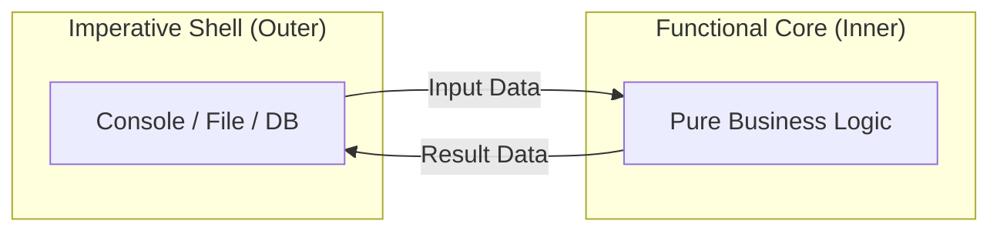

# 第39章：“境界”を増やす（I/Oを薄くする）🚪

〜中心ロジックを「純粋」にして、テストを楽にする回〜🧪💕

---

## この章のゴール🎯


この章が終わると、こんな状態になってます😊✨

* Console（入出力）を **外側** に追い出せる📤
* “中心ロジック” が **Consoleを知らない** 状態にできる🧠✨
* だから、ユニットテストが **速く・安定して・書きやすい** ⚡️🧪

---

## まず大事な感覚🌱：「I/Oは“外の世界”」


Console入出力、ファイル、DB、HTTP…こういうのって全部「外の世界」🌍
外の世界は、テストにとってはだいたい敵です😂💦

* 遅くなる🐢
* 毎回同じ結果にならない（入力が変わる）🎲
* 失敗の原因が分かりにくい😵‍💫

だからコツはこれ👇

> **中心ロジック＝できるだけ純粋に**
> **I/O＝できるだけ薄く、端っこに寄せる** 🧼✨

この考え方、よく **“Functional Core / Imperative Shell”**（中心は純粋・外側は手続き）って言われます☺️



---

## 今日の題材：ミニCLI「推し活グッズ管理（超ミニ）」🎀📦

コマンドを打つだけの小さいやつでやります😊

* `add うちわ 2`：追加
* `list`：一覧
* `exit`：終了

---

## ありがちな“ぐちゃ混ぜ”版（テストしづらい😇）


最初こうなりがち👇（※例なので雑でOK！）

```csharp
using System;
using System.Collections.Generic;

var items = new List<(string Name, int Qty)>();

while (true)
{
    Console.Write("> ");
    var line = Console.ReadLine();
    if (line is null) break;

    if (line == "exit") break;

    if (line.StartsWith("add "))
    {
        var parts = line.Split(' ');
        var name = parts[1];
        var qty = int.Parse(parts[2]);
        items.Add((name, qty));
        Console.WriteLine("OK!");
    }
    else if (line == "list")
    {
        foreach (var (name, qty) in items)
            Console.WriteLine($"{name} x{qty}");
    }
    else
    {
        Console.WriteLine("unknown command");
    }
}
```

### 何がつらいの？😵

* ロジックが Console にべったり🍯
* ルール（パース、追加、一覧整形）が1か所に混ざってる🌀
* テストで「Console.ReadLine」を扱うのがダルい😂

---

## 解決方針✨：「境界」を増やして分離する


イメージはこれ👇

* **外側（I/O）**：Consoleで読む・出す🪟
* **中心（ロジック）**：文字列コマンドを処理して「結果」を返す🧠
* （中心は Console を知らない！）

図にするとこんな感じ😊

* `Program（Console）` → `CommandHandler（中心）` → `Catalog（状態）`
* Consoleは **“入力を渡すだけ / 結果を表示するだけ”** にする🎯

---

## Step 1：中心ロジック側を作る🧠✨（Console禁止🚫）


### 1) 状態（カタログ）を小さく持つ📦

```csharp
public sealed class GoodsCatalog
{
    private readonly List<GoodsItem> _items = new();

    public void Add(string name, int qty)
    {
        _items.Add(new GoodsItem(name, qty));
    }

    public IReadOnlyList<GoodsItem> List() => _items;
}

public sealed record GoodsItem(string Name, int Qty);
```

### 2) コマンド処理（中心）を作る🧾✨

ポイント：**入力＝string、出力＝結果（データ）** にする！

```csharp
public sealed class GoodsCommandHandler
{
    private readonly GoodsCatalog _catalog;

    public GoodsCommandHandler(GoodsCatalog catalog) => _catalog = catalog;

    public CommandResult Handle(string line)
    {
        if (string.IsNullOrWhiteSpace(line))
            return CommandResult.Message("empty");

        if (line == "exit")
            return CommandResult.Exit();

        if (line == "list")
        {
            var items = _catalog.List()
                .Select(x => $"{x.Name} x{x.Qty}")
                .ToList();

            return CommandResult.Lines(items.Count == 0
                ? new List<string> { "(empty)" }
                : items);
        }

        if (line.StartsWith("add "))
        {
            var parts = line.Split(' ', StringSplitOptions.RemoveEmptyEntries);
            if (parts.Length != 3) return CommandResult.Message("usage: add <name> <qty>");

            var name = parts[1];
            if (!int.TryParse(parts[2], out var qty) || qty <= 0)
                return CommandResult.Message("qty must be positive number");

            _catalog.Add(name, qty);
            return CommandResult.Message("OK!");
        }

        return CommandResult.Message("unknown command");
    }
}

public sealed record CommandResult(bool ShouldExit, IReadOnlyList<string> OutputLines)
{
    public static CommandResult Exit() => new(true, Array.Empty<string>());
    public static CommandResult Message(string message) => new(false, new[] { message });
    public static CommandResult Lines(IReadOnlyList<string> lines) => new(false, lines);
}
```

✅ ここまでで、中心ロジックは **Consoleを一切知らない** です🎉

---

## Step 2：外側（Console）を“薄い殻”にする🪺🪟


Programは「読む→渡す→出す」だけ！

```csharp
var catalog = new GoodsCatalog();
var handler = new GoodsCommandHandler(catalog);

while (true)
{
    Console.Write("> ");
    var line = Console.ReadLine();
    if (line is null) break;

    var result = handler.Handle(line);

    foreach (var msg in result.OutputLines)
        Console.WriteLine(msg);

    if (result.ShouldExit) break;
}
```

✨これが **I/Oを薄くした** 状態です！

---

## Step 3：テストがめちゃ簡単になる🧪⚡️


Console関係ないから、普通に `Handle()` を叩くだけ😊

```csharp
using Xunit;

public sealed class GoodsCommandHandlerTests
{
    [Fact]
    public void add_then_list_should_show_item()
    {
        var catalog = new GoodsCatalog();
        var handler = new GoodsCommandHandler(catalog);

        var r1 = handler.Handle("add うちわ 2");
        Assert.Equal(new[] { "OK!" }, r1.OutputLines);

        var r2 = handler.Handle("list");
        Assert.Equal(new[] { "うちわ x2" }, r2.OutputLines);
    }

    [Fact]
    public void add_with_invalid_qty_should_return_message()
    {
        var catalog = new GoodsCatalog();
        var handler = new GoodsCommandHandler(catalog);

        var r = handler.Handle("add うちわ 0");
        Assert.Equal(new[] { "qty must be positive number" }, r.OutputLines);
    }

    [Fact]
    public void exit_should_set_shouldExit_true()
    {
        var catalog = new GoodsCatalog();
        var handler = new GoodsCommandHandler(catalog);

        var r = handler.Handle("exit");
        Assert.True(r.ShouldExit);
    }
}
```

🧡 最高ポイント：

* テストが速い⚡️
* 失敗原因が分かりやすい🔍
* 仕様がテストで読める📘✨

---

## “境界”を増やす時の命名のコツ📝✨


ここ、迷いがちなのでテンプレ置いとくね😊

* **外側（I/O）**：`ConsoleRunner` / `ConsoleAdapter` / `Program`
* **中心（アプリの処理）**：`XxxCommandHandler` / `XxxUseCase`
* **状態（ドメインっぽい）**：`Catalog` / `Repository` / `Service`

「これは外側？中心？」って自問するとスッと決まります💡💕

---

## よくあるミス集⚠️（あるある〜😂）

* `GoodsCommandHandler` の中で `Console.WriteLine` しちゃう😇
  → **中心はI/O禁止**！結果を返すだけにしよ✨
* “便利”のために中心で `DateTime.Now` とか使う⏰
  → テストが不安定になりがち！必要なら前の章の「依存差し替え」へ🔁
* 出力を全部 `string` 1本にして、後で拡張が地獄😵
  → 今はOK！でも拡張するなら `CommandResult` みたいに **データで返す** のが強い💪

---

## AIの使いどころ（この章は相性いい🤖✨）

Copilot / Codex にお願いするなら、こんな感じが便利だよ〜😊💕

* 「この `Program.cs` のロジックを **CommandHandler** に抽出して。Console操作は Program に残して」
* 「`Handle(string line)` のテストケースを **正常/異常/境界** で列挙して」
* 「責務名の候補を 5 個：Catalog / Handler / Result の命名案ちょうだい」

🧠最後に必ず：

* **テストが通る？** ✅
* **自分の意図と一致？** ✅
  これでOKなら採用🎉

---

## ミニ課題（15〜30分）🧸✨

できたら最高〜！🎀

1. `add うちわ 2` と同じ名前が来たら数量を加算する（上書きじゃなくて合算）
2. `remove うちわ 1` を追加（0以下になったらエラー）
3. テストを先に追加して、Red→Green→Refactor🚦🧪

---

## まとめチェックリスト✅✨

* [ ] 中心ロジックは Console を知らない🚫🪟
* [ ] Programは「読む→渡す→出す」だけ🪺
* [ ] テストは `Handle()` を叩くだけで書ける🧪⚡️
* [ ] 仕様追加してもテストで守れる💪💕

---

## 参考（本日時点の更新状況メモ）🗓️✨

* .NET 10 は LTS で、最新パッチは **10.0.2（2026-01-13）** として公開されています。([Microsoft][1])
* C# 14 の新機能は Microsoft Learn にまとまっていて、.NET 10 SDK / Visual Studio 2026 で試せる形になっています。([Microsoft Learn][2])
* xUnit v3 系はリリースノートで継続更新されていて、v3 の系統が整理されています。([xUnit.net][3])
* Visual Studio 2026 のリリース履歴（例：18.2.0 が 2026-01-13）も Microsoft Learn 側で追えます。([Microsoft Learn][4])

---

次の第40章は、この分離を土台にして「登録・検索」を **UseCaseっぽい単位** でテストしていくよ〜🎀📦🧪
必要なら、第39章の内容を **講義台本（説明→手順→チェック→提出物）** 形式にも変換できるよ😊✨

[1]: https://dotnet.microsoft.com/en-us/platform/support/policy/dotnet-core?utm_source=chatgpt.com "NET and .NET Core official support policy"
[2]: https://learn.microsoft.com/en-us/dotnet/csharp/whats-new/csharp-14?utm_source=chatgpt.com "What's new in C# 14"
[3]: https://xunit.net/releases/?utm_source=chatgpt.com "Release Notes"
[4]: https://learn.microsoft.com/en-us/visualstudio/releases/2026/release-history?utm_source=chatgpt.com "Visual Studio Release History"
