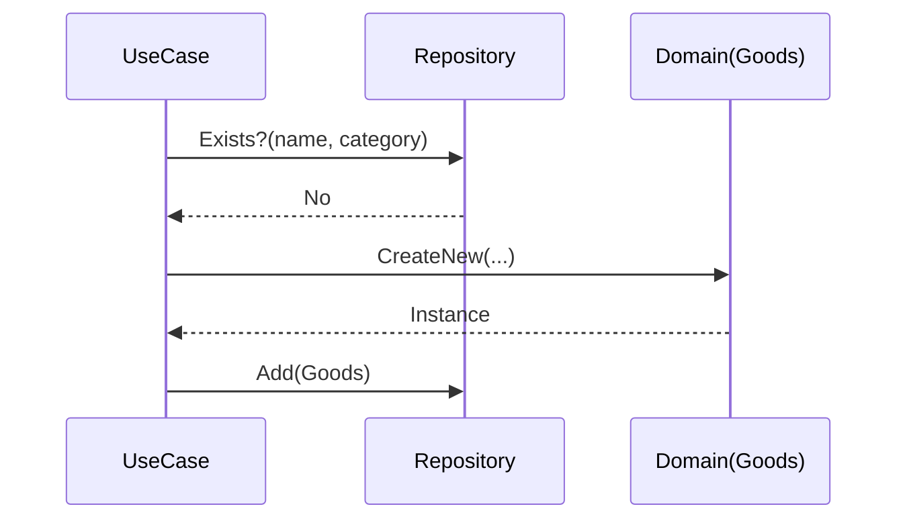

# 第40章：総合演習：推し活グッズ管理①（登録・検索）🎀📦

この章は **“依存分離＋DI＋テストダブル” をまとめて一回まわす** 回だよ〜！😊✨
UIはまだ作らず、**中身（ロジック）だけ**をTDDで育てるよ💪🧠

（執筆時点の最新：.NET 10 は 10.0.2 が 2026/01/13 リリース、SDK 10.0.102 だよ🆕） ([Microsoft][1])
（C# 14 は .NET 10 でサポート✨） ([Microsoft Learn][2])
（Visual Studio 2026 の 18.2.0 は 2026/01/13 リリース🆕） ([Microsoft Learn][3])
（xUnit v3 は `xunit.v3` が 3.2.2 まで出てるよ🧪） ([xUnit.net][4])

---

## 1) この章のゴール🎯✨


**できるようになること**👇😍

* 「登録する」「検索する」を **UseCase（アプリの目的）単位**でテストできる🧪
* DBや外部サービスを使わずに、**Repository を差し替えてテストする**（DI＋テストダブル）🔁
* “UIにロジックが入る未来”を見越して、**中心ロジックを薄く・キレイに保つ**🚪✨

---

## 2) 今回つくるもの（完成イメージ）🎀📦

今回は **“推し活グッズ” を管理するロジック**だけ作るよ😊

### 登録（Register）📝

* 名前・カテゴリ・タグ・メモを受け取って登録する
* ルール違反なら登録できない（例：名前が空）🙅‍♀️

### 検索（Search）🔎

* キーワード（部分一致）で探せる（名前・タグ）
* カテゴリで絞り込める
* 結果は **登録日が新しい順**（例）で返す

---

## 3) 仕様（ミニでOK！でもちゃんと “決める”）📘✨

迷子防止のため、ここは先に決めちゃうよ😊🫶

### 登録ルール🧾

* 名前：必須、1〜50文字（空白だけもNG）✋
* タグ：0〜10個、各タグは 1〜20文字（空白だけNG）🏷️
* カテゴリ：必須（列挙型）📦
* **重複禁止**：同じ「名前（大文字小文字無視）＋カテゴリ」は登録できない🚫

### 検索ルール🔎

* キーワード：空なら “全部” でもOK（今回はそうする）🙂
* 部分一致：名前 or タグに含まれたらヒット（大文字小文字無視）🔍
* カテゴリ指定があれば絞り込み
* 返す順番：登録日が新しい順（CreatedAt 降順）🕒⬇️



---

## 4) 最小の設計（ちゃんと “依存” を外に出す）🔌✨

今回の構造はこれだけで十分🙆‍♀️

* `GoodsUseCase`：登録・検索の “目的” を実現する（主役）🌟
* `IGoodsRepository`：保存や検索の “置き場” を抽象化（差し替え可能）🔁
* `Goods`：データ＋最低限のルール（ドメインの核）❤️

イメージ👇

* UseCase →（interface）→ Repository
* テストでは Repository を **InMemory（メモリ版）** に差し替える🧠✨

---

## 5) まずテストケース表を作る🗂️🧪（AIもここで使うと強い！）

### テストケース（おすすめ最小セット）🌼

| # | 機能 | 条件          | 期待                      |
| - | -- | ----------- | ----------------------- |
| 1 | 登録 | 正常入力        | IDが返り、検索で見つかる           |
| 2 | 登録 | 名前が空        | 例外（ArgumentException 等） |
| 3 | 登録 | 同名＋同カテゴリを2回 | 例外（重複禁止）                |
| 4 | 検索 | キーワード一致（名前） | ヒットする                   |
| 5 | 検索 | キーワード一致（タグ） | ヒットする                   |
| 6 | 検索 | カテゴリ絞り込み    | 指定カテゴリだけ返る              |
| 7 | 検索 | 並び順         | 新しい順で返る                 |

### AIに投げるならこのプロンプト（コピペOK）🤖✨

* 「この仕様のテストケースを、正常/異常/境界値で表にして」
* 「重複判定の “落とし穴” を3つ挙げて」
* 「検索仕様に抜けがないかチェックして」

---

## 6) プロジェクト作成（雰囲気だけサクッと）🧰✨

例：CLIで作るなら（操作はVSでも同じだよ😊）

```bash
dotnet new sln -n OshiGoods

dotnet new classlib -n OshiGoods --framework net10.0
dotnet new xunit -n OshiGoods.Tests --framework net10.0

dotnet sln OshiGoods.sln add OshiGoods/OshiGoods.csproj
dotnet sln OshiGoods.sln add OshiGoods.Tests/OshiGoods.Tests.csproj

dotnet add OshiGoods.Tests/OshiGoods.Tests.csproj reference OshiGoods/OshiGoods.csproj
```

xUnit v3 を使うなら、テスト側にこれを入れるのが分かりやすいよ🧪✨
（`dotnet test` の体験は `xunit.runner.visualstudio` が関係するよ） ([xUnit.net][5])

```bash
dotnet add OshiGoods.Tests package xunit.v3 --version 3.2.2
dotnet add OshiGoods.Tests package xunit.runner.visualstudio --version 3.1.5
dotnet add OshiGoods.Tests package Microsoft.NET.Test.Sdk
```

* `xunit.v3` は 3.2.2 が出てるよ🧪 ([xUnit.net][4])
* `xunit.runner.visualstudio` は 3.1.5 があるよ🧩 ([nuget.org][6])

---

## 7) TDDで作る（登録→検索の順でいくよ）🚦🧪✨

ここからが本番😍
**Red → Green → Refactor** を小さく回すよ⏱️

---

## Step A：まず “登録できる” を作る📝✅

### A-1) 失敗するテストを書く（Red）🔴

`OshiGoods.Tests/GoodsUseCaseTests.cs`

```csharp
using Xunit;

namespace OshiGoods.Tests;

public class GoodsUseCaseTests
{
    [Fact]
    public void Register_valid_input_should_be_found_by_search()
    {
        // Arrange
        var repo = new InMemoryGoodsRepository();
        var useCase = new GoodsUseCase(repo);

        // Act
        var id = useCase.Register(new RegisterGoodsCommand(
            Name: "アクスタ（初回限定）",
            Category: GoodsCategory.AcrylicStand,
            Tags: new[] { "初回", "限定" },
            Memo: "めちゃ尊い"
        ));

        // Assert
        Assert.NotEqual(GoodsId.Empty, id);

        var result = useCase.Search(new SearchGoodsQuery(
            Keyword: "アクスタ",
            Category: null
        ));

        Assert.Single(result);
        Assert.Equal(id, result[0].Id);
        Assert.Equal("アクスタ（初回限定）", result[0].Name);
    }
}
```

👀 ここでまだ `GoodsUseCase` も `InMemoryGoodsRepository` も無いから、当然コンパイルが落ちる！
それでOK〜！まずは “欲しい形” を決めるのが勝ち🏆✨

---

### A-2) 最小実装で通す（Green）🟢

`OshiGoods/GoodsUseCase.cs`

```csharp
namespace OshiGoods;

public sealed class GoodsUseCase
{
    private readonly IGoodsRepository _repo;

    public GoodsUseCase(IGoodsRepository repo)
    {
        _repo = repo;
    }

    public GoodsId Register(RegisterGoodsCommand cmd)
    {
        var goods = Goods.CreateNew(cmd.Name, cmd.Category, cmd.Tags, cmd.Memo);
        _repo.Add(goods);
        return goods.Id;
    }

    public IReadOnlyList<GoodsSummary> Search(SearchGoodsQuery query)
    {
        return _repo.Search(query);
    }
}
```

`OshiGoods/Contracts.cs`（必要な型たちをまとめて置くよ。後で分割してもOK🧹✨）

```csharp
namespace OshiGoods;

public enum GoodsCategory
{
    AcrylicStand,
    Badge,
    TShirt,
    Other
}

public readonly record struct GoodsId(Guid Value)
{
    public static GoodsId Empty => new(Guid.Empty);

    public static GoodsId New() => new(Guid.NewGuid());

    public override string ToString() => Value.ToString();
}

public sealed record RegisterGoodsCommand(
    string Name,
    GoodsCategory Category,
    IReadOnlyList<string> Tags,
    string? Memo
);

public sealed record SearchGoodsQuery(
    string? Keyword,
    GoodsCategory? Category
);

public sealed record GoodsSummary(
    GoodsId Id,
    string Name,
    GoodsCategory Category,
    DateTimeOffset CreatedAt
);
```

`OshiGoods/Goods.cs`

```csharp
namespace OshiGoods;

public sealed class Goods
{
    private readonly List<string> _tags;

    public GoodsId Id { get; }
    public string Name { get; }
    public GoodsCategory Category { get; }
    public IReadOnlyList<string> Tags => _tags;
    public string? Memo { get; }
    public DateTimeOffset CreatedAt { get; }

    private Goods(GoodsId id, string name, GoodsCategory category, List<string> tags, string? memo, DateTimeOffset createdAt)
    {
        Id = id;
        Name = name;
        Category = category;
        _tags = tags;
        Memo = memo;
        CreatedAt = createdAt;
    }

    public static Goods CreateNew(string name, GoodsCategory category, IReadOnlyList<string> tags, string? memo)
    {
        // いまは最小（バリデーションは次のステップで追加）
        return new Goods(
            id: GoodsId.New(),
            name: name,
            category: category,
            tags: tags?.ToList() ?? new List<string>(),
            memo: memo,
            createdAt: DateTimeOffset.UtcNow
        );
    }
}
```

`OshiGoods/IGoodsRepository.cs`

```csharp
namespace OshiGoods;

public interface IGoodsRepository
{
    void Add(Goods goods);
    IReadOnlyList<GoodsSummary> Search(SearchGoodsQuery query);
}
```

`OshiGoods.Tests/InMemoryGoodsRepository.cs`

```csharp
using OshiGoods;

namespace OshiGoods.Tests;

internal sealed class InMemoryGoodsRepository : IGoodsRepository
{
    private readonly List<Goods> _items = new();

    public void Add(Goods goods) => _items.Add(goods);

    public IReadOnlyList<GoodsSummary> Search(SearchGoodsQuery query)
    {
        IEnumerable<Goods> q = _items;

        if (query.Category is not null)
            q = q.Where(x => x.Category == query.Category.Value);

        var keyword = (query.Keyword ?? "").Trim();
        if (keyword.Length > 0)
        {
            q = q.Where(x =>
                x.Name.Contains(keyword, StringComparison.OrdinalIgnoreCase) ||
                x.Tags.Any(t => t.Contains(keyword, StringComparison.OrdinalIgnoreCase))
            );
        }

        return q
            .OrderByDescending(x => x.CreatedAt)
            .Select(x => new GoodsSummary(x.Id, x.Name, x.Category, x.CreatedAt))
            .ToList();
    }
}
```

これで **最初のテストが通る** はず！🎉🧪✨
（通ったら一回深呼吸〜😮‍💨💕）

---

### A-3) ちょいリファクタ（Refactor）🧹✨

この時点での “いい感じ” の整理👇

* `Contracts.cs` に詰めた型を、後でファイル分割してOK（今は速度優先🏃‍♀️💨）
* `InMemoryGoodsRepository` はテスト専用でOK（本物DBはまだ不要🙆‍♀️）

---

## Step B：ルール違反をテストで固定（入力バリデーション）🧯🧪

### B-1) 失敗テスト（Red）🔴：名前が空はNG

```csharp
using Xunit;

namespace OshiGoods.Tests;

public partial class GoodsUseCaseTests
{
    [Fact]
    public void Register_empty_name_should_throw()
    {
        var repo = new InMemoryGoodsRepository();
        var useCase = new GoodsUseCase(repo);

        var ex = Assert.Throws<ArgumentException>(() =>
            useCase.Register(new RegisterGoodsCommand(
                Name: "   ",
                Category: GoodsCategory.Other,
                Tags: Array.Empty<string>(),
                Memo: null
            ))
        );

        Assert.Contains("Name", ex.Message, StringComparison.OrdinalIgnoreCase);
    }
}
```

### B-2) 通す実装（Green）🟢：`Goods.CreateNew` に最低限のチェックを追加

```csharp
namespace OshiGoods;

public sealed partial class Goods
{
    public static Goods CreateNew(string name, GoodsCategory category, IReadOnlyList<string> tags, string? memo)
    {
        if (string.IsNullOrWhiteSpace(name))
            throw new ArgumentException("Name is required.", nameof(name));

        if (name.Length > 50)
            throw new ArgumentException("Name must be 1..50 chars.", nameof(name));

        tags ??= Array.Empty<string>();
        if (tags.Count > 10)
            throw new ArgumentException("Tags must be 0..10 items.", nameof(tags));

        var cleanedTags = new List<string>(tags.Count);
        foreach (var t in tags)
        {
            if (string.IsNullOrWhiteSpace(t))
                throw new ArgumentException("Tag must not be blank.", nameof(tags));
            if (t.Length > 20)
                throw new ArgumentException("Tag must be 1..20 chars.", nameof(tags));

            cleanedTags.Add(t.Trim());
        }

        return new Goods(
            id: GoodsId.New(),
            name: name.Trim(),
            category: category,
            tags: cleanedTags,
            memo: memo,
            createdAt: DateTimeOffset.UtcNow
        );
    }
}
```

これで「バリデーションは仕様！」って胸張れるよ😊💘

---

## Step C：重複禁止（Repository依存っぽい所をUseCaseで扱う）🚫🧪

ここが **“UseCaseっぽさ”** 出るところ〜！🌟

### C-1) 失敗テスト（Red）🔴：同名＋同カテゴリは2回登録できない

```csharp
using Xunit;

namespace OshiGoods.Tests;

public partial class GoodsUseCaseTests
{
    [Fact]
    public void Register_duplicate_name_in_same_category_should_throw()
    {
        var repo = new InMemoryGoodsRepository();
        var useCase = new GoodsUseCase(repo);

        useCase.Register(new RegisterGoodsCommand(
            Name: "うちわ",
            Category: GoodsCategory.Other,
            Tags: Array.Empty<string>(),
            Memo: null
        ));

        Assert.Throws<InvalidOperationException>(() =>
            useCase.Register(new RegisterGoodsCommand(
                Name: "  UCHIWA  ", // わざと表記ゆらぎ
                Category: GoodsCategory.Other,
                Tags: Array.Empty<string>(),
                Memo: null
            ))
        );
    }
}
```

### C-2) 仕様を満たす最小実装（Green）🟢

Repository に「存在チェック」機能を足すのが自然だよね🙂
`IGoodsRepository` を拡張するよ🔧✨

```csharp
namespace OshiGoods;

public interface IGoodsRepository
{
    void Add(Goods goods);
    bool ExistsByNameAndCategory(string name, GoodsCategory category);
    IReadOnlyList<GoodsSummary> Search(SearchGoodsQuery query);
}
```

UseCase 側でチェックしてから登録🧪

```csharp
namespace OshiGoods;

public sealed class GoodsUseCase
{
    private readonly IGoodsRepository _repo;

    public GoodsUseCase(IGoodsRepository repo) => _repo = repo;

    public GoodsId Register(RegisterGoodsCommand cmd)
    {
        var normalizedName = (cmd.Name ?? "").Trim();

        if (_repo.ExistsByNameAndCategory(normalizedName, cmd.Category))
            throw new InvalidOperationException("Duplicate goods in same category.");

        var goods = Goods.CreateNew(cmd.Name, cmd.Category, cmd.Tags, cmd.Memo);
        _repo.Add(goods);
        return goods.Id;
    }

    public IReadOnlyList<GoodsSummary> Search(SearchGoodsQuery query) => _repo.Search(query);
}
```

InMemory も対応👇

```csharp
using OshiGoods;

namespace OshiGoods.Tests;

internal sealed class InMemoryGoodsRepository : IGoodsRepository
{
    private readonly List<Goods> _items = new();

    public void Add(Goods goods) => _items.Add(goods);

    public bool ExistsByNameAndCategory(string name, GoodsCategory category)
    {
        var n = (name ?? "").Trim();
        return _items.Any(x =>
            x.Category == category &&
            string.Equals(x.Name, n, StringComparison.OrdinalIgnoreCase)
        );
    }

    public IReadOnlyList<GoodsSummary> Search(SearchGoodsQuery query)
    {
        IEnumerable<Goods> q = _items;

        if (query.Category is not null)
            q = q.Where(x => x.Category == query.Category.Value);

        var keyword = (query.Keyword ?? "").Trim();
        if (keyword.Length > 0)
        {
            q = q.Where(x =>
                x.Name.Contains(keyword, StringComparison.OrdinalIgnoreCase) ||
                x.Tags.Any(t => t.Contains(keyword, StringComparison.OrdinalIgnoreCase))
            );
        }

        return q
            .OrderByDescending(x => x.CreatedAt)
            .Select(x => new GoodsSummary(x.Id, x.Name, x.Category, x.CreatedAt))
            .ToList();
    }
}
```

🎉 これで「DBが本物でも同じ仕様になる」構造ができたよ！
**依存はRepositoryに閉じ込めた**からね🔒✨

---

## 8) ここで “設計チェック” 👀💡

### ✅ いい感じポイント🌟

* UseCase が “仕様の司令塔” になってる（重複禁止とか）👑
* Repository が差し替え可能（テストはInMemory、本番はDBにできる）🔁
* 検索ロジックは Repository 側に置いてもOK（今回の規模なら自然）🙂

### ⚠️ よくある事故（先に潰す）💥

* **UIに検索条件の解釈が入り始めたら分離**🚪（この章のチェック項目どおり！）
* テストが “実装の写し” になりそうなら、テスト名を仕様に戻す📝

---

## 9) AIの使いどころ（この章で超効くやつ）🤖💞

### ① テストケース表を増やす（抜け防止）🗂️

* 「検索の境界値（空文字、空白、タグ一致、カテゴリ未指定）も追加して」

### ② リファクタ提案を “小さく” もらう🧹

* 「このクラスで責務が混ざってる所を指摘して。最小の改善を1つだけ提案して」

### ③ 命名を整える📝✨

* 「UseCase/Repository/Command/Query の命名案を3つずつ出して。誤解が少ない順に」

---

## 10) この章のゴール達成チェック✅🎀

* [ ] 登録がテストで守れてる🧪
* [ ] 不正入力がテストで落ちる🧯
* [ ] 重複禁止がテストで固定できた🚫
* [ ] 検索がキーワード＋カテゴリで動く🔎
* [ ] Repository差し替え（InMemory）で高速に回せる⚡️
* [ ] UseCaseが “目的の単位” になってる（UIに依存してない）🚪✨

---

## 11) 宿題（次の章に気持ちよく繋がるやつ）🎒✨

やるならこの順がオススメ😊🫶

1. **検索結果の並び順をテストで固定**（新しい順）🕒
2. タグの正規化（重複タグを許さない等）🏷️
3. `GoodsSummary` を “検索専用DTO” として別ファイルへ分離🧩
4. Repository を “本番用（仮）” として `JsonFileGoodsRepository` にしてみる（I/O境界が見える）📁🚪

---

必要なら、この続きとして👇も一気に作れるよ😊✨

* 「推し活グッズ管理①」を **コミット単位（何をRed/Green/Refactorで入れるか）**まで分解した“授業台本”📘🧪
* **モックフレームワーク版**（ExistsチェックやAdd呼び出し確認をモックで書く版）🎭✅
* ここから **推し活グッズ管理②（集計・条件検索）** に自然につながる設計の育て方📊🌱

[1]: https://dotnet.microsoft.com/en-US/download/dotnet/10.0?utm_source=chatgpt.com "Download .NET 10.0 (Linux, macOS, and Windows) | .NET"
[2]: https://learn.microsoft.com/en-us/dotnet/csharp/whats-new/csharp-14?utm_source=chatgpt.com "What's new in C# 14"
[3]: https://learn.microsoft.com/en-us/visualstudio/releases/2026/release-notes "Visual Studio 2026 Release Notes | Microsoft Learn"
[4]: https://xunit.net/releases/?utm_source=chatgpt.com "Release Notes"
[5]: https://xunit.net/docs/getting-started/v3/microsoft-testing-platform "Microsoft Testing Platform (xUnit.net v3) [2025 November 2] | xUnit.net "
[6]: https://www.nuget.org/packages/xunit.runner.visualstudio?utm_source=chatgpt.com "xunit.runner.visualstudio 3.1.5"
