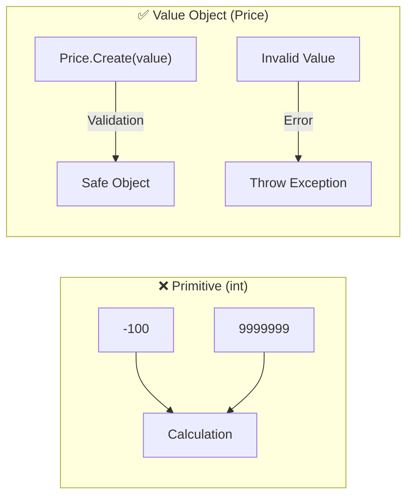

# 第41章：ドメインルールを“型”で守る入門（超やさしく）🧷

〜「ifで守る」より「入れない」を目指すよ〜💪😊

---

## 0. この章でできるようになること🎯✨


* **無効な値（負の価格、0個、上限超え）を“そもそも作れない”**ようにする🧱🚫
* TDDで **「ルール＝テスト」→「型＝ガード」** の流れを体験する🧪➡️🧩
* “プリミティブ地獄”（intやstringのまま増え続けるやつ）を卒業し始める🎓🌸

---

## 1. まず「あるある地獄」😇💥

たとえば、推し活グッズの価格と数量をこう書くと…

```csharp
public class Goods
{
    public int PriceYen { get; }
    public int Quantity { get; }

    public Goods(int priceYen, int quantity)
    {
        PriceYen = priceYen;
        Quantity = quantity;
    }
}
```

すると、プロジェクトが大きくなるほどこうなる👇😵‍💫

* あちこちに `if (priceYen <= 0) throw...` が散らばる🌀
* チェック漏れた場所だけ事故る💣
* “価格のint” と “数量のint” を間違えて渡してもコンパイルが通る😇🔀

✅ だから発想を変えるよ：
**「チェックを増やす」より「変な値を入れられない型を作る」** 🧷✨



---

## 2. 今日の作戦：Value Object（値オブジェクト）ってやつ🧸✨

ここでは超やさしく言うと👇

* **Price（価格）という型**を作る
* **Quantity（数量）という型**を作る
* それらが **作られる瞬間にルールをチェック**する
* 以後、アプリ内には **“正しいPrice/Quantityしか存在しない世界”** を作る🌎✨

---

## 3. まずはテストから：Priceは「1〜1,000,000円」だけOKにしよ💰✅

### 3-1. Red：失敗するテストを書く🔴🧪

（例：0円や負の値はダメ）

```csharp
using Xunit;

public class PriceTests
{
    [Theory]
    [InlineData(0)]
    [InlineData(-1)]
    [InlineData(-999)]
    public void Create_0以下はエラー(int value)
    {
        var ex = Assert.Throws<DomainRuleException>(() => Price.Create(value));
        Assert.Equal("PRICE_OUT_OF_RANGE", ex.Code);
    }
}
```

> ここで **DomainRuleException** は「ドメインルール違反専用の例外」だよ🧯✨
> （普通の `ArgumentOutOfRangeException` でも始められるけど、章のテーマ的に“意味を持たせる”ほうが気持ちいい😊）

---

### 3-2. Green：最小実装で通す🟢🧩

```csharp
public sealed class DomainRuleException : Exception
{
    public string Code { get; }

    public DomainRuleException(string code, string message) : base(message)
        => Code = code;
}

public sealed record Price
{
    public int Value { get; }

    private Price(int value) => Value = value;

    public static Price Create(int value)
    {
        if (value <= 0)
            throw new DomainRuleException("PRICE_OUT_OF_RANGE", "価格は1円以上である必要があります。");

        return new Price(value);
    }
}
```

---

### 3-3. さらにルール追加：上限もテストで固定しよ🧪🧷

```csharp
public class PriceUpperBoundTests
{
    [Theory]
    [InlineData(1_000_001)]
    [InlineData(int.MaxValue)]
    public void Create_上限超えはエラー(int value)
    {
        var ex = Assert.Throws<DomainRuleException>(() => Price.Create(value));
        Assert.Equal("PRICE_OUT_OF_RANGE", ex.Code);
    }

    [Fact]
    public void Create_範囲内は作れる()
    {
        var price = Price.Create(500);
        Assert.Equal(500, price.Value);
    }
}
```

実装をちょい拡張✨

```csharp
public static Price Create(int value)
{
    if (value is <= 0 or > 1_000_000)
        throw new DomainRuleException("PRICE_OUT_OF_RANGE", "価格は1〜1,000,000円の範囲です。");

    return new Price(value);
}
```

---

## 4. 次はQuantity：数量は「1〜999個」だけOK📦✅

```csharp
public sealed record Quantity
{
    public int Value { get; }

    private Quantity(int value) => Value = value;

    public static Quantity Create(int value)
    {
        if (value is <= 0 or > 999)
            throw new DomainRuleException("QUANTITY_OUT_OF_RANGE", "数量は1〜999の範囲です。");

        return new Quantity(value);
    }
}
```

テストも同じノリで書くよ〜🧪✨

```csharp
public class QuantityTests
{
    [Theory]
    [InlineData(0)]
    [InlineData(-1)]
    [InlineData(1000)]
    public void Create_範囲外はエラー(int value)
    {
        var ex = Assert.Throws<DomainRuleException>(() => Quantity.Create(value));
        Assert.Equal("QUANTITY_OUT_OF_RANGE", ex.Code);
    }

    [Fact]
    public void Create_範囲内は作れる()
    {
        var q = Quantity.Create(3);
        Assert.Equal(3, q.Value);
    }
}
```

---

## 5. “型で守る”と何が嬉しいの？🎁✨（ここ超重要！）

### 5-1. 間違いがコンパイルで止まる🚦🛑

```csharp
var price = Price.Create(500);
var qty   = Quantity.Create(2);

// もし間違ってこう書いたら…👇
// var total = CalcTotal(qty, price); // ←引数の型が違うので止まる✨
```

### 5-2. ルールチェックが散らばらない🧹✨

* 価格のルールは **Price.Create に集約**
* 数量のルールは **Quantity.Create に集約**
  ⇒ 変更があっても直す場所が“ほぼ1箇所”になる🏠✅

---

## 6. 仕上げ：Goodsで型を使ってみよ🎀📦✨

```csharp
public sealed class Goods
{
    public string Name { get; }
    public Price Price { get; }
    public Quantity Quantity { get; }

    public Goods(string name, Price price, Quantity quantity)
    {
        Name = name;
        Price = price;
        Quantity = quantity;
    }

    public int TotalPriceYen() => Price.Value * Quantity.Value;
}
```

テストで「合計」も固定しちゃう🧪🧾

```csharp
public class GoodsTests
{
    [Fact]
    public void TotalPriceYen_価格×数量()
    {
        var goods = new Goods("推しT", Price.Create(2500), Quantity.Create(2));
        Assert.Equal(5000, goods.TotalPriceYen());
    }
}
```

---

## 7. 初心者がハマりがちな注意点⚠️😵‍💫

### 7-1. “struct（構造体）”で作ると default が出てくる問題🧱💥

値オブジェクトは `record struct` でも作れるけど、**structは `default` が必ず作れちゃう**のが落とし穴になりやすいよ〜😇

* Quantityが「1以上」なのに `default(Quantity)` は 0 になっちゃう…みたいなやつ💣
  👉 なのでこの章は、まず **record class（今回のやつ）でOK**！😊✨

### 7-2. setter を生やすと世界が壊れる🌋

```csharp
public int Value { get; set; } // ←これやると、後から無効値入れ放題😇
```

👉 `private` にして “作る瞬間だけチェック” にしよ🧷✅

---

## 8. AIの使いどころ（超効く）🤖✨

コピペ用プロンプト例だよ📋💞

* 「Priceのルール（1〜1,000,000円）に対して **異常系・境界値ケース**を列挙して」🧪
* 「このテスト名、仕様として読みやすい **命名案を3つ**出して」📝
* 「このValue Objectの実装、**抜けてるバリデーション観点**ない？」🔍

---

## 9. ミニ演習（提出できるやつ）🎒✨

1. `NonEmptyName`（空文字・空白だけ禁止）を作る📝🚫
2. `Sku`（英数字のみ、長さ8〜12など）を作る🏷️✨
3. 例外コードを一覧化して、テストで「コードが変わらない」も守る🧯✅

---

## 10. 今日のまとめ🌸🎉

* ルールを **ifで各所に散らす**より、**型の入口で止める**ほうが強い🧷✨
* TDDだと、**ルール→テスト→型**の順で気持ちよく固められる🧪➡️🧱
* ここができると次章の **CQS（更新と参照を分ける）** がめちゃラクになるよ〜🔀🚫✨

---

## 付記：本日時点の“最新情報”メモ🗓️🔍✨

* .NET 10 は LTS で、**2026-01-13 に SDK 10.0.102** が案内されてるよ📦✨ ([Microsoft][1])
* C# 14 の新機能は Microsoft Learn の「What’s new in C# 14」にまとまってるよ🧠✨ ([Microsoft Learn][2])
* xUnit は v3 系が提供されていて、リリース一覧や NuGet で **xunit.v3 3.2.2** が確認できるよ🧪✨ ([xUnit.net][3])

---

次は第42章（CQS）へ行く前に、もし希望があれば👇も同時に作れるよ😊💞

* Price/Quantity を **もっと“読み物テスト”っぽく**整えるテンプレ📝✨
* DomainRuleException を **UI表示用/ログ用**に分ける超やさしい設計🧯📣

[1]: https://dotnet.microsoft.com/en-us/download?utm_source=chatgpt.com "Download .NET (Linux, macOS, and Windows) | .NET"
[2]: https://learn.microsoft.com/en-us/dotnet/csharp/whats-new/csharp-14?utm_source=chatgpt.com "What's new in C# 14"
[3]: https://xunit.net/releases/?utm_source=chatgpt.com "Release Notes"
