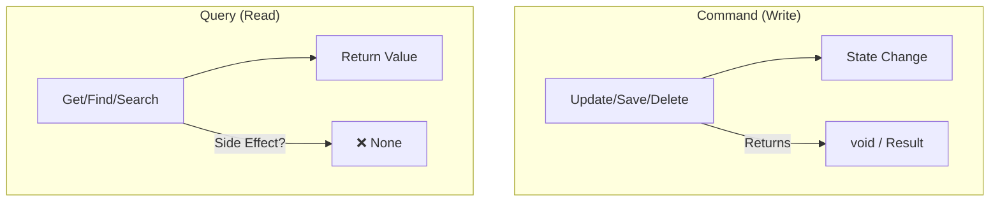

# 第42章：CQSの超入門（更新と参照を混ぜない）🔀🚫

## この章でできるようになること🎯


* 「状態を変える処理」と「読むだけの処理」を**分けて考えられる**ようになる🙆‍♀️
* テストが **書きやすい・読みやすい** 形に自然と寄っていく🧪📘
* 「地味に怖いバグ（読んだだけのはずなのに状態が変わる）」を防げる😇💥

---

## まずCQSってなに？🧠✨

CQS（Command Query Separation）は超ざっくり言うと👇

* **Command（コマンド）**：状態を変える（保存・更新・削除など）✍️🧱
* **Query（クエリ）**：状態を変えずに返す（検索・取得など）🔎📦

「質問しただけで答えが変わるのはナシね！」って発想だよ🙂



---
（Martin Fowlerの定義もほぼこれで、Queryは副作用なし、Commandは値を返さない、という整理です） ([martinfowler.com][1])

---

## なんでTDDと相性いいの？🧪💕

TDDって「テスト＝仕様」だから、**読み物として分かりやすい**のが正義📘✨
CQSを守ると、こういう嬉しさが出るよ👇

### 1) テストがシンプルになる🧁

* Queryのテスト：**返り値だけ見ればOK**（状態が変わらない前提）
* Commandのテスト：**状態変化だけ見ればOK**（保存された？増えた？など）

### 2) “え、これ呼んだだけで…？”事故が減る😇

たとえば `GetOrCreate()` みたいに
「取得するつもりで呼んだのに、裏で作ってた」みたいなやつ…あるある😵‍💫

### 3) 命名が自然に良くなる📝

* `Add... / Update... / Delete...` → Commandっぽい
* `Get... / Find... / Search...` → Queryっぽい
  読むだけで心が落ち着く☺️🍵

---

## “混ざる”と何がツラいの？💥

### 😱 悪い例：Queryっぽい顔して、裏で保存してる

* `GetLatestSummary()` が内部で「アクセス記録」保存しちゃう
* `FindById()` が「見つからなかったら作る」
* `Search()` が「キャッシュ更新」で状態を変える

こうなるとテストは👇みたいに地獄化しやすい🫠

* 「返り値」も「保存された回数」も「時刻」も「ログ」も…ぜんぶ気になる
* 失敗した時に「どこが仕様違反？」が分かりづらい

---

## ハンズオン：推し活グッズ管理でCQSを体に入れる🎀📦🧪

ここでは小さく👇を作るよ！

* Command：グッズ登録する `Register(...)`
* Query：グッズ取得する `GetById(...)` / 検索 `Search(...)`

さらに大事なルール👇

* **QueryはSaveしない（副作用なし）**✅
* **Commandは結果を返さない（基本）**✅
  （※現実の折衷案も後で紹介するよ😉）

---

## Step 0：テストの土台（“Fake”で呼ばれ方を記録）🧸🧪

モックフレームワーク無しでもいけるように、**手作りFake**でいこう✨
（もちろん後でMoqでもOK👌）

```csharp
public readonly record struct GoodsId(Guid Value);

public sealed record Goods(GoodsId Id, string Name);

public interface IGoodsRepository
{
    void Save(Goods goods);
    Goods? FindById(GoodsId id);
    IReadOnlyList<Goods> Search(string keyword);
}

// 呼ばれた回数を記録できる Fake
public sealed class FakeGoodsRepository : IGoodsRepository
{
    private readonly Dictionary<GoodsId, Goods> _store = new();

    public int SaveCallCount { get; private set; }

    public void Save(Goods goods)
    {
        SaveCallCount++;
        _store[goods.Id] = goods;
    }

    public Goods? FindById(GoodsId id)
        => _store.TryGetValue(id, out var g) ? g : null;

    public IReadOnlyList<Goods> Search(string keyword)
        => _store.Values
            .Where(g => g.Name.Contains(keyword, StringComparison.OrdinalIgnoreCase))
            .ToList();
}
```

---

## Step 1：Commandのテストを書く（まずRed）🚦🧪

「登録したら保存される」だけを仕様にするよ🙂

```csharp
using Xunit;

public sealed class GoodsCommandTests
{
    [Fact]
    public void Register_saves_goods_once()
    {
        var repo = new FakeGoodsRepository();
        var service = new GoodsService(repo);

        var id = new GoodsId(Guid.NewGuid());

        service.Register(id, "アクスタ");

        Assert.Equal(1, repo.SaveCallCount);
        Assert.NotNull(repo.FindById(id));
    }
}
```

---

## Step 2：最小実装でGreen✅✨

```csharp
public sealed class GoodsService
{
    private readonly IGoodsRepository _repo;

    public GoodsService(IGoodsRepository repo) => _repo = repo;

    // Command：状態を変える（戻り値なし）
    public void Register(GoodsId id, string name)
    {
        var goods = new Goods(id, name);
        _repo.Save(goods);
    }

    // Query：この後追加するよ！
}
```

---

## Step 3：Queryのテストを書く（“副作用なし”を固定）🔎🚫🧪

ここが第42章のキモ💡
**Queryを呼んでもSaveされない** をテストで“釘打ち”するよ🔨✨

```csharp
public sealed class GoodsQueryTests
{
    [Fact]
    public void GetById_does_not_save_anything()
    {
        var repo = new FakeGoodsRepository();
        var service = new GoodsService(repo);

        var id = new GoodsId(Guid.NewGuid());
        service.Register(id, "ぬい");

        var saveCountBefore = repo.SaveCallCount;

        var goods = service.GetById(id);

        Assert.Equal(saveCountBefore, repo.SaveCallCount); // 増えない！
        Assert.NotNull(goods);
        Assert.Equal("ぬい", goods!.Name);
    }
}
```

そして最小実装👇

```csharp
public sealed partial class GoodsService
{
    // Query：状態を変えない（読むだけ）
    public Goods? GetById(GoodsId id)
        => _repo.FindById(id);

    public IReadOnlyList<Goods> Search(string keyword)
        => _repo.Search(keyword);
}
```

> ✅ この時点で「QueryはSaveしない」が**自動テストで守られる**ようになったよ〜！🎉🧪

---

## “でもさ、Commandの結果ほしい時あるよね？”問題😵‍💫➡️🙂

あるある！めっちゃある！
CQSの原理は「Commandは値を返さない」だけど、現実では👇が欲しくなること多い👇

* 追加したIDが欲しい
* 成功/失敗の情報が欲しい

### おすすめのやり方（初心者向けに安全）🛡️

#### ✅ 1) IDは呼ぶ側で作って渡す（さっきの方式）🎁

* Commandは `void`
* Queryであとから取る

#### ✅ 2) “結果”だけ返す（データ取得はQueryで）📦

たとえば `CommandResult` みたいに
「成功した？」とか「エラーは？」みたいな情報だけ返すのは、実務ではよくやるよ🙂
（ただし、ここで **取得用データまで返し始める** と混ざりやすいので注意⚠️）

---

## よくある落とし穴（チェックリスト）✅🧠

### ❌ Queryの中でやりがち

* ログのつもりでDB更新しちゃう📝💥
* “ついでにキャッシュ更新”で状態変更しちゃう🧊💥
* “見つからないなら作る”をやっちゃう😇💥

👉 まずは学習段階では **Queryは完全に読むだけ** に固定しちゃうのが一番ラク！🍀

---

## CQSとCQRSの違い（混乱しがちなので1分で）⏱️🙂

* **CQS**：メソッド（またはクラス）内で「更新」と「参照」を混ぜない原則🔀🚫
* **CQRS**：それをさらに大きくして、読みモデル/書きモデルを分けるアーキテクチャ寄りの話🏗️✨（複雑になりやすいから慎重に、って注意も有名） ([martinfowler.com][2])

第42章は **CQSだけ** でOK！CQRSはまだ早いよ〜🧸

---

## AI（Copilot / Codex等）の使いどころ🤖✨

この章はAIがめっちゃ役立つよ！

* 「このメソッド、Command？Query？どっち？」って判定してもらう
* “混ざってる責務” を見つけてもらう
* 命名案を3つ出してもらう（意外と効く📝）

使えるプロンプト例👇（コピペOK）

* 「このメソッドが**状態変更**している可能性を指摘して。副作用候補も列挙して」
* 「この処理をCQSに従って**Command/Queryに分離**する案を3つ。命名も」
* 「Queryが副作用を持たないことを保証する**テスト観点**を列挙して」

---

## 仕上げ課題（ミニ）🎀🧪

次の “混ざりメソッド” をCQSに直して、テストも分けてね👇

* 例：`RegisterAndGetAll()`

  * Register（Command）と GetAll（Query）に分割する
  * Query側で `SaveCallCount` が増えないテストを追加する

---

## まとめ🎉

* CQSは「変える」と「見る」を分けるだけ！…だけど効果デカい💥✨
* TDDだと **テストが読みやすく・壊れにくく** なる🧪📘
* まずは学習では **Query＝副作用ゼロ** を徹底すると一気に上手くいくよ🍀

---

## 最新メモ（本日時点の参照情報）🗓️🔍

* .NET 10 の最新は **10.0.2（2026-01-13）** として案内されています。 ([Microsoft][3])
* Visual Studio 2026 は **18.2.0（2026-01-13）** が履歴に載っています。 ([Microsoft Learn][4])
* xUnit v3 のリリース一覧では **3.2.2** が掲載されています。 ([xUnit.net][5])
* C# 14 は .NET 10 SDK / Visual Studio 2026 で試せる形で案内されています。 ([Microsoft Learn][6])

---

次はこの流れで、**「混ざってる既存コード」をCQSに直す練習問題（実案件っぽい例）**も作れるよ🙂✨
いく？🧪🎀

[1]: https://martinfowler.com/bliki/CommandQuerySeparation.html?utm_source=chatgpt.com "Command Query Separation"
[2]: https://martinfowler.com/bliki/CQRS.html?utm_source=chatgpt.com "CQRS"
[3]: https://dotnet.microsoft.com/en-US/download/dotnet/10.0?utm_source=chatgpt.com "Download .NET 10.0 (Linux, macOS, and Windows) | .NET"
[4]: https://learn.microsoft.com/en-us/visualstudio/releases/2026/release-history?utm_source=chatgpt.com "Visual Studio Release History"
[5]: https://xunit.net/releases/?utm_source=chatgpt.com "Release Notes"
[6]: https://learn.microsoft.com/en-us/dotnet/csharp/whats-new/csharp-14?utm_source=chatgpt.com "What's new in C# 14"
