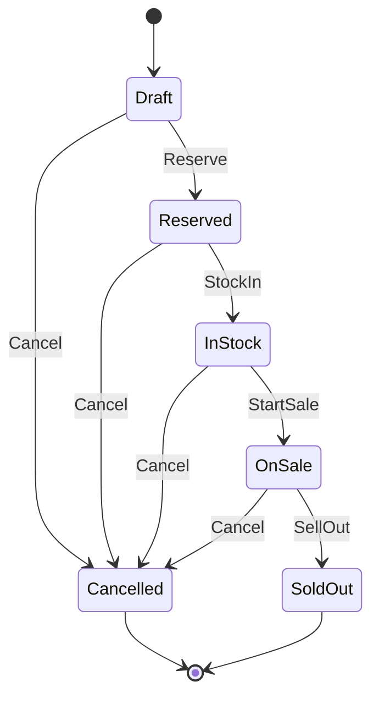

# 第43章：状態が増えたら“状態遷移”で整理（超入門）🧠🗺️

「予約中」「在庫あり」「販売中」「売り切れ」…みたいにステータスが増えてくると、つい if が増殖しがちだよね😵‍💫💦
この章では **“許可される遷移だけ通す”** って考え方で、コードもテストもスッキリさせるよ〜！🧪💖

（※バージョン系は、2026-01-18時点の公開情報に合わせて確認してます：.NET 10 の 2026/01 更新など）([Microsoft サポート][1])

---

## この章のゴール🎯✨


* ✅ ステータス（状態）とイベント（操作）を分けて考えられる
* ✅ 「できる遷移／できない遷移」を**表で管理**できる
* ✅ TDDで「遷移の仕様」をテストとして固定できる
* ✅ if地獄を“増やさない”方向へ進められる🧹✨

---

## まず超大事：状態遷移ってなに？🧩

**状態（State）**：いまのステータス（例：予約中）
**イベント（Event）**：起こしたい操作（例：入荷する）
**遷移（Transition）**：状態A + イベント → 状態B（例：予約中 + 入荷 → 在庫あり）

ポイントはこれ👇
👉 **「許可される組み合わせ」だけを通す**
👉 それ以外は **テストで“禁止”にして、例外で止める** 🚫🧪

---

## 例題：推し活グッズの状態を決めよう🎀📦

今回は、シンプルにこんな状態にするよ😊

* Draft（下書き/登録直後）
* Reserved（予約中）
* InStock（在庫あり）
* OnSale（販売中）
* SoldOut（売り切れ）
* Cancelled（キャンセル）

そしてイベント（操作）はこんな感じ✨

* Reserve（予約する）
* StockIn（入荷する）
* StartSale（販売開始）
* SellOut（売り切れにする）
* Cancel（キャンセル）

---

## 状態遷移表（これが設計図）🗂️✨

「Allowed（許可）」だけを書くのがコツだよ〜！🥰

| From（状態） | Event（操作） | To（次の状態）  |
| -------- | --------- | --------- |
| Draft    | Reserve   | Reserved  |
| Draft    | Cancel    | Cancelled |
| Reserved | StockIn   | InStock   |
| Reserved | Cancel    | Cancelled |
| InStock  | StartSale | OnSale    |
| InStock  | Cancel    | Cancelled |
| OnSale   | SellOut   | SoldOut   |
| OnSale   | Cancel    | Cancelled |



---
この表があるだけで、頭の中がスッキリする〜！🧠✨
そして **テストはこの表をそのまま写す** のが強い💪🧪

---

## TDDで作る手順（Red→Green→Refactor）🚦✨

### Step 1：まず「許可された遷移」のテストを書く🧪💕

“表の1行”を1テストにしてもいいし、**TheoryでまとめてもOK**だよ😊

```csharp
using Xunit;

public class GoodsItemStateMachineTests
{
    [Theory]
    [InlineData(GoodsStatus.Draft,    GoodsEvent.Reserve,   GoodsStatus.Reserved)]
    [InlineData(GoodsStatus.Reserved, GoodsEvent.StockIn,   GoodsStatus.InStock)]
    [InlineData(GoodsStatus.InStock,  GoodsEvent.StartSale, GoodsStatus.OnSale)]
    [InlineData(GoodsStatus.OnSale,   GoodsEvent.SellOut,   GoodsStatus.SoldOut)]
    public void 許可された遷移は_状態が変わる(GoodsStatus from, GoodsEvent ev, GoodsStatus to)
    {
        var item = new GoodsItem(from);

        item.Apply(ev);

        Assert.Equal(to, item.Status);
    }
}
```

ここで当然 Red 🔴（まだ実装ないから）になるね！

---

### Step 2：最小実装でGreenにする🟢✨

まずは “遷移表をコードにする” だけでOK🙆‍♀️

```csharp
using System;
using System.Collections.Generic;

public enum GoodsStatus
{
    Draft,
    Reserved,
    InStock,
    OnSale,
    SoldOut,
    Cancelled
}

public enum GoodsEvent
{
    Reserve,
    StockIn,
    StartSale,
    SellOut,
    Cancel
}

public sealed class InvalidStatusTransitionException : Exception
{
    public GoodsStatus From { get; }
    public GoodsEvent Event { get; }

    public InvalidStatusTransitionException(GoodsStatus from, GoodsEvent ev)
        : base($"Invalid transition: {from} --({ev})-> ???")
    {
        From = from;
        Event = ev;
    }
}

public sealed class GoodsItem
{
    public GoodsStatus Status { get; private set; }

    public GoodsItem(GoodsStatus status = GoodsStatus.Draft)
    {
        Status = status;
    }

    private static readonly IReadOnlyDictionary<GoodsStatus, IReadOnlyDictionary<GoodsEvent, GoodsStatus>> Transitions
        = new Dictionary<GoodsStatus, IReadOnlyDictionary<GoodsEvent, GoodsStatus>>
        {
            [GoodsStatus.Draft] = new Dictionary<GoodsEvent, GoodsStatus>
            {
                [GoodsEvent.Reserve] = GoodsStatus.Reserved,
                [GoodsEvent.Cancel]  = GoodsStatus.Cancelled,
            },
            [GoodsStatus.Reserved] = new Dictionary<GoodsEvent, GoodsStatus>
            {
                [GoodsEvent.StockIn] = GoodsStatus.InStock,
                [GoodsEvent.Cancel]  = GoodsStatus.Cancelled,
            },
            [GoodsStatus.InStock] = new Dictionary<GoodsEvent, GoodsStatus>
            {
                [GoodsEvent.StartSale] = GoodsStatus.OnSale,
                [GoodsEvent.Cancel]    = GoodsStatus.Cancelled,
            },
            [GoodsStatus.OnSale] = new Dictionary<GoodsEvent, GoodsStatus>
            {
                [GoodsEvent.SellOut] = GoodsStatus.SoldOut,
                [GoodsEvent.Cancel]  = GoodsStatus.Cancelled,
            },
        };

    public void Apply(GoodsEvent ev)
    {
        if (!Transitions.TryGetValue(Status, out var byEvent) ||
            !byEvent.TryGetValue(ev, out var next))
        {
            throw new InvalidStatusTransitionException(Status, ev);
        }

        Status = next;
    }
}
```

テストが Green 🟢 になったら最高〜！🎉✨

---

### Step 3：「禁止された遷移」もテストで固定する🚫🧪

ここが超大事！！！
状態遷移って、**“できないこと”を決める**のが安全性の本体だよ😊

```csharp
using Xunit;

public class GoodsItemInvalidTransitionTests
{
    [Theory]
    [InlineData(GoodsStatus.Draft,   GoodsEvent.StartSale)]
    [InlineData(GoodsStatus.OnSale,  GoodsEvent.StockIn)]
    [InlineData(GoodsStatus.SoldOut, GoodsEvent.StartSale)]
    public void 禁止された遷移は_例外になる(GoodsStatus from, GoodsEvent ev)
    {
        var item = new GoodsItem(from);

        Assert.Throws<InvalidStatusTransitionException>(() => item.Apply(ev));
    }
}
```

これで「うっかり変な状態に行く」が防げるよ〜🛡️✨

---

## ここが“if地獄回避”ポイント👀🚨

状態が増えたとき、ありがちな事故👇

* 「販売中なのに入荷できた😇」
* 「売り切れなのに販売開始できた😇」
* 「キャンセル後に復活しちゃった😇」

状態遷移表 + テストがあると、こういう事故を **テストが即止めてくれる**🧪🚫✨
しかも、仕様変更が来ても「表を直す→テストを直す→実装を直す」の順で落ち着いてできるよ😊💕

---

## もう一段レベルアップ：ガード条件（条件付き遷移）🧷✨

たとえば「在庫が0なら販売開始できない」みたいなルールね！

やり方はシンプル👇

1. テストを書く（在庫0なら例外）🧪
2. Applyの中でチェックする🛡️

（この章ではまず“遷移表”を安定させるのが主役だから、ガードは「追加の一手」くらいでOKだよ😊）

---

## AIの使いどころ🤖💖（速くするけど、主導権はテスト！）

AIにはこう頼むのが気持ちいい✨

* 「この状態一覧とイベント一覧で、状態遷移表のたたき台を作って」
* 「この遷移表から、xUnitのTheory（InlineData）を作って」
* 「禁止すべき遷移のパターンも追加で提案して」

ちなみに、Visual Studio 側でも Copilot を使ったテスト作成支援が強化されてる流れがあるよ〜🧑‍💻✨([Microsoft Learn][2])
（でも採用するかは、いつも “テストが仕様として正しいか” で決めよ✅）

---

## 章末ミニ課題🎓🎀

### 課題1：状態を1つ足してみよう➕✨

例：Paused（販売一時停止）を追加してみて、遷移表を拡張！

* OnSale → Pause → Paused
* Paused → StartSale → OnSale

✅ 先にテストを追加してから実装してね🧪🚦

### 課題2：禁止遷移を増やしてみよう🚫

「PausedなのにSellOutできちゃう」みたいな事故パターンを、テストで止める！

### 課題3：例外メッセージをわかりやすく📝✨

運用でログを見るときに助かるやつ！
（例：from / event を必ず入れる）

---

## よくあるつまずき😵‍💫💦（先に潰そ！）

* ❌ 状態だけ増えてイベントが曖昧（“何が起きたか”が不明）
  → ✅ イベント名は「操作」を表す動詞にする（Reserve/StockIn みたいに）
* ❌ switch が増えて読むのが辛い
  → ✅ 遷移表を Dictionary 化して「データで管理」へ
* ❌ 禁止遷移をテストしてない
  → ✅ “できないこと”のテストこそ価値が高い🛡️🧪

---

## まとめ🎁✨

この章の結論はこれだよ〜🥰

* 状態が増えたら **状態 + イベント = 遷移** で整理🗺️
* **遷移表を仕様書にして、テストで固定**🧪📘
* “禁止遷移”を止めると、バグが激減する🚫✨
* 実装はシンプルでOK、育ってきたらガード条件も追加🧷

---

必要なら次は、**この状態遷移を「推し活グッズ管理②（集計・検索）」の仕様追加に接続**して、状態が絡む検索条件や集計のテストも一緒に育てる形で進められるよ〜🎀📊✨

[1]: https://support.microsoft.com/en-us/topic/-net-10-0-update-january-13-2026-64f1e2a4-3eb6-499e-b067-e55852885ad5 ".NET 10.0 Update - January 13, 2026 - Microsoft Support"
[2]: https://learn.microsoft.com/en-us/visualstudio/releases/2026/release-notes-insiders "Visual Studio Insiders Release Notes | Microsoft Learn"
