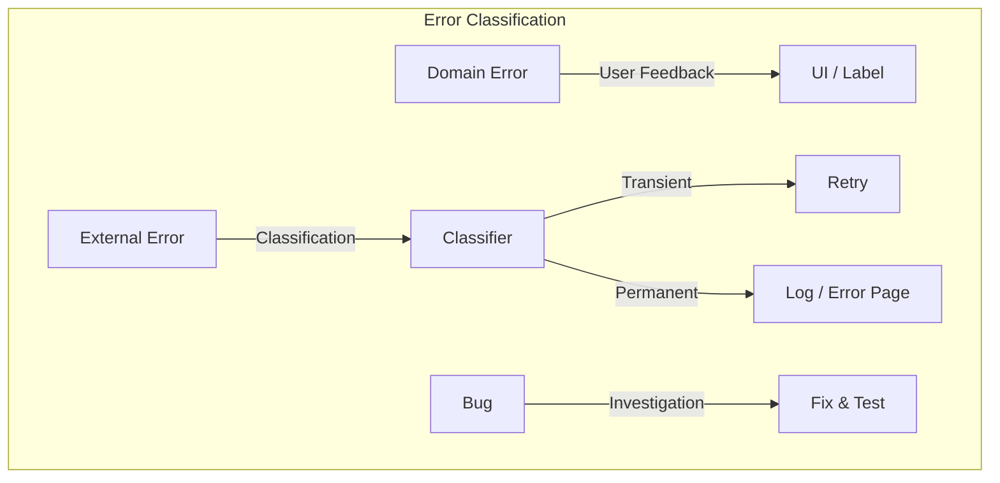

# 第44章：例外の設計（ドメインエラーと外部エラーを分ける）🧯

今回は「エラーが暴れないように、きれいに飼いならす章」だよ〜！🐶💛
TDD的には **“失敗も仕様として固定する”** のがポイントです🧪✨

（※この記事は .NET 10 / C# 14 の前提で組み立ててるよ。最新版情報も反映済み：.NET 10 の最新は 10.0.2（2026-01-13）だよ🆕 ([Microsoft][1]) / C# 14 は .NET 10 対応だよ ([Microsoft Learn][2])）

---

## 1. 今日のゴール🎯✨


できるようになってほしいことはこの3つ！😊

1. **ドメインエラー**（仕様の範囲内の失敗）と
   **外部エラー**（DB/通信/ファイルなど外の都合）を、ちゃんと分けて扱える🧠✨

2. 「何でも `Exception`」を卒業して、**失敗の種類がコードから伝わる**ようにできる🎓💡
   （.NETの例外設計の基本も押さえるよ ([Microsoft Learn][3])）

3. TDDで **“失敗の振る舞い”をテストで固定**して、後から仕様が崩れないようにできる🧪🧱

---

## 2. まず結論：エラーは3つに分けるとラク😆🧩


エラーってね、ざっくりこう分けると事故が減るの👇

### ✅ A) ドメインエラー（仕様どおりの失敗）🧾

例：

* 「価格がマイナス」💸❌
* 「在庫が足りない」📦❌
* 「同じIDは登録できない」🪪❌

👉 **ユーザーに説明できる失敗**（＝“想定内”）
👉 テストで「この条件ならこう失敗する」を固定しやすい✨

### ✅ B) 外部エラー（外が壊れた/不安定）🌩️

例：

* DBが落ちた🛢️💥
* APIがタイムアウトした🌐⌛
* ファイルが読めない📄🚫

👉 **ユーザーのせいじゃない失敗**
👉 多くは「再試行で直る可能性」がある（＝一時的）
👉 こっちは **ログ・監視**が超大事🔥

### ✅ C) バグ（想定外）🪲💥

例：

* `null` を想定してなくて落ちた
* 状態遷移の抜けで矛盾した
* `switch` の網羅漏れ

👉 これは「仕様の失敗」じゃなくて「実装の失敗」
👉 基本は直す！テスト追加して再発防止！🧪🧯



---

## 3. “分けない”と何が起きる？😇（あるある地獄）


例えば、全部こうしてると…

* `throw new Exception("エラーです")` 🙃
* UIは「エラー」しか出せない
* ログも「エラー」しか残らない
* どれがユーザー入力ミスで、どれがDB死んだのか、判別不能😵‍💫

だから今回は「分ける」💪✨

---

## 4. 方針：ドメインは“型”で守って、外部は“包んで”届ける🎁✨


ここでは初心者にも扱いやすい形として👇を採用するよ😊

* ドメインエラー：**Result（戻り値）で返す**（例外にしない）📦
* 外部エラー：**例外をキャッチして、外部エラーに変換**（ログも）🧯
* バグ：基本そのまま落としてOK（直す対象）🪲

「えっ、例外の章なのに Result？」って思った？😆
でもね、この章の題名は **“例外の設計”＝例外を乱用しない設計** って意味でもあるの💡
.NETも「例外は適切に扱う/避けられる設計にする」って方針があるよ ([Microsoft Learn][3])

---

## 5. ハンズオン：推し活グッズ管理（失敗も仕様にする）🎀📦🧪

今回の題材はこう！

* ユースケース：**グッズを登録する**（名前・価格）
* ドメインルール：

  * 名前は必須
  * 価格は 1〜100,000 円
* 外部：

  * 保存先（Repository）が失敗することがある

---

## 6. まずテストを書く（Red）🚦🔴

### 6.1 Resultとエラー型（最小セット）を用意するよ📦✨


```csharp
public sealed record AppError(
    string Code,
    string Message,
    bool IsTransient = false
);

public readonly record struct Result<T>(
    bool IsSuccess,
    T? Value,
    AppError? Error
)
{
    public static Result<T> Ok(T value) => new(true, value, null);
    public static Result<T> Fail(AppError error) => new(false, default, error);
}
```

> ✅ 「Code」があると運用がめっちゃ楽になるよ（ログ検索できる🔍✨）

---

### 6.2 ドメインエラー定義（“仕様の失敗”カタログ）📚🧾

```csharp
public static class DomainErrors
{
    public static readonly AppError NameRequired =
        new("DOM-GOODS-001", "名前は必須だよ〜！📝💦");

    public static readonly AppError PriceOutOfRange =
        new("DOM-GOODS-002", "価格は 1〜100,000 円にしてね💸✨");
}
```

---

### 6.3 外部エラー定義（“外が死んだ”カタログ）🌩️🧯

```csharp
public static class ExternalErrors
{
    public static readonly AppError PersistenceUnavailable =
        new("EXT-STORE-001", "今ちょっと保存が不安定みたい🙏💦 もう一回試してね", IsTransient: true);
}
```

---

### 6.4 テスト：ドメインエラーは Result で返る🧪✅


```csharp
using Xunit;

public class RegisterGoodsTests
{
    [Fact]
    public void 名前が空なら_ドメインエラー()
    {
        var repo = new InMemoryGoodsRepository();
        var useCase = new RegisterGoodsUseCase(repo);

        var result = useCase.Execute(name: "", price: 500);

        Assert.False(result.IsSuccess);
        Assert.Equal(DomainErrors.NameRequired.Code, result.Error!.Code);
    }

    [Theory]
    [InlineData(0)]
    [InlineData(-1)]
    [InlineData(100_001)]
    public void 価格が範囲外なら_ドメインエラー(int price)
    {
        var repo = new InMemoryGoodsRepository();
        var useCase = new RegisterGoodsUseCase(repo);

        var result = useCase.Execute(name: "うちわ", price: price);

        Assert.False(result.IsSuccess);
        Assert.Equal(DomainErrors.PriceOutOfRange.Code, result.Error!.Code);
    }
}
```

---

### 6.5 テスト：外部例外は握りつぶさず“外部エラーに変換”🧪🧯


```csharp
[Fact]
public void 保存が失敗したら_外部エラーに変換する()
{
    var repo = new ThrowingGoodsRepository(); // Saveで例外投げるやつ
    var useCase = new RegisterGoodsUseCase(repo);

    var result = useCase.Execute(name: "ペンライト", price: 3000);

    Assert.False(result.IsSuccess);
    Assert.Equal(ExternalErrors.PersistenceUnavailable.Code, result.Error!.Code);
    Assert.True(result.Error!.IsTransient);
}
```

---

## 7. 実装（Green）🚦🟢

```csharp
public interface IGoodsRepository
{
    void Save(Goods goods);
}

public sealed record Goods(string Name, int Price);

public sealed class RegisterGoodsUseCase
{
    private readonly IGoodsRepository _repo;

    public RegisterGoodsUseCase(IGoodsRepository repo) => _repo = repo;

    public Result<Goods> Execute(string name, int price)
    {
        // ✅ ドメインエラー（想定内）
        if (string.IsNullOrWhiteSpace(name))
            return Result<Goods>.Fail(DomainErrors.NameRequired);

        if (price is < 1 or > 100_000)
            return Result<Goods>.Fail(DomainErrors.PriceOutOfRange);

        var goods = new Goods(name.Trim(), price);

        // ✅ 外部エラー（外の都合）
        try
        {
            _repo.Save(goods);
            return Result<Goods>.Ok(goods);
        }
        catch (Exception ex)
        {
            // ここで ex をログに残すのが大事🔥（後で章50とかで運用に繋がる）
            // 例外は握りつぶさず「外部エラー」へ変換して返す
            return Result<Goods>.Fail(ExternalErrors.PersistenceUnavailable);
        }
    }
}
```

> 🔥 ここが「分けた」ポイント！
>
> * ルール違反：`DomainErrors`
> * 保存失敗：`ExternalErrors`（例外を変換）
> * バグ：基本テスト追加して直す対象🪲

---

## 8. リファクタ（Refactor）🧹✨：例外を“設計”するコツ

### コツ1：標準例外を優先する（APIの使い方ミス用）📌

「呼び出し側が間違ってる」系は `ArgumentException` 系が強い💪
.NETには「標準例外の使い分けガイド」もあるよ ([Microsoft Learn][4])

> 例：public API で `null` がダメなら `ArgumentNullException`
> でも今回みたいに「ユーザー入力として普通に起こる失敗」は Result のほうが扱いやすいことが多いよ😊

### コツ2：カスタム例外を作るなら “型の作法” を守る🧯

独自例外を作るなら、**基本のコンストラクタ3つ**＋ inner exception ってのが定番だよ ([Microsoft Learn][3])

（今回のハンズオンは Result に寄せたけど、外部境界でラップ例外を作る場面もあるよ〜）

---

## 9. 発展：API/Blazorに繋げるなら「ProblemDetails」で整える🧩🌐


もし将来 Web API にするなら、**例外→ProblemDetails** に統一すると超スッキリするよ✨
ASP.NET Core 10 でもエラーハンドリングと ProblemDetails のガイドがあるよ ([Microsoft Learn][5])

イメージとしては👇

* ドメインエラー → 400（Bad Request）＋（Code/Message）
* 外部エラー（IsTransient=true） → 503（Service Unavailable）＋「あとで再試行してね」
* バグ → 500（Internal Server Error）＋詳細はログへ（外に漏らさない）

---

## 10. AIの使いどころ（この章はめっちゃ相性いい）🤖✨

コピペで使えるやつ置いとくね！💛

* 「この仕様の失敗を **ドメインエラー / 外部エラー / バグ** に分類して、理由も書いて」
* 「DomainErrors の **Code設計案**（命名規則）を3案出して」
* 「このテストが落ちた。**原因候補→確認手順**を順番に出して」
* 「外部エラーのとき、ユーザー表示メッセージを **優しい日本語**で3案ちょうだい🥺」

---

## 11. まとめチェックリスト✅🧾✨（これ守るだけで強くなる）

* [ ] ルール違反（想定内）を **外部例外と混ぜてない**
* [ ] 外部例外はキャッチして **外部エラーに変換**できてる
* [ ] **Code** があって、運用で追える
* [ ] 例外を握りつぶしてない（最低でもログ/inner exceptionの方針がある）([Microsoft Learn][3])
* [ ] 「何でも Exception」卒業できた🎓✨

---

## 12. 宿題（やると一気に身につくよ💪🎀）

1. `DuplicateName`（同名登録不可）を **ドメインエラー**で追加してテストを書く🧪
2. `ThrowingGoodsRepository` を「最初の1回だけ失敗」にして、
   「IsTransient=true なら再試行したくなるよね？」を考えてみる（次の章の布石）🌩️🔁
3. 失敗時のメッセージを **UI向け（優しい）** と **ログ向け（詳しい）** に分ける案を作る📝✨

---

必要ならこの第44章を、あなたの教材フォーマットに合わせて👇も一気に作れるよ😊💕

* 講義台本（導入トーク／板書／演習手順／よくある詰まりポイント）📘✨
* “推し活グッズ管理” の章またぎ課題として、次章へ繋がるコミット単位設計🎀🔖

[1]: https://dotnet.microsoft.com/en-US/download/dotnet/10.0?utm_source=chatgpt.com "Download .NET 10.0 (Linux, macOS, and Windows) | .NET"
[2]: https://learn.microsoft.com/en-us/dotnet/csharp/whats-new/csharp-14?utm_source=chatgpt.com "What's new in C# 14"
[3]: https://learn.microsoft.com/en-us/dotnet/standard/exceptions/best-practices-for-exceptions?utm_source=chatgpt.com "Best practices for exceptions - .NET"
[4]: https://learn.microsoft.com/en-us/dotnet/standard/design-guidelines/using-standard-exception-types?utm_source=chatgpt.com "Using Standard Exception Types - Framework Design ..."
[5]: https://learn.microsoft.com/en-us/aspnet/core/fundamentals/error-handling-api?view=aspnetcore-10.0&utm_source=chatgpt.com "Handle errors in ASP.NET Core APIs"
