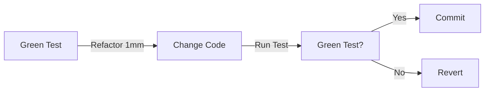

# 第45章：リファクタの型（“安全な変形”リストを持つ）🛠️

この章はね、**「怖くないリファクタ」**を体に覚えさせる回だよ〜！😆💪
TDDだと「Refactor」って毎回出てくるけど、実際はここでつまずきやすいの🥺
だから今日は **“型（カタ）”＝安全に変形する手順セット** をいっぱい持って帰ろうね🧰✨

---

## 1) この章のゴール🎯✨


* ✅ **リファクタ＝外から見える動きは変えずに、内部を整える**って説明できる
* ✅ **安全な型（リネーム／抽出／インライン／移動…）**を、迷わず使える
* ✅ **「小さく変える→テスト→小さく変える」**を3回、手で回せる🧪🔁

※リファクタの定義としては「観測できる振る舞いを変えずに、内部構造を良くする」って説明が定番だよ📘✨ ([martinfowler.com][1])

---

## 2) リファクタで一番たいせつなこと🚦🧡


### ✅ 合言葉はこれ！

**「1回1ミリ」**👣✨
大改造は事故る🥺💥 だから、

* 変更は小さく✂️
* すぐテスト回す🧪
* すぐ戻せる状態を保つ↩️

この3点セットでいこうね😊✨



---

## 3) “安全運転”チェックリスト🧷✅（これだけ守ればだいぶ勝てる！）

1. **まずテストが全部Greenか確認**🟢
2. **IDEのリファクタ機能を優先**（手作業でやるほど事故る）🛠️
3. **1回の変更は「説明できる1つ」だけ**（例：リネームだけ）🧠
4. **変更 → テスト → できればコミット**🔁
5. **テストが落ちたら「直す」より先に「戻す」も選択肢**↩️✨

---

## 4) リファクタの型（初心者向け・超実戦セット）🧰✨

ここからが本編〜！
“型”は **「よくある安全な変形」**のことだよ😊
（ショートカットも載せるね！）

### 4.1 リネーム（Rename）📝✨


**いちばんコスパ最強**。名前が良くなるだけで理解が爆上がりする！😍

* 🔧 ショートカット：`Ctrl+R, Ctrl+R` ([Microsoft Learn][2])
* 🧠 目的：意図が伝わる名前にする（“何をするか”が読める）
* ⚠️ 注意：**手で置換しない**（参照漏れが起きる）🙅‍♀️

---

### 4.2 メソッド抽出（Extract Method）✂️➡️🧩


長い処理を小分けにして読みやすくする王道✨

* 🔧 ショートカット：`Ctrl+R, Ctrl+M` ([Microsoft Learn][3])
* 🧠 目的：**1メソッド1責務**に近づける
* ✅ コツ：抽出したメソッド名は **動詞＋目的語**（例：`ApplyMemberDiscount`）

---

### 4.3 インライン化（Inline Method）🔁✨


「分けたけど、逆に読みにくい」ってときの逆操作だよ😊

* 🔧 やり方：`Ctrl+.`（クイックアクション）→ Inline Method ([Microsoft Learn][4])
* 🧠 目的：無意味な薄いメソッドを消して、流れをスッキリさせる
* ⚠️ 注意：インライン後に**名前で意味が失われた**ら、別の整理（抽出）へ

---

### 4.4 一時変数のインライン（Inline temporary variable）🧹

「変数のせいで読みにくい」時に消すやつ✨

* 🔧 やり方：クイックアクション（Inline temporary variable） ([Microsoft Learn][5])
* 🧠 目的：余計な変数を減らして、式の意図をハッキリ
* ✅ ただし：長い式になったら、逆に **Extract Variable** も検討😊

---

### 4.5 インターフェース抽出（Extract Interface）🎭🔌


「差し替えたい」「テストダブルにしたい」時の定番✨

* 🔧 ショートカット：`Ctrl+R, Ctrl+I` ([Microsoft Learn][6])
* 🧠 目的：依存の境界を作って、テストしやすくする
* ✅ コツ：まずは **必要なメンバーだけ**に絞る（盛りすぎない）🍰🙅‍♀️

---

### 4.6 型をファイルへ移動（Move type to matching file）📦➡️📄

「1ファイルにいろいろ居すぎ！」を直すやつ✨

* 🔧 やり方：`Ctrl+.` → “Move type to TypeName.cs” ([Microsoft Learn][7])
* 🧠 目的：ファイル構成を自然にする（探しやすい！）🔍

---

### 4.7 名前空間へ移動（Move to namespace）🗂️

散らかった置き場所を整える✨

* 🔧 やり方：`Ctrl+.` → Move to namespace ([Microsoft Learn][8])
* 🧠 目的：**層／用途**ごとに置き場を揃える

---

### 4.8 VS Code側の“リファクタの入り口”🧩

VS Codeも「リファクタ専用メニュー」で絞り込みできるよ✨

* 🔧 `Ctrl+Shift+R` で Refactor を開ける ([Visual Studio Code][9])
* 「外から見える動作は変えずに内部を改善する」って説明も、VS Code公式に書いてあるよ📘 ([Visual Studio Code][9])

---

## 5) ハンズオン：テストを回しながら “3回リファクタ” やってみよ🧪🔁💕

題材はミニでいくね😊（これ大事！）
**振る舞いは変えずに、読みやすくする**だけやるよ✨

### 5.1 まずは動く仕様（テスト）を用意🧪

```csharp
using Xunit;

public class PriceCalculatorTests
{
    [Fact]
    public void Member_and_coupon_are_applied_in_order_and_floor_is_zero()
    {
        var sut = new PriceCalculator();

        // price=1000, qty=1 => 1000
        // member 10% off => 900
        // coupon -500 => 400
        Assert.Equal(400, sut.CalcTotal(1000, 1, isMember: true, useCoupon: true));
    }

    [Fact]
    public void Coupon_can_make_total_negative_but_result_is_zero()
    {
        var sut = new PriceCalculator();

        Assert.Equal(0, sut.CalcTotal(400, 1, isMember: false, useCoupon: true));
    }
}
```

### 5.2 現状の実装（ちょい読みにくい版）😵‍💫

```csharp
public class PriceCalculator
{
    public int CalcTotal(int price, int qty, bool isMember, bool useCoupon)
    {
        int total = price * qty;

        if (isMember)
        {
            total = (int)(total * 0.9);
        }

        if (useCoupon)
        {
            total -= 500;
        }

        if (total < 0)
        {
            total = 0;
        }

        return total;
    }
}
```

---

## 5.3 リファクタ①：リネーム（意味が伝わるように）📝✨

**やること：名前だけ整える**（超安全！）

* `CalcTotal` → `CalculateTotalYen`
* `price` → `unitPriceYen`
* `qty` → `quantity`

👉 Visual Studioなら `Ctrl+R, Ctrl+R` で安全に一括リネームできるよ ([Microsoft Learn][2])

---

## 5.4 リファクタ②：Extract Method（処理の意図で分ける）✂️🧩

**やること：割引・クーポン・下限0 を“意図”で分割**
👉 `Ctrl+R, Ctrl+M` で抽出ができるよ ([Microsoft Learn][3])

---

## 5.5 リファクタ③：マジックナンバー排除（500に名前を付ける）🏷️✨


**やること：`500` を `CouponDiscountYen` にする**
これだけで「500って何！？」が消える😍

---

### 5.6 3回リファクタ後の完成形（テストはそのままGreenのまま！）🟢🎉

```csharp
public class PriceCalculator
{
    private const int CouponDiscountYen = 500;
    private const decimal MemberDiscountRate = 0.9m;

    public int CalculateTotalYen(int unitPriceYen, int quantity, bool isMember, bool useCoupon)
    {
        var total = unitPriceYen * quantity;

        total = ApplyMemberDiscountIfNeeded(total, isMember);
        total = ApplyCouponIfNeeded(total, useCoupon);
        total = FloorToZero(total);

        return total;
    }

    // 互換のために残す（既存呼び出しを壊さない作戦✨）
    public int CalcTotal(int price, int qty, bool isMember, bool useCoupon)
        => CalculateTotalYen(price, qty, isMember, useCoupon);

    private static int ApplyMemberDiscountIfNeeded(int totalYen, bool isMember)
        => isMember ? (int)(totalYen * MemberDiscountRate) : totalYen;

    private static int ApplyCouponIfNeeded(int totalYen, bool useCoupon)
        => useCoupon ? totalYen - CouponDiscountYen : totalYen;

    private static int FloorToZero(int totalYen)
        => totalYen < 0 ? 0 : totalYen;
}
```

---

## 6) AIの使いどころ🤖✨（丸投げ禁止だけど、めっちゃ便利！）

### ✅ おすすめプロンプト（安全運転版）

* 「このコードを**振る舞いを変えずに**読みやすくしたい。**リネーム／抽出／定数化**の候補を“最小ステップ”で3つ出して」
* 「次の1手だけ提案して。**1コミットで終わるサイズ**にして」
* 「この変更で**挙動が変わる可能性がある点**を先に指摘して」

AIは“案出し”が得意だけど、採用の合否は **テスト**が決めるよ🧪✅

---

## 7) よくある事故パターン😱💥（回避しよ！）


* ❌ いきなり大改造（差分が大きすぎてレビュー不能）
* ❌ テストが赤いのにリファクタ開始（原因が迷子）
* ❌ 置換でリネーム（参照漏れ）
* ❌ リファクタと仕様変更を混ぜる（“何で壊れた？”になる）

---

## 8) 提出物（コミット単位）📦✨

おすすめはこの3コミット構成💡

1. `refactor: rename to clarify intent` 📝
2. `refactor: extract methods for discount/coupon/floor` ✂️
3. `refactor: replace magic numbers with named constants` 🏷️

---

## 9) 小テスト（5分）⏱️🧠✨

1. リファクタの定義を一言で言うと？（ヒント：外から見える動き…） ([martinfowler.com][1])
2. “安全運転”で一番強い味方は何？🧪
3. `500` みたいな数字に名前を付けるのは何のため？
4. Extract Method をするとき、分ける基準は「処理の長さ」より何？
5. リネームは手作業の置換より、IDE機能が良い理由は？ ([Microsoft Learn][2])

---

## 10) 最新メモ（ちょこっと）🗞️✨

いまの .NET 10 の最新版パッチは **10.0.2（2026/01/13）**って扱いになってるよ（更新日が明記されてる）🧩 ([Microsoft][10])
あと C# 14 の新機能は **.NET 10 SDK や Visual Studio 2026**で試せる、ってMicrosoftが書いてるよ〜😊 ([Microsoft Learn][11])

---

次の第46章は、仕様が増えたときに **“テストの増やし方（パラメータ化／組合せ）”**で守る回だよ📊✨
この45章の「安全な変形」を持ってると、46章の改造がめちゃ楽になるよ〜😆🧪

[1]: https://martinfowler.com/bliki/DefinitionOfRefactoring.html?utm_source=chatgpt.com "Definition Of Refactoring"
[2]: https://learn.microsoft.com/en-us/visualstudio/ide/reference/rename?view=visualstudio&utm_source=chatgpt.com "Refactor rename - Visual Studio (Windows)"
[3]: https://learn.microsoft.com/en-us/visualstudio/ide/reference/extract-method?view=visualstudio&utm_source=chatgpt.com "Extract a method refactoring - Visual Studio"
[4]: https://learn.microsoft.com/ja-jp/visualstudio/ide/reference/inline-method?view=visualstudio&utm_source=chatgpt.com "メソッドのインライン化 - Visual Studio (Windows)"
[5]: https://learn.microsoft.com/en-us/visualstudio/ide/reference/inline-temporary-variable?view=vs-2022&utm_source=chatgpt.com "Inline a temporary variable refactoring - Visual Studio"
[6]: https://learn.microsoft.com/en-us/visualstudio/ide/reference/extract-interface?view=visualstudio&utm_source=chatgpt.com "Extract an interface refactoring - Visual Studio (Windows)"
[7]: https://learn.microsoft.com/en-us/visualstudio/ide/reference/move-type-to-matching-file?view=visualstudio&utm_source=chatgpt.com "Move type to matching file refactoring - Visual Studio"
[8]: https://learn.microsoft.com/en-us/visualstudio/ide/reference/move-type-to-namespace?view=visualstudio&utm_source=chatgpt.com "Move type to namespace - Visual Studio (Windows)"
[9]: https://code.visualstudio.com/docs/editing/refactoring?utm_source=chatgpt.com "Refactoring"
[10]: https://dotnet.microsoft.com/en-US/download/dotnet/10.0?utm_source=chatgpt.com "Download .NET 10.0 (Linux, macOS, and Windows) | .NET"
[11]: https://learn.microsoft.com/en-us/dotnet/csharp/whats-new/csharp-14?utm_source=chatgpt.com "What's new in C# 14"
