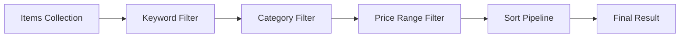

# 第46章：推し活グッズ管理②（集計・並び替え・条件検索）📊✨

この章は「仕様が増えても、テストで安心して守れるようになる」ための山場だよ〜！🧪💪
**集計**（合計・カテゴリ別）、**並び替え**（価格順・日付順）、**条件検索**（キーワード＋カテゴリ＋価格帯…）を、**TDDで増築**していくよ😊✨

ちなみに本日時点の最新版だと、.NET 10 の最新パッチは **10.0.2（2026-01-13）**、xUnit v3 は **3.2.2** だよ〜📌 ([Microsoft][1])

---

## この章のゴール🎯✨


最後にこうなってたら勝ち！🎉

* ✅ **集計**できる

  * 合計数量 / 合計金額
  * カテゴリ別数量（CD何個、アクスタ何個…）
* ✅ **並び替え**できる

  * 価格順、購入日順、名前順…（昇順/降順）
* ✅ **条件検索**できる

  * キーワード（部分一致）
  * カテゴリ
  * 価格帯（Min/Max）
  * そして… **組み合わせ（AND）**が壊れない
* ✅ テストが読み物みたいに分かりやすい📘✨（＝将来の自分が助かる）



---

## 今日の作戦（TDDの進め方）🚦🧠

この章は「機能が増える」から、**1回で全部やろうとすると爆発**しがち😇💥
なので、順番はこれがおすすめ！

1. 集計（合計）➡️ 小さいテストから🧾
2. 集計（カテゴリ別）➡️ GroupByで広げる📦
3. 並び替え ➡️ Sortキーを1つずつ追加🔃
4. 条件検索 ➡️ フィルタを1種類ずつ追加🔍
5. 組み合わせ ➡️ **パラメータ化テスト**で守る🛡️✨

---

## まずは題材の形をそろえる（最低限）🧸

ここでは「UIやDBは出さない」で、**純粋ロジックだけ**を育てるよ🧪
（純粋ロジック＝速い＝何度でも回せる＝TDD向き⚡️）

### モデル（例）📦

```csharp
public sealed record GoodsItem(
    Guid Id,
    string Name,
    string Category,
    decimal UnitPrice,
    int Quantity,
    DateOnly PurchasedOn
);
```

テスト用のサンプル工場も作っちゃうと超楽😊✨

```csharp
public static class GoodsItemSamples
{
    public static GoodsItem Item(
        string name,
        string category,
        decimal unitPrice,
        int quantity = 1,
        DateOnly? purchasedOn = null)
        => new(
            Id: Guid.NewGuid(),
            Name: name,
            Category: category,
            UnitPrice: unitPrice,
            Quantity: quantity,
            PurchasedOn: purchasedOn ?? new DateOnly(2026, 1, 1)
        );

    public static IReadOnlyList<GoodsItem> Mixed() => new List<GoodsItem>
    {
        Item("アクスタA", "アクスタ", 1800m, quantity: 2, purchasedOn: new(2026, 1, 3)),
        Item("CDシングル", "CD", 1200m, quantity: 1, purchasedOn: new(2026, 1, 2)),
        Item("ペンライト", "ライブ", 3500m, quantity: 1, purchasedOn: new(2026, 1, 5)),
        Item("アクスタB", "アクスタ", 2000m, quantity: 1, purchasedOn: new(2026, 1, 4)),
        Item("トートバッグ", "ライブ", 2800m, quantity: 1, purchasedOn: new(2026, 1, 1)),
    };
}
```

---

## ステップ1：集計（合計数量・合計金額）🧾✨

### 1-1. まずテスト（Red）🔴

```csharp
using Xunit;

public class GoodsSummaryTests
{
    [Fact]
    public void TotalQuantity_and_TotalSpend_are_calculated()
    {
        var items = new[]
        {
            GoodsItemSamples.Item("アクスタA", "アクスタ", 1800m, quantity: 2),
            GoodsItemSamples.Item("CDシングル", "CD", 1200m, quantity: 1),
        };

        var summary = GoodsSummary.From(items);

        Assert.Equal(3, summary.TotalQuantity);
        Assert.Equal(1800m * 2 + 1200m * 1, summary.TotalSpend);
    }
}
```

### 1-2. 最小実装（Green）🟢

```csharp
public sealed record GoodsSummary(
    int TotalQuantity,
    decimal TotalSpend,
    IReadOnlyDictionary<string, int> QuantityByCategory
)
{
    public static GoodsSummary From(IEnumerable<GoodsItem> items)
    {
        var list = items.ToList();

        var totalQuantity = list.Sum(x => x.Quantity);
        var totalSpend = list.Sum(x => x.UnitPrice * x.Quantity);

        return new GoodsSummary(
            TotalQuantity: totalQuantity,
            TotalSpend: totalSpend,
            QuantityByCategory: new Dictionary<string, int>()
        );
    }
}
```

まだカテゴリ別は空でOK！まず合計を通すのが大事😊👌

---

## ステップ2：集計（カテゴリ別）📦✨

### 2-1. テスト追加（Red）🔴

```csharp
[Fact]
public void Quantity_is_grouped_by_category()
{
    var items = new[]
    {
        GoodsItemSamples.Item("アクスタA", "アクスタ", 1800m, quantity: 2),
        GoodsItemSamples.Item("アクスタB", "アクスタ", 2000m, quantity: 1),
        GoodsItemSamples.Item("CDシングル", "CD", 1200m, quantity: 1),
    };

    var summary = GoodsSummary.From(items);

    Assert.Equal(3, summary.QuantityByCategory["アクスタ"]);
    Assert.Equal(1, summary.QuantityByCategory["CD"]);
}
```

### 2-2. 実装（Green）🟢

```csharp
public static GoodsSummary From(IEnumerable<GoodsItem> items)
{
    var list = items.ToList();

    var totalQuantity = list.Sum(x => x.Quantity);
    var totalSpend = list.Sum(x => x.UnitPrice * x.Quantity);

    var byCategory = list
        .GroupBy(x => x.Category)
        .ToDictionary(
            g => g.Key,
            g => g.Sum(x => x.Quantity),
            StringComparer.OrdinalIgnoreCase
        );

    return new GoodsSummary(totalQuantity, totalSpend, byCategory);
}
```

ポイント：`StringComparer.OrdinalIgnoreCase` を入れておくと、将来ちょっと強い💪✨

---

## ステップ3：並び替え（Sort）🔃✨

### 3-1. まず「並び替え指定」を型にする🧷

```csharp
public enum GoodsSortKey { None, PurchasedOn, Name, UnitPrice, Quantity }
public enum SortDirection { Asc, Desc }

public sealed record GoodsSort(GoodsSortKey Key, SortDirection Direction)
{
    public static GoodsSort None => new(GoodsSortKey.None, SortDirection.Asc);
}

public sealed record GoodsQuery(
    string? Keyword = null,
    string? Category = null,
    decimal? MinUnitPrice = null,
    decimal? MaxUnitPrice = null,
    GoodsSort? Sort = null
);
```

### 3-2. テスト（価格の昇順）🔴

```csharp
public class GoodsSortTests
{
    [Fact]
    public void Sorts_by_unit_price_ascending()
    {
        var items = new[]
        {
            GoodsItemSamples.Item("高い", "CD", 3200m, purchasedOn: new(2026, 1, 2)),
            GoodsItemSamples.Item("安い", "アクスタ", 1800m, purchasedOn: new(2026, 1, 3)),
        };

        var query = new GoodsQuery(Sort: new GoodsSort(GoodsSortKey.UnitPrice, SortDirection.Asc));

        var result = GoodsSearch.Run(items, query).Select(x => x.Name).ToArray();

        Assert.Equal(new[] { "安い", "高い" }, result);
    }
}
```

### 3-3. 実装（Green）🟢

```csharp
public static class GoodsSearch
{
    public static IEnumerable<GoodsItem> Run(IEnumerable<GoodsItem> items, GoodsQuery query)
    {
        var q = items;

        // ここではまだフィルタ無しでOK（あとで足す）
        q = ApplySort(q, query.Sort ?? GoodsSort.None);

        return q;
    }

    private static IEnumerable<GoodsItem> ApplySort(IEnumerable<GoodsItem> items, GoodsSort sort)
        => (sort.Key, sort.Direction) switch
        {
            (GoodsSortKey.UnitPrice, SortDirection.Asc) => items.OrderBy(x => x.UnitPrice),
            (GoodsSortKey.UnitPrice, SortDirection.Desc) => items.OrderByDescending(x => x.UnitPrice),

            _ => items
        };
}
```

ここまでで「並び替えの骨格」ができたよ〜😊✨
次は購入日や名前も **テスト→switchに1行追加** で増やせる👍

---

## ステップ4：条件検索（フィルタ）🔍✨

### 4-1. キーワード検索（部分一致）から📝

#### テスト（Red）🔴

```csharp
public class GoodsFilterTests
{
    [Fact]
    public void Filters_by_keyword_case_insensitive()
    {
        var items = GoodsItemSamples.Mixed();

        var query = new GoodsQuery(Keyword: "アクスタ");

        var result = GoodsSearch.Run(items, query).Select(x => x.Name).ToArray();

        Assert.Equal(new[] { "アクスタA", "アクスタB" }, result);
    }
}
```

#### 実装（Green）🟢

```csharp
public static IEnumerable<GoodsItem> Run(IEnumerable<GoodsItem> items, GoodsQuery query)
{
    var q = items;

    if (!string.IsNullOrWhiteSpace(query.Keyword))
    {
        q = q.Where(x => x.Name.Contains(query.Keyword, StringComparison.OrdinalIgnoreCase));
    }

    q = ApplySort(q, query.Sort ?? GoodsSort.None);
    return q;
}
```

### 4-2. カテゴリ絞り込み追加📦

#### テスト（Red）🔴

```csharp
[Fact]
public void Filters_by_category()
{
    var items = GoodsItemSamples.Mixed();

    var query = new GoodsQuery(Category: "ライブ");

    var result = GoodsSearch.Run(items, query).Select(x => x.Name).ToArray();

    Assert.Equal(new[] { "ペンライト", "トートバッグ" }, result);
}
```

#### 実装（Green）🟢

```csharp
if (!string.IsNullOrWhiteSpace(query.Category))
{
    q = q.Where(x => string.Equals(x.Category, query.Category, StringComparison.OrdinalIgnoreCase));
}
```

### 4-3. 価格帯（Min/Max）追加💰

「境界」が事故りやすいから、ここがテストの出番😇🛡️

#### テスト（Red）🔴

```csharp
[Fact]
public void Filters_by_price_range_inclusive()
{
    var items = GoodsItemSamples.Mixed();

    var query = new GoodsQuery(MinUnitPrice: 1800m, MaxUnitPrice: 2800m);

    var result = GoodsSearch.Run(items, query).Select(x => x.Name).ToArray();

    Assert.Equal(new[] { "アクスタA", "アクスタB", "トートバッグ" }, result);
}
```

#### 実装（Green）🟢

```csharp
if (query.MinUnitPrice is not null)
{
    q = q.Where(x => x.UnitPrice >= query.MinUnitPrice.Value);
}

if (query.MaxUnitPrice is not null)
{
    q = q.Where(x => x.UnitPrice <= query.MaxUnitPrice.Value);
}
```

---

## ステップ5：組み合わせ（AND）をパラメータ化で守る🛡️✨

条件検索って「組み合わせ」が増えると、抜け漏れが出やすい😭
だからここで **Theory + MemberData** を使うよ〜！🧪🎁
（xUnitの基本形は v3 でも同じ感じでOKだよ📌 ([xUnit.net][2])）

### 5-1. テストケース表（超ミニ版）🗂️

* Keywordだけ
* Categoryだけ
* Keyword + Category
* Price帯 + Category
* Keyword + Price帯 + Sort（1つ混ぜる）

### 5-2. パラメータ化テスト（Red→Green）🔴🟢

```csharp
public class GoodsCombinedQueryTests
{
    public static IEnumerable<object[]> Cases => new[]
    {
        new object[]
        {
            "Keyword only",
            new GoodsQuery(Keyword: "アクスタ"),
            new[] { "アクスタA", "アクスタB" }
        },
        new object[]
        {
            "Category only",
            new GoodsQuery(Category: "ライブ"),
            new[] { "ペンライト", "トートバッグ" }
        },
        new object[]
        {
            "Keyword + Category",
            new GoodsQuery(Keyword: "アクスタ", Category: "アクスタ"),
            new[] { "アクスタA", "アクスタB" }
        },
        new object[]
        {
            "Category + PriceRange",
            new GoodsQuery(Category: "ライブ", MinUnitPrice: 3000m),
            new[] { "ペンライト" }
        },
        new object[]
        {
            "Keyword + PriceRange + Sort(Price Desc)",
            new GoodsQuery(
                Keyword: "アクスタ",
                MinUnitPrice: 1500m,
                Sort: new GoodsSort(GoodsSortKey.UnitPrice, SortDirection.Desc)
            ),
            new[] { "アクスタB", "アクスタA" }
        },
    };

    [Theory]
    [MemberData(nameof(Cases))]
    public void Combined_filters_work_as_expected(string _, GoodsQuery query, string[] expectedNames)
    {
        var items = GoodsItemSamples.Mixed();

        var result = GoodsSearch.Run(items, query).Select(x => x.Name).ToArray();

        Assert.Equal(expectedNames, result);
    }
}
```

このテストがあるだけで、将来フィルタを増やしても安心感が爆上がりするよ〜🥹💖

---

## リファクタ（読みやすさ爆上げ）🧹✨

`Run` の中が `if` だらけになってきたら、ここが整理タイム！🛠️
（テストが守ってくれるから怖くない😊）

```csharp
public static class GoodsSearch
{
    public static IEnumerable<GoodsItem> Run(IEnumerable<GoodsItem> items, GoodsQuery query)
    {
        var q = items;

        q = ApplyKeyword(q, query.Keyword);
        q = ApplyCategory(q, query.Category);
        q = ApplyMinPrice(q, query.MinUnitPrice);
        q = ApplyMaxPrice(q, query.MaxUnitPrice);

        q = ApplySort(q, query.Sort ?? GoodsSort.None);

        return q;
    }

    private static IEnumerable<GoodsItem> ApplyKeyword(IEnumerable<GoodsItem> items, string? keyword)
        => string.IsNullOrWhiteSpace(keyword)
            ? items
            : items.Where(x => x.Name.Contains(keyword, StringComparison.OrdinalIgnoreCase));

    private static IEnumerable<GoodsItem> ApplyCategory(IEnumerable<GoodsItem> items, string? category)
        => string.IsNullOrWhiteSpace(category)
            ? items
            : items.Where(x => string.Equals(x.Category, category, StringComparison.OrdinalIgnoreCase));

    private static IEnumerable<GoodsItem> ApplyMinPrice(IEnumerable<GoodsItem> items, decimal? min)
        => min is null ? items : items.Where(x => x.UnitPrice >= min.Value);

    private static IEnumerable<GoodsItem> ApplyMaxPrice(IEnumerable<GoodsItem> items, decimal? max)
        => max is null ? items : items.Where(x => x.UnitPrice <= max.Value);

    private static IEnumerable<GoodsItem> ApplySort(IEnumerable<GoodsItem> items, GoodsSort sort)
        => (sort.Key, sort.Direction) switch
        {
            (GoodsSortKey.UnitPrice, SortDirection.Asc) => items.OrderBy(x => x.UnitPrice),
            (GoodsSortKey.UnitPrice, SortDirection.Desc) => items.OrderByDescending(x => x.UnitPrice),

            (GoodsSortKey.PurchasedOn, SortDirection.Asc) => items.OrderBy(x => x.PurchasedOn),
            (GoodsSortKey.PurchasedOn, SortDirection.Desc) => items.OrderByDescending(x => x.PurchasedOn),

            (GoodsSortKey.Name, SortDirection.Asc) => items.OrderBy(x => x.Name),
            (GoodsSortKey.Name, SortDirection.Desc) => items.OrderByDescending(x => x.Name),

            (GoodsSortKey.Quantity, SortDirection.Asc) => items.OrderBy(x => x.Quantity),
            (GoodsSortKey.Quantity, SortDirection.Desc) => items.OrderByDescending(x => x.Quantity),

            _ => items
        };
}
```

---

## AI（Copilot / Codex）活用ポイント🤖✨（この章向け）

AIはここで超便利！ただし「採用条件」はいつも同じだよ😊✅
**“テストが通る＋意図に一致”** のときだけ採用！

### 使えるプロンプト例（コピペOK）📋✨

* 「この `GoodsQuery` の仕様で、**組み合わせテストケース**を10個作って（期待結果も）」
* 「`ApplySort` の switch に追加すべき **SortKey候補**と、対応するテスト案を出して」
* 「この検索仕様の **境界値**（Min/Max/空文字/null）を列挙して」
* 「このテスト、読みやすいように **AAA** に整形して」

---

## よくある落とし穴（先に潰す）🕳️🛑

* 😵 **部分一致の大小文字**：`OrdinalIgnoreCase` を忘れる
* 😵 **価格帯の境界**：`>=` と `<=` なのか、`>` と `<` なのか曖昧

  * → テスト名に **inclusive** と書いちゃうのおすすめ📝
* 😵 **並び替えとフィルタの順番**

  * 基本は「絞ってから並べる」ほうが自然😊
* 😵 **テストデータがデカすぎ**

  * 5件くらいで十分！小さく！🧸✨

---

## この章の提出物（おすすめコミット単位）📦✅

* ✅ commit 46-1：`GoodsSummary` 合計のテスト＆実装
* ✅ commit 46-2：カテゴリ別集計のテスト＆実装
* ✅ commit 46-3：並び替え（価格→日付→名前）をテスト駆動で追加
* ✅ commit 46-4：検索フィルタ（Keyword/Category/PriceRange）をテスト駆動で追加
* ✅ commit 46-5：Theory + MemberData で組み合わせを守る
* ✅ commit 46-6：`GoodsSearch` を小メソッドに分解してリファクタ🧹✨

---

## 章末チェック（自己採点）🧪✅

* ✅ 価格帯の境界（Min/Max）がテストで固定されてる？
* ✅ 組み合わせ（AND）がTheoryで守られてる？
* ✅ 並び替えキーを増やすとき、**テスト1本追加→switch1行追加**で済む？
* ✅ テストが「仕様の文章」みたいに読める？📘✨
* ✅ テストが遅くなってない？（この章は基本ずっと速いはず⚡️）

---

必要なら次に、あなたの「第40章で作った推し活グッズ管理①」の形に合わせて、**この章のコードを“完全に差分適用できる形”**に組み替えて出すよ〜🎀✨
（クラス名・責務・メソッド名を揃えて、コピペで育てられるようにするやつ😊）

[1]: https://dotnet.microsoft.com/en-US/download/dotnet/10.0?utm_source=chatgpt.com "Download .NET 10.0 (Linux, macOS, and Windows) | .NET"
[2]: https://xunit.net/docs/getting-started/netcore/cmdline?utm_source=chatgpt.com "Getting Started with xUnit.net v3 [2025 August 13]"
