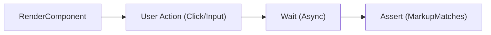

# 第48章：Blazorコンポーネントテスト入門（bUnit想定）🧪🖼️

この章は「画面の振る舞い」を**自動テスト**で守れるようになる回だよ〜！😊
“見た目全部”じゃなくて、**重要な導線（ボタン押下→表示が変わる等）**に絞って、サクッと強いテストを書けるようにしよ💪🌸

---

## 1) この章のゴール🎯✨


できるようになること👇

* コンポーネントを**テスト内でレンダリング**できる🖼️
* **ボタン/入力**などのユーザー操作を再現できる🖱️⌨️
* 表示結果を **MarkupMatches（HTMLの意味を見た比較）**で安定して検証できる✅
* **非同期描画**（ロード中→表示）も待って検証できる⏳✨
* 「どこまでテストすべきか」の線引きができる🎨✂️

bUnitはRazorコンポーネントの**ユニットテスト**向けライブラリで、レンダリング・イベント発火・出力検証ができるよ🧪（E2Eより速く安定しやすい） ([Microsoft Learn][1])

---

## 2) bUnitテストの“基本形”🧱🧪


MicrosoftのBlazorテスト記事でも、流れはこれ👇
**Arrange（描画して準備）→ Act（操作）→ Assert（表示確認）** ([Microsoft Learn][1])

そして `MarkupMatches` はただの文字列比較じゃなくて、**HTMLの意味（空白とか）を考慮**してくれるから、テストが壊れにくいのが嬉しいポイント💖 ([Microsoft Learn][1])




---

## 3) セットアップ（テストプロジェクト側）🔧🧪

bUnitはNuGetで入れるだけでOK👌
現行の bUnit は **2.x が .NET 8 以上対応**だよ（= .NET 10 でもOK） ([NuGet][2])
最新のパッケージ例（2.5.3）も NuGet に載ってるよ📦 ([NuGet][2])

### CLIで入れる（超ラク）⌨️✨

```bash
dotnet add package bunit --version 2.5.3
```

> ちなみに bUnit のリリースノートでは **.NET 10（net10.0）対応**が明記されてるよ✅ ([GitHub][3])

---

## 4) ハンズオン①：ボタン押下→表示が変わる（最小の勝ち筋）🖱️✨


いちばん王道の “Counter” でいくよ〜☝️
（テンプレのやつ！）

### Counter.razor（例）🧩

```razor
<h1>Counter</h1>

<p>Current count: @currentCount</p>

<button class="btn btn-primary" @onclick="IncrementCount">Click me</button>

@code {
    private int currentCount = 0;

    private void IncrementCount()
    {
        currentCount++;
    }
}
```

### CounterTests.cs（bUnit + xUnit）🧪✅

Microsoft Learn でも同じ発想で例があるよ（Render→Click→MarkupMatches） ([Microsoft Learn][1])

```csharp
using Bunit;
using Xunit;

public class CounterTests : BunitContext
{
    [Fact]
    public void CounterShouldIncrementWhenClicked()
    {
        // Arrange: レンダリング
        var cut = RenderComponent<Counter>();

        // Act: ボタン押す
        cut.Find("button").Click();

        // Assert: 表示が変わった？
        cut.Find("p").MarkupMatches("<p>Current count: 1</p>");
    }
}
```

### ここで覚えるコツ🍀

* `Find("button")` は **CSSセレクタ**だから `#id` や `.class` も使えるよ🎯
* “見た目全部”じゃなくて、**ユーザーにとって意味ある表示**をチェックしよ😊

---

## 5) ハンズオン②：入力（input）→テキスト表示⌨️💬

次はフォーム系！「入力したら表示が変わる」を守るよ✨

### NameEcho.razor（例）🧸

```razor
<input @bind="Name" placeholder="name" />
<p id="msg">Hello, @Name</p>

@code {
    public string Name { get; set; } = "";
}
```

### テスト：入力して表示が変わる？✅

```csharp
using Bunit;
using Xunit;

public class NameEchoTests : BunitContext
{
    [Fact]
    public void TypingNameShouldUpdateMessage()
    {
        var cut = RenderComponent<NameEcho>();

        // input を見つけて入力（Change/Input どっちでもOKな場面多い）
        cut.Find("input").Input("Komiyanma");

        cut.Find("#msg").MarkupMatches("<p id=\"msg\">Hello, Komiyanma</p>");
    }
}
```

---

## 6) ハンズオン③：非同期描画（ロード→表示）⏳✨


Blazorは `OnInitializedAsync` でデータ取ってから描画…が多いよね🙂
その時は **“待つ”** が必要！

### AsyncHello.razor（例）🌙

```razor
@if (_loading)
{
    <p>Loading...</p>
}
else
{
    <p id="done">Done: @_text</p>
}

@code {
    private bool _loading = true;
    private string _text = "";

    protected override async Task OnInitializedAsync()
    {
        await Task.Delay(50);
        _text = "OK";
        _loading = false;
    }
}
```

### テスト：Loadingが消えて Done が出るまで待つ⏳✅

```csharp
using Bunit;
using Xunit;

public class AsyncHelloTests : BunitContext
{
    [Fact]
    public void ShouldShowDoneAfterLoading()
    {
        var cut = RenderComponent<AsyncHello>();

        // 最初はLoading
        cut.MarkupMatches("<p>Loading...</p>");

        // 待ってから検証（“待ち”はbUnitの作法）
        cut.WaitForAssertion(() =>
            cut.Find("#done").MarkupMatches("<p id=\"done\">Done: OK</p>")
        );
    }
}
```

> `Thread.Sleep()` みたいな雑な待ちはフレーク（たまに落ちる）になりがち💦
> **WaitForAssertion / WaitForState** 系で“条件が満たされるまで待つ”のが安定だよ😊

---

## 7) いまどきbUnitの“推し書き方”💡✨

最近のbUnitでは **`TestContext` は将来削除予定**で、`BunitContext` 推奨になってるよ（Obsolete属性で案内されてる）📢 ([bUnit][4])
なのでこの章のサンプルも `: BunitContext` にしてるよ✅

---

## 8) どこまでテストする？線引きルール🎨✂️


おすすめはこの3段階👇

1. **重要導線だけ**（例：追加ボタン→一覧に1件増える）🧭
2. **境界**（例：空入力→エラーメッセージ）🚧
3. **分岐**（例：管理者だけボタンが出る）🔀

逆に、やりすぎ注意⚠️

* ピクセル単位の見た目、CSSの細部
* 3rdパーティUIの内部挙動（自分が責任持てない）
  → それはE2E側に寄せるほうがスッキリすること多いよ😊 ([Microsoft Learn][1])

---

## 9) AIの使いどころ（速くなるやつ）🤖✨

この章はAIがめっちゃ効く💨（でも採用基準はテスト！）

使えるプロンプト例👇

* 「このBlazorコンポーネントの**重要なユーザー操作フロー**を3つ列挙して」🧭
* 「そのフローを **bUnit + xUnit** のテスト雛形にして」🧪
* 「MarkupMatchesが壊れやすいなら、**より安定するセレクタ**案も出して」🎯

コツは、AIに出させたテストをそのまま信じないで、
**“このテスト、仕様として読める？”**って目で削って整えること😊✂️✨

---

## 10) 練習問題（推し活グッズ管理UIでやろう🎀📦）

次の3本だけでOK！少なくて強い💪✨

1. **登録ボタン押下 → 一覧に追加される**🖱️
2. **検索条件入力 → 絞り込み表示になる**⌨️
3. **無効入力（空/範囲外） → エラー表示**🚫

✅ 合格ライン：

* 1テスト1意図🍰
* `Find` は `#id` / `[data-testid]` などで安定🎯
* `MarkupMatches` で意味比較（空白で落ちない）🧠 ([Microsoft Learn][1])

---

## まとめ🎉

* bUnitで **レンダリング→操作→表示確認** ができる🧪🖼️ ([Microsoft Learn][1])
* `MarkupMatches` でテストが安定しやすい✅ ([Microsoft Learn][1])
* 非同期は **WaitForAssertion** で待つ⏳✨
* 最近は `BunitContext` 推奨（`TestContext` は将来削除予定）📢 ([bUnit][4])

---

次の第49章では、ここに **DI差し替え（サービスをスタブ化してUIテスト）** を合体させて、いよいよ“実戦のBlazor”になるよ〜！🔁🔥

[1]: https://learn.microsoft.com/en-us/aspnet/core/blazor/test?view=aspnetcore-10.0 "Test Razor components in ASP.NET Core Blazor | Microsoft Learn"
[2]: https://www.nuget.org/packages/bunit/ "
        NuGet Gallery
        \| bunit 2.5.3
    "
[3]: https://github.com/egil/bunit/releases "Releases · bUnit-dev/bUnit · GitHub"
[4]: https://bunit.dev/api/Bunit.TestContext.html?utm_source=chatgpt.com "Class TestContext"
