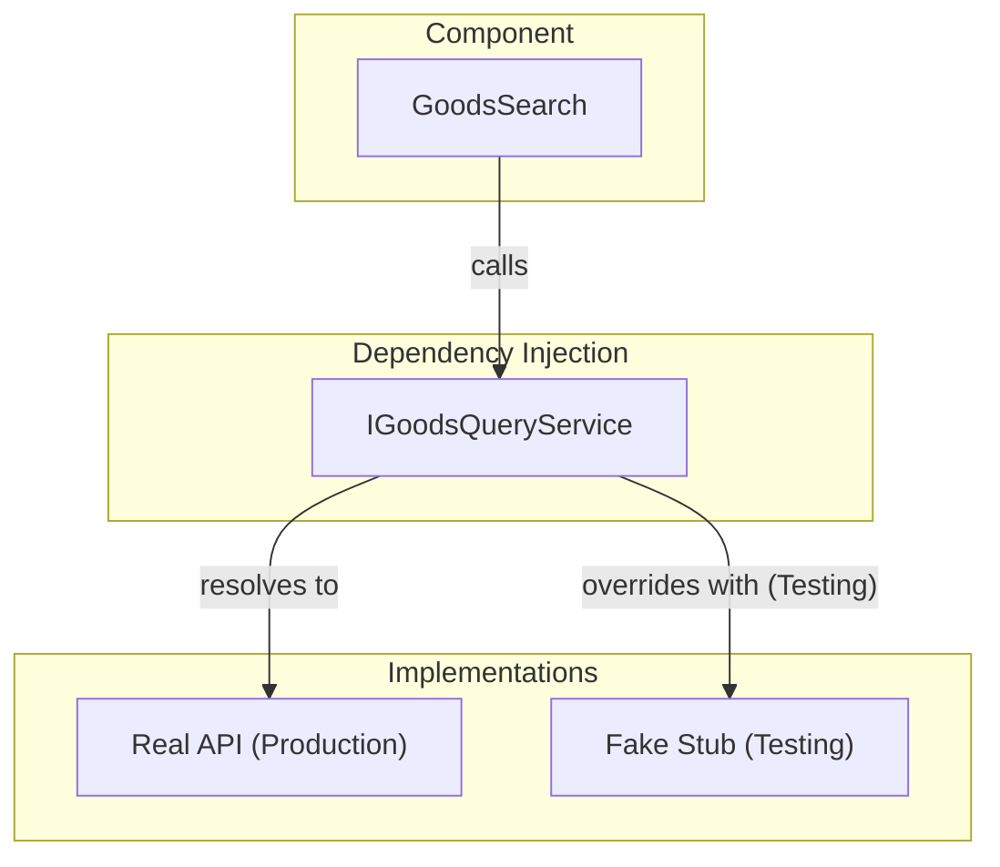

# 第49章：Blazor + DI（依存の差し替えをUIでも活かす）🔁

まず、今日の“最新メモ”だけ置いとくね📝

* .NET 10 の最新パッチは **10.0.2（2026/01/13公開）**だよ📌 ([Microsoft][1])
* BlazorのDIは、コンポーネントにサービスを注入して使う仕組みで、**コンストラクタ注入 / `@inject`** どっちもOKだよ🙆‍♀️ ([Microsoft Learn][2])
* bUnitでは、**描画前に `TestContext.Services` にサービス登録**すれば、そのまま差し替えテストできるよ🧪 ([bUnit][3])
* 同じインターフェースを複数回 `AddSingleton` した場合、**単体解決では後勝ち（上書き）**になるよ（`IEnumerable<T>` で全部も取れる）🔁 ([Microsoft Learn][4])

---

## 1) この章でできるようになること🎯✨


* Blazorコンポーネントが呼ぶサービスを **DI経由**にする💉
* UIテスト（bUnit）で **本物サービスをスタブに差し替える**🧸
* “ネットワークやDBに繋がないUIテスト” を作れる⚡️（速い・安定・怖くない！）

---

## 2) なんでDI差し替えが大事なの？🤔💡


Blazorの画面って、だいたい裏でこういうことしてるよね👇

* API呼ぶ🌐
* DBから取る🗄️
* ログ出す🧾
* 通知する📣

でもUIテストでそれを本当にやると…

* 遅い🐢
* たまに落ちる😵‍💫
* 環境に依存して“再現できない”💥

だから、UIテストでは **「画面は本物、裏のサービスは偽物」** にするのが最強だよ💪✨



---

## 3) 例題：推し活グッズ検索画面🎀🔎（サービス差し替え前提）

### 登場人物

* `IGoodsQueryService`：検索して一覧を返す（本番はAPI/DBでもOK）
* `GoodsSearch.razor`：入力→検索→結果表示するコンポーネント

---

## 4) まず“テストから”書く（Red）🚦🔴


bUnitで「検索ボタン押したら、結果が表示される」を先に固定しよう🧪✨
（この時点ではサービス実装はまだ無くてOK！）

```csharp
using Bunit;
using Microsoft.Extensions.DependencyInjection;
using Xunit;

public class GoodsSearchTests : TestContext
{
    [Fact]
    public void SearchButton_Click_ShowsResults()
    {
        // Arrange: サービスを“偽物”で登録（ここが第49章の主役！）🔁
        Services.AddSingleton<IGoodsQueryService>(new FakeGoodsQueryService(
            new[]
            {
                new GoodsDto("アクスタA"),
                new GoodsDto("缶バッジB"),
            }));

        // Act: コンポーネント描画
        var cut = RenderComponent<GoodsSearch>();

        // 入力して検索クリック
        cut.Find("input[data-testid='keyword']").Change("あ");
        cut.Find("button[data-testid='search']").Click();

        // Assert: 結果が表示される
        var items = cut.FindAll("li[data-testid='result-item']");
        Assert.Equal(2, items.Count);
    }
}
```

ポイント💡

* bUnitは **描画前に `Services`（`IServiceCollection`）へ登録**すると、そのまま注入してくれるよ🧪 ([bUnit][3])
* ここで本物のAPIやDBに繋がないのが“勝ち筋”⚡️

---

## 5) 次に“最小の画面”を書く（Green）🚦🟢

### 5-1) DTOとサービスIF

```csharp
public record GoodsDto(string Name);

public interface IGoodsQueryService
{
    Task<IReadOnlyList<GoodsDto>> SearchAsync(string keyword);
}
```

### 5-2) コンポーネント（`GoodsSearch.razor`）

`@inject` でDI注入して、ボタンで呼ぶだけだよ😊
（Blazorは `@inject` / コンストラクタ注入の両方をサポートしてるよ） ([Microsoft Learn][2])

```csharp
@using System
@inject IGoodsQueryService GoodsQuery

<div>
    <input data-testid="keyword" @bind="Keyword" />
    <button data-testid="search" @onclick="SearchAsync">検索</button>
</div>

@if (Results is not null)
{
    <ul>
        @foreach (var item in Results)
        {
            <li data-testid="result-item">@item.Name</li>
        }
    </ul>
}

@code {
    private string Keyword { get; set; } = "";
    private IReadOnlyList<GoodsDto>? Results;

    private async Task SearchAsync()
    {
        Results = await GoodsQuery.SearchAsync(Keyword);
    }
}
```

---

## 6) 偽サービス（スタブ）を用意する🧸✨


テスト用の“決め打ち”サービスだよ。いちばん分かりやすい👍

```csharp
public sealed class FakeGoodsQueryService : IGoodsQueryService
{
    private readonly IReadOnlyList<GoodsDto> _results;

    public FakeGoodsQueryService(IEnumerable<GoodsDto> results)
        => _results = results.ToList();

    public Task<IReadOnlyList<GoodsDto>> SearchAsync(string keyword)
        => Task.FromResult(_results);
}
```

これで、さっきのテストが通るはず✅🎉

---

## 7) “呼ばれたか”も確認したい（スパイでOK）🕵️‍♀️✅


モックライブラリなしでもいけるよ〜！

```csharp
public sealed class SpyGoodsQueryService : IGoodsQueryService
{
    public string? LastKeyword { get; private set; }
    private readonly IReadOnlyList<GoodsDto> _results;

    public SpyGoodsQueryService(IReadOnlyList<GoodsDto> results) => _results = results;

    public Task<IReadOnlyList<GoodsDto>> SearchAsync(string keyword)
    {
        LastKeyword = keyword;
        return Task.FromResult(_results);
    }
}
```

テストでこう書ける👇

```csharp
[Fact]
public void Search_PassesKeywordToService()
{
    var spy = new SpyGoodsQueryService(new[] { new GoodsDto("Tシャツ") });
    Services.AddSingleton<IGoodsQueryService>(spy);

    var cut = RenderComponent<GoodsSearch>();
    cut.Find("input[data-testid='keyword']").Change("T");
    cut.Find("button[data-testid='search']").Click();

    Assert.Equal("T", spy.LastKeyword);
}
```

---

## 8) “差し替え”のコツ3つ🔁🧠

### コツ①：登録は“描画前”にやる🧪

bUnitは **描画前に `Services` へ登録**が基本だよ✨ ([bUnit][3])

### コツ②：同じIFを登録し直せば上書きできる🔁

`AddSingleton<IGoodsQueryService>(...)` をもう一回やると、単体解決では後勝ちになるよ（上書きできる）🧷 ([Microsoft Learn][4])

### コツ③：ライフタイムは“ざっくり意味”だけ掴めばOK😊


* Singleton：1個を使い回し
* Scoped：スコープごとに1個
* Transient：毎回新しい
  （この3つの定義自体は公式の列挙にも書いてあるよ📚） ([Microsoft Learn][5])

---

## 9) ミニ課題（手を動かすパート）🎀✍️

### 課題A：空入力のとき「入力してね」を表示する😶➡️💬

* テスト：空欄で検索クリック → メッセージが出る
* 実装：空ならサービス呼ばずにメッセージ表示

### 課題B：0件のとき「見つからなかった」を表示する🔎💨

* テスト：偽サービスが空リスト返す → 文言表示
* 実装：`Results.Count == 0` の表示分岐追加

### 課題C：サービス例外のとき「通信失敗」を表示する💥📡

* テスト：偽サービスが例外投げる → エラー表示
* 実装：`try/catch` でUI状態に反映

---

## 10) AIの使いどころ（この章向け）🤖✨

コピペで使えるやつ置いとくね👇

* 「この画面仕様の **UIテスト観点** を、正常/異常/境界値で箇条書きにして」
* 「このサービスの **スタブ実装** を“最小”で作って（戻り値固定でOK）」
* 「bUnitで、入力→クリック→表示確認の **テスト雛形** を出して」

採用ルールはシンプルに：**テストが通る＋意図に合うものだけ採用**でOK👍🧪

---

## まとめ🎉🧪

* UIテストは **画面は本物**、裏の依存は **偽物に差し替え** が最強🔁
* bUnitは **`Services` に登録してから描画**でDI差し替えできるよ🧪 ([bUnit][3])
* 同じIFを登録し直す“上書き”も、公式ドキュメントにある挙動だよ📚 ([Microsoft Learn][4])

この次（第50章）で、Blazorアプリ全体として「重要導線だけUIテスト」＋「中心ロジックはユニットでガチガチ」を完成形にしていけるよ〜🎓🎀✨

[1]: https://dotnet.microsoft.com/en-US/download/dotnet/10.0?utm_source=chatgpt.com "Download .NET 10.0 (Linux, macOS, and Windows) | .NET"
[2]: https://learn.microsoft.com/en-us/aspnet/core/blazor/fundamentals/dependency-injection?view=aspnetcore-10.0 "ASP.NET Core Blazor dependency injection | Microsoft Learn"
[3]: https://bunit.dev/docs/providing-input/inject-services-into-components.html?utm_source=chatgpt.com "Injecting services into components under test"
[4]: https://learn.microsoft.com/en-us/dotnet/core/extensions/dependency-injection "Dependency injection - .NET | Microsoft Learn"
[5]: https://learn.microsoft.com/en-us/dotnet/api/microsoft.extensions.dependencyinjection.servicelifetime?view=net-10.0-pp&utm_source=chatgpt.com "ServiceLifetime Enum"
