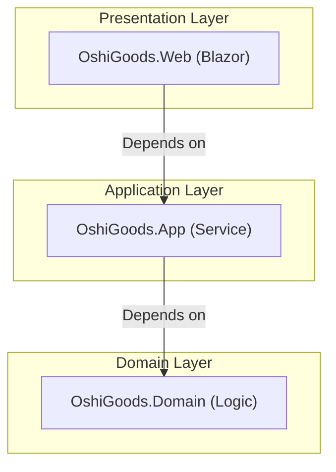

# 第50章：卒業制作：推し活グッズ管理③（Blazorで完成）🎓🎉

この章は「TDDを最初から最後まで、自力で回して“完成まで持っていく”」のゴール回です💪✨
（本日時点：.NET 10 の最新は **10.0.2（2026/01/13 リリース）** だよ📌）([Microsoft][1])
C# 14 は Visual Studio 2026 / .NET 10 SDK で使える前提だよ🧁([Microsoft Learn][2])

---

## 1) 今回作るアプリ（完成イメージ）🎀📦


### 必須（これで「完成」）✅

* グッズ登録（名前/カテゴリ/価格/数量/購入日/メモ）📝
* 一覧表示（検索・絞り込み・並び替え）🔎↕️
* 状態変更（在庫あり→予約→売却 みたいに遷移）🧠🗺️
* 集計（総数、カテゴリ別数、総額など）📊✨
* 重要導線だけ UI テスト（bUnit）🧪🖼️
* README（実行方法・テスト方法・仕様）📘

### 余裕があれば（拡張）🌈

* JSON保存/読み込み（永続化）💾
* タグ機能🏷️
* 画像URL（表示だけ）🖼️
* エクスポート（CSV）📤

---

## 2) テスト戦略（ここ大事）🧪✨

* **ドメイン（ルール）**：テスト多め（速い・壊れやすい所を守る）⚡
* **ユースケース（アプリ操作）**：必要十分（登録/検索/遷移/集計）🎯
* **UI（Blazor）**：**重要導線だけ**（「追加できる」「一覧が更新される」など）🚶‍♀️

xUnit は v3 系が安定版として継続リリースされてるよ（例：xunit.v3 3.2.2）。([xunit.net][3])
Blazor コンポーネントテストは bUnit を使う想定（NuGet で配布）。([bUnit][4])

---

## 3) ソリューション構成（迷子防止マップ）🗺️😊

「UIは薄く、ルールは外へ」🧩✨

```text
OshiGoods.sln
 ├─ src
 │   ├─ OshiGoods.Web        // Blazor（画面）
 │   ├─ OshiGoods.App        // ユースケース（登録/検索/集計）
 │   └─ OshiGoods.Domain     // ドメイン（ルール・型・状態遷移）
 └─ tests
     ├─ OshiGoods.DomainTests
     ├─ OshiGoods.AppTests
     └─ OshiGoods.WebTests   // bUnit（最小）
```



---

## 4) 仕様を「テストに落とす」やり方（卒業制作のコツ）🎯🧪

### まずはユースケースを4つに絞る🍰

1. 登録できる
2. 検索/絞り込みできる
3. 状態遷移できる（例：在庫→予約→売却）
4. 集計できる

この4つだけで十分“完成感”が出るよ🎉

---

## 5) 開発の進め方（おすすめコミット単位）🧠🔁

### ステップA：ドメインから作る（ルールが最優先）👑

**A-1 価格・数量の「型」から**

* Money（0以上）
* Quantity（1以上）

**A-2 状態遷移（状態機械の超ミニ版）**

* InStock → Reserved → Sold
* Sold → InStock は禁止、とかをルールにする🚫

**コミット例**

* `test: Money rejects negative`
* `feat: Money value object`
* `test: status transition rules`
* `feat: GoodsItem transition methods`

---

## 6) まずはドメイン最小コード（例）🧷✨

### 6-1 Value Object（価格・数量）

```csharp
namespace OshiGoods.Domain;

public readonly record struct Money(decimal Amount)
{
    public static Money Of(decimal amount)
    {
        if (amount < 0) throw new DomainException("価格は0以上だよ💰");
        return new Money(amount);
    }
}

public readonly record struct Quantity(int Value)
{
    public static Quantity Of(int value)
    {
        if (value <= 0) throw new DomainException("数量は1以上だよ📦");
        return new Quantity(value);
    }
}

public sealed class DomainException : Exception
{
    public DomainException(string message) : base(message) { }
}
```

### 6-2 グッズ本体（状態遷移つき）

```csharp
namespace OshiGoods.Domain;

public enum GoodsStatus { InStock, Reserved, Sold }

public sealed class GoodsItem
{
    public Guid Id { get; } = Guid.NewGuid();
    public string Name { get; private set; }
    public string Category { get; private set; }
    public Money Price { get; private set; }
    public Quantity Quantity { get; private set; }
    public GoodsStatus Status { get; private set; } = GoodsStatus.InStock;
    public string Memo { get; private set; } = "";

    public GoodsItem(string name, string category, Money price, Quantity quantity)
    {
        Name = string.IsNullOrWhiteSpace(name) ? throw new DomainException("名前は必須だよ📝") : name;
        Category = string.IsNullOrWhiteSpace(category) ? "未分類" : category;
        Price = price;
        Quantity = quantity;
    }

    public void Reserve()
    {
        if (Status != GoodsStatus.InStock) throw new DomainException("在庫がある時だけ予約できるよ🎟️");
        Status = GoodsStatus.Reserved;
    }

    public void Sell()
    {
        if (Status == GoodsStatus.Sold) throw new DomainException("もう売却済みだよ💦");
        Status = GoodsStatus.Sold;
    }

    public void UpdateMemo(string memo) => Memo = memo ?? "";
}
```

---

## 7) ドメインテスト（まず1本だけ書こう）🧪🚦

```csharp
using OshiGoods.Domain;
using Xunit;

public class MoneyTests
{
    [Fact]
    public void Of_rejects_negative()
    {
        var ex = Assert.Throws<DomainException>(() => Money.Of(-1));
        Assert.Contains("0以上", ex.Message);
    }
}
```

🎯ポイント：**最初は1テスト1意図**でOKだよ🍰
増やすのは後でいくらでもできる😊

---

## 8) ユースケース層（登録・検索・集計）📦✨

### 8-1 リポジトリ（差し替え前提の境界）🚪

```csharp
using OshiGoods.Domain;

namespace OshiGoods.App;

public interface IGoodsRepository
{
    Task AddAsync(GoodsItem item);
    Task<IReadOnlyList<GoodsItem>> ListAsync();
    Task<GoodsItem?> FindAsync(Guid id);
    Task UpdateAsync(GoodsItem item);
    Task DeleteAsync(Guid id);
}
```

### 8-2 InMemory実装（卒業制作はこれで十分）💾✨

```csharp
using System.Collections.Concurrent;
using OshiGoods.Domain;

namespace OshiGoods.App;

public sealed class InMemoryGoodsRepository : IGoodsRepository
{
    private readonly ConcurrentDictionary<Guid, GoodsItem> _db = new();

    public Task AddAsync(GoodsItem item)
    {
        _db[item.Id] = item;
        return Task.CompletedTask;
    }

    public Task<IReadOnlyList<GoodsItem>> ListAsync()
        => Task.FromResult((IReadOnlyList<GoodsItem>)_db.Values.OrderBy(x => x.Name).ToList());

    public Task<GoodsItem?> FindAsync(Guid id)
        => Task.FromResult(_db.TryGetValue(id, out var item) ? item : null);

    public Task UpdateAsync(GoodsItem item)
    {
        _db[item.Id] = item;
        return Task.CompletedTask;
    }

    public Task DeleteAsync(Guid id)
    {
        _db.TryRemove(id, out _);
        return Task.CompletedTask;
    }
}
```

### 8-3 ユースケース（サービス）例：登録🎀

```csharp
using OshiGoods.Domain;

namespace OshiGoods.App;

public sealed class GoodsService
{
    private readonly IGoodsRepository _repo;

    public GoodsService(IGoodsRepository repo) => _repo = repo;

    public async Task<Guid> AddAsync(string name, string category, decimal price, int quantity, string memo)
    {
        var item = new GoodsItem(name, category, Money.Of(price), Quantity.Of(quantity));
        item.UpdateMemo(memo);
        await _repo.AddAsync(item);
        return item.Id;
    }
}
```

---

## 9) Blazor（UIは薄く！）🎨🧪

### 9-1 DI登録（Program.cs イメージ）🔁

```csharp
using OshiGoods.App;

builder.Services.AddSingleton<IGoodsRepository, InMemoryGoodsRepository>();
builder.Services.AddSingleton<GoodsService>();
```

### 9-2 画面は「入力→サービス呼ぶ→再描画」だけにする🪄

* 入力バリデーションは **最低限**（空チェックくらい）
* ルールは Domain が守る（例外メッセージを UI で表示）🧯

---

## 10) UIテスト（bUnit）最小でOK🧪🖼️

bUnit は「Blazorコンポーネントのテスト用ライブラリ」だよ📌([bUnit][4])

### 例：一覧に名前が出ることだけ確認する

```csharp
using Bunit;
using Microsoft.Extensions.DependencyInjection;
using OshiGoods.App;
using OshiGoods.Domain;
using Xunit;

public class GoodsListTests : TestContext
{
    [Fact]
    public async Task Shows_added_item_name()
    {
        Services.AddSingleton<IGoodsRepository, InMemoryGoodsRepository>();
        Services.AddSingleton<GoodsService>();

        var svc = Services.GetRequiredService<GoodsService>();
        await svc.AddAsync("アクスタ", "グッズ", 1500, 1, "");

        var cut = RenderComponent<OshiGoods.Web.Components.GoodsList>();
        cut.Markup.Contains("アクスタ");
    }
}
```

🎯UIテストは「重要導線だけ」でいいよ！やりすぎるとしんどい😂

---

## 11) AIの使い方（卒業制作の最強セット）🤖✨

### 仕様→テストケース洗い出し

* 「この仕様のテストケースを、正常/異常/境界値で列挙して。状態遷移も含めてね」

### 失敗ログ→原因切り分け

* 「この失敗ログの原因候補を3つ、確認順に出して」

### リファクタ案（最小だけ採用）

* 「重複を減らす最小のリファクタ案を3つ。リスクも添えて」

### PRレビュー役

* 「この差分の“仕様漏れ”と“テスト不足”を指摘して」

✅コツ：**AIは“案出し係”**、採用は **テストと意図**で決める😌🧪

---

## 12) 完成条件（Definition of Done）🏁💪

* テスト：`dotnet test` が常に緑✅
* 主要ユースケース（登録/検索/遷移/集計）がテストで守られてる🧪
* UIは重要導線だけ自動テスト済み（bUnit）🖼️
* READMEに「起動」「テスト」「仕様」が書いてある📘
* コードが怖くない（名前・責務・重複が最低限整ってる）🧹✨

---

## 13) よくあるハマり（先に回避）🧯😵‍💫

* UIにルールを書き始める（→ドメインへ追い出そ！）🚪
* テストが重くなる（→InMemoryで速さ優先！）🐢➡️⚡
* 例外を握りつぶす（→メッセージをUIに見せる or 方針決める）🙅‍♀️
* 「状態」が増えてif地獄（→遷移表で整理）🗺️

---

必要なら、この卒業制作を「章内の課題形式」にして、
**(1) 1コミット1課題** / **(2) 各課題のテストお題** / **(3) 期待差分** まで、まるっと講義台本にして出せるよ📘✨

[1]: https://dotnet.microsoft.com/en-US/download/dotnet/10.0?utm_source=chatgpt.com "Download .NET 10.0 (Linux, macOS, and Windows) | .NET"
[2]: https://learn.microsoft.com/ja-jp/dotnet/csharp/whats-new/csharp-14?utm_source=chatgpt.com "C# 14 の新機能"
[3]: https://xunit.net/releases/?utm_source=chatgpt.com "Release Notes"
[4]: https://bunit.dev/?utm_source=chatgpt.com "bUnit - a testing library for Blazor components | bUnit"
