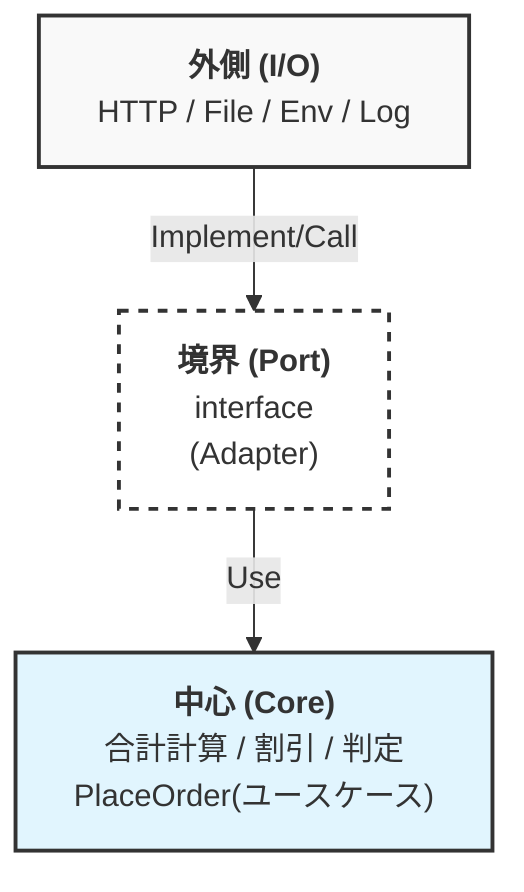

# 第30章：ミニプロジェクト（集大成）🎓🌈


**題材：ミニ注文システム（合計/割引/在庫チェック）🛒🍕**
「中心（ロジック）」と「外側（I/O）」をちゃんと分けて、**中心がほぼユニットテストだけで守れる**形を完成させよう〜！🧪✨

---

## 0. 今日の“最新前提”だけサクッと確認🧭✨* **TypeScript**：npmの最新版は **5.9.3**（2025-09-30公開の“Latest”）

になってるよ📘✨ ([NPM][1])


* **Node.js**：LTS系は **v24（Active LTS）**、v22（Maintenance LTS）などが並行運用されてるよ（2026-01-12更新）🟩 ([Node.js][2])
* **Node.jsセキュリティ更新**：2026-01-13にLTS向けのセキュリティリリースが出てるので、使うなら新しめ推奨だよ🛡️ ([Node.js][3])
* **Vitest**：**Vitest 4.0** が 2025-10-22 にリリース済み🧪🎉 ([Vitest][4])
* **Vitest設定**：Vite使わないなら `vitest/config` から `defineConfig` を読むやり方が公式に載ってるよ🧩 ([Vitest][5])

---

## 1. ミニプロジェクトの仕様（小さくて“現実っぽい”やつ）

🍕🛒今回は「注文を確定する」だけに絞るよ😊


### やること（要件）

✅1. 注文アイテム（SKUと数量）を受け取る
2. **合計計算**（小計 → 割引 → 税 → 合計）💰
3. **在庫チェック＆確保**（外の世界＝I/O）📦
4. **注文を保存**（外の世界＝I/O）🗄️
5. **ログを出す**（外の世界＝I/O）📝

### 重要ルール（設計の縛り）

🧠✂️* **中心（core）**：計算・判断だけ。`fetch`/`fs`/`process.env`/`Date`/`console` は触らない🙅‍♀️


* **外側（adapters）**：I/O担当。中心が欲しい形に変換して渡す🔁
* **境界（ports）**：中心が「こういう機能が欲しい」とお願いする“最小の約束（interface）”📜✨

---

## 2. まずは地図！

境界図を描こう🗺️✨（設計ステップ）イメージはこんな感じ👇




### 今回のPort（境界interface）

を決める🎯* `InventoryPort`：在庫を確認・確保する


* `OrderRepository`：注文を保存する
* `LoggerPort`：必要なログだけ出す
* `ConfigPort`：設定値（税率・割引率など）を渡す

> コツ：**中心が本当に必要な操作だけ**にするのが勝ち✌️✨

---

## 3. プロジェクト雛形を作る（最小でOK）

📁✨ここは「動く＋テスト回る」だけ作るよ。


### 例：フォルダ構成（おすすめ）

📂


```text
mini-order/
  src/
    core/
      domain/
      usecases/
      ports/
    adapters/
      inventory/
      orderRepo/
      logger/
      config/
    app/
      main.ts
  test/
  package.json
  tsconfig.json
  vitest.config.ts
```

### package.json（例）

🧰


```json
{
  "name": "mini-order",
  "private": true,
  "type": "module",
  "scripts": {
    "test": "vitest",
    "test:ui": "vitest --ui",
    "dev": "tsx src/app/main.ts"
  },
  "devDependencies": {
    "typescript": "^5.9.3",
    "vitest": "^4.0.0",
    "tsx": "^4.0.0"
  }
}
```

* TypeScript最新版は npm 上で 5.9.3 が “Latest” になってるよ📘 ([NPM][1])
* Vitest 4.0 は公式発表あり🧪🎉 ([Vitest][4])

### vitest.config.ts（Viteなし版）

🧪


```ts
import { defineConfig } from "vitest/config";

export default defineConfig({
  test: {
    include: ["test/**/*.test.ts"],
  },
});
```

（`vitest/config` から読むのが公式ガイドにあるよ） ([Vitest][5])

---

## 4. 中心（Core）

を作る：まず“純粋ロジック”🍰✨（中心実装ステップ）### 4.1 ドメイン型（src/core/domain/types.ts）

📘


```ts
export type SKU = string;

export type OrderItem = Readonly<{
  sku: SKU;
  qty: number; // 1以上
  unitPrice: number; // 円、0以上
}>;

export type Coupon =
  | { kind: "NONE" }
  | { kind: "PERCENT"; percent: number } // 例: 10 => 10%
  | { kind: "FLAT"; yen: number };       // 例: 300 => 300円引き

export type MoneyBreakdown = Readonly<{
  subtotal: number;
  discount: number;
  taxed: number;
  total: number;
}>;
```

### 4.2 合計計算（src/core/domain/pricing.ts）

💰


```ts
import { Coupon, MoneyBreakdown, OrderItem } from "./types";

export function calcSubtotal(items: readonly OrderItem[]): number {
  return items.reduce((sum, it) => sum + it.unitPrice * it.qty, 0);
}

export function calcDiscount(subtotal: number, coupon: Coupon): number {
  if (coupon.kind === "NONE") return 0;

  if (coupon.kind === "PERCENT") {
    const raw = Math.floor((subtotal * coupon.percent) / 100);
    return clamp(raw, 0, subtotal);
  }

  // FLAT
  return clamp(coupon.yen, 0, subtotal);
}

export function calcTax(amount: number, taxRate: number): number {
  // taxRate: 0.1 みたいな想定
  return Math.floor(amount * taxRate);
}

export function calcTotal(
  items: readonly OrderItem[],
  coupon: Coupon,
  taxRate: number
): MoneyBreakdown {
  const subtotal = calcSubtotal(items);
  const discount = calcDiscount(subtotal, coupon);
  const afterDiscount = subtotal - discount;
  const taxed = calcTax(afterDiscount, taxRate);
  const total = afterDiscount + taxed;

  return { subtotal, discount, taxed, total };
}

function clamp(n: number, min: number, max: number): number {
  return Math.max(min, Math.min(max, n));
}
```

### 4.3 ここまでのユニットテスト（test/pricing.test.ts）

🧪🎉


```ts
import { describe, expect, test } from "vitest";
import { calcTotal } from "../src/core/domain/pricing";

describe("calcTotal", () => {
  test("割引なし", () => {
    const r = calcTotal(
      [{ sku: "PIZZA", qty: 2, unitPrice: 1000 }],
      { kind: "NONE" },
      0.1
    );
    expect(r.subtotal).toBe(2000);
    expect(r.discount).toBe(0);
    expect(r.taxed).toBe(200);
    expect(r.total).toBe(2200);
  });

  test("割合クーポン 10%", () => {
    const r = calcTotal(
      [{ sku: "PIZZA", qty: 1, unitPrice: 1500 }],
      { kind: "PERCENT", percent: 10 },
      0.1
    );
    // 1500の10% = 150, (1500-150)=1350, 税=135, 合計=1485
    expect(r).toEqual({ subtotal: 1500, discount: 150, taxed: 135, total: 1485 });
  });
});
```

> この時点で「中心はほぼ計算だけ」だから、テストが速い！気持ちいい！⚡🥳

---

## 5. 中心（Core）

を完成させる：ユースケース PlaceOrder 🧠➡️📦次は「在庫チェック＆保存」という **I/Oを含む処理**を、**境界（Port）越し**にやるよ✨


### 5.1 Port（src/core/ports/ports.ts）

📜

```ts
import { OrderItem, SKU } from "../domain/types";

export type InventoryCheck = Readonly<{ sku: SKU; available: number }>;

export interface InventoryPort {
  getAvailability(skus: readonly SKU[]): Promise<readonly InventoryCheck[]>;
  reserve(items: readonly OrderItem[]): Promise<void>;
}

export type SavedOrder = Readonly<{
  orderId: string;
  items: readonly OrderItem[];
  total: number;
}>;

export interface OrderRepository {
  save(order: SavedOrder): Promise<void>;
}

export interface LoggerPort {
  info(message: string, meta?: Record<string, unknown>): void;
  warn(message: string, meta?: Record<string, unknown>): void;
}

export interface ConfigPort {
  taxRate: number;
}
```

### 5.2 結果型（throw地獄回避）

🧯✨

```ts
export type Result<T, E> =
  | { ok: true; value: T }
  | { ok: false; error: E };

export const Ok = <T>(value: T): Result<T, never> => ({ ok: true, value });
export const Err = <E>(error: E): Result<never, E> => ({ ok: false, error });
```

### 5.3 Usecase（src/core/usecases/placeOrder.ts）

🛒

```ts
import { calcTotal } from "../domain/pricing";
import { Coupon, OrderItem } from "../domain/types";
import { ConfigPort, InventoryPort, LoggerPort, OrderRepository, SavedOrder } from "../ports/ports";
import { Err, Ok, Result } from "./result";

export type PlaceOrderError =
  | { kind: "INVALID_INPUT"; message: string }
  | { kind: "OUT_OF_STOCK"; message: string; sku: string }
  | { kind: "INFRA_FAILURE"; message: string };

export type PlaceOrderOutput = Readonly<{ orderId: string; total: number }>;

export async function placeOrder(
  deps: Readonly<{
    inventory: InventoryPort;
    repo: OrderRepository;
    logger: LoggerPort;
    config: ConfigPort;
    idGen: () => string; // 乱数もI/O寄りなので注入で✨
  }>,
  input: Readonly<{
    items: readonly OrderItem[];
    coupon: Coupon;
  }>
): Promise<Result<PlaceOrderOutput, PlaceOrderError>> {
  // 入口の最低限チェック（中心に壊れたデータを入れない）
  for (const it of input.items) {
    if (it.qty <= 0) return Err({ kind: "INVALID_INPUT", message: "qtyは1以上だよ🥺" });
    if (it.unitPrice < 0) return Err({ kind: "INVALID_INPUT", message: "unitPriceが変だよ🥺" });
  }

  const skus = input.items.map(x => x.sku);
  try {
    const availability = await deps.inventory.getAvailability(skus);

    for (const it of input.items) {
      const found = availability.find(a => a.sku === it.sku);
      if (!found || found.available < it.qty) {
        deps.logger.warn("out_of_stock", { sku: it.sku, need: it.qty, available: found?.available ?? 0 });
        return Err({ kind: "OUT_OF_STOCK", message: "在庫が足りないよ〜😭", sku: it.sku });
      }
    }

    const money = calcTotal(input.items, input.coupon, deps.config.taxRate);

    await deps.inventory.reserve(input.items);

    const order: SavedOrder = {
      orderId: deps.idGen(),
      items: input.items,
      total: money.total,
    };

    await deps.repo.save(order);

    deps.logger.info("order_placed", { orderId: order.orderId, total: order.total });

    return Ok({ orderId: order.orderId, total: order.total });
  } catch (e) {
    deps.logger.warn("infra_failure", { error: String(e) });
    return Err({ kind: "INFRA_FAILURE", message: "外側の都合で失敗しちゃった🥲" });
  }
}
```

---

## 6. 中心のテスト：I/Oは全部“差し替え”で🧸👀（ユースケースのユニットテスト）### 6.1 テストダブル（手書きでOK）

🧪

```ts
import { describe, expect, test } from "vitest";
import { placeOrder } from "../src/core/usecases/placeOrder";

function fakeDeps() {
  const logs: string[] = [];

  return {
    logs,
    deps: {
      inventory: {
        async getAvailability(skus: readonly string[]) {
          return skus.map(sku => ({ sku, available: 99 }));
        },
        async reserve() {},
      },
      repo: {
        async save() {},
      },
      logger: {
        info(msg: string) { logs.push(`info:${msg}`); },
        warn(msg: string) { logs.push(`warn:${msg}`); },
      },
      config: { taxRate: 0.1 },
      idGen: () => "ORDER-001",
    }
  };
}

test("placeOrder: 成功する", async () => {
  const { deps } = fakeDeps();
  const r = await placeOrder(deps, {
    items: [{ sku: "PIZZA", qty: 2, unitPrice: 1000 }],
    coupon: { kind: "NONE" },
  });

  expect(r.ok).toBe(true);
  if (r.ok) {
    expect(r.value.orderId).toBe("ORDER-001");
    expect(r.value.total).toBe(2200);
  }
});

test("placeOrder: 在庫不足", async () => {
  const { deps } = fakeDeps();
  deps.inventory.getAvailability = async () => [{ sku: "PIZZA", available: 0 }];

  const r = await placeOrder(deps, {
    items: [{ sku: "PIZZA", qty: 1, unitPrice: 1000 }],
    coupon: { kind: "NONE" },
  });

  expect(r.ok).toBe(false);
  if (!r.ok) {
    expect(r.error.kind).toBe("OUT_OF_STOCK");
  }
});
```

> ここが最高ポイント！
> **placeOrderをテストしてるのに、ネットもDBも触ってない**😆✨
> なのに「在庫不足」「成功」「入力ミス」全部検証できる🎯

---

## 7. 外側（Adapters）

を作る：本物I/O担当🔌✨（外側接続ステップ）ここから先は「中心のお願い（Port）」を満たす実装を書くだけ〜！


### 7.1 Config（環境変数は外側で読む）

⚙️📦

```ts
// src/adapters/config/envConfig.ts
import { ConfigPort } from "../../core/ports/ports";

export function loadConfig(): ConfigPort {
  const taxRate = Number(process.env.TAX_RATE ?? "0.1");
  return { taxRate };
}
```

### 7.2 Logger（consoleは外側）

📝

```ts
// src/adapters/logger/consoleLogger.ts
import { LoggerPort } from "../../core/ports/ports";

export const consoleLogger: LoggerPort = {
  info(message, meta) { console.log("[info]", message, meta ?? {}); },
  warn(message, meta) { console.warn("[warn]", message, meta ?? {}); },
};
```

### 7.3 OrderRepository（ファイル保存）

📁

```ts
// src/adapters/orderRepo/fileOrderRepo.ts
import { promises as fs } from "node:fs";
import { dirname } from "node:path";
import { OrderRepository, SavedOrder } from "../../core/ports/ports";

export function fileOrderRepo(path: string): OrderRepository {
  return {
    async save(order: SavedOrder) {
      await fs.mkdir(dirname(path), { recursive: true });
      const current = await readJson(path);
      current.push(order);
      await fs.writeFile(path, JSON.stringify(current, null, 2), "utf-8");
    }
  };
}

async function readJson(path: string): Promise<any[]> {
  try {
    const s = await fs.readFile(path, "utf-8");
    return JSON.parse(s);
  } catch {
    return [];
  }
}
```

### 7.4 Inventory（HTTP版アダプタ：fetchは外側）

🌐

```ts
// src/adapters/inventory/httpInventory.ts
import { InventoryPort, InventoryCheck } from "../../core/ports/ports";
import { OrderItem, SKU } from "../../core/domain/types";

export function httpInventory(baseUrl: string): InventoryPort {
  return {
    async getAvailability(skus: readonly SKU[]): Promise<readonly InventoryCheck[]> {
      const url = new URL("/availability", baseUrl);
      url.searchParams.set("skus", skus.join(","));
      const res = await fetch(url);
      if (!res.ok) throw new Error(`inventory availability failed: ${res.status}`);
      return (await res.json()) as InventoryCheck[];
    },

    async reserve(items: readonly OrderItem[]): Promise<void> {
      const res = await fetch(new URL("/reserve", baseUrl), {
        method: "POST",
        headers: { "content-type": "application/json" },
        body: JSON.stringify({ items }),
      });
      if (!res.ok) throw new Error(`inventory reserve failed: ${res.status}`);
    }
  };
}
```

---

## 8. “最小の結合テスト”を1本だけやる🧪🔌（外側が壊れてない確認）

外側は全部やると重いので、**代表1本だけ**でOK👌✨


### 8.1 テスト内でミニHTTPサーバを立てる（test/httpInventory.int.test.ts）

🌐

```ts
import { describe, expect, test } from "vitest";
import { createServer } from "node:http";
import { httpInventory } from "../src/adapters/inventory/httpInventory";

function startServer() {
  const server = createServer(async (req, res) => {
    if (!req.url) return;

    if (req.method === "GET" && req.url.startsWith("/availability")) {
      res.setHeader("content-type", "application/json");
      res.end(JSON.stringify([{ sku: "PIZZA", available: 3 }]));
      return;
    }

    if (req.method === "POST" && req.url === "/reserve") {
      res.statusCode = 204;
      res.end();
      return;
    }

    res.statusCode = 404;
    res.end();
  });

  return new Promise<{ baseUrl: string; close: () => Promise<void> }>((resolve) => {
    server.listen(0, "127.0.0.1", () => {
      const addr = server.address();
      const port = typeof addr === "object" && addr ? addr.port : 0;
      resolve({
        baseUrl: `http://127.0.0.1:${port}`,
        close: () => new Promise(r => server.close(() => r())),
      });
    });
  });
}

describe("httpInventory integration", () => {
  test("availability/reserve が動く", async () => {
    const s = await startServer();
    try {
      const inv = httpInventory(s.baseUrl);
      const a = await inv.getAvailability(["PIZZA"]);
      expect(a[0].available).toBe(3);

      await inv.reserve([{ sku: "PIZZA", qty: 1, unitPrice: 1000 }]);
    } finally {
      await s.close();
    }
  });
});
```

---

## 9. アプリの組み立て（Composition Root）

🏗️✨“組み立て係”は **外側**に置くよ〜！


```ts
// src/app/main.ts
import { placeOrder } from "../core/usecases/placeOrder";
import { httpInventory } from "../adapters/inventory/httpInventory";
import { fileOrderRepo } from "../adapters/orderRepo/fileOrderRepo";
import { consoleLogger } from "../adapters/logger/consoleLogger";
import { loadConfig } from "../adapters/config/envConfig";

const deps = {
  inventory: httpInventory(process.env.INVENTORY_URL ?? "http://127.0.0.1:3000"),
  repo: fileOrderRepo("data/orders.json"),
  logger: consoleLogger,
  config: loadConfig(),
  idGen: () => `ORDER-${Date.now()}`, // 本当はClock/Random注入でもOK👌
};

const result = await placeOrder(deps, {
  items: [{ sku: "PIZZA", qty: 1, unitPrice: 1500 }],
  coupon: { kind: "PERCENT", percent: 10 },
});

console.log(result);
```

---

## 10. 完成チェックリスト🎯✨

（ここが合格ライン！）できたら、以下を指差し確認〜！👉😆


* [ ] `src/core/` 配下に `fetch/fs/process.env/console/Date` が出てこない
* [ ] 合計計算は **純粋関数**で、ユニットテストが秒で終わる⚡
* [ ] `placeOrder` は **Portを介して**在庫・保存・ログを扱ってる
* [ ] 外側は結合テスト **1〜2本**で“最低限の通電確認”だけしてる🔌
* [ ] 変更したくなったとき「中心に影響が少ない」感覚がある✨

---

## 11. AI拡張を“強い使い方”で混ぜる🤖🎀（ミニプロンプト集）### テストケース増やしたい時🧪

```text
次の関数の境界値・異常系を含むテストケースを10個提案して。
対象: calcTotal(items, coupon, taxRate)
前提: 税は切り捨て、割引は小計を超えない
出力: 期待値を具体的な数値で
```

→ 返ってきたら、**数字が正しいかだけは自分で再計算**してね😉✨

### Portが大きくなりそうな時✂️

```text
InventoryPortが大きくなりそう。最小の操作に分割案を3つ出して。
観点: 呼び出し側（中心）が本当に必要な操作だけにしたい
```

→ “中心が欲しい最小”に戻すのがコツ💡

---

## 12. おまけ課題（伸ばしやすい順）

📈✨* 🥉 割引ルール追加：合計3000円以上で送料無料、みたいなやつ


* 🥈 OUT_OF_STOCK を SKUごとにまとめて返す（エラーデザイン練習）
* 🥇 「同じ注文を二重送信しても1回扱い」っぽい仕組み（冪等性）

---

必要なら、この第30章ミニプロジェクトを「章末課題（提出物・採点基準つき）」の形にも整えるよ📚✨

[1]: https://www.npmjs.com/package/typescript?utm_source=chatgpt.com "typescript"
[2]: https://nodejs.org/en/about/previous-releases?utm_source=chatgpt.com "Node.js Releases"
[3]: https://nodejs.org/en/blog/vulnerability/december-2025-security-releases?utm_source=chatgpt.com "Tuesday, January 13, 2026 Security Releases"
[4]: https://vitest.dev/blog/vitest-4?utm_source=chatgpt.com "Vitest 4.0 is out!"
[5]: https://vitest.dev/config/?utm_source=chatgpt.com "Configuring Vitest"
