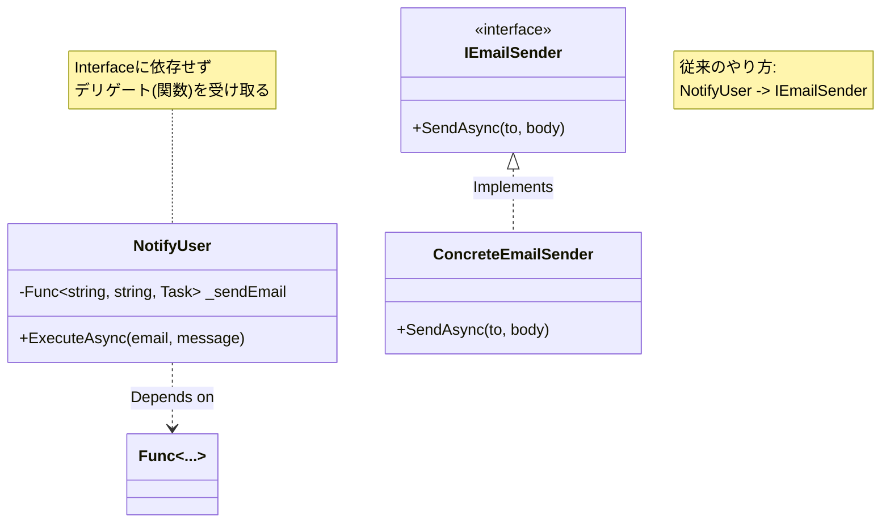
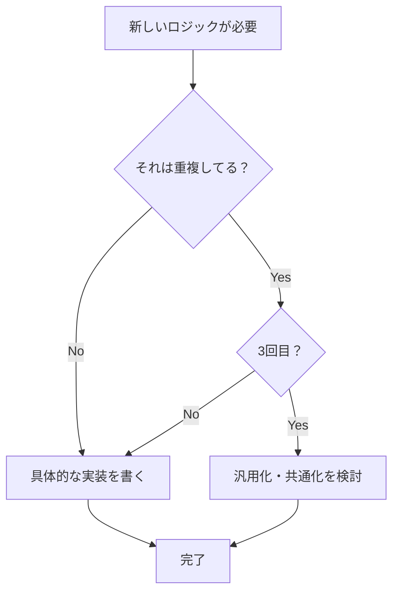

# 第05章：C#でやりがちな“未来用設計”を安全に先送りする 🧯🧠

この章では、「C#だとつい“それっぽい設計”を先に作っちゃう問題」を、**安全に・気持ちよく・あとで困らない形で**先送りする練習をします😊💕

（いまの最新環境だと、.NET 10 は LTS（長期サポート）で、C# 14 も同時期に出ています📦✨）([Microsoft Learn][1])
（Visual Studio 2026 も一般提供が始まっていて、AI支援を前提にした流れが強いです🤖💡）([Microsoft for Developers][2])

---

## この章のゴール🎯✨

終わるころには、次ができるようになります😊

* 「interface まだ要らないかも」を**理由付きで**言える🗣️🧠
* DIコンテナを入れずに、**手動注入で気持ちよく進める**📦➡️🧩
* パターンやジェネリクスの“先走り”を止めて、**必要になった瞬間にだけ入れられる**✂️✨
* AI（Copilot/Codex系）に盛られた提案を、**上手に削る**🧯🤖

---

## まず知っておく：C#の「未来用設計」あるある😅🎭

C#って、良い道具がいっぱいあるぶん、こうなりがち👇

* **Interface先行**：「とりあえず `IService` 作っとこ！」🪓
* **DIコンテナ先行**：「最初から `AddScoped` して Host 作っとこ！」📦
* **パターン先行**：「Strategy/Factory/Repository入れとこ！」🎭
* **ジェネリクス汎用化先行**：「何でも `IRepository<T>`！」🧬

これ、悪ではないんだけど…
**“困ってないのに入れる”と、理解コストと変更コストが先に爆発**します💥😭

YAGNI的には、ここで合言葉：

> ✅ **痛みが出てから、最小の道具を足す**
> ✅ **ただし、あとで足せるように“手すり”だけ付ける**🧤✨

---

## “先送り”を安全にする「4つの手すり」🧤🧱🧪🗺️

先送りって、雑にやると事故るので、最低限これだけ付けます😊

### ① 依存の組み立て場所を1か所に寄せる（Composition Root）🧩

`new` が散らばると、後からDIコンテナに移行しづらいです💦
なので最初から「組み立てはここ！」を作ると強い💪✨

### ② 境界は“フォルダ”でいい（最初は）📁


DDDが初めてでもOK🙆‍♀️
最初はこれで十分です👇

* `Domain/`（ルール・値・エンティティ）
* `UseCases/`（アプリの操作）
* `Infrastructure/`（DB/外部API/ファイル）

### ③ テストは“1〜2本”でいい（守りの要）🧪✨

先送りするなら、**変更しても壊れてない**を確認できる最低限が大事！

### ④ 変更が起きそうな場所は“引数”で渡せる形にする🎁

interface にしなくても、**デリゲート**や**設定オブジェクト**で逃げ道は作れます😺

---

## interface はいつ切る？🪓（結論：差し替えの痛みが出てからでOK）


### ✅ interface を“今”切るサイン（どれか当てはまったら）👀🚨

* 実装が **2つ以上、すでに存在**してる（予定じゃなくて現物）✌️
* テストで差し替えたいのに、**差し替えが辛すぎて**毎回つらい😭
* 外部（API/DB/メール等）との境界で、**失敗パターンが多く**テストが地獄🔥

### ✅ まだ切らなくていいサイン（先送りしてOK）🌿

* 実装が1つしかない（「将来増えるかも」は未来の自分に任せよ🕊️）
* そもそも差し替える要件がまだ無い
* “それっぽくしたい”以外の理由が説明できない😅

---

## interface を作らずにテスト可能にする（デリゲート注入）🧪🎁

「メール送信」とかは、interface 先に作りがちですが…
最初はデリゲートで十分なこと、めちゃ多いです😊✨

```csharp
// UseCases/NotifyUser.cs
public sealed class NotifyUser
{
    private readonly Func<string, string, Task> _sendEmail;

    public NotifyUser(Func<string, string, Task> sendEmail)
        => _sendEmail = sendEmail;

    public Task ExecuteAsync(string email, string message)
        => _sendEmail(email, message);
}
```



テストではこう👇（“送ったこと”だけ確認）

```csharp
using System.Collections.Generic;
using System.Threading.Tasks;
using Xunit;

public class NotifyUserTests
{
    [Fact]
    public async Task ExecuteAsync_sends_email()
    {
        var sent = new List<(string Email, string Message)>();

        Task FakeSend(string e, string m)
        {
            sent.Add((e, m));
            return Task.CompletedTask;
        }

        var useCase = new NotifyUser(FakeSend);

        await useCase.ExecuteAsync("a@example.com", "hi!");

        Assert.Single(sent);
        Assert.Equal(("a@example.com", "hi!"), sent[0]);
    }
}
```

🎀ポイント

* interface無しで差し替えできる
* 依存の形がシンプル（学習コスト小）
* 本当に必要になったら、後で `IEmailSender` に昇格できる✨

---

## DIコンテナはいつ入れる？📦（結論：手動注入で詰み始めたら）

.NET には標準のDIがあって便利だけど、**最初から入れると構成が理解しづらい**ことも多いです😵‍💫
（IDEもどんどんAI前提になってるので、なおさら“見通し”が大事！）([Microsoft for Developers][3])

### ✅ まずは手動注入（超おすすめ）🧩✨

```csharp
// Program.cs（例：コンソールでもWebでも“組み立てだけ”は同じ考え）
var sendEmail = (Func<string, string, Task>)(async (to, msg) =>
{
    // ここは仮実装でOK（ログ出すだけでもOK）
    Console.WriteLine($"[Email] to={to} msg={msg}");
    await Task.CompletedTask;
});

var notifyUser = new NotifyUser(sendEmail);

await notifyUser.ExecuteAsync("a@example.com", "hello!");
```

### ✅ DIコンテナ導入の“痛みサイン”👀🚨

* `new` が増えすぎて、**組み立てが読めない**📛
* スコープ（Webのリクエスト単位等）やライフサイクル管理が必要になった🧯
* 構成が複雑で、手動注入が“手作業地獄”になった🫠

このタイミングで入れると、**「助けになる」導入**になります😊✨

---

## パターンはいつ使う？🎭（結論：困りごとから入る）

### ありがちな失敗例😅

「Strategyっぽくしたい！」で最初から分けると、クラスが増えて迷子になります🐣💦

### ✅ まずは if / switch でOKな場面🍰

* 種類が 1〜2個
* 追加の頻度が不明
* まだ仕様が揺れてる

```csharp
public decimal CalcShippingFee(string prefecture, decimal price)
{
    if (prefecture == "Tokyo") return 0;
    if (price >= 5000) return 0;
    return 500;
}
```

### ✅ Strategy に上げるサイン🚀

* 条件分岐が **複数箇所にコピペ**され始めた
* 種類が増えて、ifが長くなって読みづらい
* 追加が頻繁で、毎回既存コードをいじって事故る💥

そのとき初めて、最小のStrategyへ🎭✨

---

## ジェネリクス汎用化の目安🧬（結論：重複が“痛い”まで待つ）

### ❌ 早すぎる例（ありがち）😇

`IRepository<T>` を先に作って、結局 `T` ごとに例外処理が増えて破綻…💣

### ✅ 先にやるべき順番（おすすめ）🌿

1. まずは **具体的な `UserRepository`** を作る
2. “同じ構造の重複”が3回くらい出てから
3. 初めて「共通化できる形」を検討する

これだと、「共通化の形」が現実に合うので成功しやすいです😊✨




---

## ミニ演習📝：「先に作り込み版」をYAGNI的に削る✂️✨

### お題🎯

「ユーザー登録 → ウェルカム通知」だけやりたいのに、最初から盛り盛りになってるコードを削ります😺

#### 作り込み版（わざと過剰😅）

```csharp
public interface IEmailSender { Task SendAsync(string to, string body); }

public interface INotifier<T>
{
    Task NotifyAsync(T target, string message);
}

public sealed class EmailNotifier : INotifier<User>
{
    private readonly IEmailSender _sender;
    public EmailNotifier(IEmailSender sender) => _sender = sender;

    public Task NotifyAsync(User target, string message)
        => _sender.SendAsync(target.Email, message);
}

public sealed class RegisterUserUseCase
{
    private readonly INotifier<User> _notifier;
    public RegisterUserUseCase(INotifier<User> notifier) => _notifier = notifier;

    public async Task ExecuteAsync(User user)
    {
        // 登録処理（省略）
        await _notifier.NotifyAsync(user, "Welcome!");
    }
}

public sealed record User(string Email);
```

### やること（チェックリスト）✅✅✅

* `INotifier<T>` のジェネリクスをやめる（今は User しかない）🧬✂️
* interface を消してもテストできる形にする（デリゲート注入）🧪
* クラス数を減らして、読みやすくする📉✨

### 目標の形（例）🌟

「これだけ」でOKにする👇

* `RegisterUserUseCase`
* 依存は `Func<string, string, Task>`（送信関数）
* テストは1本でOK

---

## AI活用🤖：AIに“逆質問”させて判断材料を出す 🧠🧯

AIって放っておくと盛りがちなので、指示がコツです😆🎈

### ① 盛らせない指示テンプレ🧾

* 「**いまの要件だけ**で。拡張性の仕組みは入れないで」
* 「クラス増やさないで。増えるなら理由を先に質問して」
* 「interface/DIコンテナ/デザインパターンは**禁止**。必要になった“痛み”を列挙して」

### ② 逆質問テンプレ（おすすめ！）🕵️‍♀️

* 「この interface を導入する“今の痛み”は何？（将来じゃなく今）」
* 「差し替えが必要な実装は、現時点で何個ある？」
* 「それを入れないとテストが成立しない？成立するなら最小案は？」

### ③ レビュー用テンプレ（過剰設計検出）🔍

* 「このPR、YAGNI違反っぽいところを3つ挙げて。削る案も出して」
* 「クラス数を減らすリファクタ案を提示して（振る舞いは維持）」

（Visual Studio 側でも Copilot が統合されて、検索や支援が強化されてるので、こういう“制約つき指示”が効きます🤖✨）([The GitHub Blog][4])

---

## 成果物📦：C#版YAGNI判断ルール集（この章のまとめ）🧠✨

最後に、あなた用のルールとしてこのままコピペOKです🫶💕

* interface は「**実装が2個以上**」「**テスト差し替えが地獄**」になったら切る🪓
* それまでは **デリゲート注入** で逃げ道を作る🎁
* DIコンテナは「**組み立てが読めない**」「**手動注入が苦痛**」になったら入れる📦
* パターンは「**分岐が散らかる/コピペが増える**」まで我慢🎭
* ジェネリクス共通化は「**同型の重複が3回くらい**」出てから🧬
* 先送りする代わりに、**組み立て場所1か所 + テスト1〜2本**は付ける🧤🧪

---

次の章（第6章）では、この判断を“手順”として回せるように、**YAGNI開発フロー**に落としていきます🚶‍♀️✨

[1]: https://learn.microsoft.com/en-us/dotnet/core/whats-new/dotnet-10/overview?utm_source=chatgpt.com "What's new in .NET 10"
[2]: https://devblogs.microsoft.com/visualstudio/visual-studio-2026-is-here-faster-smarter-and-a-hit-with-early-adopters/?utm_source=chatgpt.com "Visual Studio 2026 is here: faster, smarter, and a hit with ..."
[3]: https://devblogs.microsoft.com/visualstudio/visual-studio-november-update-visual-studio-2026-cloud-agent-preview-and-more/?utm_source=chatgpt.com "Visual Studio 2026 November 2025 Update"
[4]: https://github.blog/changelog/2025-12-03-github-copilot-in-visual-studio-november-update/?utm_source=chatgpt.com "GitHub Copilot in Visual Studio — November update"
