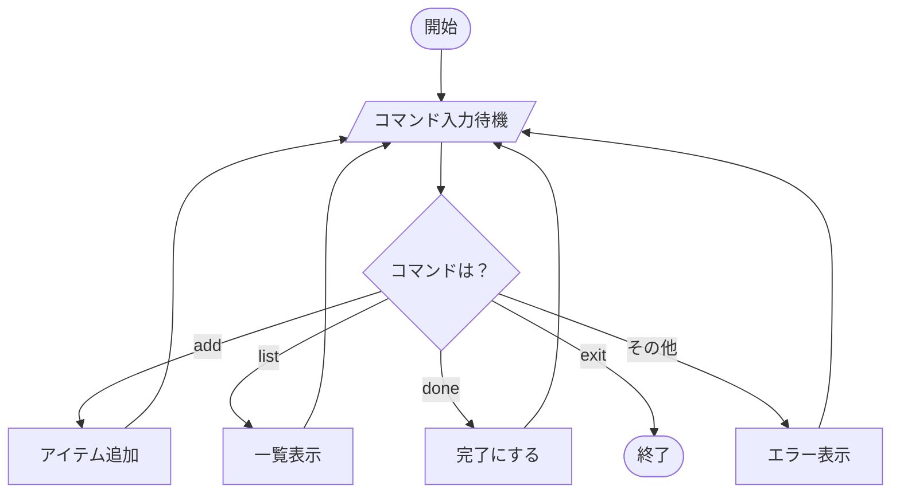

# 第06章：YAGNIで進める開発フロー（基本）🚶‍♀️✨

この章は「YAGNIって分かったけど、**実際の手順としてどう回すの？**」を“手が動く形”にする回だよ〜！🫶💡
（今どきの C# は .NET 10 / C# 14 が基準で進めやすいよ〜）([Microsoft Learn][1])

---

## 1. まず結論：YAGNIは「ループ」で回すと強い 🔁🌱


YAGNIの実戦は、だいたいこの4つを**1セット**にして回すのが最強です💪✨

1. **MVP（次に出す価値）を決める** 🍰
2. **最小実装（まず動く）** 🧱
3. **小リファクタ（整える）** 🧹
4. **次の1歩を選ぶ（また小さく）** 👣

これを回すだけで、「将来のための作り込み」が入り込むスキがめちゃ減るよ〜😇🧯

---

## 2. “1ループ”のテンプレ（そのまま使えるやつ）📌✨

### 2.1 まずはカード1枚に落とす（ここ超大事！）📝💗

実装に入る前に、**カード1枚**だけ書く！
（長文仕様書はこの章では不要〜！✂️）

**テンプレ：ユーザーストーリー（1行）**

* 「私は〇〇として、△△したい。なぜなら□□だから。」

**テンプレ：受け入れ条件（3〜5個まで）✅**

* ✅ 〜できる
* ✅ 〜の場合はこうなる
* ✅ 表示は最低限こうなる
* ❌ 今回は〜しない（←ここがYAGNIの盾🛡️）

**テンプレ：やらないこと（2〜3個）🙅‍♀️**

* 🙅‍♀️ 検索はまだ
* 🙅‍♀️ DBはまだ
* 🙅‍♀️ 並び替えはまだ
  みたいに、**未来の地雷を先に「今じゃない」宣言**しちゃうのがコツ！

---

## 3. ①MVP：次に出す“価値”を1つだけ選ぶ 🍰✨

### MVPの決め方（迷ったらこれ）🧭

* 「ユーザーが今日うれしい？」😊
* 「デモできる？（動く？見える？）」👀
* 「失敗しても直せるサイズ？」🧯
* 「受け入れ条件が3〜5個で書ける？」✍️

**ポイント：機能じゃなく“価値の薄切り”**にするよ〜🍞✨
例：

* ❌「タスク管理を作る」
* ✅「タスクを1件登録して、一覧で見れる」

---

## 4. ②最小実装：「まず動く」を最優先 🧱🏃‍♀️

### 最小実装のルール（YAGNI用）🧠🧯

* ✅ **最短のコードで動かす**（キレイは後でOK）
* ✅ **抽象化はしない**（痛くなってからでいい）
* ✅ **分岐は増やさない**（要件分だけ）
* ✅ **拡張ポイントを作らない**（将来対応の“穴”を掘らない）

ここで「いい感じの設計にしたくなる病」が出るんだけど…それは第5章で止めたやつ！😇🛑

### AI（Copilot/Codex）に頼むときの“盛らせない”指示🤖🎈✂️

このままコピって投げてOKだよ〜👇
（Visual StudioのCopilotは、最近コンテキストメニューから説明/最適化などもしやすくなってるよ）([The GitHub Blog][2])

```text
目的：受け入れ条件を満たす最小実装だけ作って。
禁止：将来拡張のための抽象化、余計なレイヤー、Repository/Serviceの新設、DI導入。
方針：1ファイル増える程度まで。読みやすさは最低限でOK。動作優先。
出力：変更点の要約→コード→簡単な動作確認手順。
```

---

## 5. ③小リファクタ：「小さく整える」🧹✨

最小実装が動いたら、**1回だけ整える**🧼
ここでの目的はただ一つ！

> 「次の変更が怖くない状態」にする 😌🛡️

### 小リファクタのチェック（やりすぎ防止）👀

* ✅ 同じ処理が2回以上？ → **関数にする**
* ✅ 名前がぼんやり？ → **命名だけ直す**
* ✅ 条件分岐が増えた？ → **ガード節で読みやすく**
* ✅ テストが1本もない？ → **超ミニで1本だけ**🧪

※ここで「完璧設計」を目指すとYAGNIが死ぬよ〜😇⚰️

---

## 6. ④次の1歩：「次にやるのは1個だけ」👣✨

ここでやることはシンプル！

* ✅ 受け入れ条件、満たした？
* ✅ “やらないこと”守れた？
* ✅ 次の価値はどれ？（候補3つ出して1つ選ぶ）

**選ぶコツ**：
「変更が小さく済みそうなやつ」を優先すると、YAGNI的に勝ちやすい🏆✨

---

## 7. YAGNIチェック観点（この章のメイン武器）👀🧨

迷ったら、この2つを唱えるだけでだいぶ勝てるよ〜😆🪄

### ✅ 観点1：「受け入れ条件に必要？」

* 必要なら作る
* 必要じゃないなら作らない（将来の自分に任せる）

### ✅ 観点2：「未来のための仕組み増えてない？」

* “拡張のための何か” を入れたくなったら赤信号🚥

  * interface
  * 汎用化ジェネリクス
  * 先回りの設定
  * 使うか分からないオプション
  * 予定だけのフォルダ/レイヤー

---

## 8. ミニ演習：第4章アプリに“小変更”を入れて差分を見る 👣📝✨

ここでは、（第4章の）「登録→一覧」アプリを想定して、**変更1個**だけ入れるよ〜！🎯
題材：**「完了フラグを付ける」** ✅☑️

### 8.1 今回のカード（例）📝

**ストーリー**

* 私はユーザーとして、タスクを完了にできるようにしたい。なぜなら終わったものを区別したいから。

**受け入れ条件 ✅**

* ✅ タスク作成時は未完了
* ✅ 一覧に `[ ]` / `[x]` で状態が表示される
* ✅ `done <id>` で完了にできる
* ✅ 存在しない id はエラーメッセージ

**やらないこと 🙅‍♀️**

* 🙅‍♀️ 未完了だけ表示、みたいな絞り込みはまだ
* 🙅‍♀️ DB保存はまだ
* 🙅‍♀️ 取り消し（undone）はまだ

### 8.2 最小実装（例：コンソール）🧱

※「動けばOK」版。今はキレイすぎなくてOKだよ〜😆✨

```csharp
using System;
using System.Collections.Generic;
using System.Linq;

public record TodoItem(Guid Id, string Title, bool IsDone);

public static class Program
{
    private static readonly List<TodoItem> _items = new();

    public static void Main()
    {
        Console.WriteLine("Todo CLI: add <title> / list / done <id> / exit");

        while (true)
        {
            Console.Write("> ");
            var line = Console.ReadLine();
            if (string.IsNullOrWhiteSpace(line)) continue;

            var parts = line.Split(' ', 2, StringSplitOptions.RemoveEmptyEntries);
            var cmd = parts[0].ToLowerInvariant();

            if (cmd == "exit") break;

            if (cmd == "add")
            {
                if (parts.Length < 2 || string.IsNullOrWhiteSpace(parts[1]))
                {
                    Console.WriteLine("title が必要だよ〜🫠");
                    continue;
                }

                var item = new TodoItem(Guid.NewGuid(), parts[1].Trim(), IsDone: false);
                _items.Add(item);
                Console.WriteLine($"追加したよ🎉 id={item.Id}");
                continue;
            }

            if (cmd == "list")
            {
                if (_items.Count == 0)
                {
                    Console.WriteLine("まだ0件だよ〜🌱");
                    continue;
                }

                foreach (var it in _items)
                {
                    var mark = it.IsDone ? "[x]" : "[ ]";
                    Console.WriteLine($"{mark} {it.Id} {it.Title}");
                }
                continue;
            }

            if (cmd == "done")
            {
                if (parts.Length < 2 || !Guid.TryParse(parts[1], out var id))
                {
                    Console.WriteLine("done <id> の形式でお願い🙏");
                    continue;
                }

                var idx = _items.FindIndex(x => x.Id == id);
                if (idx < 0)
                {
                    Console.WriteLine("その id は見つからなかったよ〜🥲");
                    continue;
                }

                var old = _items[idx];
                _items[idx] = old with { IsDone = true };
                Console.WriteLine("完了にしたよ〜✅");
                continue;
            }

            Console.WriteLine("知らないコマンドだよ〜🫣");
        }
    }
}
```




### 8.3 小リファクタ（この演習では“やるならこの程度”）🧹

* `done` の検索と更新が読みにくい → `MarkDone(id)` に抜き出す（**1回だけ**）
* `list` の `[x]` 表示は良いけど、文字列組み立てを関数にしてもOK
* 余裕があったらテスト1本🧪（「存在しないidでエラー」みたいなやつ）

**注意⚠️**：ここで Repository とか DI とか始めたら、今回の変更のサイズに対して重すぎ！😂🧨

---

## 9. 成果物：あなた用「YAGNI開発フロー手順メモ」📦✨

これ、メモ帳に貼っておくと超便利だよ〜🫶💕

### ✅ 毎回これだけ（コピペ用）📌

* 📝 **カードを書く**（ストーリー1行＋受け入れ条件3〜5＋やらないこと）
* 🧱 **最小実装**（余計な拡張ポイント禁止）
* 🧪 **（できれば）ミニテスト1本**
* 🧹 **小リファクタ1回**（重複/命名/ガード節だけ）
* 👣 **次の1歩を1個選ぶ**（候補3→1）
* 👀 **YAGNIチェック**

  * 「受け入れ条件に必要？」✅
  * 「未来の仕組み増えてない？」🧨

---

必要なら、この第6章の流れを「Visual Studioでの操作手順（クリック順）」版📸と、「VS Code + dotnet CLI」版⌨️に分けて、同じ内容で書き直すよ〜😆✨

[1]: https://learn.microsoft.com/en-us/dotnet/core/releases-and-support?utm_source=chatgpt.com ".NET releases, patches, and support - .NET"
[2]: https://github.blog/changelog/2025-12-03-github-copilot-in-visual-studio-november-update/?utm_source=chatgpt.com "GitHub Copilot in Visual Studio — November update"
