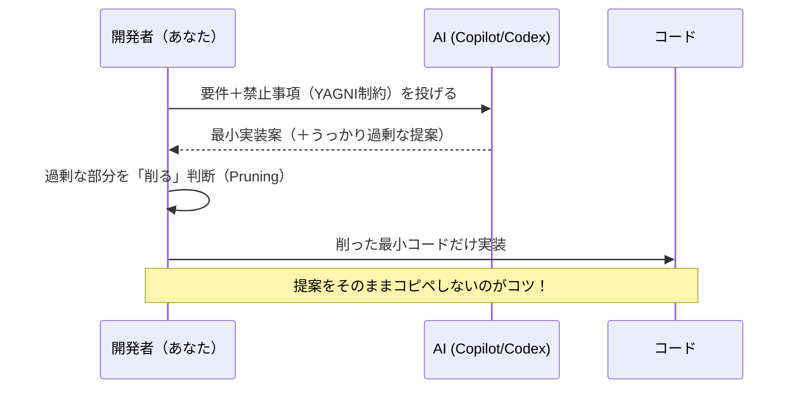

# 第07章：AIと一緒にYAGNI（盛らせない使い方）🤖🧯

この章はね、「AIを使う＝ラクできる！」だけじゃなくて、**AIの“盛りグセ”を逆手にとって、YAGNIを守りながら爆速で作る**のがゴールだよ〜！🎯💨

---

## 7-1. この章のゴール（できるようになること）🎓✨

最後までやると、こんな力がつくよ🫶

* AIに頼みつつ、**必要以上の抽象化（interface地獄とか）を止められる**🛑🧩
* AIの提案をそのまま採用じゃなくて、**「削ってシンプルにする」判断**ができる✂️🙂
* Copilot / Codex を「実装係」じゃなくて **“設計の監視役・レビュー役”**にできる👀🤖
* 「いま必要」の範囲で、**安全に速く進めるテンプレ**が手に入る🧰✨

---

## 7-2. AIが“盛りがち”な理由（知っておくと勝てる）🎈😅


AIって親切だから、ついこういう方向に行きがち👇

* 将来の拡張を想定して、**レイヤーを増やす**（Application / Domain / Infrastructure…）🏗️
* すぐ **Repository + UnitOfWork + DTO + Mapper** を並べる🧱🧱🧱
* まだ差し替え予定もないのに **全部interface化**する🪓😇
* 「あとで便利」を理由に、**設定・抽象・汎用化を最初から入れる**🧨

でもね、これはAIが悪いんじゃなくて、**指示が曖昧だと“優等生回答”になる**だけなの🥺
だから、こっちが主導権を握ればOK！💪✨

---

## 7-3. “盛らせない”指示の基本ルール3つ 🧾🧯


### ルール①：スコープを先に固定する📌

AIにまず「今回はここまで」って柵を立てる感じ🐑✨

* いまの受け入れ条件にないものは入れない
* 将来の拡張は「コメントでTODOを書く」までで止める
* DBやキャッシュやDIコンテナ導入は、必要が出てから

---

### ルール②：禁止事項をハッキリ書く🚫

これ、めっちゃ効く！😆

* 「余計な抽象化は禁止」
* 「新しいライブラリ追加禁止（標準だけ）」
* 「interfaceは作らない（必要になったらその時）」
* 「フォルダ増やさない（ファイルは最大3つまで）」📁✋

---

### ルール③：出力フォーマットを指定する🧩

AIって文章でもコードでも盛るから、枠を決めると安定するよ✨

* 「変更ファイル一覧→差分→理由→テスト」みたいに固定
* 「まず最小案、そのあと“やらない案”リスト」も超おすすめ✂️📝

---

## 7-4. 2026時点のAI開発“いまどき事情”ざっくり最新版🧠🆕✨

* **.NET 10（LTS）**が出てて、サポートは**2028-11-10まで**だよ📅✨ ([Microsoft for Developers][1])
* **Visual Studio 2026**では、Copilotがより深く統合されてきてる流れだよ〜🧠⚡ ([Visual Studio][2])
* Visual StudioのCopilotは「チャットウィンドウ」と「インラインチャット」で使い分けできて、提案は差分表示でレビューしてから適用できるのが強い💡🪄 ([Microsoft Learn][3])
* Copilotはプランがいくつかあって、Freeだと回数制限つき（例：月50のチャット/agent系リクエスト等）みたいに“枠”があるよ📦 ([GitHub][4])
* VS Code側は **agent mode** がいて、複数ファイル編集やテスト実行まで回す「ちょい自律型」🧑‍💻🤖（だからこそ、YAGNIの柵が超大事！） ([Visual Studio Code][5])
* GitHubの「Copilot Extensions（GitHub App型）」は **2025-11-10でサンセット**して、今は **MCP** 方向（ツール連携の共通規格）に寄ってるよ🧩🔌 ([The GitHub Blog][6])
* OpenAI Codexも「エージェント型」で、クラウド環境でタスクを回したり、CLI/IDE拡張でスキル（再利用できる指示セット）を使える流れがあるよ🤖🛠️ ([OpenAI][7])

> まとめると：2026は **“AIが自律っぽく動ける”時代**だから、
> **「何をやらせないか」＝YAGNIの価値がさらに上がってる**ってことだね😎🔥

---

## 7-5. Copilot / Codex を“YAGNI向け”に使う役割分担 🧑‍🍳🤖


AIに全部やらせようとすると盛るので、役割分担が最強！✨




### ✅ AIが得意な役（任せてOK）🎁

* 受け入れ条件の叩き台づくり✅
* 既存コードの説明・理解サポート📖
* “いまの実装”の範囲でのコード補完（細部）🧩
* テストのひな形（最小の数で）🧪
* リファクタ候補の列挙（**採用するかは人間**）🔧

Copilot Chat は IDE内で質問したり、インラインで「このファイルをこう直して」ってやれるのが便利だよ✨ ([Microsoft Learn][3])

---

### ⚠️ AIが盛りがちな役（人間が主導）🧯

* “アーキテクチャ決め”（レイヤーやパターン選定）🏗️
* “ライブラリ選定”（勝手に追加してくる）📦
* “将来の拡張のための抽象化”（YAGNI敵）🧨

ここはAIを「提案係」にして、採用は最小だけにする✂️🙂

---

## 7-6. “生成 → 削る”が基本ワークフロー ✂️🤖✨


YAGNI×AIの基本ムーブはこれ！💃

1. **AIに最小案を出させる**（最初から制約つき）🧾
2. **AIにセルフツッコミさせる**（過剰設計チェック）👀
3. **削る（削った理由も1行で残す）**✂️📝
4. **実装→最小テスト**🧪
5. **次の要件が来るまで拡張しない**🚪🙂

---

## 7-7. “盛らせない”プロンプトテンプレ集（コピペOK）📚✨


### A) 最小実装を出させるテンプレ🧱

```text
あなたはYAGNI最優先の実装者です。
次の要件だけを満たす最小の実装を提案してください（将来拡張・汎用化は禁止）。
禁止：interface追加、Repository/UnitOfWork導入、DIコンテナ導入、新ライブラリ追加、層の増加。
出力：①最小設計（箇条書き）②変更ファイル一覧③コード④最小テスト（2〜3本）
要件：<ここに要件>
```

---

### B) AIに「過剰設計監査官」をやらせるテンプレ🕵️‍♀️🧯

```text
次の提案（または差分）について、YAGNI観点で過剰設計の疑いがある点を列挙して。
各項目に「今必要な根拠があるか？」をYes/Noで答え、Noなら削る代案を出して。
出力は表形式ではなく、箇条書きで。
対象：<ここにAIの提案 or PR差分>
```

---

### C) “削る方針”を決めるテンプレ✂️

```text
この実装案を「変更量が最小」「理解コストが最小」になるように削ってください。
削る時の優先順位：
1. 余計な抽象化（interface/パターン）
2. 余計なレイヤー/フォルダ
3. 余計な設定・拡張ポイント
ただし要件は必ず満たすこと。
```

---

### D) インラインチャットで「このファイルだけ直して」用テンプレ🧷

```text
このファイルだけを編集して要件を満たして。
他のファイル追加は禁止。抽象化は禁止。
変更点は最小にして、最後に「変更理由」を3行で書いて。
要件：<ここに要件>
```

（Visual StudioのCopilotはインラインチャットで提案→差分レビュー→採用/破棄がやりやすいよ🪄✨ ([Microsoft Learn][3])）

---

## 7-8. ミニ演習：AI提案を“削って勝つ”練習 ✂️🏆✨


### お題🎯：第4章アプリに「並び替え」を追加する🔁

要件はこれだけ👇

* 一覧表示を「作成日時の降順」にする
* 追加の要件（検索・ページング・DB化）は今回は不要🙅‍♀️

#### Step1：AIに最小案を出させる🤖

上のテンプレAでOK！

#### Step2：AIが盛ったら、監査する👀

テンプレBで「それ今いる？」をYes/Noで潰す✅❌

#### Step3：削る✂️

テンプレCで「変更量最小」に寄せる
（だいたいAIは“並び替え戦略パターン”とか言い出すから笑、そこを削る🤣✂️）

#### Step4：最小テスト🧪

* 「追加したメモが先頭に来る」みたいなテストを2本くらいでOK🙆‍♀️

---

## 7-9. VS / VS Code での“盛らせない”運用Tips 🧠✨


### Visual StudioのTips（YAGNI向け）🪄

* まずは **インラインチャット**で「このファイルだけ直して」って言うと暴走しにくいよ✍️✨ ([Microsoft Learn][3])
* Copilotは **/（意図）**や **#（参照）**を使う小技があるので、指示が締まるよ🧷（例：#solution参照など） ([Visual Studio][8])
* 右クリックのコンテキストメニューに Copilotアクションが増えてる流れもあるから、「説明だけ」「最適化だけ」みたいに用途を絞るとYAGNIしやすい🧯 ([The GitHub Blog][9])

### VS CodeのTips（agent mode注意⚠️）🤖

agent mode は複数ファイル編集・テスト実行まで回せる分、**勝手に“それっぽい設計”を作りがち**😅
だから、プロンプトの最初にこれを付けるのおすすめ👇

```text
agent modeで実行するけど、アーキテクチャ変更は禁止。
ファイル追加は最大1つ。新ライブラリ追加禁止。interface追加禁止。
要件を満たす最小の差分だけ作って。
```

（agent mode が自律ループで編集/コマンド/テストを回す性質があるのは公式でも説明されてるよ🧠 ([Visual Studio Code][5])）

---

## 7-10. 仕上げ：Copilot/Codex用 “YAGNIプロンプト集（最終版）” 📦✨

最後に、普段使いしやすい短いやつ置いとくね🫶（コピペOK）

### ✅ 仕様整理

```text
要件をMVPに削って。今回やらないことも3つ挙げて。
```

### ✅ 実装（最小）

```text
最小の差分で。禁止：interface/DI/Repository追加。新規ファイル追加なし。
```

### ✅ レビュー（YAGNI）

```text
これ、将来のための作り込みになってる所ある？今必要な根拠が弱い所を指摘して。
```

### ✅ テスト（最小）

```text
守りたい挙動だけに絞って、2〜3本のユニットテストを書いて。
```

### ✅ “やらない理由”のメモ（地味に超効く📝）

```text
今回入れなかった設計要素（例：DB化/抽象化/DI）と、その理由を1行ずつ書いて。
```

---

## この章のまとめ 🎀✨

AI時代のYAGNIはね、
**「AIに作らせる」より「AIの提案を削る」ほうが上手くいく**よ✂️😆

次の第8章では、追加要件を1個だけ入れて「小さく育てる」を完成させようね〜！🎓🌱✨

[1]: https://devblogs.microsoft.com/dotnet/announcing-dotnet-10/ "Announcing .NET 10 - .NET Blog"
[2]: https://visualstudio.microsoft.com/insiders/ "
	Visual Studio 2026 Insiders - Faster, smarter IDE"
[3]: https://learn.microsoft.com/en-us/visualstudio/ide/visual-studio-github-copilot-chat?view=visualstudio "About GitHub Copilot Chat in Visual Studio - Visual Studio (Windows) | Microsoft Learn"
[4]: https://github.com/features/copilot/plans "GitHub Copilot · Plans & pricing · GitHub"
[5]: https://code.visualstudio.com/blogs/2025/02/24/introducing-copilot-agent-mode "Introducing GitHub Copilot agent mode (preview)"
[6]: https://github.blog/changelog/2025-09-24-deprecate-github-copilot-extensions-github-apps/ "Sunset notice: GitHub App-based Copilot Extensions - GitHub Changelog"
[7]: https://openai.com/index/introducing-codex/ "Introducing Codex | OpenAI"
[8]: https://visualstudio.microsoft.com/github-copilot/ "
	Visual Studio With GitHub Copilot - AI Pair Programming"
[9]: https://github.blog/changelog/2025-12-03-github-copilot-in-visual-studio-november-update/ "GitHub Copilot in Visual Studio — November update - GitHub Changelog"
