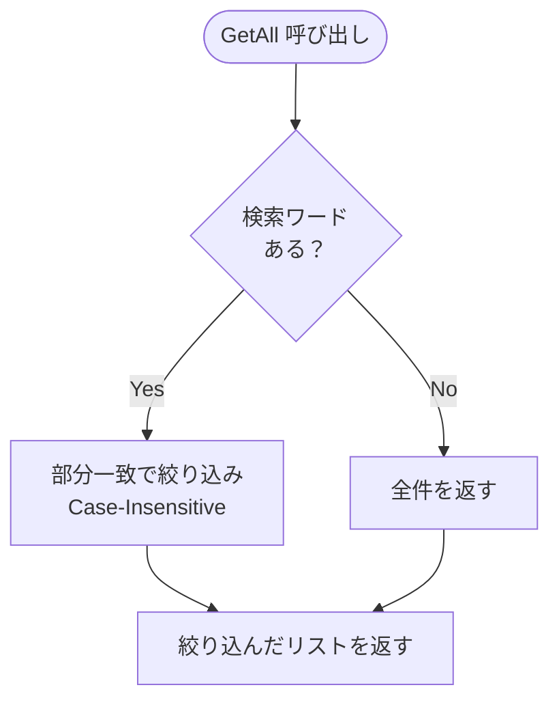

# 第08章：最終ミニ課題（追加要件1つで育てる）🎓🌱

この章は「YAGNIで作った最小アプリ」に、**追加要件を“たった1つだけ”**入れて、**差分が小さいまま成長させる体験**をするよ〜！🥳✨
（ちなみに今の最新は **.NET 10（LTS）＋ C# 14** だよ〜🧡 ([Microsoft for Developers][1])）

---

## 0. まずゴール確認しよっ 🎯💕

この章が終わったら、こんな状態になってたら勝ち🏆✨

* ✅ 追加要件を **1つだけ** 実装できた
* ✅ 変更差分が小さい（＝勝ち💯）
* ✅ 「入れなかった理由」を **軽ADR 1枚** に書けた🗒️
* ✅ YAGNIチェックで自己採点できた✅

---

## 1. 今回の題材（前章までの“最小アプリ”）📦✨

第4章で作った「カフェメモ（CafeMemo）」をそのまま使うよ☕
（登録して、一覧で見るだけのコンソールアプリ📱）

### できてる状態（v1）✅

* `add <店名>` で登録できる ➕
* `list` で全件表示できる 📃
* テストが少しある（最低限）🧪

---

## 2. 追加要件は「1つだけ」選ぶよ✂️😤

ここ超大事〜！2つ選びたくなるのをグッと我慢🥹✊

### 候補（どれか1個だけ）🌟

* A. **簡単検索**（コマンド引数で絞り込み）🔎 ←この章ではこれを“お手本”で進めるよ！
* B. メモの追記（登録時にメモも入れる）📝
* C. 削除機能（間違えたやつを消す）🗑️
* D. 並び替え（日付順/名前順）🔃

---

## 3. 今回の“お手本要件”：簡単検索🔎✨

`list` コマンドをちょっと賢くするよ！

### 受け入れ条件（Acceptance Criteria）✅

* ✅ `list` だけなら全件表示（今まで通り）
* ✅ `list <キーワード>` なら **店名に部分一致** したものだけ表示
* ✅ 大文字小文字は気にしない（case-insensitive）
* ✅ 追加パッケージなし（標準機能だけでやる）🚫📦

### 非ゴール（やらないこと）🙅‍♀️

* ❌ 全文検索エンジン
* ❌ 複雑なクエリ（AND/ORなど）
* ❌ 検索履歴の保存
* ❌ メモ欄の検索（今回は店名だけでOK）

---

## 4. 作業の進め方（YAGNIの型）🚶‍♀️✨

### ステップ0：現状を固定する📌

* `main`（or `master`）の状態でテストが通るのを確認✅
* `v1` みたいにタグを打つ or コミットメッセージを「v1」とわかるようにする

### ステップ1：ブランチを切る🌿

* `feature/search` みたいにする（気持ちが整うやつ🧘‍♀️）

### ステップ2：受け入れ条件を見える場所に置く👀

* Issue/README/メモ、どこでもOK！
* **「何を満たしたら終わり？」**を迷子にしないためだよ🧭✨

### ステップ3：最小の変更で実装→テスト→ちょい整える🔧🧪

* 実装（最小）
* テスト（最小）
* リファクタ（必要なら“ちょい”）

---

## 5. 実装例（CafeMemoに検索を足す）☕🔎✨

UI（Program.cs）でフィルタするのもアリだけど、ここは
**「ロジック（CafeLog）」に検索を持たせる** のがおすすめだよ🫶
理由：テストしやすいし、将来Web化したときもそのまま使えるから💡

---

### 5-1. `CafeLog` に引数を足す（最小変更）🧠

`GetAll()` を `GetAll(string? search)` に変えるだけ！

```csharp
public sealed class CafeLog
{
    // ... Addとかはそのまま ...

    // search引数を追加（デフォルトnull）
    public IReadOnlyList<CafeVisit> GetAll(string? search = null)
    {
        // 1. まず全部とる（DBならIQueryableの段階だけど、ListならこれでOK）
        var items = _visits.OrderByDescending(v => v.VisitedAt);

        // 2. 検索条件がなければそのまま返す（ガード節）
        if (string.IsNullOrWhiteSpace(search))
            return items.ToList();

        // 3. 絞り込んで返す（部分一致・大文字小文字無視）
        return items
            .Where(v => v.ShopName.Contains(search.Trim(), StringComparison.OrdinalIgnoreCase))
            .ToList();
    }
}
```

ポイント🌟



* わざわざ `SearchService` とか作らない
* `ISpecification` とか持ち出さない
* `List` の機能だけでサクッと終わらせる 🏃‍♀️💨

---

### 5-2. `Program.cs`（コマンド受付）を対応 🖥️

`list` コマンドの引数を見て、`GetAll` に渡すだけ！

```csharp
// ... 
else if (cmd == "list")
{
    // list の後に何か書いてあったら検索ワードにする
    var search = parts.Length > 1 ? parts[1] : null;

    // さっき変えた GetAll に渡すだけ！
    var all = log.GetAll(search);

    if (all.Count == 0)
    {
        Console.WriteLine("見つからなかったよ〜🍃");
        continue;
    }

    Console.WriteLine($"---- 一覧 ({all.Count}件) ----");
    foreach (var v in all)
    {
        Console.WriteLine($"{v.VisitedAt:MM/dd} {v.ShopName}");
    }
}
// ...
```

---

## 6. 最小テスト（検索が壊れてないか）🧪✨

### 6-1. `GetAll` をテストすれば安心💗

```csharp
public class CafeLogTests
{
    // ... 既存テスト ...

    [Fact]
    public void GetAll_検索ワードで絞り込める()
    {
        var log = new CafeLog();
        log.Add("スターバックス", "新作");
        log.Add("ドトール", "いつもの");
        log.Add("タリーズ", "ちょっと休憩");

        // "タ" で検索（スタバとタリーズが出るはず）
        var items = log.GetAll("タ");

        Assert.Equal(2, items.Count);
        Assert.Contains(items, x => x.ShopName == "スターバックス");
        Assert.Contains(items, x => x.ShopName == "タリーズ");
    }

    [Fact]
    public void GetAll_大文字小文字は無視する()
    {
        var log = new CafeLog();
        log.Add("Cafe M", "おしゃれ");

        // "cafe" (小文字) で検索してもヒットする
        var items = log.GetAll("cafe");

        Assert.Single(items);
        Assert.Equal("Cafe M", items[0].ShopName);
    }
}
```

---

## 7. 「差分が小さい＝勝ち」を目で確認しよう👀🏆


チェック観点👇

* ✅ 変更したファイル数、少ない？
* ✅ 新しい概念（クラス/インターフェイス/パッケージ）増やしてない？
* ✅ 受け入れ条件以上のことしてない？

**Gitの差分を見るだけで気持ちよくなれる章**だよ🤣💕

---

## 8. 軽ADR（1枚）🗒️✨ 〜“やらなかった理由”を書く〜

> ADRって「将来の自分への優しい手紙」だよ💌

テンプレ（コピペOK）👇

```text
# ADR: リスト検索は「コマンド引数での店名部分一致」とする

## 状況 / Context
登録数が増えてきて、`list` で全部出ると探しにくい。
追加要件は「検索を1つ」だけ。

## 決定 / Decision
`list <keyword>` の形式で受け取り、`ShopName` の部分一致で絞り込む。
大文字小文字は無視する（case-insensitive）。

## 理由 / Why
- 受け入れ条件を満たす最小実装で済む
- 追加パッケージ不要（LINQだけでいける）
- メモ欄まで検索するのはまだ過剰（YAGNI）

## 代替案 / Alternatives (今回は採用しない)
- 全文検索エンジンの導入（オーバースペック）
- `ISpecification` パターンでの検索条件クラス化（まだ複雑すぎる）
- 検索履歴の保存（要望がない）

## 影響 / Consequences
- 検索は「店名」だけに限られるが、現状はそれで十分
- 将来「メモも検索したい」となったら、GetAll のロジックを少し修正する
```

---

## 9. 最終チェック（YAGNI自己採点）✅💯

各1点で合計10点満点🎀（7点以上なら優勝🏆）

1. 追加要件は1つだけにできた？
2. 受け入れ条件を全部満たしてる？
3. 非ゴールを守れた？
4. 新しい抽象化（不要なクラス/IF）を増やしてない？
5. 追加パッケージ入れてない？
6. テストが最低1つ増えた？
7. 差分が小さい？
8. リファクタは“必要な分だけ”？
9. ADRが1枚ある？
10. 「次に必要になったら育てる」ポイントが1つ言える？

---

## 10. AI活用（盛らせないテンプレ🤖🧯）

### 実装前：AIに“最小差分プラン”だけ出させる📌

例プロンプト👇（Copilot Chat / CodexどっちでもOK）

```text
CafeMemoアプリ（コンソール）の `list` コマンドに「検索（店名部分一致）」を足したいです。
要件はこれだけ。非ゴールは全文検索、DB導入、複雑なクラス設計です。
変更差分を最小にする実装ステップを、3〜5手順で提案して。
新しいクラス追加は最小限で。
```

### 実装後：過剰設計チェックだけさせる🕵️‍♀️

```text
今の差分をレビューして、「YAGNI違反っぽい点」を最大3つだけ指摘して。
指摘は必ず「なぜ今は不要か」もセットで。
```

Visual Studio 2026 では Copilot が右クリックから呼べるアクションも増えてるから、**レビュー用途**に使うと楽だよ〜🖱️🤖 ([Microsoft Learn][2])

---

## 11. おつかれさま！🎉 次に育てるなら（でも今じゃない😤）

今回「店名だけ」では検索が足りないって痛みが出たら、次の候補👇

* 検索対象を「メモ欄」にも広げる
* 完了/未完了フィルタを追加する
* DBや全文検索を検討する（痛みが出てから！）

---

### さいごにひとこと🫶✨

この章でいちばん偉いのは、**“やらない”を守ったこと**だよ🥹💖
差分が小さいの、ほんと正義〜〜🏆🌱

[1]: https://devblogs.microsoft.com/dotnet/announcing-dotnet-10/?utm_source=chatgpt.com "Announcing .NET 10"
[2]: https://learn.microsoft.com/en-us/visualstudio/releases/2026/release-notes?utm_source=chatgpt.com "Visual Studio 2026 Release Notes"
