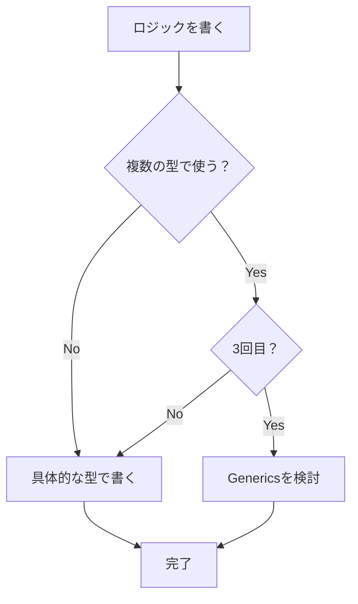
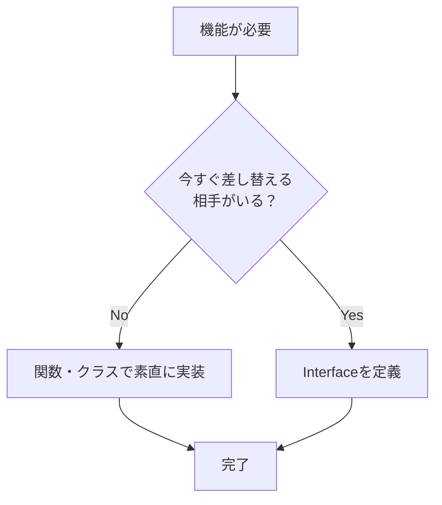

# 第02章：作り込みすぎのサインを見抜く 👀🚨

（対象：TypeScriptは初級〜中級／設計は超入門者）

> 2026/01/11 時点の情報メモ🗓️：TypeScript は 5.9.3 が “Latest” として公開されています。([GitHub][1])
> TypeScript 5.9 の公式リリースノートは 2026/01/07 に更新されています。([typescriptlang.org][2])
> VS Code は 1.108（2025年12月版）のリリース日が 2026/01/08 です。([Visual Studio Code][3])
> それと、VS Code の Copilot は「提案・説明・実装」まで手伝う方向に進化中だよ〜🤖✨([Visual Studio Code][4])

---

## 0. この章のゴール🎯✨

この章が終わると…

* 「それ今いる？🤔」を**根拠つきで**言えるようになる✅
* TypeScriptでありがちな “未来のための作り込み” を、早めに止められる🛑
* AIに盛られた提案を、**上手に削れる**✂️🤖

---

## 1. まず知ってほしい「作り込みすぎ」って何？🌀

作り込みすぎって、ざっくり言うと…

* **“未来の可能性”に備えすぎて**
* **“今の価値”を出すのが遅くなる**こと 😵‍💫

しかも怖いのが、本人は「ちゃんと設計してるつもり」になりがちなところ…！🫠
だからこそ、**サイン（赤信号）を早めに見つける**のが大事だよ🚦✨

---

## 2. 赤信号サイン7つ🚨（TypeScriptあるある）

ここからは「見つけたら一回止まろ？」っていうサインを紹介するね👀

---

### サイン①：「汎用にしといたよ！」が増え始める（早すぎる抽象化）🧰😵‍💫

**症状**

* `utils/` や `helpers/` が増える
* 関数名がふわふわ（`handleThing`, `process`, `execute`）
* 引数が増えて “何でもできる関数” になる

**ありがちな例（赤）🚨**

```ts
// なんでも変換できる（ように見える）謎関数…
export function convert<TInput, TOutput>(
  input: TInput,
  mapper: (x: TInput) => TOutput,
  options?: { trim?: boolean; allowEmpty?: boolean; locale?: string }
): TOutput {
  // ...中身も複雑
  return mapper(input);
}
```

**YAGNI/KISS的にどうする？（緑）🟢**

* まずは**用途名**で素直に書く🙂
* 共通化は「同じ形の重複が3回」くらい出てからでOK👌

```ts
export function normalizeTitle(title: string): string {
  return title.trim();
}
```

**自分に聞く質問🧠**

* 「この汎用関数、今 “2箇所以上” で使ってる？🧐」
* 「用途が説明できる名前になってる？📛」

---

### サイン②：型が“芸”になってくる（Union爆発・条件型ダンス）🧨🌀


**症状**

* `type A = ...` がパズルみたいになる
* 変更が怖くて触れない
* 型エラーが “文章” になる📜😇

**ありがちな例（赤）🚨**

```ts
type Action =
  | { type: "add"; payload: { title: string; date?: string; tags?: string[] } }
  | { type: "delete"; payload: { id: string; soft?: boolean } }
  | { type: "update"; payload: { id: string; title?: string; date?: string; tags?: string[] } }
  | { type: "sync"; payload: { provider: "gdrive" | "dropbox" | "icloud"; strategy?: "merge" | "overwrite" } }
  | { type: "export"; payload: { format: "csv" | "json" | "md"; pretty?: boolean } }
  // ...まだ要件に無いのに未来が詰まっていく
```

**YAGNI/KISS的にどうする？（緑）🟢**

* いま必要な `add / list / delete` だけにする✂️
* 将来の `sync/export` は “メモ” に置く📝（コードに入れない）

```ts
type Action =
  | { type: "add"; payload: { title: string } }
  | { type: "delete"; payload: { id: string } };
```

**自分に聞く質問🧠**

* 「この分岐、今日ユーザーが使える価値ある？🎁」
* 「この型、受け入れ条件に書いてある？✅」

---

### サイン③：Genericsを使いたくてウズウズする（Generics芸）🧬🎭

**症状**

* `T`, `K`, `V` が増える
* 型推論の挙動が分からなくなる
* “賢いけど読めない” コードになる😵‍💫

**判断のコツ🧭**
Genericsは悪じゃないよ！でも、超入門のうちはこれでOK👇

* ✅ “同じロジックを複数の型で使う必要” が **確定** してから
* ✅ チーム内で「これなら読める！」が一致してから
* ❌ “いつか再利用できそう” だけで入れない




---

### サイン④：interfaceが増えすぎる（差し替え前提の乱立）🪓🧱

**症状**

* `IRepository`, `IService`, `IClient` が並ぶ
* 実装は1個しかないのに、抽象だけ増える
* 変更点が増えて逆に遅くなる🐢

**ミニ判定✅**

* “差し替えたい相手” が **今ある？**

  * ないなら、いったん普通に関数・モジュールでOK🙂



**例（緑）🟢：まずは素直に**

```ts
export async function fetchMemos(): Promise<Memo[]> {
  // ここは今は固定でOK
  const res = await fetch("/api/memos");
  return res.json();
}
```

---

### サイン⑤：APIクライアントを完璧にしてからUIに行けない😇📡

**症状**

* `ApiClient` が巨大化
* エラーハンドリング、リトライ、キャッシュ、認証…が先に全部入る
* 画面がまだ無い🫠

**YAGNI/KISSの順番✨**

1. まず **1エンドポイント** を叩いて画面を出す📱
2. 次に “困った痛み” が出たところだけ整える🔧
3. キャッシュやリトライは “必要になったら” でOK

---

### サイン⑥：フォルダが先に立派（空のディレクトリ博覧会）📁🎪


**症状**

* `domain/ usecase/ infrastructure/ adapters/ ...` が並ぶ
* でも中身は空 or 薄い
* 「どこに置けばいい？」で止まる🤔

**KISSの合言葉🧁**

* “置き場所に迷う設計” は、早すぎるサインかも🚨
* まずは **機能単位** で小さく置いて、増えたら整える🌿

---

### サイン⑦：「いつか」「将来」「あとで拡張」が口ぐせになる🔮😅

**症状**

* 仕様に無い未来が会話に増える
* コードに “未来の穴” がいっぱいできる🕳️

**対処✨**

* “未来” はコードじゃなく **メモ** に置く📝

  * 例：`TODO.md` とか、Issue とか、ノートとか！

---

## 3. “今必要” を決める2つの基準🧭✅

ここ、超大事だよ〜！

### 基準A：受け入れ条件にある？✅

* ユーザーが今日使える価値に直結する？🎁
* デモで見せられる？📺✨

### 基準B：変更要求が “すでに” 来てる？📩

* 「実際に困った」が発生してる？😖
* 同じ修正が何度も出てる？🔁

> ポイント：**未来予想より、現実の痛み** を優先する💡

---

## 4. ミニ演習📝：サンプル要件から「今やらない」を3つ選ぼう✂️

題材：**推し活メモ**（超シンプル版）🎀📝

### 受け入れ条件（これが “今必要”）✅

* メモを追加できる（タイトル必須）➕
* メモ一覧が見れる👀
* メモを削除できる🗑️

### “やりたくなる未来候補” 🎈

A. タグ付け🏷️
B. 検索🔎
C. 並び替え↕️
D. クラウド同期☁️
E. エクスポート（CSV/JSON）📤
F. 複数端末ログイン🔐
G. オフライン対応📴
H. リトライ/キャッシュ/メトリクス📊

**問題**：この中から「今やらない」を3つ選んで、理由も1行ずつ書いてね✍️🙂

---

### 模範解答例（いろんな答えがあってOK🙆‍♀️）

例：D / F / H を “今やらない” にする

* D（同期）☁️：UIができてから「同期が必要な痛み」が出たらでOK
* F（ログイン）🔐：要件にない＋設計負債が一気に増える
* H（メトリクス等）📊：動くものが出来てから、必要な箇所だけ入れる方が速い

---

## 5. AI活用🤖：盛られた設計を“削る”ためのプロンプト集✂️✨

AIって、放っておくと **善意で盛る** ことがあるのね😂（立派にしたくなる…）

### ① 赤信号チェック（レビュー用）🕵️‍♀️

* 「この設計の “過剰な抽象化” を5つ指摘して。今の要件だけに絞った簡略案も出して」
* 「今の受け入れ条件に “直接関係しない” 型・関数・フォルダを列挙して」

### ② Generics禁止で書き直し🧬🚫

* 「Genericsと条件型を使わず、読みやすさ優先で同じ機能を書き直して」

### ③ “今やらない” を言語化📝

* 「この機能を今入れない判断理由を、未来の自分が納得できる文章にして（3行で）」

※ Copilot が VS Code に統合されて、提案や説明までやってくれる前提で、**“削る用途”** にも使うのがコツだよ🤖✂️([Visual Studio Code][4])

---

## 6. 成果物📦：作り込みサイン・チェックリスト（コピペOK）✅🚨

開発中に、1日1回これ見てね👀✨

### 🚨赤信号（当てはまったら一回停止）

* [ ] “いつか” のための仕組みを今入れている🔮
* [ ] まだ1回しか出てないのに共通化した🧰
* [ ] 型が複雑すぎて、説明できない🧨
* [ ] 実装1つなのに interface が増えた🪓
* [ ] APIクライアントが先に完成しそう📡
* [ ] フォルダが立派なのに中身が薄い📁
* [ ] 「後で便利」を理由に追加してる🎈

### 🟢緑信号（安心して進んでOK）

* [ ] 受け入れ条件に直結してる✅
* [ ] デモで価値が見える📺
* [ ] 同じ痛みが繰り返し発生してる🔁
* [ ] 変更が来ても直せる “シンプルさ” がある🧁

---

## 7. まとめ🎀

この章の結論はこれだよ👇

* 作り込みすぎは「上手に見える罠」😇
* サインを見つけたら、**“今の価値” に戻る**🎯
* AIは “作る” だけじゃなく、**削る相棒** にする🤖✂️

---

* [theverge.com](https://www.theverge.com/news/808032/github-ai-agent-hq-coding-openai-anthropic?utm_source=chatgpt.com)
* [itpro.com](https://www.itpro.com/software/development/github-just-launched-a-new-mission-control-center-for-developers-to-delegate-tasks-to-ai-coding-agents?utm_source=chatgpt.com)

[1]: https://github.com/microsoft/typescript/releases "Releases · microsoft/TypeScript · GitHub"
[2]: https://www.typescriptlang.org/docs/handbook/release-notes/typescript-5-9.html "TypeScript: Documentation - TypeScript 5.9"
[3]: https://code.visualstudio.com/updates "December 2025 (version 1.108)"
[4]: https://code.visualstudio.com/docs/copilot/overview "GitHub Copilot in VS Code"
