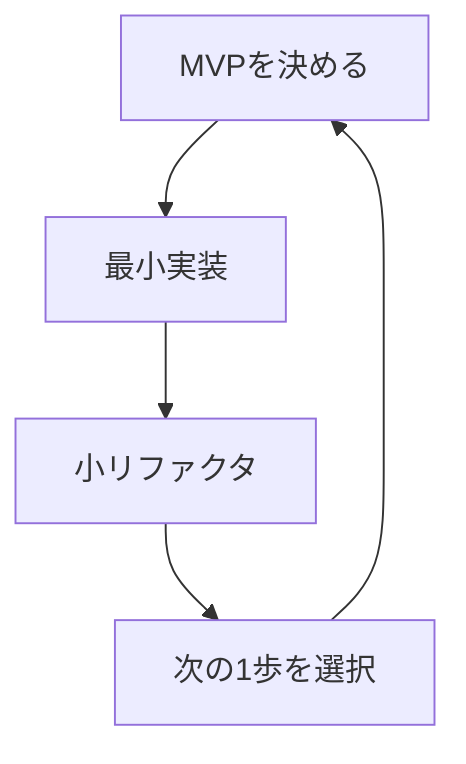

# 第06章：YAGNIで進める開発フロー（基本）🚶‍♀️✨

**ねらい🎯**：YAGNIを「考え方」じゃなくて「手順」として毎回ちゃんと回せるようになるよ〜！🧠🔁

---

## 0. まず“今どき事情”だけ、超サクッと🍬

YAGNIの話って古くならないんだけど、周辺ツールの進化は早いの〜！💨

* TypeScriptの安定版（npmのlatest）は 5.9.3。([npm][1])
* TypeScript 6.0/7.0 に向けて “橋渡し”や移行準備の話が進んでるよ（6.0はブリッジ、7.0はネイティブ系の流れ）。([Microsoft for Developers][2])
* VS Codeまわりも「AIエージェントっぽい使い方」や統合がどんどん進んでて、拡張の形が変わっていく流れも出てるよ。([Visual Studio Code][3])
* OpenAIのCodexも、VS Codeで並走しながら“編集・理解・実行”寄りに使える説明が公式にあるよ。([OpenAI Developers][4])

つまり何が言いたいかというと…
**AIが賢くなるほど、こっちが「盛らせない手順」を持ってるのが超大事**ってこと！🤖🧯✨

---

## 1. 第6章で身につけること（できるようになる一覧）✅✨

この章が終わると、こんなことができるようになるよ〜！🌷

* 「次に何を作る？」を **手順で迷わず決められる** 🧭
* AIに頼っても、**過剰設計を増やさず**に進められる 🤖✂️
* 変更を入れるたびに、**“差分が小さい＝勝ち”** を体感できる 🏆
* 「今やらない」を、**ちゃんと“決定”として残せる** 📝

---

## 2. YAGNI開発フロー（基本テンプレ）📌

ここからが本編！このテンプレを毎回回すだけで、YAGNIが自然に効くよ〜！🔁✨

### ✅ 4ステップ・テンプレ

**① MVP（or 今回のゴール）決める** 🎯
**② 最小実装する** 🧱
**③ 小リファクタする** 🧹
**④ 次の1歩を決める** 👣



そして、各ステップで必ず唱える呪文はこれ👇

> **「それ、受け入れ条件に必要？」** ✅
> **「未来のための仕組み、増えてない？」** 🧨

---

## 3. 具体例で回してみよ！題材：推し活メモ📝🎀

第3章〜第5章で作った想定の「推し活メモ」に、今回は小さな変更を入れてみるよ！

### 今回の小さな追加要件（例）⭐

**「メモを“ピン留め”できる」** 📌✨

* 一覧で⭐が付いてたら「ピン留め中」って分かる
* クリックでON/OFFできる

ここがポイント！💡
「ピン留めしたら上に並び替える？」とか「フィルターつける？」とか、色々やりたくなるけど…
**この章では“まず最小のピン留め”だけ**にするよ✂️😊

---

## 4. ステップ①：今回の“受け入れ条件”を3つに絞る✅

受け入れ条件（Acceptance Criteria）って、**“これ満たせばOK！”の合格ライン**だよ〜💮

### 受け入れ条件（最小）✅✅✅

* [ ] 一覧の各メモで、ピン留め状態が見える（⭐など）
* [ ] クリックでピン留めON/OFFできる
* [ ] 保存されて、リロードしても状態が残る（localStorage等）

これで十分〜！🎉
並び替えは…今回はやらない！🙅‍♀️（やりたくなっても我慢！笑）

---

## 5. ステップ②：最小実装する🧱✨（“差分を小さく”が正義👑）


最小実装のコツはこれ👇

### 最小実装のコツ 5つ🍀

* 既存の構造を **壊さない** 🔧
* 新しい抽象（interface乱立、汎用化）を **作らない** 🚫
* まずは **データにフラグ1個足す** ところから 🏷️
* 「将来」のためのオプション・設定を **増やさない** ⚙️❌
* AIが提案してきた“デカい改善”は **採用しない**（後で）🧯

---

### 例：データ構造に pinned を足す（素直に！）🧩

```ts
export type Memo = {
  id: string;
  title: string;
  body?: string;
  createdAt: number;
  pinned: boolean; // ← 追加（これだけ！）
};
```

---

### 例：ピン留めを切り替える関数（ロジックは純粋に）🔁

```ts
import type { Memo } from "./types";

export function togglePin(memos: Memo[], id: string): Memo[] {
  return memos.map(m =>
    m.id === id ? { ...m, pinned: !m.pinned } : m
  );
}
```

**ここ、超えらいポイント🥹✨**
UIや保存処理と混ぜずに、ロジックを“単体で完結”させてるのが良い！🧪
（後のテストもラク〜！）

---

### 例：localStorage保存（最低限）💾

```ts
import type { Memo } from "./types";

const KEY = "oshi-memo:v1";

export function loadMemos(): Memo[] {
  const raw = localStorage.getItem(KEY);
  if (!raw) return [];
  try {
    return JSON.parse(raw) as Memo[];
  } catch {
    return [];
  }
}

export function saveMemos(memos: Memo[]): void {
  localStorage.setItem(KEY, JSON.stringify(memos));
}
```

> 「v1って何？」→ 未来の移行のため…というより、壊れた時に自分が助かる保険だよ🛟
> でも、複雑なバージョニング仕組みは作らないでOK！🙆‍♀️

---

### 例：表示と操作（Reactの場合の最小イメージ）⭐

```tsx
type Props = {
  memo: Memo;
  onTogglePin: (id: string) => void;
};

export function MemoItem({ memo, onTogglePin }: Props) {
  return (
    <div>
      <button onClick={() => onTogglePin(memo.id)} aria-label="pin">
        {memo.pinned ? "⭐" : "☆"}
      </button>
      <span>{memo.title}</span>
    </div>
  );
}
```

**ここもYAGNI的に大事💡**

* 「ピン留め用の抽象コンポーネント」とか作らない
* 「将来デザイン変えるからアイコンコンポーネント化」とかしない
* まずは“動く最小”でOK！😊✨

---

## 6. ステップ③：小リファクタする🧹✨（“今必要な範囲だけ”）

小リファクタは、**やりすぎ厳禁**だよ〜！🚫😅
目的はこれ👇

### 小リファクタの目的🎯

* 読みにくい所をちょい整える
* 同じミスを繰り返しそうな所だけ守る
* 次の変更が怖くない状態にする

### “やっていい小リファクタ”例 ✅

* 変数名を分かりやすくする 🏷️
* 1ファイルが長すぎたら、2つに分ける 📄📄
* togglePinをテストする（ロジックだけ）🧪

### “やらない小リファクタ”例 ❌（盛りの始まり）

* 「将来データ保存先がDBになるからRepository作る」🗄️❌
* 「状態管理ライブラリ入れよう」🧰❌
* 「ピン留め戦略をStrategyパターンで…」🧠❌

---

### ミニテスト（ロジックだけ）🧪✨

```ts
import { togglePin } from "./togglePin";

test("togglePin flips pinned", () => {
  const memos = [
    { id: "1", title: "a", createdAt: 1, pinned: false },
  ];

  const next = togglePin(memos, "1");
  expect(next[0].pinned).toBe(true);
});
```

このテストがあるだけで、未来の自分が救われるよ〜！🥹🛟

---

## 7. ステップ④：次の1歩を決める👣✨（“やらない”も決める！）

ここがYAGNIの心臓💓

### 次の1歩の決め方（超シンプル）🧭

* バグある？→ 直す 🐛🔧
* 受け入れ条件、全部満たした？→ OK 🎉
* 次の価値が一番出るのどれ？→ それだけやる ✨

そして…**今回やらなかったこと**も書く！📝

#### 例：今回はやらないリスト（軽メモ）

* ピン留めを上に並び替える（価値はあるが、今は必須じゃない）↕️❌
* ピン留めだけ表示するフィルター（次の要望が出たら）🔎❌
* データ保存をDBにする（今はlocalStorageで足りてる）🗄️❌

この「やらないメモ」が、未来の自分への優しさだよ〜😊🌸

---

## 8. ミニ演習📝：「ピン留め⭐」を“差分最小”で入れてみよう！

### 手順（この順でやると迷わない✨）

1. 受け入れ条件を3つ書く✅
2. `pinned: boolean` を追加🧩
3. toggle関数を作る🔁
4. 表示を☆/⭐にする⭐
5. 保存してリロード耐性を確認💾
6. 余裕があればロジックだけテスト🧪

### チェック（YAGNI観点）👀

* 「将来のため」のコード、増えてない？🧨
* “汎用化”の匂いするもの、入れてない？😵‍💫
* 変更の差分、説明できるくらい小さい？👣

---

## 9. AI活用🤖：盛らせないプロンプト（第6章版）🧯✨

AIは放っておくと、親切で盛ってくるよ〜！🎈😇
だから最初から枠を渡すのがコツ！

### ① 受け入れ条件づくり（3つだけ）

* 「この要件の受け入れ条件を3つだけ。最小で。将来要件は入れないで」

### ② 実装の指示（最小・素直・抽象化禁止）

* 「最小の差分で実装して。新しい抽象や汎用化は禁止。Genericsは使わない。フォルダ増やさない」

### ③ AIレビュー（削る観点）

* 「この変更で“今不要”なものを指摘して。削除候補を3つ出して」

### ④ 追加要望が出た時（スコープ守る）

* 「この要望を“今回やる最小”と“やらない”に分けて。理由も短く」

CodexのIDE拡張も「編集・理解・実行」の並走ができる前提で案内されてるから、**“削るレビュー役”**に回すのも相性いいよ🧰✨ ([OpenAI Developers][4])

---

## 10. 成果物📦：自分用「YAGNI開発フロー手順メモ」（コピペOK✨）

最後に、あなた専用の手順メモを作って完成！🎉
（これがあると、次から爆速で迷わない！💨）

* ✅ 今回のゴール（1行）：
* ✅ 受け入れ条件（3つ）：

  * [ ]
  * [ ]
  * [ ]
* ## ✅ 今回やらない（最大3つ）：

  *
  *
* ✅ 実装の最小差分（どこをどう変える？）：
* ✅ 小リファクタ（やったこと1〜2個）：
* ✅ 次の1歩（1個だけ）：

---

必要なら、この第6章の内容をベースにして、**「推し活メモ」の“ピン留め”を入れた差分設計（ファイル構成、最小コミット粒度、AIへの指示文まで）**も、まるっと教材形式で書けるよ〜！📚⭐

[1]: https://www.npmjs.com/package//typescript?activeTab=versions&utm_source=chatgpt.com "typescript"
[2]: https://devblogs.microsoft.com/typescript/progress-on-typescript-7-december-2025/?utm_source=chatgpt.com "Progress on TypeScript 7 - December 2025"
[3]: https://code.visualstudio.com/blogs/2025/11/04/openSourceAIEditorSecondMilestone?utm_source=chatgpt.com "Open Source AI Editor: Second Milestone"
[4]: https://developers.openai.com/codex/ide/?utm_source=chatgpt.com "Codex IDE extension"
