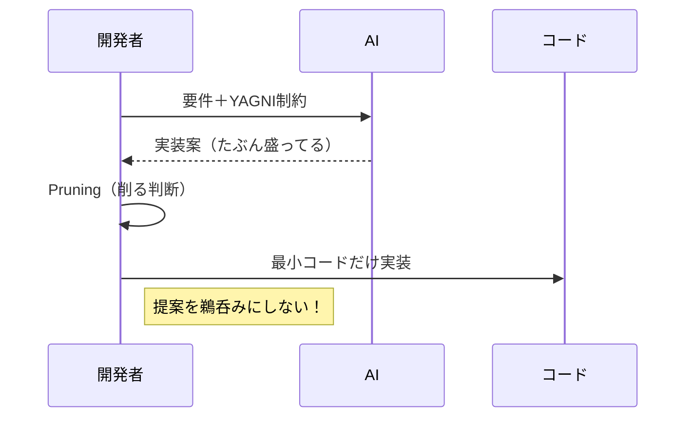

# 第07章：AIと一緒にYAGNI（盛らせない使い方）🤖🧯

この章はひとことで言うと——
**「AIを使うほど、YAGNIが大事になる」**って話です🙂🌱
AIって優秀なんだけど、放っておくと**“親切心で盛る”**んだよね…！🎈😅

---

## 0. この章でできるようになること🎯💪

* AIに頼みつつ、**“今いらない設計”を増やさない**で進められる🧱✨
* **AIの提案を削る力（＝YAGNI筋）**がつく✂️🏋️‍♀️
* VS Codeで、AIが盛りにくくなる **ガードレール（指示ファイル＆プロンプト集）** を作れる🛡️📚
* “AIに作らせて、AIに削らせて、最後は自分が決める” ができる👩‍💻✅

---

## 1. AIが盛りがちなポイント🎈😇（あるある集）


AIは「一般に正しいっぽい」方向に寄せがち。だから、要件が小さいのに…👇

* いきなり **Clean Architecture / レイヤー分割** しがち🏗️
* **Repository / Service / UseCase** を生やしがち🌱🌱🌱
* 「将来差し替え」を理由に **interface乱立** しがち🪓
* 型も **Generics芸** を始めがち🧬💥
* 設定ファイルや共通化で **ファイルが増える増える**📁📁📁
* テストも “理想形” を盛って、先に疲れさせがち🧪😵‍💫

ここで合言葉👇
**「かわいい機能には、かわいい設計で十分」**🧁✨

---

## 2. AIとYAGNIの基本戦略🗺️✨（3ステップだけ覚えよ）


### ステップA：AIに渡すのは「要件」じゃなくて「受け入れ条件」✅

AIに「ピン留め機能作って」だけ言うと、盛られます😇
代わりに👇

* できたらOKの条件（受け入れ条件）を先に渡す✅
* 今回 “やらないこと” も先に言う🚫

### ステップB：「制約」を明示して、盛る余地を消す🧯

* **新規フォルダ追加禁止**📁🚫
* **新規依存追加禁止**📦🚫
* **Generics禁止**🧬🚫
* **差分は小さく**👣✨

### ステップC：AIには「差分」だけ作らせる🧩

「全部作って」じゃなくて、
**“今あるコードに、最小の差分で足して”** が最強です🔥

---

## 3. VS Codeで「盛らせない仕組み」を作る🛡️✨（ここが本体！）

VS Codeは、AIの出力を安定させる仕組みが用意されてます🙂
特に重要なのがこの3つ👇

1. **指示ファイル（Custom Instructions）**
2. **プロンプトファイル（Prompt files）**
3. （必要なら）**Agent Skills**

### 3.1 指示ファイル：`.github/copilot-instructions.md` を置く🧾✨


VS Codeはワークスペース用の指示ファイルを作れて、チャットのたびに効かせられます🛡️
しかも VS Code から **自動生成** もできるよ（Chatの設定から）⚙️✨ ([Visual Studio Code][1])

まずは「YAGNI専用の指示」を入れちゃおう🙂
例👇（そのままコピペOK）

```md
# YAGNI / KISS rules (project-wide)

- Implement only what is required by current acceptance criteria.
- Prefer the simplest solution that is readable and works.
- Do NOT add layers (repository/service/usecase) unless explicitly requested.
- Do NOT add new dependencies or config files unless explicitly requested.
- TypeScript types: keep minimal; avoid complex generics.
- Keep changes as small diffs; prefer editing existing files.
- If you propose refactoring, explain the smallest safe refactor first.
- Ask clarifying questions if requirements are ambiguous, but keep them minimal.
- Output: show the smallest code changes and where to paste them.
```

ポイント💡

* 指示は **短文で箇条書き** が効きやすいです（VS CodeのTipsにも近い）([Visual Studio Code][1])
* 以前あった「codeGeneration / testGeneration の指示設定」は非推奨になって、**指示ファイル推し**になってます ([Visual Studio Code][1])

> ちなみにVS Code側の動きとして、Copilot体験が統合・整理されていて、拡張機能の扱いも変わってきています（早期2026にGitHub Copilot拡張が非推奨予定の話など）([Visual Studio Code][2])
> でも、やることは同じ！「指示で盛らせない」が勝ち🏆

---

### 3.2 プロンプトファイル：`.prompt.md` で「盛らせない命令」をワンボタン化📌✨


VS Codeには **Prompt files（`.prompt.md`）** があって、よく使う命令を `/` で呼び出せます📚✨
（ワークスペースなら `.github/prompts` に置くのが基本）([Visual Studio Code][3])

#### 例1：YAGNIレビュー用プロンプト（AIに削らせる✂️🤖）

`.github/prompts/yagni-review.prompt.md`

```md
---
name: yagni-review
description: "Check over-engineering & propose minimal diffs"
argument-hint: "Paste code or describe the change you want"
---

You are a strict YAGNI reviewer.

1) List any parts that are NOT required by acceptance criteria.
2) Mark each as: (remove now) / (postpone) / (keep)
3) Propose the smallest diff to remove/postpone them.
Constraints:
- No new dependencies
- No new architecture layers
- Keep TypeScript types minimal (no complex generics)
Return:
- Bullet list of findings
- Patch-style suggestions with file names
```

#### 例2：最小実装プロンプト（差分だけ作らせる👣✨）

`.github/prompts/min-implement.prompt.md`

```md
---
name: min-implement
description: "Implement a feature with the smallest diff"
argument-hint: "Describe acceptance criteria + files"
---

Implement the requested feature with the smallest possible diff.

Rules:
- Edit existing files first; avoid creating new files.
- Do not introduce repository/service layers.
- No new dependencies.
- Keep functions small and readable.
- Types: simple interfaces only; avoid generics unless truly necessary.

Before coding:
- Restate acceptance criteria as a checklist (max 5 items).
Then:
- Provide the minimal code changes with file paths.
Finally:
- Mention 1-2 future improvements we intentionally did NOT do (YAGNI).
```

この仕組み、めちゃ便利です🙂✨
“毎回同じこと言う” を卒業できる📌 ([Visual Studio Code][3])

---

### 3.3（必要なら）Agent Skills：AIに「専門スキル」を持たせる🧠🧰

Agent Skillsは「AIが必要なときだけ読み込む資料フォルダ」みたいな感じ📁✨
VS Codeでもプレビュー対応で、`chat.useAgentSkills` を有効化して使います ([Visual Studio Code][4])

ただ、最初は **指示ファイル＋プロンプトファイルだけで十分**🙂🌱
Agent Skillsは「ちょっと慣れてからの拡張」でOKだよ〜！✨ ([Visual Studio Code][4])

---

## 4. 盛らせない “お願いテンプレ” 集🧾✨（コピペで勝つ）

### 4.1 まず最初に投げるやつ（万能）✨

* 「**今の受け入れ条件だけ**で実装して。将来拡張は考えすぎないで🙂」
* 「**ファイル追加なし**、**依存追加なし**で。差分小さめで👣」
* 「Repository/Service/UseCaseみたいな層は**作らないで**🚫」

### 4.2 型が盛られそうなとき🧩🧯

* 「型は最小でOK。**複雑なGenericsは禁止**🧬🚫」
* 「Union増やしすぎないで。まずは素直な `type` / `interface` だけで🙂」

### 4.3 共通化が始まりそうなとき🪓😅

* 「utils化はしないで。**重複が3回出てから**考えよう✋」
* 「抽象化じゃなくて、まず“読みやすいベタ”で✨」

### 4.4 AIに“削る役”をやらせる🕵️‍♀️✂️


* 「今の提案、**YAGNI的に削れる部分を列挙して**」
* 「“今いらない理由”も一緒に書いて🙂」
* 「削った最小差分の案を出して👣」




---

## 5. 実例：推し活メモの「ピン留め⭐」で、AIを盛らせない（超重要🔥）

### 5.1 受け入れ条件（これだけ！）✅

* 一覧に「⭐」ボタンがある
* 押すと `pinned: boolean` が切り替わる
* pinnedは一覧の上に出る（同じ pinned 同士は作成順のままでOK）
* **保存は今回はやらない**（localStorageなどは次章以降でもOK）🚫

### 5.2 AIへの投げ方（例）🤖🧾

```text
ピン留め機能を追加したいです。

受け入れ条件:
- ⭐ボタンで pinned を toggle
- pinned は一覧の上に表示
- 保存はしない

制約:
- 依存追加なし
- 新規ファイル追加なし（既存ファイル編集のみ）
- repository/service/usecase層は作らない
- 複雑なGenericsは禁止

最小の差分で、変更箇所とコードを出してください。
```

これだけで、AIが勝手に大工事しにくくなります🙂🛡️

---

## 6. Copilot / コーディングエージェント系を使うときのYAGNIコツ🤖🧑‍🔧

GitHub Copilot には、タスクを任せて裏でPRを作る「coding agent」系の動きもあります（最後にレビューを求めてくる）([GitHub Docs][5])
便利だけど、YAGNI目線だと👇が大事！

* **タスクを小さく切ってから投げる**（1PR = 1目的）✂️
* “要件”じゃなく“受け入れ条件”を貼る✅
* PRが来たら、まず見るのはここ👇

  * 追加ファイルが増えてない？📁
  * 層が増えてない？🏗️
  * 設定・抽象化が増えてない？🧨

---

## 7. ミニ演習📝✨（この章はここがゴール🎯）

### 演習1：AIの提案を“削る”練習✂️🤖

1. AIに「ピン留め」を提案させる
2. 出てきた案の中から、**今いらないものを3つ**選ぶ（理由も）✍️
3. `/yagni-review` で「削った最小差分」を作らせる✨

### 演習2：`copilot-instructions.md` を育てる🌱🧾

* 今日の学びを反映して、ルールを **2行だけ**追加してみて🙂
  例：

  * 「新しい抽象化を提案する前に、まず“ベタ実装”案を提示する」
  * 「差分が大きくなる場合は、最小案→次案の順に出す」

### 演習3：プロンプト集を2個作る📚✨

* `yagni-review.prompt.md`
* `min-implement.prompt.md`
  → `/` で呼べる状態にする📌 ([Visual Studio Code][3])

---

## 8. セキュリティ注意（さらっと大事）🔐🧯


AIチャットは、**間接プロンプト注入（prompt injection）**で“変な指示”を混ぜられることがあります😨
VS Codeでの対策や注意点も公式に解説されています ([The GitHub Blog][6])
さらに、研究・レポートでもIDE×AIのリスクが話題になってます ([Tom's Hardware][7])

超シンプルに守るルール👇（初心者でもできる✨）

* 怪しいテキストや謎ファイルの指示を、AIが言っても **そのまま実行しない**🛑
* トークンや秘密情報が入ったファイルを、むやみにコンテキストへ入れない🔒
* “エージェントに勝手に実行させる系”は、最初は慎重に🙂🧯

---

## 9. この章の成果物📦✨（持ち帰り）

* ✅ `.github/copilot-instructions.md`（YAGNIガードレール）([Visual Studio Code][1])
* ✅ `.github/prompts/` の `.prompt.md` 2つ（レビュー用＋最小実装用）([Visual Studio Code][3])
* ✅ 「AIの提案を削った理由」メモ（短くてOK）✍️🙂

---

### おまけ：いまのTypeScriptまわりの“最新ざっくり”🧁✨

* TypeScript の最新版ラインは **5.9系（npm上のlatestが 5.9.3）**です ([npmjs.com][8])
* そして **TypeScript 6.0 は “橋渡し（bridge）” 的な位置づけ**、その先にネイティブ化の流れ（7.0）があります ([Microsoft for Developers][9])

この状況だからこそ、なおさら👇
**「今必要な範囲だけ、小さく、読みやすく」**が強いよ〜🙂🌱✨

---

次の章（最終課題）では、このプロンプト集を使って
**“追加要件1つだけ”**をきれいに入れる練習に入ろうね🎓🌱✨

[1]: https://code.visualstudio.com/docs/copilot/customization/custom-instructions "Use custom instructions in VS Code"
[2]: https://code.visualstudio.com/blogs/2025/11/04/openSourceAIEditorSecondMilestone "Open Source AI Editor: Second Milestone"
[3]: https://code.visualstudio.com/docs/copilot/customization/prompt-files "Use prompt files in VS Code"
[4]: https://code.visualstudio.com/docs/copilot/customization/agent-skills "Use Agent Skills in VS Code"
[5]: https://docs.github.com/en/copilot/concepts/agents/coding-agent/about-coding-agent "About GitHub Copilot coding agent - GitHub Docs"
[6]: https://github.blog/security/vulnerability-research/safeguarding-vs-code-against-prompt-injections/ "Safeguarding VS Code against prompt injections - The GitHub Blog"
[7]: https://www.tomshardware.com/tech-industry/cyber-security/researchers-uncover-critical-ai-ide-flaws-exposing-developers-to-data-theft-and-rce?utm_source=chatgpt.com "Critical flaws found in AI development tools are dubbed an 'IDEsaster' - data theft and remote code execution possible"
[8]: https://www.npmjs.com/package/typescript?activeTab=versions&utm_source=chatgpt.com "typescript"
[9]: https://devblogs.microsoft.com/typescript/progress-on-typescript-7-december-2025/ "Progress on TypeScript 7 - December 2025 - TypeScript"
