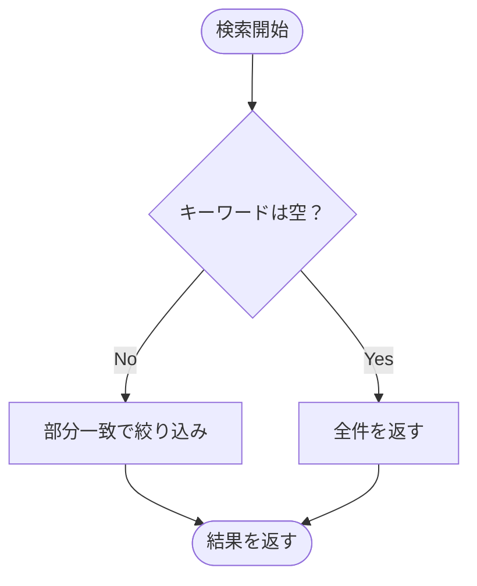

# 第08章：最終ミニ課題（追加要件1つで育てる）🎓🌱

この章は、**“1個だけ追加して、差分を小さく勝つ”**を体験して終わる回だよ〜！🙌💕
（ここまで作ってきた「推し活メモ」を、YAGNIでちょっとだけ育てる🌱）

---

## 0) 今日のゴール🎯

* 追加要件を **1つだけ** 選ぶ🧸✨
* その要件を **最小の変更** で実装する✂️
* “入れなかった理由” を **軽ADR** に残す🗒️
* 最後にチェックリストで自己採点💯

---

## 1) まず「追加要件」を1つだけ選ぶ👇😺

次のどれか **1つだけ** ね！（2つ目に手を出したらYAGNI負けやすい😂）

### A. 検索🔎（おすすめ！差分が小さくて勝ちやすい🏆）

* 画面に検索ボックス1つ追加
* タイトル（または本文）で「含む」フィルタするだけでOK

### B. 並び替え↕️（これも差分が小さい✨）

* 「新しい順 / 古い順」切り替え
* まずは日付 or 作成日時どっちか1本でOK

### C. タグ付け🏷️（ちょい差分が増えるけど学び多め📚）

* タグを文字列で1つだけ付けられる（最初は複数タグ禁止でOK🙅‍♀️）
* 表示でタグを見せるだけでも合格

---

## 2) 受け入れ条件を3つだけ書く✅📝（ここ超大事！）

受け入れ条件が多いと、AIも自分も盛りがちになるよ〜🎈😇

例（検索🔎の場合）：

1. 検索欄に文字を入れると、一覧が絞り込まれる
2. 空文字なら全件表示に戻る
3. 大文字小文字は気にしない（or 気にする）どっちかに決める

ポイント💡

* “検索精度” とか “ハイライト” とか “検索履歴” とか…今はナシ！🙅‍♀️
* まずは「動く」「分かる」「戻れる」だけで勝ち🏆✨

---

## 3) YAGNIの進め方テンプレ（この順でやると迷いが減る）🧭✨

1. 追加要件を1つ選ぶ（さっきのA/B/C）
2. 受け入れ条件を3つに絞る✅
3. 実装方針を1行で書く（例：「配列をフィルタするだけ」）
4. 小さいコミットで進める（“差分が小さい＝勝ち”🏆）
5. 仕上げに軽ADR🗒️＆自己採点💯

---

## 4) 実装ガイド（選んだ要件ごと）🛠️😺

### A) 検索🔎（いちばんYAGNI向き🌱）

**最小方針**：保存データは変えない。表示だけ絞る。

#### UI

* 入力欄（input）を1つ追加
* state（searchText）を1つ追加

#### ロジック

* 一覧を作る直前に filter するだけ✨
  （“検索用のクラス”とか“検索サービス”とか作らない🙅‍♀️）



コード例（React想定・超ミニ）：

```ts
type Memo = {
  id: string;
  title: string;
  body?: string;
  createdAt: number;
};

function includesIgnoreCase(text: string, keyword: string): boolean {
  return text.toLowerCase().includes(keyword.toLowerCase());
}

function filterMemos(memos: Memo[], keyword: string): Memo[] {
  const k = keyword.trim();
  if (k === "") return memos;

  return memos.filter(m =>
    includesIgnoreCase(m.title, k) || (m.body ? includesIgnoreCase(m.body, k) : false)
  );
}
```

✅ ここでのYAGNI勝ちポイント

* 新ライブラリ入れない（検索ライブラリ不要🙅‍♀️）
* 正規表現検索とか曖昧検索とか…未来案件すぎる😂

---

### B) 並び替え↕️

**最小方針**：並び順の選択 state を1つ持って、表示直前で sort。

コード例（破壊的ソートを避けるのがコツ💡）：

```ts
type SortOrder = "new" | "old";

function sortMemos(memos: { createdAt: number }[], order: SortOrder) {
  const copied = [...memos];
  copied.sort((a, b) => order === "new" ? b.createdAt - a.createdAt : a.createdAt - b.createdAt);
  return copied;
}
```

✅ YAGNI勝ちポイント

* “ソート戦略パターン”とか作らない🙅‍♀️
* UIはラジオ2個 or セレクト1個で十分🙂

---

### C) タグ付け🏷️（差分が増えやすいので制限が命🔥）

**最小方針**：タグは「文字列1個」だけ。複数タグ禁止🙅‍♀️

データ：

* memo に tag?: string を追加するだけでOK

コード例：

```ts
type Memo = {
  id: string;
  title: string;
  createdAt: number;
  tag?: string; // 1個だけ！
};

function normalizeTag(tag: string): string {
  return tag.trim();
}
```

✅ YAGNI勝ちポイント

* タグ一覧画面、タグ検索、タグマスタ…全部未来すぎる😂
* まず「入力できる」「表示される」だけで合格💮

---

## 5) “差分が小さい＝勝ち”のチェック👀🏆

実装中ずっとこれ意識してね〜🙂✨

* 追加したファイルが増えすぎてない？📁💥
* 新しい抽象化（謎interface、謎utils）が生えてない？🌱→🌳になってない？😂
* “いつか使うための設定”が増えてない？⚙️
* 受け入れ条件を満たすのに必要な変更だけ？✅

---

## 6) ミニテスト🧪（最小でOK！）

ここでは「UI全部テスト」じゃなくて、**ロジックだけ**守ろう🙂

例（検索なら filterMemos、ソートなら sortMemos）をテストするだけで十分💮

* “空文字なら全件”
* “一致するものだけ残る”
* “大文字小文字の扱い”

---

## 7) 軽ADR🗒️✨（1枚でOK！未来の自分に優しい🥹）

テンプレ（コピペして埋めるだけ）👇

```txt
# ADR: 追加要件（検索/ソート/タグ）を最小実装で入れる

## Context
なぜこの要件を足す？（ユーザー価値は？）

## Decision
どう実装した？（1〜2行で）

## Consequences
良い点：
気になる点（今は許容する点）：

## Rejected options（入れなかった理由）
例：検索ライブラリ導入 → 今は要件外、差分が大きい
例：汎用フィルタ基盤 → 未来予想なので今回は見送り
```

---

## 8) AIの使い方（盛らせないテンプレ）🤖🧯✨

AIは放っておくと、わりと簡単に「立派すぎる設計」を提案しがち😂
だから最初に釘を刺すのがコツ！

### 受け入れ条件づくり

* 「追加要件は検索だけ。受け入れ条件を3つだけ。余計な機能を足さないで🙂」

### 実装方針レビュー（過剰設計検知🕵️‍♀️）

* 「この変更、今の要件に不要な抽象化があれば指摘して。削れる案も出して✂️」

### 差分レビュー（最小化チェック👀）

* 「変更点を、より小さい差分にするにはどう直せる？ファイル増やさずに🙏」

ちなみに最近の流れとして、VS Code 側でエージェント的な作業体験が整備されつつあって、セッション管理なども改善されてるよ〜（AIに“計画→実装→レビュー”をやらせる時に便利）([releasebot.io][1])
また VS Code のAIエディタ化の流れで、拡張機能の構成が変わっていく話（Copilot拡張の扱い変更など）も出てるので、「ツールは変わる前提」でプロンプト資産（盛らせない指示）を手元に残すのはかなり強い💪✨([Visual Studio Code][2])
OpenAI側も Codex のIDE拡張として「IDEで並走」できる案内があるので、同じ“盛らせない”指示を使い回すと楽だよ🙂([OpenAI Developers][3])

---

## 9) 自己採点チェックリスト💯✅（○が多いほど勝ち🏆）


* 追加要件は1つだけにした
* 受け入れ条件は3つに絞った
* 変更は表示ロジック中心で済んだ（データ構造は最小）
* 新ライブラリを入れてない
* 謎の抽象化（汎用化/インターフェース乱立）を増やしてない
* テストはロジックだけ最小で入れた
* 軽ADRを書いた（入れなかった理由がある）
* “次にやるなら”は TODO に置いた（今作ってない）
* 変更理由を自分で説明できる
* 未来の自分が読んでも分かるコミット/メモになってる

---

## 10) 提出物（成果物）📦✨

* 改善版アプリ（検索/ソート/タグのどれか1つ入り）
* 軽ADR 1枚🗒️
* 自己採点メモ（チェックリストに○つけたやつ）✅

---

## 11) おまけ：TypeScriptの“いまどき”注意点（盛り防止に直結）🧩✨

最近のTypeScriptは Node の挙動モデル（node18/node20 など）を安定オプションとして用意してて、「環境差分でハマる」を減らす方向に進んでるよ〜([Microsoft for Developers][4])
だからこそ逆に、**最初から複雑な設定を盛るより**、テンプレのまま小さく進めて「困ったら調整」でOKになりやすい🙂🌱

---

必要なら、あなたが今作ってる「推し活メモ」の構成（ファイル構成と、メモの型）を貼ってくれたら、**選んだ追加要件に合わせて“最小差分の入れ方”**をピンポイントで提案するよ〜🔎✨

[1]: https://releasebot.io/updates/microsoft/visual-studio-code?utm_source=chatgpt.com "Visual Studio Code Release Notes - Releasebot"
[2]: https://code.visualstudio.com/blogs/2025/11/04/openSourceAIEditorSecondMilestone?utm_source=chatgpt.com "Open Source AI Editor: Second Milestone"
[3]: https://developers.openai.com/codex/ide/?utm_source=chatgpt.com "Codex IDE extension"
[4]: https://devblogs.microsoft.com/typescript/announcing-typescript-5-9/?utm_source=chatgpt.com "Announcing TypeScript 5.9"
